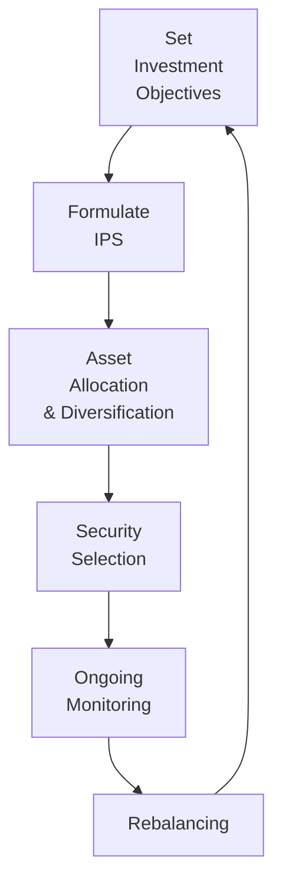

## Introduction

Have you ever wondered why people fuss so much about combining investments into a single portfolio, rather than just buying one or two great stocks and calling it a day? I remember early in my career, I once boasted about discovering a “dream stock” that I was certain was going to the moon. One of my mentors, however, gently nudged me to think about potential downturns, macroeconomic changes, and unexpected company-specific issues. He told me, “Don’t just own one rocket. Build an entire fleet.” Well, that was my first lesson in the power of managing investments as a cohesive portfolio.

At its heart, the portfolio approach is about looking at your entire set of investments as one dynamic whole, rather than a bunch of isolated pieces. Taken together, seemingly unconnected securities can behave in ways that influence each other’s returns and risks. When you diversify properly and manage risk in the right way, your entire financial position can be stronger than if you’d just pick random stocks based on hunches or the latest market buzz. 

Below, we’ll explore how the portfolio approach underpins the formal investment management process. We’ll also break down how asset allocation decisions, feedback loops, and risk–return trade-offs shape practical discussions around building and monitoring a portfolio. And trust me, you’ll see that the investment management process is iterative, always evolving as both markets and your objectives shift.

## A Holistic Perspective: Why a Portfolio?

When you build a portfolio, you’re combining different asset classes—like stocks, bonds, and alternative investments—into a single vehicle that seeks to balance returns with an acceptable level of risk. The underlying logic is rooted in a principle known as diversification. By spreading your capital across various investments, you aim to mitigate the negative impact of any single holding’s poor performance.

Diversification accomplishes something magical: it reduces unsystematic (or idiosyncratic) risk that is tied to a specific company or industry. Although you can’t fully eliminate systemic or market-wide risk (the kind that affects nearly all assets), diversification is the best defense against an unexpected blow to just one part of your portfolio. It’s akin to not putting all your eggs in one basket—if one basket drops, you’ve still got plenty left.

Besides diversification, there's another major conceptual cornerstone: the risk–return trade-off. In finance, higher returns typically require taking on greater risk. When you’re constructing a portfolio, you must decide how much risk you’re really comfortable bearing. If you need stable income with minimal losses, you might allocate more heavily to lower-volatility bonds. If you’re gunning for capital appreciation and it’s early in your investment horizon, you might tilt more aggressively towards equities. Balancing these preferences shapes your portfolio’s strategic direction. 

## The Investment Management Process: Steps & Iterations

The investment management process is systematic and cyclical. Sure, it’s formal, but in practice, it can feel like an ongoing conversation between your portfolio’s goals and the realities of the market. Here’s a diagram illustrating this cycle:

### 1) Setting Clear Objectives

You can’t chart a course if you don’t know your destination. Investors typically have a range of objectives, from capital appreciation to preserving wealth, generating income, or a mix of all three. Defining these objectives at the outset is crucial. No matter how perfect a portfolio looks on paper, if it doesn’t align with your objectives—say, protecting principal for retirement or generating stable returns to fund a future purchase—it may disappoint in the real world.

Objective-setting also clarifies time horizons, liquidity needs, and regulatory constraints. Maybe you need your money in five years for a home down payment, or maybe you can stay the course for three decades because you’re saving for retirement. Spell out these conditions—it’ll help shape everything else that follows.

### 2) Formulating the Investment Policy Statement (IPS)

So you wrote down your goals. Good. But how do you ensure you stick to them during unpredictable market swings? This is where the Investment Policy Statement (IPS) comes in. The IPS is like a personal constitution, stating exactly how decisions will be made and what constraints apply. It documents:

• Your risk tolerance  
• Return requirements  
• Liquidity needs  
• Legal or ethical constraints  
• Asset allocation ranges  
• Monitoring and rebalancing guidelines

An IPS might also reflect regulatory and professional standards—like the CFA Institute Code of Ethics and Standards of Professional Conduct, or your local financial authority’s requirements. This structure not only keeps you accountable, but it also provides clarity for any investment managers or advisors who will eventually implement and monitor the strategy for you.

### 3) Strategic Asset Allocation & Diversification

Asset allocation—how you divide your portfolio across major categories, such as stocks, bonds, and alternatives—is a primary driver of long-term returns. Many studies suggest that the bulk of a portfolio’s performance variance can be attributed to asset allocation decisions rather than individual security picks.

When establishing your asset allocation, you’ll weigh each asset class’s volatility, expected return, liquidity, and correlation with other assets. Since correlations among different asset classes often move around with market conditions, it’s important to periodically review these relationships. If, for instance, two asset classes that previously had low correlation start moving together, you might want to readjust your exposures.

### 4) Security Selection

Within each asset class, you still have choices galore. Which stocks fit your style: growth or value? Which bonds: government or corporate, high-yield or investment-grade? Should you consider exchange-traded funds (ETFs) or mutual funds for convenience? Maybe you’d like some alternative investments such as real estate or commodities for further diversification.

Security selection typically involves either an active (i.e., trying to outperform a benchmark through company-level research or factor tilts) or passive (i.e., replicating an index) approach. The actual mix depends on your preferences for cost, market outlook, and willingness—or ability—to conduct detailed research.

### 5) Ongoing Monitoring & Rebalancing

Investing isn’t a “set it and forget it” activity—that’s another lesson I learned rather quickly. Markets move daily. Over time, small changes can accumulate into substantial drifts from your target asset allocation. Let’s say stocks have surged. Now, you might be overweight equities, which could bring higher portfolio risk than you originally intended.

Rebalancing is the practice of realigning your holdings with the target asset allocation. It can be mechanical (e.g., every quarter, bring the portfolio back to predefined weights—like 60% equities, 40% bonds) or opportunistic (e.g., rebalance only when allocations deviate by more than a certain percentage from your target). Before you rebalance, you’ll also consider transaction costs and tax implications, especially if you’re operating in a taxable account. Still, ignoring a drift is often riskier in the long run than fine-tuning your weightings.

### 6) Performance Evaluation & Feedback Loop

Performance evaluation is essential for judging whether the portfolio met or exceeded your targets. Did it outperform relevant benchmarks, considering both returns and risk measures like volatility or drawdowns? If not, was it due to asset allocation decisions, security selection, or simply a temporary market anomaly?

One way to see if your portfolio is on track is to measure actual results against a policy benchmark that reflects your intended allocation. If your portfolio consistently underperforms, you might need to revisit your security selection process or reevaluate your chosen asset classes. If it frequently outperforms, maybe you want to channel more resources into those strategies—but beware of overconfidence and changing your strategy too drastically based on short-term success.

Crucially, performance evaluation isn’t just about returns. It’s about whether the portfolio has stayed within your risk tolerance, provided enough liquidity, and executed in accordance with your IPS. From there, it’s a feedback loop: new information about performance, market conditions, or even your personal situation can inform the next iteration of setting objectives, adjusting the IPS, and tweaking allocation.

## Professional Standards & Regulations

If you’re practicing as a professional portfolio manager, you’re bound by certain ethical guidelines and regulatory frameworks. The CFA Institute’s Code of Ethics and Standards of Professional Conduct, for example, forms the backbone of how you should handle client funds and communications. This includes:

• Acting in the best interest of the client  
• Disclosing potential conflicts of interest  
• Presenting performance results fairly and accurately  
• Maintaining confidentiality  
• Adhering to applicable laws and regulations  

Regulations also influence how you structure your portfolio solutions, particularly if you have constraints like maximum leverage or specific asset class limitations. And if you’re overseeing institutional accounts, there might be additional pension or insurance regulations that shape whether you can invest in certain instruments at all.

## Key Terms

Below are some important terms you’ll encounter all the time in portfolio management:

• Asset Allocation: The process of dividing an investment portfolio among different asset categories (e.g., stocks, bonds, alternatives) to achieve desired risk–return objectives.  
• Diversification: A strategy of spreading investments across various assets or asset classes with the aim of reducing unsystematic risk.  
• Investment Policy Statement (IPS): A formal document that outlines investment objectives, constraints, and guidelines for a specific portfolio.  
• Risk–Return Trade-Off: The principle that achieving higher potential returns usually involves accepting higher volatility or risk.  
• Rebalancing: Adjusting portfolio weights to realign with the target asset allocation. This is done periodically or when allocations deviate from policy thresholds.  
• Feedback Loop: A circular process where performance results and market changes inform ongoing refinements to objectives, allocations, or security selection.  
• Systematic Documentation: Keeping records of investment decisions, rationales, and outcomes to ensure transparency and accountability.  
• Performance Evaluation: Measuring actual returns against benchmarks or targets to assess how well the portfolio meets its objectives.

## Common Pitfalls & Best Practices

• Pitfall: Overlooking correlation shifts among asset classes. Best Practice: Regularly update correlation estimates; don’t just rely on historical averages.  
• Pitfall: Lack of clarity in the IPS. Best Practice: Spell out your constraints, objectives, and rebalancing policies clearly.  
• Pitfall: Emotional decisions during market swings. Best Practice: Rely on your IPS and adopt a systematic rebalancing plan that limits impulsive actions.  
• Pitfall: Ignoring tax implications. Best Practice: Incorporate tax optimization strategies when selecting securities or deciding on rebalancing frequency.  
• Pitfall: Failing to adapt to evolving goals. Best Practice: Revisit your objectives and constraints periodically, especially if there’s a major life change (e.g., marriage, retirement, big purchase).

## Practical Example: Multi-Role Portfolio

Imagine a client named Sofia who aims for moderate growth but also needs some liquidity for a planned housing purchase in three years. The portfolio might allocate a substantial portion to bonds (for stability and short-term liquidity), while still allocating a chunk to equities to capture long-term growth—though perhaps not as large a chunk as a pure accumulation-focused investor might hold. 

Every quarter, Sofia and her advisor review the portfolio to confirm that the equity share hasn’t grown too large. If stocks perform extremely well, they’ll sell off a bit (locking in gains) to bring the equity percentage down, redirecting proceeds into short-term bond funds. If a market downturn hits, they’ll see if selling some bonds (which might have gained or at least held steady) to buy equities on a dip aligns with her risk tolerance. If her personal situation changes, say she finds a home she wants to buy sooner, she’ll likely shift more to cash or very short-term bonds, lowering overall risk exposure.

## Conclusion & Final Exam Tips

In many ways, portfolio management is a balancing act. You weigh your risk appetite against market opportunities, pivoting as needed when conditions alter or new personal goals arise. A carefully crafted IPS ensures you keep sight of big-picture objectives, while periodic performance evaluation keeps you honest about whether your strategies are truly delivering. 

If you’re aiming to master exam-style questions:

• Focus on scenario-based reasoning. Practice thinking about how you’d adjust allocation in response to changes in a client’s risk tolerance or market outlook.  
• Know your formulas. Return calculations, standard deviation, correlation, and performance measures matter when comparing portfolios with different risk profiles.  
• Practice synthesizing steps in the investment management process: how would you set an IPS, choose an allocation, and then evaluate success against risk–return metrics?  
• Be ready to integrate ethical considerations. The CFA® exams emphasize professionalism: keep an eye out for how you treat private client information and present performance results fairly.

As you continue your studies, you’ll refine your sense of how best to implement these principles in actual practice. But always keep that big-picture portfolio perspective. It’s not about finding a single “golden” security, but rather crafting a well-rounded mix that aligns with your needs—both present and future.

## References and Further Reading

• CFA Institute Program Curriculum (Level I readings on portfolio management).  
• Bodie, Z., Kane, A., & Marcus, A. J. (2021). Investments. McGraw-Hill.  
• Maginn, T., Tuttle, D., Pinto, J., & McLeavey, D. (2016). Managing Investment Portfolios: A Dynamic Process. CFA Institute Investment Series.  
• The Journal of Portfolio Management.  

## Test Your Knowledge: The Portfolio Approach & Investment Process



### Which statement best describes the rationale behind managing investments as a cohesive portfolio rather than as individual holdings?

- [ ] It eliminates all types of investment risk.
- [x] It reduces overall risk by offsetting losses of one asset with gains in others.
- [ ] It guarantees a certain rate of return over time.
- [ ] It enables perpetual tax deferral regardless of local regulations.

> **Explanation:** A portfolio approach diversifies across assets, so a loss on one might be offset by gains on another, reducing unsystematic risk. It doesn’t eliminate systemic risk or guarantee returns, and it certainly can’t ensure perpetual tax deferral.

### What is the primary role of the Investment Policy Statement (IPS) in the investment management process?

- [x] It formally documents objectives, constraints, and guidelines for managing a portfolio.
- [ ] It acts as a record of trading activity for regulatory filings.
- [ ] It tracks daily price fluctuations in the portfolio.
- [ ] It eliminates the need for separate rebalancing strategies.

> **Explanation:** The IPS outlines the goals, constraints, and strategies that guide all investment decisions. It is not used for daily price monitoring or replacing rebalancing procedures.

### When considering the risk–return trade-off, which of the following scenarios is generally true?

- [ ] Lower-risk assets will always generate the highest returns.
- [x] Higher returns usually demand taking on more risk.
- [ ] Allocating to safe assets typically increases portfolio volatility.
- [ ] There is no correlation between risk and return in modern markets.

> **Explanation:** The foundation of finance holds that higher returns typically stem from bearing higher risk. Low-risk assets can offer stability but generally do not produce higher returns than riskier assets over the long term.

### Which of the following is a direct benefit of rebalancing a portfolio periodically?

- [x] It maintains the intended risk profile by realigning asset weights.
- [ ] It locks in losses and prevents capital preservation.
- [ ] It guarantees protection from market drawdowns.
- [ ] It increases the correlation among diversified assets.

> **Explanation:** Rebalancing brings the portfolio back to its target asset allocation, maintaining the intended risk level. It doesn’t guarantee protection from market declines, nor does it lock in losses or raise correlations among assets.

### In the investment management process, feedback loops refer to:

- [ ] The process of soliciting client opinions on unrelated personal finance topics.
- [x] The continuous cycle of re-evaluating objectives, performance, and strategies as conditions change.
- [ ] A mechanism to backtest only historical data without updating current allocations.
- [ ] The mandatory regulatory reporting required by all investment managers.

> **Explanation:** A feedback loop in portfolio management is the ongoing mechanism where market outcomes and changes in investor circumstances drive updates to the investment strategy and possibly asset allocation.

### Which statement best explains diversification?

- [x] Investing in multiple asset classes to minimize the impact of underperformance by any single holding.
- [ ] Concentrating all funds in one high-performing sector to maximize returns.
- [ ] Timing the market to capture short-term price swings.
- [ ] Applying the full allocation to risk-free assets for guaranteed performance.

> **Explanation:** Diversification distributes capital across various assets or asset classes, reducing exposure to idiosyncratic risk. It’s not about timing the market or focusing on a single sector.

### Where does the majority of a portfolio’s long-term performance variance typically originate?

- [ ] The specific stocks selected.
- [x] Strategic asset allocation decisions.
- [ ] Short-term market timing strategies.
- [ ] The method of performance evaluation.

> **Explanation:** Numerous studies show that asset allocation is generally the dominant determinant of long-term portfolio performance variance, overshadowing individual security selection or market timing.

### Why is an ongoing monitoring process important after implementing the portfolio?

- [x] Because market conditions and investor objectives can change over time.
- [ ] Because there is no IPS in most portfolios.
- [ ] Because it prevents changes to the initial asset allocation.
- [ ] Because diversification becomes irrelevant if market volatility remains low.

> **Explanation:** Ongoing monitoring assures that the portfolio remains aligned with current market conditions and evolving objectives. Without it, you’d risk drifting away from your stated risk–return profile.

### Under which circumstance might an investor prefer a higher allocation to bonds?

- [x] When capital preservation and stable income are higher priorities than aggressive growth.
- [ ] When extremely long-term growth is the only objective.
- [ ] When expecting a sudden surge in equity markets.
- [ ] When seeking high-risk, high-return strategies for short-term gains.

> **Explanation:** Bonds often serve investors who want more stability, predictable income, and protection against large drawdowns. Aggressive growth or short-term gains might lean more into equities or alternative instruments.

### True or False: The IPS can be ignored once an asset allocation has been set.

- [x] True
- [ ] False

> **Explanation:** Actually, it should be “False” in principle. The IPS is a living document designed to guide all investment decisions and should not be simply ignored. However, for the sake of testing how well you pay attention, let’s clarify that in real-life practice, you should never disregard the IPS after setting the allocation. You regularly refer to it for rebalancing, evaluating performance, and adjusting strategies as goals or market conditions shift.


