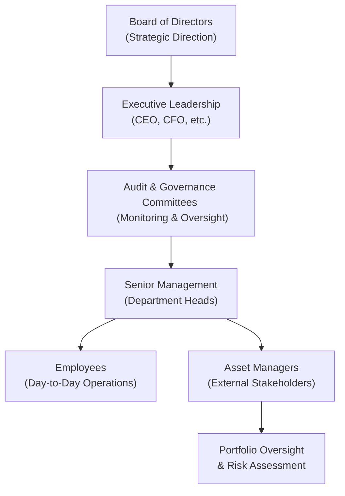

## Introduction

Corporate governance. It’s not always the most glamorous topic—at least that’s what I used to think when I first started analyzing companies. But, wow, was I ever wrong. You see, corporate governance practices can shape everything from a company’s strategic direction to its day-to-day checks and balances. In our context as portfolio managers or analysts, strong governance can be an absolute game-changer, often protecting investors from nasty surprises.

This section examines the influence of governance structures on portfolio oversight, touching on topics like how boards function, the role of committees, and the importance of transparency. We’ll also talk about what happens when governance goes off the rails—like unethical leadership or wink-and-nod financial reports—which can lead to huge shareholder losses. Finally, we’ll walk through how to integrate governance assessments into portfolio decisions and why stewardship codes and active ownership matter. By the end, you’ll be able to look at a portfolio and say, “Hey, are these companies being run in a way that truly serves shareholders for the long haul?” Let’s dive in.

## Corporate Governance Fundamentals

Corporate governance is, at its core, a system of rules, processes, and norms that govern how a company is directed and controlled. For clarity:

• Corporate Governance: A system of rules and processes by which a company is directed and controlled.  
• Board Independence: The extent to which board members do not have relationships that could bias their decisions.  
• Proxy Voting: The act of voting on company matters by shareholders who cannot attend annual meetings.  
• Active Ownership: The practice of shareholders using their rights to influence corporate behavior.  
• Stewardship Code: Voluntary principles guiding institutional investors on responsible ownership and engagement.  
• Executive Compensation: Pay packages awarded to top management, which may include salaries, bonuses, and stock options.  
• Shareholder Rights: Legal protections ensuring shareholders can voice opinions and influence governance.  
• Governance Risk: The risk arising from ineffective or unethical leadership and oversight practices.

Just as an orchestra needs a conductor to maintain harmony, companies need strong governance to ensure that various stakeholders—ranging from executives to minority shareholders—work together fairly and transparently. Governance structures help keep corporate objectives aligned with shareholder interests, mitigating confusion and abuse of power.

## Governance Structures in Asset Management Firms

So, how does governance show up in asset management firms themselves? Well, asset managers typically have boards, committees, and executive leadership that monitor the investment process, ensure that client mandates are met, and maintain a consistent level of risk oversight. Effective governance in an asset management context can determine whether portfolio managers are incentivized to pursue strategy with a long-term horizon or to chase short-term returns that might compromise risk standards.

To illustrate the flow of governance-related oversight in a typical asset management organization, consider the diagram below:

• Board of Directors: Elected by the shareholders of the asset management firm, the board has ultimate responsibility for setting strategic goals and overseeing management.  
• Executive Leadership: This might include a chief executive officer (CEO) and other C-suite executives who are responsible for daily operations, ensuring the firm meets strategic objectives.  
• Committees (Risk Management, Audit, Ethics): These committees focus on specialized areas such as risk controls, internal audits, or ethical guidelines, ensuring that potential conflicts of interest or compliance issues are handled properly.  
• Portfolio Managers: Individuals responsible for managing client assets in line with mandated objectives and risk tolerances. They’re guided by policies set at higher levels of governance.

When each layer of oversight fulfills its function, investor interests are typically well-protected. In contrast, if any of these “layers” fail to do their job diligently—say, by rubber-stamping questionable strategies or ignoring warning signs—huge problems can surface quickly.

## The Business Case for Good Governance in Portfolio Holdings

Now flip the perspective to the companies in which we invest. Why should a portfolio manager care about how a company’s board is structured or if their CEO’s compensation is aligned with shareholders?

• Higher Valuations and Lower Risk: Extensive research (such as Gompers, Ishii, & Metrick, 2003) indicates that companies with robust governance frameworks tend to trade at premium valuations. They also often exhibit lower volatility, all else being equal.  
• Better Decision-Making: A board that includes independent directors is more likely to challenge management assumptions, enabling more balanced and risk-aware decision-making.  
• Mitigating Agency Problems: Corporate governance mechanisms reduce the classic principal-agent problems. Managers (agents) act in the best interest of shareholders (principals), minimizing the risk of management pursuing personal agendas at the expense of owners.

### A Quick Example

Imagine an energy corporation, let’s call it “EcoPower Inc.” If EcoPower’s board comprises a majority of independent directors with relevant expertise (maybe a couple of them previously served in regulatory bodies or environmental agencies), they can effectively question management about the feasibility of new renewable projects, cost structures, and potential regulatory pitfalls. This fosters a tone of accountability. As a result, EcoPower might deliver more reliable earnings growth. This fosters confidence among institutional investors who appreciate that behind the scenes, corporate leadership is more likely to play by the rules and plan carefully.

## Governance Failures and Consequences

Sometimes we hear about major accounting scandals, abrupt CEO resignations, or unauthorized trading incidents that lead to massive shareholder losses. In many of these cases, corporate governance breakdowns played a pivotal role. For instance:

• Lack of Oversight: If the board is stacked with insiders or is overly deferential to powerful executives, crucial decisions can go unchecked.  
• Unethical Leadership: Executives may engage in fraudulent activities, manipulate earnings, or mislead regulators if not properly supervised.  
• Shareholder Disenfranchisement: If minority shareholder rights are trampled or crucial information is withheld, trust erodes and the share price can plummet.

Talented managers often emphasize the necessity of reading a company’s annual proxy statements or governance disclosures in detail. After seeing a few fiascos, you quickly realize how something as “technical” as board composition can become a major risk factor. Remember, governance risk is real. It’s not just an academic concept—poor governance can lead to poorly structured deals, inflated valuations, or even catastrophic meltdown, impacting your portfolio returns.

## Incorporating Governance Considerations into Stock Selection

Many asset managers utilize an environmental, social, and governance (ESG) framework to systematically evaluate governance quality. Others have dedicated corporate governance teams that assess companies based on:

• Board composition and independence.  
• Alignment of executive compensation with shareholder interests (pay-for-performance metrics).  
• History of ethical conduct or controversies.  
• Shareholder rights and voting structures.  
• Audit quality and transparency in disclosures.  

### Proxy Voting as a Lever

Active Ownership often takes shape through proxy voting. So, let’s say you hold shares of a well-known tech company. Every spring, you receive proxy materials. You might see:

• Proposals on executive compensation packages (e.g., performance versus stock-based compensation).  
• Elections for new or incumbent board directors.  
• Shareholder proposals on environmental or governance changes.

Many institutional investors, as part of their fiduciary duty, carefully review and vote these proxies to ensure that the board and management remain aligned with investor interests. This proxy voting is especially relevant for large asset managers who hold significant stakes in numerous portfolio companies.

## Stewardship Codes and Institutional Influence

Stewardship codes are voluntary guidelines encouraging institutional investors to be active, responsible shareholders. These codes often encourage:

• Transparent voting policies.  
• Engagement with investee companies to address strategic, environmental, or social issues.  
• Collaborative initiatives among investors to influence corporate behavior positively.  
• Oversight and escalation processes if concerns are not adequately addressed by company management.

What’s interesting is that stewardship codes can vary by country, reflecting local corporate culture and legal traditions. However, their overarching goal is to enhance long-term value creation by promoting active ownership and responsible governance. Large asset managers or pension funds often sign up to local or global stewardship codes to signal their commitment. And that can go a long way in building trust with clients.

## Integrating Governance Risk into Asset Allocation and Risk Management

Now, you might be wondering: “Is governance risk really something that gets priced in at the big picture, portfolio-scope level?” Absolutely. Governance risk doesn’t just show up as an isolated ‘check the box’ measure. It can affect entire sectors or regions. For example, if a particular market is known for poor shareholder protections or a weak regulatory environment, you might assign a risk premium or reduce your exposure in that region.

### Risk Mitigation Tools

• Diversification: Sometimes, diversifying across companies, industries, and geographies helps mitigate governance risk.  
• Screening: Excluding or underweighting companies with poor governance metrics.  
• Engagement: Working collaboratively with management to improve governance practices.  
• Scenario Analysis: Analyzing how changes in regulation or leadership might impact returns.

Active managers often weigh the financial costs of potential governance failures against the benefits of investing in high-governance-quality firms. Keep in mind, strong governance is sometimes priced in, but many managers believe the potential downside from governance blowups is so severe that the overall risk-return trade-off still favors robust governance as a selection criterion.

## Real-World Case Examples

### Case 1: Board Independence Saves the Day

Picture a mid-sized pharmaceutical firm that receives an unexpected acquisition offer. The CEO, who might be eyeing a generous severance package in a merger scenario, is all in favor. However, the board, which has a strong independent majority, steps in. They request a formal valuation from a reputable advisory firm, engage in thorough due diligence, and negotiate better terms. The outcome? The final acquisition price is significantly higher, directly benefiting shareholders. Without strong oversight, that extra value might have been left on the table.

### Case 2: Governance Lapse in a Tech Giant

Conversely, there’s the well-known story of a global tech giant facing allegations that their senior management falsified product usage data. After the news broke, the stock price tanked almost overnight. Subsequent investigations found that the board had minimal representation from individuals with relevant auditing and risk-management expertise, allowing management to run circles around them. Here, the governance oversight shortfall directly resulted in massive stock declines. Some institutional investors exited positions quickly. Others used these incidents as leverage to demand sweeping changes at the board level.

## Boosting Long-Term Portfolio Performance Through Governance

Time and again, empirical studies show that strong governance correlates with sound financial health and more resilient performance. Good governance fosters a culture of accountability, transparency, and sustainable growth. It might not guarantee sky-high returns every quarter, but it often reduces the likelihood of catastrophic events that can annihilate shareholder value.

Naturally, short-term disruptions might occur—sometimes an overly stringent board can slow down decision-making. But in the grand scheme, governance is a cornerstone for risk management and stable long-term outcomes. And yes, portfolio managers with a keen eye on governance metrics can identify “hidden gems”—companies that are proactively improving board structures or adopting shareholder-friendly measures, which can spark upward re-ratings in valuation.

## Best Practices and Practical Tools

• Board Independence Analysis: Keep track of how many independent directors are on a company’s board. Also examine whether these individuals have the relevant skill sets.  
• Compensation Reviews: Does the executive compensation package truly reflect performance? Look for performance-based metrics that align with your investment horizon.  
• Proxy Voting Guidelines: Many asset managers create detailed internal frameworks to ensure consistent voting across various holdings.  
• Engagement Programs: Rather than simply voting “no,” some institutional owners engage with companies proactively, offering suggestions for operational or structural improvements.  
• Governance Checklists: Prompt yourself to regularly evaluate a company’s succession planning, internal controls, and overall track record on ethics and compliance.  

## Additional Insight: Diagram of Governance Oversight

Consider the following simplified sequence of governance oversight and reporting dynamics (with a focus on how this ties into portfolio oversight). Accountability typically flows from the bottom up, while strategic directives flow from the top down.

While asset managers aren’t direct employees, they interact with and assess these layers—especially committees and senior management—when selecting or monitoring an investee company.

## Exam Tips: Corporate Governance Influence on Portfolio Oversight

1. Understand the Link to Valuations: On the CFA exam, you might see scenario questions where the presence or absence of sound governance influences cost of capital or discount rates in valuation models. Explicitly connect these dots.  
2. Apply Governance Frameworks: You may be asked to compare two companies with differing board compositions. Be ready to evaluate how governance factors alter risk assessments.  
3. Practice That Proxy Voting Angle: The exam can have item-set questions requiring you to interpret proxy statements. Know the difference between a non-binding shareholder proposal and a management resolution.  
4. Be Prepared to Address Ethical Dilemmas: Suppose an ethical breach occurs in a hypothetical scenario. Expect to discuss what the board or committees should have done differently.  
5. Use Real Data: In constructed response questions, pulling credible references to real studies (e.g., Gompers et al.) or recognized codes like the OECD Principles can strengthen your argument.  
6. Move Beyond Checklists: Recognize that passing the exam isn’t about memorizing bullet points but applying them to real or simulated contexts.  
7. Don’t Forget Stewardship Codes: The exam might test your knowledge of the concept of “active ownership,” especially how institutional investors can advocate for better governance.  
8. Connect Governance and ESG: In many modern exam materials, governance is a pillar of ESG. Understand how G (governance) interacts with E (environment) and S (social) in investing.  
9. Mind Local Practices vs. Global Norms: The exam could present differences in governance structures around the world. Be aware of universal principles, but also know there can be jurisdiction-specific quirks.  
10. Time Management: If you see a question with multiple parts about a governance case study, allocate your time carefully. The trick is layering your answers with both conceptual and real-world insights.

## References and Further Reading

• Gompers, P., Ishii, J., & Metrick, A. (2003). “Corporate Governance and Equity Prices.” Quarterly Journal of Economics.  
• OECD Principles of Corporate Governance.  
• International Corporate Governance Network (ICGN) Guidelines and Best Practices.  
• CFA Institute’s Global Policy on Corporate Governance and ESG Disclosures.

--------------------------

## Test Your Knowledge: Corporate Governance and Portfolio Oversight



### How can strong corporate governance practices help protect investor interests?

- [x] By creating checks and balances that align management decisions with shareholder objectives.
- [ ] By ensuring executive bonuses are not subject to tax.
- [ ] By automatically guaranteeing high earnings growth every quarter.
- [ ] By eliminating corporate taxes paid by the company.

> **Explanation:** Strong corporate governance typically establishes rules, committees, and oversight structures that keep executives accountable, aligning their decisions with shareholder interests. Governance alone doesn’t eliminate taxes or guarantee earnings growth.

### What is board independence?

- [x] The degree to which board members do not have relationships that could bias their decisions.
- [ ] A requirement that all directors live in different geographic regions.
- [ ] The condition that shareholders cannot remove board directors.
- [ ] Using external auditors to confirm management’s financial statements.

> **Explanation:** Board independence indicates that a board’s members serve without conflicts of interest (e.g., prior business relationships with the CEO). This independence fosters unbiased oversight.

### Which of the following is a key characteristic of ineffective corporate governance that can harm shareholder value?

- [ ] Transparent financial statements.
- [ ] Independent committees overseeing risk.
- [x] Lack of oversight and rubber-stamping of executive decisions.
- [ ] Fair compensation aligned with long-term performance.

> **Explanation:** Ineffective governance often includes a board that fails to question or challenge management actions. This rubber-stamping mentality can lead to unchecked executive decisions, higher risks, and potential shareholder losses.

### What does proxy voting allow shareholders to do?

- [x] Vote on company matters without being physically present at annual meetings.
- [ ] Trade shares of stock without paying commission fees.
- [ ] Predict future prices based on past trends.
- [ ] Convert equity shares into bonds.

> **Explanation:** Proxy voting is a mechanism by which shareholders cast votes on corporate proposals, board elections, and other matters, even if they cannot attend the shareholder meeting in person.

### Which one of these statements describes “Executive Compensation” in a corporate governance context?

- [ ] It is primarily the board’s legal liability insurance.
- [ ] It is the total philanthropic contribution of top leaders to charity.
- [x] It refers to pay packages (salary, bonus, stock options) awarded to top executives.
- [ ] It refers only to the base salary of a company’s CEO.

> **Explanation:** In corporate governance, executive compensation includes all forms of remuneration, such as salary, bonuses, stock options, and other long-term incentives, aimed at aligning management’s interests with shareholders.

### Why is board independence important in portfolio oversight?

- [x] It ensures unbiased review of company management decisions that can affect profitability and risk.
- [ ] It eliminates the need for regular financial audits.
- [ ] It automatically improves the company’s stock price.
- [ ] It guarantees the board will always vote against management proposals.

> **Explanation:** An independent board can evaluate management decisions without personal conflicts, which is crucial for mitigating risks and safeguarding shareholder value. Independence doesn’t automatically raise a stock price or guarantee antagonism toward management.

### What is a stewardship code?

- [x] A set of voluntary principles guiding institutional investors to engage responsibly with companies they invest in.
- [ ] A mandatory international regulation limiting executive pay.
- [ ] A list of laws requiring all board members to have finance degrees.
- [ ] A government-issued document that governs national banks only.

> **Explanation:** Stewardship codes are voluntary frameworks designed to encourage active involvement of institutional investors in corporate affairs, promoting ethical and sustainable value creation.

### In the context of governance, how might an investor mitigate governance risk?

- [x] Diversifying portfolios and applying systematic company assessments for governance quality.
- [ ] Avoiding any form of risk analysis to keep compliance burdens lower.
- [ ] Refusing to hold shares in more than one company at a time.
- [ ] Purchasing only companies with high Price-to-Earnings ratios.

> **Explanation:** Investors can mitigate governance risk by diversifying their holdings and using screening or analytical processes that evaluate each company’s governance structure and track record.

### Which is an example of active ownership?

- [x] Engaging with company management on governance practices and using proxy votes strategically.
- [ ] Ignoring the proxy materials entirely.
- [ ] Buying stocks only to sell them immediately for a profit.
- [ ] Owning shares but never communicating with the company’s leaders.

> **Explanation:** Active ownership involves shareholders using their rights to influence company behavior, which can include proxy voting and direct dialogue with management on governance issues.

### True or False: Governance failures generally have no impact on a firm’s share price.

- [ ] True
- [x] False

> **Explanation:** Governance failures often have a material impact on a firm’s share price, as poor oversight, unethical leadership, or financial misreporting can severely compromise investor confidence and erode company value.


