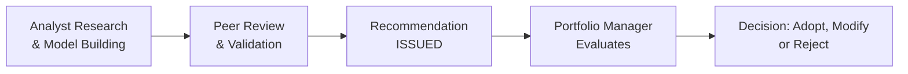

## Introduction

Ever wonder how analysts feed their research into the grand machine of portfolio management? I used to think it was basically analysts handing off reports and portfolio managers magically turning them into investment decisions. But, as I found out early in my career, the process is more dynamic. It involves back-and-forth discussions, clarifications, real-time data updates, and even a fair share of spirited debates. Whether you’re analyzing a small-cap stock or a massive corporate bond, your findings rarely stand alone—they’re part of a team effort that shapes strategic action. In this section, we’ll dive into how analysts and portfolio managers collaborate, emphasizing the importance of seamless communication, data-sharing, and mutual respect.

## Roles and Responsibilities

Analysts typically specialize in one or more sectors, asset classes, or themes, such as technology equities or emerging market debt. They provide deep-dive research, evaluate company fundamentals, identify catalysts for price movements, and forecast potential downside risks. The usual deliverables can include a formal research report, a set of valuation models, scenario analyses, and ongoing updates (sometimes weekly or even daily “notes” on new developments). Portfolio managers, on the other hand, juggle a broader array of responsibilities. They integrate various research inputs from multiple analysts, monitor portfolio-level risk, ensure compliance with client mandates and sector allocation guidelines, and ultimately decide on position sizing and timing.

It’s helpful to keep the concept of Analyst Coverage in mind. Analysts typically focus on a defined coverage universe, which is a list of securities (stocks, bonds, or other instruments) and markets they regularly track. Meanwhile, managers rely on them not just for raw information but also for insights into the “Investment Thesis”—the story behind why a given security might outperform or underperform in the market.

## Importance of Effective Communication

When I first saw a portfolio manager miss out on a potentially lucrative trade, it wasn’t because the research was flawed. It was because the communication was slow. Information had to pass through multiple layers: from the analyst to a research coordinator, from the coordinator to an investment committee, and finally from the committee to the manager. By then, the short-term catalyst the analyst identified had already played out.

You don’t want that to happen in your organization (or in your exam case scenarios). So one of the first steps in forging a strong partnership is implementing clear data-sharing protocols. This includes file naming conventions, research templates, communication channels, and expected turnaround times. Quick communication ensures:

• Potential trades aren’t missed.  
• Risk signals are flagged as early as possible.  
• Multiple viewpoints can be consolidated before making big decisions.

## Structured Analyst Recommendations

An effective collaboration framework typically features a structured process for making and evaluating analyst recommendations. Here’s a simplified depiction in a Mermaid diagram:

• Analyst Research & Model Building: This step involves gathering industry data, validating assumptions, and projecting financial outcomes.  
• Peer Review & Validation: Fellow analysts or senior staff critique the models, challenge assumptions, and highlight potential oversights.  
• Recommendation Issued: Once peer-reviewed, the analyst presents findings, typically with a summary of the thesis, valuation targets, risk factors, and recommended position sizing.  
• Portfolio Manager Evaluation: The manager checks alignment with portfolio constraints, overall strategy, and macro views.  
• Decision: The manager decides to adopt the recommendation as is, modify (e.g., reduce the proposed allocation), or reject it if it doesn’t fit the portfolio’s risk-reward objectives.

## Scenario Testing and Peer Review

Analysts usually conduct Scenario Testing to stress their investment theses in different market conditions (e.g., sudden rate hikes, global recessions, or sector disruptions). In many firms, the scenario testing results are reviewed by a team of peers who ensure that the proposed forecast is robust and accounts for outlier events. Sometimes, managers also request additional scenarios—perhaps a price shock in commodities or a big change in foreign exchange rates. This evidence-based approach ensures that recommendations are grounded in rigorous analysis rather than mere intuition.

Peer Review is a cornerstone of high-quality research. Let’s say an analyst covers the energy sector. They’ll often share initial findings with a senior analyst or cross-industry expert who can spot hidden pitfalls or confirm the logic. In my experience, this practice not only leads to better recommendations but also fosters a culture of continuous improvement and learning within the research team.

## Balancing Short-Term Catalysts and Long-Term Goals

Analysts are frequently focused on short-term catalysts—like an upcoming earnings release or a product launch. Portfolio managers, however, must integrate these catalysts into a broader, sometimes years-long, investment horizon. There can be tension: an analyst might push for immediate action (e.g., “Buy before the next quarterly earnings call!”), while the portfolio manager has to consider the broader strategic context, like capital gains taxes, the portfolio’s mandated turnover limits, or fear of overconcentration in a particular segment of the market.

How is this tension resolved? Through direct dialogue and structured decision-making. Managers will typically weigh short-term moves against strategic objectives. This is where the concept of Conviction Level is useful. If an analyst’s conviction for a near-term trade is extremely high, the manager might increase the position as a tactical maneuver while still keeping eyes on the broader portfolio constraints.

## Real-Time Updates and Technology Solutions

We live in a world where data changes by the second, and it’s crucial that portfolio managers stay up-to-date on changing assumptions. Tools like Slack channels, internal research portals, automated dashboards, or specialized platforms are increasingly used to broadcast Real-Time Updates:

• Automated Alerts: The moment an analyst updates their valuation model or changes their price target, the system can ping the manager.  
• Shared Watchlists: Analysts and managers both see these watchlists, allowing them to track real-time market quotes, related news, and performance metrics.  
• Collaboration Tools: Some organizations adopt software that keeps track of annotated charts, scenario test results, and prior trades.

In my earliest days, I found that simply having a well-organized shared drive and a broadcast email system significantly reduced confusion. Nowadays, advanced platforms are often essential; they feed the manager a continuous stream of relevant news, recommendations, and analyst notes, ensuring a unified “single source of truth” for your research process.

## Balancing Portfolio-Level Constraints with Analyst Convictions

A portfolio might have Sector Limits, such as a maximum 25% exposure to technology stocks. If your brilliant tech analyst just discovered five must-buy stocks, it isn’t realistic—or compliant—to load up on all of them. The manager must keep an eye on the overall asset mix, liquidity requirements, and diversification. This is where bridging the gap between an analyst’s conviction in a stock and the manager’s risk tolerance is paramount.

A good approach is to rank or score each recommendation. For instance:  
• Analyst Might Rate Potential Trades: A, B, or C based on expected alpha.  
• Manager Adjusts by Weighing Constraints: “We already have 20% in tech. We can add some top-tier positions (A-rated). Let’s hold off on B or C-rated names until we have more capacity.”  

This ensures that positions with the strongest risk-reward ratio make it into the portfolio, respecting both the manager’s risk objectives and the constraints laid out in the Investment Policy Statement (IPS).

## Fostering a Culture of Respect and Data-Driven Debate

Encouraging robust dialogue doesn’t mean letting arguments devolve into personal attacks or “turf wars.” In many high-functioning teams, analysts and managers engage in healthy debates about valuations, sector outlooks, or macro assumptions. Yet respect is never lost—everyone understands that the best argument, backed by data, stands the highest chance of influencing final decisions. Cultivating such a culture often requires:

• Clear Communication Norms: People should know how to challenge assumptions constructively.  
• Emphasis on Evidence: Opinions are fine, but data should back them up.  
• Timely Feedback: Managers should help analysts refine their process, and analysts, in turn, can flag potential blind spots in the manager’s portfolio strategy.

## Case Study: The Consumer Discretionary Upside

Imagine an analyst specializing in consumer discretionary stocks is convinced that a particular company, say “Dazzling Retailers Inc.,” is about to release an innovative loyalty program that will spark an earnings surprise. The analyst’s detailed report includes:

• A bullish scenario with a 30% upside potential in the next six months.  
• A baseline scenario that projects a 15% upside over a year.  
• A bearish scenario acknowledging that if the new loyalty program flops, the stock could drop by 10%.  

High conviction, right? The portfolio manager looks at current sector exposure and sees they’re already at the upper limit for consumer discretionary, having placed other positions in travel and e-commerce. The manager can’t simply exceed these limits without violating the portfolio’s guidelines. After discussion, they decide to:

1. Trim an existing consumer discretionary holding with a lower alpha potential.  
2. Initiate a smaller position in Dazzling Retailers, sized conservatively at first.  
3. Plan to scale in more if early results on that loyalty program confirm positive traction.  

This solution respects the constraints, harnesses the analyst’s conviction, and aligns with the manager’s broader risk framework.

## Best Practices and Common Pitfalls

Best Practices:
• Centralize data for easy real-time access.  
• Maintain a structured process for recommendations and reviews.  
• Encourage open dialogue but anchor all claims in data.  
• Align the time horizons between short-term and long-term objectives whenever possible.

Common Pitfalls:
• Over-reliance on a single star analyst without peer reviews.  
• Inefficient communication, leading to missed opportunities or delayed risk detection.  
• Lack of scenario testing, causing the portfolio to be blind to certain tail risks.  
• Letting personal biases or “gut feeling” override evidence-based decisions.

## Exam Relevance

On the CFA Level III exam, collaboration between analysts and portfolio managers could easily appear in an item-set question or a constructed response scenario. You might be asked to:

• Evaluate how an analyst’s recommendation fits within a portfolio’s constraints.  
• Identify best practices in communication protocols.  
• Discuss trade-offs between short-term catalysts and long-term portfolio strategies.  
• Suggest improvements to research process flows or scenario testing methods.

A typical question might give you a mini case study about an analyst who has just upgraded a stock, highlight the manager’s existing sector weightings and constraints, and ask for the most appropriate action. Or you might see a question that describes a breakdown in communication leading to suboptimal performance, and you’d have to propose solutions.

## Conclusion

Collaboration between analysts and portfolio managers is like an ongoing dance—you need the right rhythm, clear signals, and mutual trust. Analysts supply the in-depth, up-to-date research that shapes the portfolio vision, while managers orchestrate it all, ensuring alignment with larger strategies, risk appetites, and client-specific guidelines. By fostering open communication, respecting each other’s perspectives, and embracing a robust, data-driven approach, teams can deliver outcomes that satisfy both short-term catalysts and long-term objectives.

## Final Exam Tips

• Expect scenario-based questions that merge the analyst’s perspective (valuation and catalysts) with the manager’s constraints (asset allocation, risk budgets, liquidity).  
• Practice writing short, direct responses that show how you’d weigh analyst inputs against portfolio guidelines.  
• Emphasize the importance of real-time data-sharing. In an exam context, you might need to explain how delays or missing data can erode potential returns.  
• Incorporate references to structured processes—these are tested often in constructed response questions where you must outline steps or a sequence.  
• Stay familiar with peer review, scenario analysis, and performance attribution methods. These all connect to how an analyst’s work eventually impacts the portfolio outcome.  

## References

• Burns, T., & Wholey, D. (1993). “Adoption and Abandonment of Matrix Management Programs.” Academy of Management Journal, 36(1), 106–138.  
• CFA Institute. (n.d.). Equity Asset Valuation. (CFA Institute Investment Series).  
• Additional materials on communication best practices and team-based investment processes can be found on the CFA Institute website.

---

## Test Your Knowledge: Collaboration Essentials for Analysts and Portfolio Managers



### How does scenario testing contribute to the analyst–portfolio manager relationship?

- [x] It helps validate the analyst’s assumptions under different market conditions.
- [ ] It removes the need for real-time data sharing.
- [ ] It ensures every sector limit is automatically enforced.
- [ ] It eliminates the need for peer reviews.

> **Explanation:** Scenario testing examines how a recommendation might perform under various market or economic conditions, providing managers with confidence in the analyst’s assumptions.

### Which of the following best describes “Analyst Coverage”?

- [x] The defined universe of securities or markets an analyst regularly researches.
- [ ] The insurance policy that protects analysts from liability.
- [ ] The marketing campaign materials about analyst performance.
- [ ] The process of controlling portfolio sector risks.

> **Explanation:** Analyst Coverage specifically refers to the companies, sectors, or markets that an analyst is responsible for researching.

### A portfolio manager discovers that a top tech analyst has five “must-buy” ideas, but the portfolio is at its tech limit. What is the most appropriate action?

- [ ] Increase tech holdings significantly to capture all the upward potential.
- [x] Evaluate which existing tech positions could be trimmed to add the highest-conviction ideas.
- [ ] Immediately disregard the analyst’s recommendations.
- [ ] Purchase small positions in all five ideas, ignoring the tech limit.

> **Explanation:** While the analyst might have multiple good ideas, the manager must respect sector allocation constraints and balance the existing tech exposure. Thus, adding the highest-conviction picks while trimming lower-conviction or underperforming positions is the best approach.

### Which of the following is most critical in fostering a productive analyst–manager dynamic?

- [ ] Blindly following the analyst’s recommendations.
- [x] Maintaining a culture of respect and robust, data-driven debate.
- [ ] Having the manager override the analyst’s guidance at all times.
- [ ] Relying on gut instinct over scenario analysis.

> **Explanation:** Productive collaboration thrives when respectful dialogue is supported by quantitative analysis and real-world data.

### Why do portfolio managers often consider short-term catalysts with analyst input while maintaining a long-term view?

- [x] They must weigh immediate opportunities against overarching portfolio mandates and constraints.
- [ ] Short-term catalysts are legally mandated considerations.
- [ ] They have no interest in the long-term.
- [ ] They aim solely to maximize trading frequency.

> **Explanation:** Managers must balance near-term market opportunities with abiding by client objectives, sector limits, and risk-control frameworks, creating a healthy tension between short- and long-term goals.

### What is the purpose of peer review in an investment research context?

- [x] To ensure the analyst’s thesis is rigorously vetted, improving the final recommendation.
- [ ] To automatically approve any ideas with minimal scrutiny.
- [ ] To maintain a hierarchy in which junior analysts always yield to senior managers.
- [ ] To delay the research process as long as possible.

> **Explanation:** Peer review involves vetting assumptions, data sources, and methodologies, helping produce high-quality research recommendations.

### Which statement about “Conviction Level” is most accurate?

- [x] It represents the strength of belief an analyst (or manager) holds in a recommendation’s outcome.
- [ ] It’s a legal requirement before placing any trade.
- [x] High conviction can lead to larger allocations for a recommendation.
- [ ] It is solely determined by historical performance data.

> **Explanation:** Conviction Level reflects an analyst’s or manager’s confidence in an investment thesis. A high conviction often justifies allocating a larger portion of the portfolio—provided it fits overall constraints.

### When might real-time updates be most critical?

- [x] Right before a major earnings announcement or market-moving event.
- [ ] Only at the end of the fiscal year.
- [ ] Only after a trade has been executed.
- [ ] During a company’s quiet period.

> **Explanation:** Real-time updates are especially important when market conditions or company announcements can rapidly shift an investment’s return profile.

### A manager rejects an analyst’s recommendation despite the analyst’s high conviction. Which best describes a valid reason for rejection?

- [x] The portfolio is already at capacity for that sector based on the client’s Investment Policy Statement.
- [ ] The analyst’s personal style doesn’t match the manager’s.
- [ ] The manager never reads stock reports before deciding.
- [ ] The recommended security is cheap.

> **Explanation:** Even a brilliant idea can be turned down if it violates portfolio guidelines or risk limits. Sector constraints and strategy alignment are paramount.

### True or False: An analyst’s role ends once they submit their research report.

- [x] True
- [ ] False

> **Explanation:** This is a trick question. Analysts often continue monitoring their coverage universe and provide follow-up insights, making real-time updates and ongoing dialogue essential for effective portfolio management, but some might say “Yes, the official role in producing new research ends,” though in practice, they continue to collaborate. In many organizations, the analyst remains involved in ongoing discussions and adjustments to their recommendations, so strictly speaking, their role doesn’t fully end.


