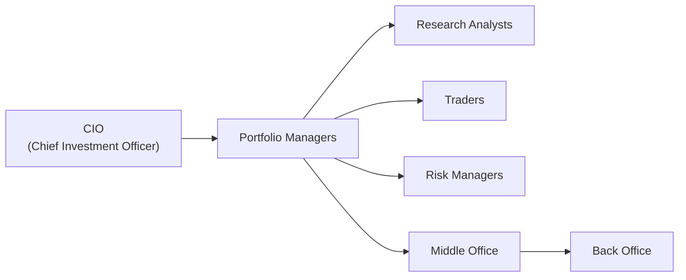

## Introduction

Managing a portfolio management team—whether you’re part of a large asset management firm or a boutique investment house—can sometimes feel like orchestrating a band. You’ve got different players, each with distinct specialties (think: the loud drummer equals the high-energy trader, while the mellow bass player is like a methodical research analyst). If everyone plays in sync, you make music. But if someone is off-key, well, you get the idea.

In this article, we’ll dive deeply into various common team structures for portfolio management, best practices in decision-making, operational considerations such as compliance and technology, and performance metrics that can help you evaluate and improve how your teams function. This is your opportunity to see how a strong operational structure and a supportive cultural atmosphere can boost investment outcomes, reduce conflicts, and keep your firm on the right side of regulatory requirements. Let’s jump right in.

## Common Team Structures

There’s no “one size fits all” approach to managing a portfolio management team. Over the years, I’ve seen wide variations, ranging from a single “star” portfolio manager with minimal support staff to sophisticated, globally distributed pods. Below are the three most prevalent structures.

### Individual Portfolio Manager Model
In some firms—often smaller hedge funds or specialized boutique shops—the entire portfolio can be managed by one lead portfolio manager. This individual might lean on a small team of analysts, but major decisions, including asset allocation and security selection, often rest with them. The advantage? There’s clear accountability and a streamlined decision-making process. But beware: personal biases or blind spots might go unchecked without a robust support network. In addition, the knowledge base can be narrow if managers don’t foster collaboration with analysts or external experts.

### Team-Based Model
Many larger firms adopt a collaborative approach where multiple managers and analysts share responsibility. Rather than one “star,” you have a group of professionals working together, perhaps each with a defined asset class or sector focus. Ideally, decisions come from group consensus, leveraging each member’s perspectives while ensuring checks and balances. This approach promotes cross-pollination of ideas but requires a clear hierarchy or protocol for final decisions to avoid confusion. If not managed well, it can become a “too many cooks in the kitchen” situation.

### Pods or Specialized Units
Some firms organize themselves into pods—small, specialized teams that focus on a particular strategy, sector, or product line. For instance, you might have a “tech pod,” a “healthcare pod,” or even a “long/short equity pod.” Each pod typically includes a portfolio manager, one or two research analysts specializing in that subject matter, and possibly a trader. This structure promotes deeper expertise and agility within each specialized domain. However, strong coordination between pods is essential to avoid duplication of effort or conflicting positions across the broader portfolio.

## Key Roles in a Portfolio Management Team

Regardless of how your firm is structured, certain roles remain fixtures in any well-run investment organization. Let’s look at how these key players interact.

### Chief Investment Officer (CIO)
At the top of the investment hierarchy, the CIO sets the overarching strategy, risk tolerance, and performance objectives. They’ll typically coordinate with portfolio managers to ensure alignment with the firm’s philosophy. In many respects, the CIO is like a conductor, making sure all instruments (i.e., teams) play in harmony.

### Portfolio Managers
Portfolio managers execute the firm’s investment strategy for their assigned mandate. They take inputs from research analysts, weigh macro factors, and ultimately choose which assets to buy or sell. Success depends on both their technical acumen (understanding markets, valuations, and risk) and their ability to synthesize diverse viewpoints from the team.

### Research Analysts
Research analysts form the foundation of idea generation. They analyze companies, industries, or asset classes, building models, crunching numbers, and generating investment theses. They also provide real-time updates on corporate actions, economic data, and industry trends.

### Traders
Traders handle the execution side of the portfolio. They must strike a balance between achieving best execution (lowest cost, minimal market impact) and adhering to portfolio guidelines. In some places, advanced algorithmic trading tools are used to improve speed and reduce errors.

### Risk Managers
In the “bad old days,” risk management could be an afterthought. Today, risk managers are vital. They monitor portfolio volatility, track exposures against defined risk limits, perform stress tests, and keep an eye on compliance with internal and external regulations. They often work closely with the middle office to ensure accurate position-level data.

## Decision-Making in Portfolio Management Teams

The approach to decision-making can make or break a team’s effectiveness. Some firms prefer a hierarchical approach where the CIO or lead portfolio manager issues directives. Others use consensus-based voting, especially in a team model. Whatever technique you adopt, clarity is crucial—everyone must know who’s responsible for the final say. 

A best practice is to establish an Investment Committee that meets regularly. This committee scrutinizes new ideas, monitors ongoing positions, and tracks macroeconomic developments. With a structured process (like employing formal pitch documents, checklists, or project management tools), teams can reduce bias, ensure accountability, and incorporate diverse viewpoints.

It can help to think of decision-making as a funnel:

• Segment 1: Idea Generation – Research analysts propose new ideas, either top-down (macroeconomic themes) or bottom-up (company-specific).  
• Segment 2: Preliminary Screening – The portfolio manager or a small committee examines feasibility, synergy with existing positions, and risk.  
• Segment 3: Deep Dive – If the idea passes initial scrutiny, a deeper fundamental or quantitative analysis is conducted.  
• Segment 4: Final Sign-Off – The portfolio manager, sometimes with the CIO or an Investment Committee, gives the green light or kills the idea.

A strong record-keeping system ensures decisions are documented and lessons are learned—both from winners and losers.

## Operational Considerations

### Compliance Monitoring
If you’ve ever tried to run a marathon wearing uncomfortable shoes, you already know the pain of ill-fitting processes. Compliance is that comfortable pair of running shoes, ensuring smooth operation and fewer blisters (read: regulatory consequences). Compliance specialists verify that trading adheres to regulatory standards, the firm’s code of ethics, and client mandates. This function is critical in maintaining investor trust and avoiding legal repercussions.

### Technology Infrastructure
Sophisticated portfolio management systems and risk analytics tools help with everything from real-time performance monitoring to stress testing. Additionally, secure trade execution and data management platforms reduce operational risk. A single data error—like a misquoted price—can wreak havoc on performance calculations, so robust technology is essential.

### Middle Office Functions
The middle office is often the unsung hero. These teams handle performance attribution, risk management processes, and day-to-day operational tasks such as generating reports on transaction cost analysis (TCA) and reconciling positions. They form the bridge between the front office (portfolio managers, traders) and the back office (settlements, accounting, record-keeping).

### Back Office Functions
Your back office covers trade settlement, record-keeping, and accounting. Although it might not be as glamorous as front-end trading, it’s where the details come together. Ensuring trades settle on time, reconciling outstanding positions, and performing the day-to-day accounting ensures the integrity of all data. If your back-end processes fail, your entire organization’s credibility is at risk.

Below is a simple diagram illustrating the interplay between some of these roles and offices:

## Importance of Internal Controls

Internal controls act like the guardrails on a winding mountain road. You might never need to lean on them, but if something goes off course, they’re lifesavers.

• Segregation of duties prevents any one individual from controlling too many aspects of a transaction. For example, a trader initiating an order should not be responsible for approving it.  
• Approval workflows and consistent documentation help pinpoint errors quickly and provide audit trails.  
• Regular audits—both internal and external—mitigate the likelihood of fraud or operational mishaps.  
• Internal compliance checks ensure that the firm’s investment guidelines are respected.  

Nowadays, advanced analytics can alert teams to anomalous trading patterns or unusual operational data—even before humans spot an issue.

## Organizational Culture: Collaborative vs. Hierarchical

Culture heavily influences how a team shares ideas, handles risk, and responds to challenges. A hierarchical culture may provide clear lines of authority and swift decision-making. However, it can also stifle debate if junior members hesitate to challenge superiors. A collaborative culture, on the other hand, encourages open discussion and fosters innovative solutions. Then again, the risk of “analysis paralysis” or groupthink is real if you don’t set firm decision deadlines.

I remember an experience working at a large institution where any pushback on a senior manager’s idea was taken as borderline insubordination. The result? A few big losers that might have been avoided with robust, open debate. Conversely, at another firm, the culture was so collaborative that it took us weeks (often too many) to finalize even moderate position changes. The sweet spot, as usual, lies somewhere in the middle—encourage robust dialogue while keeping an efficient route to a definitive call.

## Managing Remote or Global Teams

In an era of virtual connectivity, managing a global or partly remote investment team is increasingly common. While technology helps, time zone differences, language barriers, and cultural nuances can complicate communication. Some best practices:

• Schedule rotating call times so no single office consistently has to meet at inconvenient hours.  
• Leverage collaborative platforms (e.g., shared analytics dashboards or real-time chat) so that analysts, traders, and portfolio managers can weigh in without messy email threads.  
• Facilitate occasional in-person meetups if possible. Face-to-face team building fosters trust and empathy that might not form purely online.  
• Encourage cultural awareness training, ensuring minimal friction from different norms or communication styles.

## Performance Metrics for Team Effectiveness

Yep, it’s not just about final returns. Successful teams are usually evaluated on a blend of quantitative and qualitative measures:

• Investment Performance: Growth rate, Sharpe ratio, Treynor ratio, or alpha relative to a benchmark.  
• Risk Management: Adherence to risk budgets, drawdowns, and volatility relative to expectations.  
• Process Consistency: Did your team follow the documented investment process? Are trades properly justified and recorded?  
• Collaboration and Communication: Peer reviews, 360-degree feedback, and even metrics like investment idea “hit rates.”  
• Client Satisfaction: Retention rates and feedback from client surveys.  

Balancing these performance metrics—without overemphasizing short-term returns—helps sustain a healthy environment and ensures long-term alpha generation.

## Best Practices and Common Pitfalls

• Clear Accountability: Spell out who makes the final decisions, who handles day-to-day responsibilities, and who reviews outcomes. Avoid role confusion.  
• Encourage Diversity of Thought: A monolithic viewpoint leads to groupthink and missed opportunities. Harness the power of varied backgrounds—geographic, educational, or experiential.  
• Robust Infrastructure: Don’t skimp on software solutions that ensure accurate data and streamlined communication.  
• Continuous Learning: A knowledge-sharing ethos ensures that lessons from winning (and losing) trades inform future decisions.  
• Watch Out for Overload: Sometimes teams end up with too many concurrent projects or conflicting mandates. Periodically assess priorities to maintain focus.  
• Effective Resource Allocation: Deploy specialized pods only if you can staff them with enough depth and budget; a “pod” of one does little good.

## Practical Case Study: A Multi-Manager Equity Fund

Consider a real-world scenario: A global equity fund structured around a multi-manager approach. Each manager in the fund has a designated style (like growth, value, or small-cap). The CIO oversees them, establishing risk guidelines (e.g., factor exposures) and performance objectives. The advantage? Each manager can leverage domain expertise. The risk? Lack of coordination can lead to unintended portfolio overlap or contradictory exposures—one manager shorting a stock while another is going long.

In one instance, I witnessed a case where a growth manager was heavily allocated to a tech company at the same time the value manager decided to short it, citing collapsing fundamentals. Because each manager operated in a silo, the net effect offset. When the team uncovered this contradiction, they set up a weekly cross-team huddle, mitigating future mishaps.

## Concluding Exam Tips

• Recognize Different Structures: Know the pros and cons of each organizational setup. Exam questions may ask you to identify the best approach given a scenario.  
• Stress on Roles & Accountability: For constructed-response questions, highlight how each role—CIO, PM, analyst, trader—contributes to a robust investment process.  
• Operational Risk & Compliance: Examiners often test your awareness of the middle and back offices’ importance.  
• Culture & Communication: Don’t overlook the intangible aspects of team dynamics. The CFA Institute’s Code and Standards emphasize professional conduct, which ties into organizational culture.  
• Performance Measurement: Familiarize yourself with typical Key Performance Indicators (KPIs) and know how to evaluate results beyond just raw returns.

## Glossary

Team-Based Model: An approach where multiple managers or analysts collectively manage a portfolio.  
Pod Structure: Small, specialized groups focusing on specific strategies or sectors within a larger firm.  
Operational Risks: Potential losses from inadequate internal processes, systems, or external events.  
Middle Office: Functions handling risk management, performance attribution, and compliance.  
Back Office: Functions handling trade settlement, record-keeping, and accounting.  
Chief Investment Officer (CIO): Senior executive responsible for overarching investment strategy.  
Internal Controls: Processes and procedures designed to ensure the integrity of financial and operational information.  
Performance Metrics: Tools (e.g., Key Performance Indicators) used to gauge the success of individuals and teams.

## References and Further Reading

• Kaplan, R. & Norton, D. (1996). The Balanced Scorecard: Translating Strategy into Action. Harvard Business Review Press.  
• CFA Institute’s resources on global investment performance standards and operational best practices.  
• Ware, J. (2003). Investment Leadership: Building a Winning Culture for Long-Term Success. Wiley.

---

## Test Your Knowledge: Managing Portfolio Teams and Operational Structures Quiz



### Which of the following best describes a “pod structure” within a portfolio management organization?

- [ ] A single manager who makes all investment decisions independently.
- [ ] A hierarchical system where the CIO and senior managers hold central authority.
- [x] Small, specialized groups focusing on specific strategies or sectors within a larger firm.
- [ ] A firmwide consensus committee with no defined specializations.

> **Explanation:** A pod structure is typically formed by small, specialized teams, each focusing on a particular strategy, product line, or market sector.

### When discussing key roles, which position most directly oversees the entire investment strategy in an asset management firm?

- [ ] Portfolio Manager
- [x] Chief Investment Officer (CIO)
- [ ] Research Analyst
- [ ] Senior Trader

> **Explanation:** The CIO sets the overarching investment strategy and often supervises portfolio managers to ensure alignment with the firm’s objectives.

### In a team-based portfolio management model, one potential drawback is:

- [ ] There is no collaboration.
- [x] Decision-making can become slow or indecisive if roles are not clearly defined.
- [ ] Portfolio managers operate without any checks and balances.
- [ ] Compliance often becomes irrelevant.

> **Explanation:** While team-based models encourage collaboration, the risk is that decisions might be delayed or diluted without a clear hierarchy or decision protocol.

### Which function is primarily responsible for risk management, performance attribution, and compliance monitoring?

- [ ] Front Office
- [x] Middle Office
- [ ] Back Office
- [ ] Investment Committee

> **Explanation:** The middle office typically handles these functions, acting as a conduit between the front office (where trades are initiated) and the back office (trade settlement, record-keeping).

### What is one advantage of segregating duties between a trader and the back office?

- [x] It reduces the likelihood of fraud by preventing one individual from controlling all aspects of a transaction.
- [ ] It allows the trader to settle trades faster on their own.
- [ ] It allows the back office to make investment decisions.
- [ ] It simplifies compliance oversight by reducing transparency.

> **Explanation:** Segregating duties ensures checks and balances, making it more difficult for a single person to conduct unauthorized or fraudulent activities.

### Organizational culture in a portfolio management firm:

- [ ] Is irrelevant as long as there is a solid investment strategy.
- [x] Can significantly influence the flow of ideas and willingness of team members to share concerns.
- [ ] Only matters if the firm has more than 100 employees.
- [ ] Does not affect risk management or operational outcomes.

> **Explanation:** Culture shapes communication, collaboration, and decision-making processes, which in turn affects investment performance and risk management.

### Which of the following best describes a potential pitfall of a purely hierarchical culture?

- [ ] It fosters an environment of open debate.
- [ ] It ensures that junior employees proactively challenge management.
- [x] It can stifle innovative ideas if lower-level employees feel discouraged from voicing concerns.
- [ ] It naturally encourages idea sharing across pods.

> **Explanation:** In a strong hierarchical culture, junior employees may be reluctant to question the authority of senior staff, leading to missed opportunities and unchecked risks.

### In evaluating a team’s performance, it’s wise to:

- [ ] Focus only on short-term returns.
- [ ] Penalize collaborators for increasing overhead in communication.
- [x] Assess both qualitative factors (e.g., collaboration) and quantitative metrics (e.g., alpha, Sharpe ratio).
- [ ] Treat all members alike, regardless of their contribution.

> **Explanation:** An effective performance evaluation considers not only short-term returns but also process adherence, collaboration, risk management, and client satisfaction.

### One best practice for managing global, remote teams is:

- [ ] Conducting all group discussions via long email threads to maintain written records.
- [x] Rotating meeting times to share the inconvenience of time zone differences across the group.
- [ ] Requiring everyone to relocate to a central headquarters.
- [ ] Limiting cultural awareness training to the senior management level.

> **Explanation:** Rotating meeting times and providing cultural awareness training fosters fairness, stronger teamwork, and improved idea exchanges among globally distributed teams.

### True or False: A strong system of internal controls can help detect anomalies before they evolve into major operational failures.

- [x] True
- [ ] False

> **Explanation:** Internal controls, such as segregation of duties, approval workflows, and regular audits, serve as the frontline defense against both intentional misconduct and inadvertent errors.


