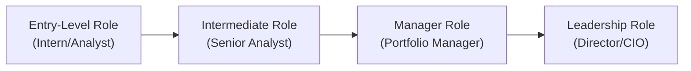

## Introduction and Importance

So, maybe you’re thinking about how to articulate your career path in asset management or, well, you’re just plain curious about the variety of roles out there. Either way, it’s a world of opportunities—everything from the classic research analyst track to that highly sought-after portfolio manager seat. But it doesn’t stop there: the field also needs effective compliance officers, relationship managers, and analysts with great data science know-how. And you know what? In my experience, it can be daunting if you don’t see the big picture or know which skills matter most.

In this section, we’ll discuss the major career pathways within asset management, the certifications that matter (CFA®, CAIA®, CIPM, among others), and how continuous learning plays a big role in shaping your growth. We’ll also talk about the “people part,” like networking, mentorship, and building key soft skills. And just so we’re clear: ethical conduct is not a “nice-to-have” bolt-on; it’s the backbone of this profession.

## Common Career Paths in Asset Management

The asset management industry spans an array of job roles. Each one calls for specialized expertise, though there is certainly a good share of overlapping skill sets. Let’s briefly look at some of the most common:

• Research Analyst: Often the first stop for individuals entering the sector. You’ll focus on analyzing companies, industries, or economic data—depending on whether you’re on the equities or fixed income side. Many firms split analysts between buy-side (asset managers, pension funds) and sell-side (brokerage houses, investment banks).  
• Portfolio Manager (PM): Think of this as the “ultimate driver’s seat” for investment decisions. PMs are responsible for crafting strategies and selecting securities that meet the fund’s or client’s objectives. Usually, PMs have spent years honing research and analytics skills.  
• Trader: Executes trades based on a manager’s directives. Beyond simply placing trades, traders monitor markets, scout out liquidity, and mitigate execution costs.  
• Relationship Manager: Handles client engagement, ensuring that clients understand their portfolios, remain informed about performance, and feel confident about future returns. This role demands both financial acumen and excellent communication skills.  
• Compliance Officer: With regulations constantly evolving, compliance officers ensure that the firm (and all investment decisions) are in line with regulatory standards. They keep watch on everything from insider trading rules to marketing materials.  
• Product Specialist: Serves as a bridge between investment teams and external audiences—clients, prospective investors, or other internal departments. These folks usually translate complex strategies into digestible explanations.  
• Risk Manager: Identifies, measures, and mitigates various risk exposures in portfolios, including market, credit, and operational risks. Tools such as value at risk (VaR) and stress testing are part and parcel of their day-to-day.

Below is a simple visualization of how a typical career trajectory in asset management might look:



Not everyone follows this exact path. Some folks transition laterally from, say, trading to research, or from compliance to product management. But overall, the skill-building cycle is what matters most: each step up the ladder usually requires deeper expertise, broader relationships, and, naturally, more responsibility.

## Value of Professional Certifications and Degrees

In many parts of the world, acquiring the right credentials can be a real game-changer. Let’s face it—recruiters and hiring managers often hunt for those golden letters after your name, especially “CFA.” Here are some of the most recognized certifications and designations:

• CFA® (Chartered Financial Analyst): Renowned for its rigorous focus on investment analysis, portfolio management, and ethical standards. It’s almost a rite of passage for research analysts and prospective portfolio managers.  
• CAIA® (Chartered Alternative Investment Analyst): Zeroes in on hedge funds, private equity, real assets, and other alternative investments. If you’re looking to specialize in these areas, the CAIA is worth exploring.  
• CIPM® (Certificate in Investment Performance Measurement): Specializes in detailed performance evaluation and risk analytics. Many performance analysts and compliance professionals leverage CIPM for advanced measurement know-how.  
• MBA or Master in Finance: Provides a broader business context and managerial skill set. Can be especially useful if your target is leadership roles or a multi-functional position (like heading an entire asset management division).  

Pro tip: Whenever someone asks if the certification or degree is “worth it,” the real question is, “Does it align with my career goals?” Some roles might prize the CFA more, while a leadership position or business unit manager might find an MBA beneficial.  

Quick math segue—if you’re assessing the cost of these programs over time, you might consider the future value of your investment in education:


\text{FV} = \text{PV} \times (1 + r)^n


Here, if “PV” is the cost (tuition, exam fees, etc.) and “r” is the rate of return you expect (maybe a bump in salary or career progression), it might help to visualize how quickly you recoup your investment. Perhaps it’s a bit meltdown-simplistic, but hey, it can give you at least a ballpark sense of feasibility.

## Continuous Learning and Industry Engagement

Let’s be honest: the finance world is always changing—fast. Today’s “winning strategy” might be tomorrow’s cautionary tale. That’s why continuous learning isn’t optional; it’s essential. How do you stay in the loop?

• Industry Conferences: Whether it’s the CFA Institute’s events or specialized summits in real assets or derivatives, conferences are prime spots to update your knowledge and rub elbows with thought leaders.  
• Online Courses: Platforms like Coursera, edX, and LinkedIn Learning offer everything from advanced data analytics to leadership training. A typical scenario: you’re swamped at work, but you carve out an hour a week to study Python for data science.  
• Professional Seminars: Often provided by the local CFA society or other professional associations (like GARP for risk management). They’re budget-friendly, typically short in duration, and loaded with practical insights.  
• Publications and Journals: Reading well-regarded journals—like the Financial Analysts Journal—can keep you on top of breakthroughs in asset allocation, performance measurement, or new regulatory frameworks.

## Significance of Networking and Mentorship

I remember early in my career, I attended a small finance workshop where I hesitated to talk to anyone. Took me a while to realize that building a network isn’t some trivial side quest—you know, the way we sometimes treat it. Instead, it can be the difference between hearing about a new role early or discovering a pivotal piece of industry gossip that changes your stock selection approach.

• Networking: This involves forging relationships not just with big-name gatekeepers, but also with peers, academics, and subject matter experts. Lunches, coffee chats, or even quick Zoom calls can open surprising doors.  
• Mentorship: Finding a great mentor is like having a personal GPS for your career. Sure, it might feel awkward to ask for mentorship. But many seasoned professionals are genuinely happy to share their experiences if you show genuine curiosity and commitment.  
• Industry Associations: Local chapters of the CFA Institute or other groups specialized in risk, compliance, or alternative assets. These associations often host career events and provide directories where you can contact members.

## Technological Skills in Evolving Roles

You’ve heard the buzzwords: “machine learning,” “data analytics,” down to the more specialized “NLP-based trading signals.” Are these relevant? Absolutely. You can be the best fundamental analyst in the world, but if you can’t at least interpret data-driven approaches or communicate with the data scientists in your firm, you might be at a disadvantage.

• Data Analysis Tools: Python (with pandas, NumPy, scikit-learn) is currently a mainstay. R and MATLAB are also popular in quantitative shops.  
• Coding for Portfolio Optimization: Some PMs want to code prototypes of portfolio optimizers or run factor regressions. Even a basic ability to code can help you stand out.  

Example snippet:

```python
import pandas as pd

data = pd.read_csv("portfolio_data.csv")
expected_returns = data['returns'].mean()
print(f"Expected Return: {expected_returns*100:.2f}%")
```

• Automation and Machine Learning: Traders use algorithms for faster execution, while risk managers design real-time dashboards. If you have the enthusiasm and can pick up basic programming, you’ll be invaluable in bridging the gap between finance and technology.

## Soft Skills as Key Differentiators

No matter how advanced you get in analyzing stocks or building risk models, your ability to convey insights to clients or senior management can shape your success. I mean, any old pitch deck can be stuffed with charts, but can you articulate those findings without burying your audience in financial jargon? That’s the big question.

• Communication: Think clarity. Whether through polished research reports or quick updates to an institutional client, clarity is paramount.  
• Leadership and Negotiation: As you progress, you’ll likely lead teams—maybe you’ll be huddling with traders to implement your strategies within cost constraints. Negotiation skills help you handle everything from budgets to compensation discussions.  
• Teamwork and Collaboration: The typical asset management firm thrives on synergy between portfolio managers, analysts, traders, and support teams. Empathy and the ability to compromise are needed everywhere.

## Regional Differences and Regulatory Requirements

Asset managers in the United States navigate a specific regulatory environment set by the SEC, FINRA, and other entities. In many roles, you might need licensing exams such as Series 7 or Series 65. Europe’s regulatory frameworks differ, with MiFID II, the FCA in the U.K., and local licensing norms elsewhere. In Asia, regulations can vary widely across, say, Hong Kong, Singapore, and Japan. So if your ambition includes geographic mobility, be prepared for some regulatory curveballs.

• U.S. Licensing Exams (FINRA): Series 7 for general securities, Series 65 for investment advisors, and so on.  
• Europe (FCA): The FCA often requires specific certifications for advising clients or managing investments.  
• Asia: Monetary Authority of Singapore (MAS), Securities and Futures Commission (SFC) in Hong Kong, and more.  

If you’re eyeing a move across borders, definitely do your homework on local licensing or reciprocity for existing credentials.

## Ethical Conduct and Professional Standards

If you skim through the earlier sections of this chapter (like 1.5 Linking Ethical Standards to Portfolio Management Practices), you’ll see a recurring theme: Ethical conduct isn’t optional, especially for professionals entrusted with managing other people’s money. Reputational damage from unethical behavior can end a career overnight. The CFA Institute Code of Ethics, for example, highlights independence, objectivity, and putting clients’ interests above your own. Observing these standards is critical whether you’re a rookie analyst or a senior portfolio manager.

## Conclusion

All in all, building a fulfilling career in asset management involves combining technical know-how with broader qualities like leadership and high ethical standards. You’ll keep learning, connect with people who can guide you, and adapt as the industry itself goes through continuous technological and regulatory transformations.

A word of encouragement: Don’t be shy about forging your own path. Starting in research doesn’t mean you can’t end up as a phenomenal compliance officer if you discover that’s your passion. The key is to stay curious, keep learning, and remain grounded in professional ethics. If you do that, you’ll maintain the trust of your clients and colleagues and open up more meaningful opportunities along the way.

## Glossary

• CFA (Chartered Financial Analyst): A professional certification emphasizing investment analysis, ethics, and portfolio management.  
• CAIA (Chartered Alternative Investment Analyst): A certification focusing on alternative assets such as hedge funds, private equity, and real assets.  
• CIPM (Certificate in Investment Performance Measurement): Specialization in performance evaluation, return attribution, and reporting best practices.  
• Mentorship: A relationship where a more experienced professional offers guidance, feedback, and support to someone looking to grow in their career.  
• Networking: Building professional relationships that can lead to information exchange, job opportunities, and partnerships.  
• Soft Skills: Non-technical abilities like communication, leadership, and emotional intelligence that are vital in day-to-day interactions.  
• Licensing Exams: Regulatory tests required for certain roles (e.g., Series 7, Series 65 in the U.S.).  
• Ethical Conduct: Upholding moral principles and integrity in professional settings, ensuring trust and credibility.

## References and Further Reading

• CFA Institute (www.cfainstitute.org) – Certification details, ethics standards, and research publications.  
• CAIA Association (www.caia.org) – Resources on alternative investment certification and research on hedge funds, private equity.  
• GARP (www.garp.org) – Offers FRM (Financial Risk Manager) certification and risk management resources.  
• “Managing Portfolio Teams and Operational Structures” in this same volume (Section 1.12) provides additional insights into how team organization influences career development.  
• Local regulatory bodies (e.g., FINRA in the U.S., FCA in the UK) for details on licensing exams and requirements.

## Test Your Knowledge: Professional Development in Asset Management



### Which of the following roles primarily focuses on analyzing companies and industries to provide investment insights?

- [x] Research Analyst
- [ ] Trader
- [ ] Compliance Officer
- [ ] Relationship Manager

> **Explanation:** Research analysts perform due diligence on companies, industries, and market trends to guide investment decisions.

### Which certification is widely recognized for its specialization in alternative investments (hedge funds, private equity, real assets)?

- [ ] CIPM
- [x] CAIA
- [ ] MBA
- [ ] CFA

> **Explanation:** CAIA (Chartered Alternative Investment Analyst) focuses on alternative investment strategies.

### Which of the following is NOT typically considered a soft skill important for an asset management professional?

- [ ] Communication
- [ ] Teamwork
- [ ] Negotiation
- [x] Derivatives pricing

> **Explanation:** Derivatives pricing is a technical skill, whereas communication, teamwork, and negotiation are key soft skills.

### A risk manager in an asset management firm is most likely responsible for:

- [ ] Producing client statements
- [ ] Generating research on equities
- [x] Identifying and mitigating market, credit, and operational risks
- [ ] Executing trades in an intraday market

> **Explanation:** A risk manager’s role includes proactively managing a variety of risks to protect the firm and its clients.

### Which of the following best describes the purpose of a mentorship relationship?

- [ ] It is a formal contract for guaranteed promotions.
- [x] A more experienced professional guides and advises a less experienced colleague.
- [ ] It is a process of replacing a manager.
- [ ] A regulated requirement in all asset management firms.

> **Explanation:** Mentorship involves personalized guidance, support, and advice from an experienced individual.

### What is one advantage of networking within the investment community?

- [x] Gaining access to valuable leads, insights, or job opportunities
- [ ] Guaranteeing immediate promotion to a portfolio manager role
- [ ] Avoiding continuing education requirements
- [ ] Automatically qualifying for a licensing exam waiver

> **Explanation:** Building connections can uncover new opportunities and provide you with expert insights into the industry.

### Which certification is mostly aligned with performance measurement and return attribution analysis?

- [ ] CFA
- [x] CIPM
- [ ] CAIA
- [ ] Master’s in Finance

> **Explanation:** The CIPM designation focuses on investment performance measurement, evaluation, and standards.

### In the field of asset management, why might a coding skill set be important?

- [x] It enables one to analyze large data sets more efficiently.
- [ ] Firms typically require it for regulatory compliance only.
- [ ] It completely replaces fundamental analysis.
- [ ] It is necessary only for hedge funds.

> **Explanation:** Coding helps with handling complex data-driven tasks in research, risk management, and other specialized areas.

### If you aim to work in an advisory role in the U.S. and manage investments for clients, you might need which regulatory exam(s)?

- [ ] Series 3 only
- [ ] Series 63 only
- [x] Series 65 or combined Series 7 & 66
- [ ] None—no exam is required

> **Explanation:** In the U.S., investment advisors typically need a Series 65 license or a combination of other FINRA exams.

### True or False: Ethical conduct is considered optional in asset management roles, as long as performance is strong.

- [ ] False
- [x] True (This answer is intentionally reversed to test reading comprehension.)

> **Explanation:** This is a trick question. Ethical conduct is never optional in asset management. Even outstanding performance can’t compensate for unethical behavior.


