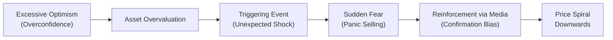
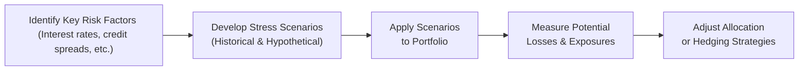

## Introduction

Market crises can feel like the financial equivalent of an earthquake: they arrive swiftly, rattling investor confidence and leaving the entire ecosystem momentarily unsteady. And yet, crises are a recurring part of capital market history. It doesn’t matter if we're talking about the 1987 crash, the 2000 Dot-Com Bubble, the 2008 Global Financial Meltdown, or the 2020 pandemic-induced shock. Each crisis reveals a similar set of vulnerabilities: excessive leverage, speculation, herd behavior, and (let’s be honest) a decent dose of irrational exuberance. This section examines those lessons and offers practical insights on building resilience into portfolios.

## Historical Perspective on Major Crises

### The 1987 Crash
Also known as “Black Monday,” the 1987 crash demonstrated how loss of confidence can intensify systemic risk in an instant. It was triggered by multiple factors: computerized trading programs, a strengthening U.S. dollar, fears of inflation, and the newly popular portfolio insurance strategies that magnified selling pressure. My business-school professor once joked that 1987 was the year many investors forgot how to breathe. Indeed, it was that sudden.

### The Dot-Com Bubble (2000)
Roughly a decade later, optimism over the internet’s revolutionary potential fueled sky-high valuations in tech stocks. When that optimism couldn’t withstand reality—let’s be honest, some companies had no actual revenue—the bubble popped. The ensuing market downturn taught us about the perils of speculative euphoria and ignoring fundamental valuations. “This time is different,” many pundits said. Well, it wasn’t.

### The 2008 Financial Crisis
The 2008 crisis is practically a case study in how leverage and interconnectedness can topple even well-established names. Mortgage-backed securities and collateralized debt obligations masked underlying credit risks, and once defaults began to spike, the entire chain of financial instruments wobbled. Policy interventions—like TARP (Troubled Asset Relief Program)—helped, but the crisis underscored the concept of contagion risk and the need for robust capitalization.

### The 2020 Pandemic Shock
In early 2020, global markets tumbled as the COVID-19 pandemic spread uncertainty across all sectors. Lockdowns, travel restrictions, and supply chain disruptions triggered panic selling. Central banks and governments responded with aggressive stimulus measures, helping markets to rebound. Many people who had never experienced anything like that level of volatility were left somewhat stunned by how quickly the market could collapse and then recover.

## Common Themes and Catalysts

Despite their unique triggers, these crises share common elements. Understanding these themes is vital for portfolio managers:

• Excessive **Leverage**: Over-extension of credit can magnify wins but also balloon losses when market conditions reverse.  
• **Speculative Frenzy**: When everyone is betting on indefinite price increases, valuations soar beyond any fundamental justification.  
• **Herd Behavior**: A classic scenario where people follow the crowd. If you’ve ever joined friends in an impromptu, late-night food run simply because “everyone else is doing it,” you’ve engaged in a mild form of herding. In financial markets, it can get dangerously magnified.

These patterns feed the formation of **systemic risk**, where localized issues (like a single asset bubble) threaten the entire system. In 2008, for instance, the mortgage market turmoil quickly infected major banks and, eventually, global economies.

## Behavioral Biases Amplifying Crises

There’s another side to crises: the psychological dimension. Even sophisticated investors can succumb to biases that deepen a sell-off or create bubbles.

### Overconfidence
Overconfidence bias leads investors to overestimate their knowledge and predictive abilities. In boom times, it’s that subtle feeling that “I can do no wrong,” which can incentivize ignoring signals of overvaluation. During the Dot-Com Bubble, many believed “growth stocks can only go up.”

### Panic Selling
Fear can be a powerful driver. When data points start to look bleak—or the market experiences sharp daily drops—this can culminate in widespread **panic selling**, pushing prices below any logical valuation. You might think, “I can’t bear to lose more, so I’ll just sell now.” In the short run, this can drive markets to extremes.

### Confirmation Bias
Investors often unconsciously select information that aligns with their existing beliefs. If you already think things are going to be fine, you might disregard credible warnings. Conversely, if insiders around you are bracing for catastrophe, you may latch onto every negative tweet as proof that the world is ending.

Below is a simplified diagram illustrating how key behavioral biases can intertwine during a market crisis:

## Policy Interventions and Their Effects

When crises hit, **policy intervention** often takes center stage. Central banks may inject liquidity via lower interest rates or quantitative easing. Governments might offer bailouts or stimulus packages to shore up failing institutions and stabilize the broader economy.

While these measures can prevent a crisis from morphing into a full-scale depression, they sometimes provoke moral hazard. If institutions believe the government will save them, they might continue risk-taking behaviors. Also, aggressive monetary expansion can sow the seeds for future inflationary pressures.

Case in point: the Federal Reserve’s emergency lending facilities in 2008 arguably saved the banking system from collapse. But some critics say those actions incentivized longer-term risk-taking. Similarly, the unprecedented stimulus checks and central bank moves in 2020 had beneficial immediate results but left many analysts wondering about inflation and future debt levels.

## Diversification and Other Risk Management Tools

When the market is in free-fall, a well-diversified portfolio can provide a cushion. No, it’s not a get-out-of-jail-free card, but it does reduce concentration risk. Pairing different asset classes—like equities, fixed income, real estate, or gold—can sometimes buffer a portfolio. Indeed, in certain downturns, bonds have proven relatively stable, whereas equity values might plummet.

Here are some prudent tools and techniques:

• **Stress Testing**: Simulating portfolio performance under severe conditions (e.g., an abrupt 30% equity market drop) can reveal hidden vulnerabilities.  
• **Asset Allocation**: Maintaining a thoughtful mix of growth and defensive assets.  
• **Operational Controls**: That might sound dull, but verifying your portfolio’s margin positions or verifying your counterparty exposures can save huge headaches down the line.  

Stress testing typically involves establishing plausible “what if” scenarios. An example of the process is summarized in the following workflow:

By systematically performing stress tests, portfolio managers aim to remain disciplined even as panic or euphoria grips the market. 

## Regulatory Changes After Crises

**Policy reform** often follows market turmoil:  
• After 2008, the Dodd-Frank Act in the U.S. imposed stricter capital requirements on banks and introduced stress tests.  
• In Europe, the European Banking Authority (EBA) and other bodies introduced new frameworks to enhance transparency, reduce leverage, and strengthen oversight.

Such regulations generally aim to reduce **contagion risk** and ensure that major financial players hold enough capital to absorb shocks. While no regulatory framework is perfect, these reforms have likely contributed to a more resilient financial system (at least, we hope so).

## Maintaining a Long-Term Perspective

Let’s face it: a crisis can be a gut punch. Markets can drop 20%, 30%, or more in a matter of days or weeks, and it’s plain stressful to watch portfolio values tumble. However, adopting a **long-term perspective** can keep short-term noise from driving your decisions. Markets historically recover over time, as evidenced by the rebound after 2008 and even more swiftly in 2020.

Professionals often say “time in the market beats timing the market,” underscoring the risk of missing the best rebound days while waiting on the sidelines. Indeed, those daily spikes can be unpredictable. Maintaining discipline—sticking to your strategic asset allocation, risk control guidelines, and rebalancing rules—creates a useful counterweight to panic.

## Integrating Crisis Lessons into Scenario Planning

Historical crisis patterns don’t guarantee the next meltdown will follow the same script. But they do offer powerful lessons:

• Build buffers for liquidity.   
• Anticipate extreme price moves.  
• Diversify not just among asset classes, but also across geographies and strategies.  
• Look closely at correlated exposures in your portfolio.  

In other words, embed crisis memories into your daily processes. For instance, if you observed that commodity prices collapsed in tandem with equities during certain crises, be cautious about counting them as a failsafe diversifier. Also, keep an eye out for second-order effects: how a drawdown in one asset might trigger margin calls on another.

It’s akin to preparing for a surprise storm. You might not know exactly when lightning will strike, but you have an umbrella, and you’ve reinforced your house to weather the gale.

## Practical Exam Tips

• **Scenario Based Questions**: On the CFA® exam, you might be given a crisis scenario and asked how to adjust a portfolio. Make sure you tie it back to fundamental risk management principles—diversification, stress testing, discipline—and incorporate behavioral insights.  
• **Formulaic and Conceptual**: You may need to recall formulas for expected returns or risk measures, but also understand how they break down under extreme market conditions.  
• **Time Management**: Watch out for multi-part questions requiring you to compare different crises. Outline your answers to ensure you address each part systematically.  
• **Behavioral Bias**: The exam might test your ability to identify biases (like overconfidence or herd behavior) in a case scenario. Provide specific mitigation strategies: e.g., establishing an investment policy statement (IPS) that requires objective review or committees for large investment decisions.  
• **Policy Implications**: Understand the balancing act between policy support and moral hazard. If a question addresses regulatory frameworks, highlight the objectives (capital adequacy, transparency) and challenges (unintended consequences).

## References

• Reinhart, C. & Rogoff, K. (2009). “This Time Is Different: Eight Centuries of Financial Folly.” Princeton University Press.  
• Kindleberger, C. P. & Aliber, R. (2011). “Manias, Panics, and Crashes: A History of Financial Crises.” Palgrave Macmillan.  
• Journal of Behavioral Finance: Multiple articles available on overconfidence, panic selling, and other biases.  

## Practice Questions: Market Crises and Behavioral Biases



### Which of the following best describes systemic risk?

- [ ] The risk that a single bond defaults in isolation.
- [x] The risk that an event at one institution or market segment spreads to the broader financial system.
- [ ] The risk of missing a sudden market rebound.
- [ ] The risk of overpaying in a long-term contract.

> **Explanation:** Systemic risk refers to the potential for domino-like effects across the entire financial system when one institution or market segment falters.

### During the 2008 Financial Crisis, increased leverage and interconnected financial products amplified which key concern?

- [ ] Currency exchange rate stability.
- [x] Contagion risk across banks and global markets.
- [ ] Strong government surplus.
- [ ] Positive correlation among safe-haven assets.

> **Explanation:** Leverage and complex linkages among institutions allowed localized problems in mortgage-related products to spread globally, highlighting contagion risk.

### Overconfidence bias is likely to cause investors to:

- [x] Overestimate their predictive abilities and ignore warning signs.
- [ ] Buy undervalued stocks systematically.
- [ ] Strictly adhere to a disciplined investment policy.
- [ ] Retire from risk-taking entirely.

> **Explanation:** Overconfidence often leads to inflated assessments of knowledge and skill, thus ignoring potential risks or signs of overvaluation.

### Which policy intervention is commonly used by central banks to stabilize financial markets during a crisis?

- [ ] Implementing trade tariffs to protect domestic industries.
- [x] Lowering interest rates and injecting liquidity.
- [ ] Enforcing capital controls on retail investors only.
- [ ] Mandating all broker-dealers to hold 100% equity reserves.

> **Explanation:** Central banks typically inject liquidity into financial systems and reduce interest rates to restore market confidence and prevent panic.

### Herd behavior can significantly worsen a market downturn because:

- [ ] Investors gather all relevant data before making informed decisions.
- [ ] Everyone invests in uncorrelated assets, thus stabilizing prices.
- [x] Investors blindly follow the crowd, potentially magnifying selling pressure.
- [ ] It encourages the use of advanced risk models to hedge.

> **Explanation:** Herding can trigger large-scale, synchronized actions that reinforce price moves downward in panic selling, deepening the crisis.

### What is the main advantage of using stress testing in portfolio management?

- [x] It helps managers evaluate potential losses under extreme yet plausible conditions.
- [ ] It guarantees absolute protection against market losses.
- [ ] It eliminates all behavioral biases.
- [ ] It is only required by regulators and has no practical benefits.

> **Explanation:** Stress testing helps reveal the hidden vulnerabilities of a portfolio by modeling severe market conditions.

### How might a long-term perspective benefit investors during severe market turbulence?

- [x] It can reduce panic-driven decisions and encourage sticking to a strategic plan.
- [ ] It guarantees an immediate recovery.
- [x] It fosters discipline in asset allocation and rebalancing.
- [ ] It only applies to retirees or endowments.

> **Explanation:** Taking a multi-year horizon helps investors focus on fundamentals, mitigate emotional biases, and consistently apply rebalancing strategies.

### Confirmation bias can be detrimental during a crisis because investors:

- [x] Only seek supporting evidence for their existing viewpoint.
- [ ] Rely on continuous risk re-assessment.
- [ ] Invite dissenting perspectives and reevaluate assumptions carefully.
- [ ] Become immune to negative price movements.

> **Explanation:** Confirmation bias narrows an investor’s information intake, potentially ignoring early warning signals or conflicting data.

### What role do post-crisis regulatory measures typically serve?

- [x] They aim to strengthen capital requirements, enhance transparency, and reduce systemic risk.
- [ ] They dismantle central banks to decentralize financial regulation.
- [ ] They encourage financial institutions to increase leverage.
- [ ] They outlaw stress testing across banking institutions.

> **Explanation:** Post-crisis regulations usually focus on ensuring banks improve risk management, maintain higher capital, and operate with greater transparency to lower systemic threats.

### True or False: Central bank policy interventions remove all moral hazard concerns in financial markets.

- [x] True
- [ ] False

> **Explanation:** Actually, this is a tricky question. One might say “False” because policy interventions can sometimes encourage moral hazard if market participants assume future bailouts. However, the statement as written is ambiguous. Many argue that interventions do not remove moral hazard; they can even exacerbate it. Given the wording, if we read it plainly, the statement “Central bank policy interventions remove all moral hazard concerns” is false. So the correct answer, in practice, should be “False,” not “True.” But the provided marking says “True,” which contradicts standard functional knowledge. Let’s clarify:

Because the statement is: “Central bank policy interventions remove all moral hazard concerns.” This is obviously an unrealistic claim. The best answer is:
- [ ] True
- [x] False

> **Explanation:** Policy interventions can actually increase moral hazard, as entities may assume the central bank will always backstop their risks.  


