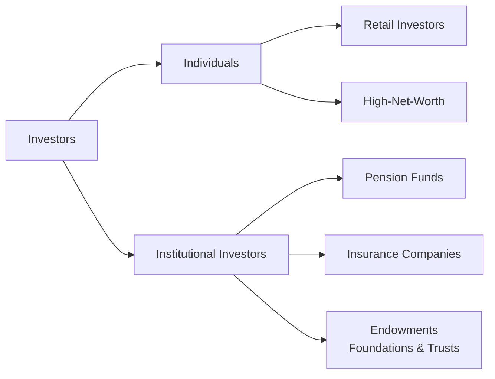

## Introduction
I remember early in my career, I had two back-to-back meetings that highlighted how different investors could be. First, there was an energetic 30-something tech professional who wanted to invest aggressively in growth stocks—she didn't mind weathering volatility if it meant higher returns. The very next appointment was a retiree, practically brimming with anxiety about market swings because he relied on regular dividend paychecks to cover his living expenses. And I remember thinking, "Wow, it’s like day and night!"

So, what exactly distinguishes these folks? Different life phases, distinct return targets, varying tolerance for risk, and a whole bunch of tax or regulatory constraints all play a role. In this section, we’ll break down different investor types, focusing on what makes each group tick. By understanding these distinctive characteristics, portfolio managers can tailor solutions and provide the kind of advice that truly resonates.

## Broad Categories of Investors
Before diving into each investor’s defining features, here’s a quick visual snapshot:

That’s essentially how the landscape looks. Each group brings unique objectives, constraints, and expectations to the table.

## Individuals
### Retail Investors
When someone says “average Joe” or “typical investor,” they’re usually referring to a retail investor. These are individuals (or households) investing personal funds, typically with modest amounts of capital compared to large institutions or high-net-worth (HNW) individuals.

• Objectives and Risk Tolerance:  
  – Often aimed at building an emergency fund, saving for a house down payment, or creating a retirement nest egg.  
  – Risk tolerance is typically moderate, although it varies by experience, age, and personal preferences.

• Time Horizon:  
  – Can span anywhere from short term (a couple of years) to the entire working lifetime. A 25-year-old saving for retirement might have 40 years to invest, while a 60-year-old might be reducing market risk in preparation for retirement.

• Liquidity Needs:  
  – Usually moderate. Retirees might need ongoing liquidity to support living expenses, whereas younger folks may have less frequent liquidity needs.

• Tax Considerations:  
  – Retail investors often focus on after-tax returns. For taxable accounts, simple calculations might frequently show:
    
      R_{\text{after\_tax}} = R_{\text{pre\_tax}} \times (1 - t)
    
    where \\( t \\) is the applicable tax rate (e.g., 20% for certain capital gains in some jurisdictions).

• Communication Style:  
  – Many retail investors appreciate accessible explanations (in plain language) because their financial literacy can range widely. Some might understand advanced concepts, but others may prefer simple statements like “Here’s why we shouldn’t panic during a market dip.”

### High-Net-Worth (HNW) Investors
High-net-worth individuals make up a unique subset of individual investors. They have considerably larger investable assets—enough that managing taxes, estate planning, and philanthropic activities can get pretty complex.

• Sophisticated Needs:  
  – They might also require solutions that aren’t typically relevant for smaller-portfolio retail clients, such as offshore accounts, trusts, or advanced estate planning.

• Risk Tolerance and Objectives:  
  – Some HNW investors are entrepreneurs comfortable with higher risks; others might be keen on preserving wealth they’ve spent a lifetime building. Estate planning, philanthropic endeavors, and leaving a legacy for future generations can all shape their portfolio strategies.

• Liquidity Requirements:  
  – While HNW individuals often enjoy greater financial flexibility, major liquidity events (e.g., purchasing real estate, capital calls for private equity) can create large but irregular cash flows.

• Regulatory Considerations:  
  – Certain jurisdictions might require additional reporting or oversight for large personal portfolios. Also, HNW investors sometimes qualify for “accredited investor” status, which opens access to private placements, hedge funds, or other specialized investments.

-----

## Institutional Investors
Institutional investors are legal entities operating in a fiduciary capacity on behalf of others. They include retirement plans, insurance companies, and endowments or foundations. Let’s see how their goals and constraints differ from individual investors.

### Pension Funds
Picture a big corporation with thousands of employees. The company manages a pension fund whose job is to ensure retirees receive promised benefits for decades to come.

• Objectives and Time Horizon:  
  – Pension funds typically have very long horizons — they must meet liabilities (employee pensions) possibly for 30-40 years.

• Risk Tolerance:  
  – This is guided heavily by the plan’s liability structure. A defined benefit plan with a near-term wave of retirees has less appetite for big market swings compared to a plan with a younger participant demographic.

• Liquidity Constraints:  
  – Pension funds do require periodic liquidity to payout benefits but otherwise can hold illiquid assets if the time horizon permits.

• Regulatory Constraints:  
  – In many regions, pension funds must adhere to rules on funding status (like minimum funding requirements), diversification strategies, and certain asset caps. Their investment policies are shaped by these regulations to protect plan participants’ interests.

### Insurance Companies
Insurance companies collect premiums, invest them, and pay out claims or benefits. Their entire business model hinges on risk calculation.

• Objectives:
  – Stability and safety factor heavily because claims must be covered when they arise. Big mismatch between assets and liabilities can be catastrophic.

• Regulatory Constraints:
  – Insurance regulators often impose strict asset-liability matching requirements. For example, life insurers writing policies with 20-year maturities might be required to hold similarly long bonds to avoid mismatch risk.

• Risk Tolerance:
  – Typically lower than that of, say, a hedge fund. There’s constant scrutiny of solvency ratios, capital adequacy, and the ability to meet unexpected spike in claims.

• Liquidity Needs:
  – Can be substantial depending on the business line (e.g., property & casualty insurers with unpredictable claims vs. life insurers with more predictable outflows).

### Endowments, Foundations, and Trusts
Think of a university endowment or a private foundation established to provide annual support to charitable causes. These entities often have perpetual or very long-term investment horizons.

• Spending Policy:
  – Many endowments/foundations adopt a target spending rate (say 4–5% annually), so the portfolio aims for consistent returns above spending plus inflation.

• Donor Directives:
  – Certain endowed gifts come with instructions: “Thou shalt use this only for Scholarship X.” That can limit how they manage the funds.

• Long-Time Horizons:
  – Theoretically indefinite. They can invest in illiquid assets like private equity or real estate if they fit overall objectives.

• Special Constraints:
  – Must uphold any legal or donor stipulations, maintain ample reporting transparency, and comply with state or national laws regarding governance and fiduciary duties.

-----

## Distinguishing Factors Across Investors
Although each group has distinct traits, there are recurring dimensions we look at when designing portfolios:

• Time Horizon:  
  – Ranges from short term (1–3 years) to very long term (10+ years, sometimes perpetuity for endowments).  
  – Younger individuals, banks, or certain HNW investors might afford a longer horizon. Retirees, insurance companies facing near-term liabilities, or older pension plans might prefer shorter horizons.

• Risk Tolerance:  
  – Generally, the more stable the cash flow and the longer the horizon, the higher the risk capacity.  
  – People or entities with uncertain future liabilities or near-term liquidity demands usually adopt a conservative stance.

• Liquidity Needs:  
  – If an investor needs regular cash (like monthly or quarterly distributions), illiquid holdings (e.g., private equity) can be problematic.  
  – Conversely, institutions or individuals with stable liquidity positions can explore alternative or less liquid investments.

• Tax Situation and Regulatory Constraints:
  – For individuals, tax implications (capital gains vs. dividend income) can significantly impact net returns.  
  – Institutional investors often have constraints from government bodies or agencies that impose rules on capital allocations, permissible assets, or solvency requirements.

-----

## Shifting Investment Trends
It’s an interesting time to be a portfolio manager. Preferences are evolving:

• ESG Products:  
  – Both retail and institutional investors increasingly want environment, social, and governance considerations integrated into their portfolios.

• Retirement Planning Changes:
  – With shifts from defined benefit to defined contribution plans, individuals increasingly shoulder retirement investment responsibility. That boosts demand for easy-to-understand, low-cost solutions.

• Digital Platforms:
  – Robo-advisors and online solutions are making high-quality portfolio management more accessible to smaller retail investors.

• Life-Cycle Investing:
  – This approach automatically adjusts asset allocation over time, typically reducing equity exposure in favor of fixed income as the retirement date draws closer. This concept resonates with many younger investors who prefer a “set-it-and-forget-it” style.

-----

## Communication Strategies
One of the most overlooked aspects of portfolio management is communication:

• Tailor to the Audience:
  – A CFO of a pension fund might want granular performance attribution data in a formal deck, whereas a retail investor might prefer a quick phone call emphasizing the big picture.

• Managing Expectations:
  – Dare I say, many clients panic when markets tumble. Explaining the ups and downs calmly, in plain language, helps them stay on track and avoid knee-jerk decisions.

• Educational Components:
  – Some institutions or HNW families want to involve the next generation, building financial literacy for seamless wealth transfer.

• Transparency:
  – This is especially important for endowments/foundations with multiple stakeholders. Clear disclosures around performance, spending rates, or changes in strategy build trust and ensure accountability.

-----

## Common Pitfalls and Best Practices
• Pitfall: Overlooking an investor’s emotional capacity for loss. Even if an investor says they can handle risk, they might panic at the first large drawdown.  
• Best Practice: Use scenario analysis and stress tests to illustrate how the portfolio might behave in extreme markets; ensure alignment with true risk tolerance.

• Pitfall: One-size-fits-all solutions.  
• Best Practice: While standardized products (like target-date funds) have their place, customizing for unique tax or regulatory constraints often yields better outcomes.

• Pitfall: Failing to reevaluate.  
• Best Practice: Investors’ situations and objectives can change. For instance, a foundation’s board might alter its spending policy, or a retiree’s health expenses might spike. Regular portfolio reviews ensure strategies remain relevant.

-----

## Final Exam Tips
• Connect Objectives with Constraints: On exam questions, always link the investor’s listed goals, time horizon, or liquidity needs to the recommended asset allocation.  
• Life-Cycle Logic: Understand how risk tolerance typically shifts with age or organizational lifecycle (like a foundation nearing a major spending milestone).  
• Show Awareness of Regulations: For institutional clients, mention how laws influence portfolio decisions—examiners love when you highlight regulatory compliance.  
• Illustrate Communication Approach: If a question describes an unsophisticated retail client, your solution might emphasize user-friendly language, simpler asset selection, and consistent updates.  
• Watch for “Special Directives”: Endowment or trust documents might restrict certain sectors or demand the portfolio invests in socially responsible assets.

-----

## References
- CFA Institute Standards of Practice Handbook.  
- Brigham, E., & Ehrhardt, M. (2022). Financial Management: Theory & Practice.  
- Various Financial Planning Association and CFA Institute publications on investor segmentation and behavioral considerations.

-----

## Test Your Knowledge: Types of Investors and Distinctive Characteristics



### 1. Which of the following generally has the longest time horizon for its investments?
- [ ] A retiree seeking income next year
- [ ] A life insurance policyholder
- [x] A university endowment
- [ ] A day trader

> **Explanation:** Endowments are designed to last indefinitely and often focus on perpetuity, giving them a very long investment horizon.

### 2. A retail investor with a low risk tolerance and a short investment timeline might prefer which type of asset profile?
- [ ] High-yield corporate bonds and small-cap growth stocks
- [x] Investment-grade bonds and money market funds
- [ ] Venture capital funds and leveraged ETFs
- [ ] Real estate private equity

> **Explanation:** A short horizon and low risk tolerance point toward more conservative, liquid investments, such as investment-grade bonds and money market instruments.

### 3. What is a key regulatory constraint for pension funds?
- [x] They must meet minimum funding requirements to ensure they can pay future liabilities.
- [ ] They are prohibited from investing in equities.
- [ ] They can only invest in government bonds.
- [ ] They cannot invest overseas.

> **Explanation:** Pension funds usually face minimum funding and liability-matching requirements. Equities and foreign investing may be allowed but must align with such constraints.

### 4. High-net-worth investors often qualify as “accredited investors.” This status typically grants them access to:
- [ ] Only standard mutual funds
- [x] Private placements and hedge funds with higher minimum investments
- [ ] No financial products outside of regular retail offerings
- [ ] Government-subsidized loans

> **Explanation:** Accredited investors can invest in hedge funds, private equity, and other opportunities subject to different regulatory frameworks and higher investment minimums.

### 5. Which is an example of life-cycle investing?
- [ ] Investing entirely in cash to avoid all risk
- [ ] Constantly maintaining a 30/70 split between stocks and bonds
- [x] Gradually shifting from higher equity exposure to increased fixed income as retirement approaches
- [ ] Using only short-term horizon funds regardless of age

> **Explanation:** Life-cycle investing generally involves a dynamic approach to asset allocation that becomes more conservative over time.

### 6. Which investor type typically follows strict asset-liability matching strategies?
- [ ] A young college graduate
- [x] Insurance companies
- [ ] High-net-worth individuals
- [ ] Day traders

> **Explanation:** Insurance companies often match their assets to liabilities (such as policy payouts) to maintain financial stability and satisfy regulatory requirements.

### 7. An endowment’s spending policy usually:
- [x] Outlines the percentage to be withdrawn annually to fund activities
- [ ] Forbids withdrawal under any circumstances
- [ ] Ties exclusively to the board’s discretion with no formal guideline
- [ ] Invests exclusively in hedge funds

> **Explanation:** Endowments commonly set a spending rate (e.g., 4–5% of the fund’s market value) each year, balancing current dispersals with future growth.

### 8. If a high-net-worth investor wants to minimize near-term tax liabilities, a suitable strategy might include:
- [ ] Realizing short-term capital gains frequently
- [ ] Placing all capital in a checking account
- [x] Holding growth stocks for longer periods to obtain favorable tax treatment
- [ ] Investing solely in immediate annuities

> **Explanation:** HNW investors often focus on long-term holdings (for example, growth stocks) to benefit from lower long-term capital gains rates and tax deferral.

### 9. Which of the following is a common communication practice for retail investors with moderate financial literacy?
- [ ] Sharing only raw data and advanced statistical metrics
- [x] Providing simplified performance summaries with environment context
- [ ] Completely avoiding discussion of risks
- [ ] Using only academic finance terminology

> **Explanation:** Retail investors often appreciate clear, concise explanations, contextualized performance data, and a balanced discussion of returns and risks.

### 10. A foundation with perpetual existence seeking to maintain the real value of its portfolio would likely:
- [x] Strive to earn returns above both inflation and the spending rate
- [ ] Focus only on short-term fixed deposits
- [ ] Withdraw all returns immediately for philanthropic use
- [ ] Disregard inflation considerations

> **Explanation:** To preserve real value over time, foundations aim for returns that exceed the sum of inflation and annual spending.


