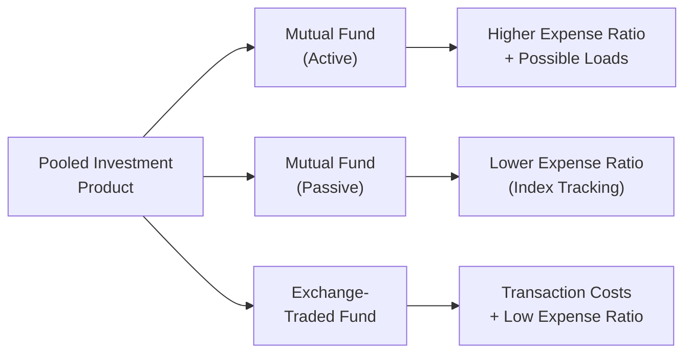
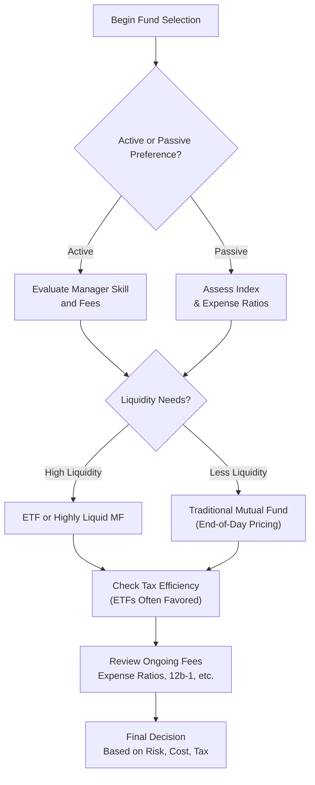

## Introduction and Scope

Pooled investment products—like mutual funds, exchange-traded funds (ETFs), and other collective investment vehicles—are popular among individual and institutional investors looking for professional management, broad diversification, and simplified access to various asset classes. Maybe you’ve heard your friends or colleagues mention how convenient it is to “just buy a fund” rather than picking individual stocks. In this section, we’ll explore the core characteristics, costs, operational efficiencies, and regulatory considerations that define these pooled structures. We’ll also focus on how they align with different investor objectives and risk profiles, and highlight best practices for selecting the right fund.

## Understanding Key Pooled Vehicles

### Mutual Funds
Mutual funds pool assets from many investors to buy a diversified portfolio of securities. The fund is managed by a professional investment adviser or management company that selects the underlying investments, handles regulatory and compliance tasks, and seeks to fulfill the fund’s investment objective. Mutual funds can be:
- Actively Managed: Managers aim to outperform a benchmark index by selecting securities they believe will provide superior returns or lower risk.
- Passively Managed (Index Funds): Managers replicate a specific benchmark index (e.g., S&P 500) to track its performance at lower costs.

From a practical standpoint, investors buy mutual fund shares at the net asset value (NAV) per share—which is typically priced once per day after market close. This structure means you never know the exact price you’ll get during the day (unlike stocks or ETFs), but it also removes intraday volatility concerns if you’re a buy-and-hold investor.

### Exchange-Traded Funds (ETFs)
ETFs resemble mutual funds in that they pool investor assets to buy a basket of securities. However, ETFs are listed and trade on exchanges, similar to individual stocks. That means:
- You can buy and sell shares throughout the trading day, often with relatively tight bid-ask spreads.
- Real-time pricing: The market price of the ETF share fluctuates intraday based on supply and demand.
- Arbitrage mechanism: Authorized participants help keep the ETF’s market price close to its intrinsic value by creating and redeeming shares in large blocks (often called “creation units”).

ETFs have grown in popularity due to their transparency, tax efficiency, and typically lower expense ratios. But, as any seasoned investor might tell you, not all ETFs are created equal—liquidity, underlying holdings, and expense structure can differ significantly from one fund to another.

### Unit Trusts and Other Pooled Vehicles
Beyond mutual funds and ETFs, there are other structures—such as unit trusts, closed-end funds, and hedge funds—that also group assets from multiple investors. Unit trusts distribute pre-defined investment units, often focusing on a specific theme or region. Closed-end funds issue a limited number of shares and trade on exchanges at either premiums or discounts to NAV. Hedge funds, meanwhile, often require high minimum investments, may employ leverage and sophisticated strategies, and are less regulated.

Although each vehicle has its unique nuances, the general principle remains the same: pool investors’ money, invest it according to a stated objective, and (ideally) achieve economies of scale and greater diversification than most individuals could achieve on their own.

## Comparing Costs and Management Styles

One major factor often dictating an investor’s preference between pooled vehicles is cost. Let’s take a closer look:

### Actively Managed Funds vs. Passively Managed Funds
- Actively Managed Funds: Managers attempt to identify mispriced securities or time the market. These strategies typically come with higher management fees because of the research, human capital, and operational effort required. They may also charge performance fees if they exceed certain benchmarks.
- Passively Managed Funds (Index Funds or Index-Tracking ETFs): Managers replicate an index, reducing the costs of research and security selection. As a result, passive strategies often have lower expense ratios, making them highly attractive when controlling costs is a priority.

### Expense Ratios
Funds generally publish an annual expense ratio indicating what percentage of the fund’s net assets go toward operational costs—including management fees, administrative charges, marketing, and other expenses. For instance, a 0.10% annual expense ratio implies you’ll pay $1 for every $1,000 invested (annually). While 0.10% might be a typical ratio for certain passive ETFs, it is not uncommon to see 1% or more for actively managed equity funds.

### Share Classes, Loads, and Other Fees
Traditional mutual funds often come in different share classes:
- Class A: Usually charges a front-end load (an upfront sales commission) but may have lower ongoing fees.
- Class B: May impose a back-end load (a deferred sales fee) that declines over time, with moderate expense ratios.
- Class C: Typically has no front-end load but higher annual fees.

“Load funds” charge sales commissions, whereas “no-load funds” do not. Even no-load funds may include 12b-1 fees (distribution and marketing fees) that increase the overall cost. ETFs typically charge a single expense ratio and transaction costs (e.g., brokerage commissions when buying or selling shares), but no loads are involved.

Below is a simple conceptual diagram contrasting key cost drivers among various pooled structures:

## Operational Efficiency, Transparency, and Liquidity

### Operational Efficiency
Mutual funds calculate their NAV at the end of each trading day; investors transact at that NAV. ETFs, on the other hand, trade intraday on an exchange, leading to potentially lower transactional friction, particularly for short-term or tactical moves. If you’re rebalancing frequently, ETFs might offer more operational ease—although frequent trading can still generate brokerage fees.

### Transparency
Many ETFs disclose their holdings daily, allowing investors to see exactly what’s under the hood. Mutual funds generally disclose holdings on a monthly or quarterly basis (with a delay). This difference can be crucial if real-time transparency is a priority.

### Liquidity
Liquidity can vary widely, depending on the fund’s size and the market for the underlying securities. Large ETFs usually maintain high liquidity, but specialized or thinly traded ETFs may come with wider bid-ask spreads. Mutual funds, by design, guarantee end-of-day liquidity at NAV, so there’s no premium or discount. In closed-end funds, you could encounter discounts or premiums stemming from market sentiment or perceived manager skill.

## Simplified Diversification and Professional Management

It’s often said that pooled vehicles allow small investors to “invest like the pros.” With just a few hundred or thousand dollars, you can buy shares in a mutual fund or ETF that holds hundreds—sometimes thousands—of diverse securities. This approach vastly reduces unsystematic risk compared to holding a handful of individual stocks or bonds, and the inherited expertise of professional management can be especially comforting if you’re new to the markets.

I still remember my early investment days, fumbling around with individual stock picks, only to realize I was far from diversified. A simple ETF basically took that stress off my shoulders and gave me broad exposure to the market. That’s a big plus.

## Regulatory Framework for Investor Protection

Pooled vehicles across major financial markets, including the US, the EU, and other jurisdictions, are often subject to stringent regulatory oversight:
- SEC (Securities and Exchange Commission) in the United States.
- UCITS (Undertakings for Collective Investment in Transferable Securities) regime in Europe.
- Similar regulatory bodies in Asia, Latin America, etc.

Regulations typically require robust disclosure of fees, strategies, and risks. For mutual funds in the US, the prospectus and Statement of Additional Information detail the fund’s structure, objectives, and risk factors. ETFs must also issue prospectuses and frequently publish holdings. These rules ensure a level of transparency and comparability, allowing investors to weigh costs, strategies, and performance. Furthermore, the CFA Institute Code of Ethics and Standards of Professional Conduct underscore the importance of clarity, fairness, and due diligence when recommending or managing these products.

## Selecting the Right Fund Structure

Choosing the right pooled product is not just about cost; it boils down to the investor’s unique objectives, risk tolerance, liquidity needs, and investment horizon. Key considerations include:
- Asset Class Exposure: Are you looking for broad equity exposure, fixed income, or specialty sectors like real estate or commodities?  
- Active vs. Passive: Do you believe in market efficiency or prefer the potential for outperformance (with higher fees)?  
- Time Horizon: For short-term tactical allocations, intraday trading capability might matter—and that’s often easier with ETFs.  
- Tax Considerations: Some fund structures, especially ETFs, might be more tax efficient, thanks to in-kind redemptions that minimize capital gains distributions.

## Tax Efficiency: Mutual Funds vs. ETFs

One hot topic is the tax treatment of capital gains distributions. In many jurisdictions:
- Mutual funds may distribute capital gains on a regular basis, leading to taxable events for investors even if they haven’t sold fund shares.
- ETFs often use in-kind transfers during the creation/redemption process, potentially reducing capital gains distributions to shareholders. As a result, long-term investors may find ETFs’ tax efficiency appealing for taxable accounts.

Of course, local tax laws and personal circumstances vary, so always consult a qualified professional or check with credible sources like the Investment Company Institute (ICI) or Morningstar’s tax analysis tools.

## Common Pitfalls and Best Practices

While pooled investment products simplify many aspects of investing, they’re not foolproof. Here are a few pitfalls to watch out for:
- Overlapping Holdings: Buying multiple funds with similar objectives can create redundancy and reduce diversification benefits.
- Expense Ignorance: Sometimes people ignore expense ratios, not realizing that even a small difference in annual fees can erode returns over time.
- Performance Chasing: Selecting funds based solely on past performance can lead to disappointment if those returns prove unsustainable.
- Misreads on Liquidity: Even if a fund is labeled “liquid,” underlying holdings might become illiquid in stressed markets; bond funds are a classic example.

The best practice is to read the fund literature carefully, understand its strategy, and ensure the product aligns with your personal risk-return profile and time horizon.

## Exam Tips and Real-World Applications

On the exam, you could see scenario-based questions where you must identify the most suitable pooled vehicle for an investor profile: perhaps a retiree needing monthly income, or a high-net-worth individual with a strong desire for intraday trading. You might also be asked to compare the tax implications of mutual funds and ETFs or to calculate how an expense ratio affects net returns over time. The key is to apply the fundamental knowledge of cost structures, liquidity provisions, and performance drivers to a given client scenario. Time management is crucial in multi-part questions—often you’ll have to highlight the benefits and drawbacks of each product type with concise clarity.

In real life, your ability to explain these products in simple terms, weigh the pros and cons, and account for taxes and fees will serve you well in client conversations—especially if you’re in a client-facing role such as private wealth management or financial advisory.

## Visual Summary of Key Decisions

For a quick snapshot, here’s a simple decision-flow diagram:

## References and Further Reading
- Investment Company Institute (www.ici.org) – Detailed research, statistics on mutual funds and ETFs.  
- Morningstar Fund Screener – Compare fees, performance, and portfolio holdings of various pooled vehicles.  
- Kahn, R. (2019). The ETF Book: All You Need to Know About Exchange-Traded Funds. Wiley.

---------------------------------

## Test Your Knowledge: Pooled Investment Products Essentials



### Which of the following is a key difference between mutual funds and ETFs?

- [ ] Mutual funds are required to disclose holdings daily, while ETFs disclose quarterly.
- [x] ETFs trade intraday on an exchange, whereas mutual funds transact once daily at NAV.
- [ ] Mutual funds can only invest in stocks, while ETFs can invest in both stocks and bonds.
- [ ] ETFs have higher expense ratios than mutual funds.

> **Explanation:** ETFs allow intraday trading on an exchange, while mutual funds settle transactions at the end-of-day NAV. Also, both mutual funds and ETFs can invest in different asset classes such as stocks, bonds, or commodities.

### Investors seeking the lowest possible annual fees and willing to track an index would most likely choose:

- [ ] An actively managed mutual fund with an experienced portfolio manager.
- [ ] A no-load mutual fund with a high 12b-1 fee.
- [x] A passive index ETF with a low expense ratio.
- [ ] A Class C share mutual fund charging a back-end load.

> **Explanation:** Passive index ETFs tend to have some of the lowest expense ratios and align well with investors whose goal is to match an index at minimal cost.

### What is the primary advantage of investing in pooled vehicles for smaller investors?

- [ ] Guaranteed premium to net asset value.
- [x] Access to diversification and professional management at relatively small investment amounts.
- [ ] Ability to leverage without regulatory restrictions.
- [ ] Exemption from annual capital gains taxes.

> **Explanation:** Pooled investments let smaller investors diversify more efficiently than they could by purchasing many individual securities, while receiving professional management.

### A fund that imposes a charge at the time of purchase is known as a:

- [x] Front-end load fund (Class A share).
- [ ] Back-end load fund (Class B share).
- [ ] No-load fund.
- [ ] 12b-1 fee mutual fund.

> **Explanation:** A front-end load fund charges a percentage of the purchase amount as a sales commission.

### A key driver of tax efficiency in ETFs is:

- [ ] Daily valuation at NAV.
- [ ] Higher turnover than active mutual funds.
- [ ] Routine payment of capital gains distributions.
- [x] In-kind creation and redemption processes that minimize realized capital gains.

> **Explanation:** ETFs typically use in-kind transfers to create and redeem shares, which often results in lower taxable capital gains passed on to shareholders.

### Which of the following describes an operational difference between mutual funds and ETFs?

- [ ] Both are obliged to execute trade orders in real time.
- [x] Mutual funds settle transactions at end-of-day NAV, while ETFs can be bought and sold throughout the trading day.
- [ ] Mutual funds display tick-by-tick pricing on an exchange.
- [ ] ETFs do not disclose their holdings publicly.

> **Explanation:** ETFs can be traded throughout the day on an exchange, whereas mutual fund trades settle at the next computed end-of-day NAV.

### Why might an investor choose an actively managed mutual fund over a passive ETF?

- [ ] The actively managed fund always outperforms its benchmark.
- [ ] The management fees of actively managed funds are typically lower.
- [ ] It guarantees better tax efficiency.
- [x] The investor believes the fund manager has skill to outperform the market.

> **Explanation:** If an investor believes in the skills of a specific fund manager to select securities or time the market, the potential for higher returns may justify active management fees.

### Which statement is true regarding share classes for mutual funds?

- [ ] All share classes have the exact same expense ratio.
- [x] Class A shares usually charge a front-end load, while Class B or C shares may charge different loads or fees.
- [ ] Class A shares always have the lowest annual fees.
- [ ] Class B and Class C shares are intended for institutional investors only.

> **Explanation:** Class A shares typically carry front-end loads; Class B may have back-end loads, and Class C tends to charge higher annual fees but no front-end load. Each class targets different investor preferences.

### Which regulatory body in the U.S. primarily oversees mutual funds and ETFs?

- [ ] FINRA (Financial Industry Regulatory Authority)
- [x] SEC (Securities and Exchange Commission)
- [ ] CFTC (Commodity Futures Trading Commission)
- [ ] Federal Reserve Board

> **Explanation:** The SEC regulates mutual funds and ETFs under the Investment Company Act of 1940.

### True or False: A no-load mutual fund is always free from any type of fees or charges.

- [x] True
- [ ] False

> **Explanation:** By definition, a no-load fund doesn’t impose front-end or back-end loads, but remember it may still have an expense ratio and possibly 12b-1 fees. Careful reading of the fund’s prospectus is essential.


