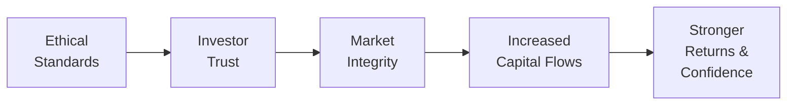

## Introduction

Ethical standards might seem like an abstract concept at first, but—believe me—they’re the bedrock of trust in portfolio management. When you’re managing someone’s hard-earned savings or a pension fund that retirees rely on, everything you do has an enormous impact on people’s lives. So, why take all this talk about ethics so seriously? Well, the moment clients even suspect unethical behavior—like a conflict of interest or undisclosed fees—you can basically kiss their trust goodbye. And honestly, without trust, the foundation on which the entire investment profession rests starts to wobble.

In portfolio management, every transaction, every communication, every piece of advice is imbued with an ethical dimension. In the daily rush of asset allocation decisions, rebalancing tasks, and performance analyses, it’s easy to lose sight of this. But abiding by strong ethical standards ensures transparency, honesty, and fairness—three qualities that help keep capital markets functioning smoothly and ultimately foster robust investor confidence. This article explores how ethical behavior underpins our profession, with a particular emphasis on the CFA Institute’s Code of Ethics and Standards of Professional Conduct, common ethical dilemmas, the value of disclosure, and the consequences of non-compliance. We’ll also share a few historical examples that put these principles into perspective.

## Why Ethics Matter for Portfolio Management

If you’ve ever seen a large institutional client withdraw a massive chunk of capital from an investment firm over concerns of compliance or insider trading allegations, you know exactly how quickly reputational risk materializes. Ethical standards serve as both a guiding compass and a protective shield. They set forth a dedicated path for treating clients equitably—whether that’s through transparent disclosure of fees, distribution of material information, or fair dealing during high-stakes trading activity.

Let’s break this down:

• Trust Builder: If you hold yourself to a high moral code (and adhere to it day in and day out), your clients are far more likely to remain loyal in turbulent markets or crises.  
• Risk Management Tool: Ethical misbehavior can blossom into full-blown legal nightmares, from class-action lawsuits to regulatory sanctions. Sticking to ethical guidelines mitigates potential catastrophes.  
• Market Integrity: An ethical environment means that markets are more efficient, as no one illegally benefits from nonpublic data. That’s good for everyone, from retail investors to multi-billion-dollar hedge funds.

A personal anecdote might help drive this home. A colleague once confided to me that his firm’s daily risk management checks weren’t just about quantitative metrics—like VaR or tracking error—but also about making sure nobody on the team was sitting on market-moving information the rest of the group was unaware of. This was a simple but powerful daily reminder: you can’t have real risk management if you ignore the ethical dimension of information flow.

## The Core of Ethical Portfolio Management: The CFA Institute Code and Standards

At the heart of best practices in investment management are the CFA Institute Code of Ethics and Standards of Professional Conduct. These guidelines aren’t just suggestions. They’re a robust framework that clarifies how you should handle clients, colleagues, and the markets at large.

Under the Code of Ethics, professionals commit to:

• Acting with integrity, competence, diligence.  
• Placing client interests above personal interests.  
• Using care and independent judgment.  
• Practicing in a professional and ethical manner.  

Building on those broad principles, the Standards of Professional Conduct provide specific rules and expectations. For example, they govern how to handle material nonpublic information (so you don’t inadvertently fall into insider trading), how to adequately disclose conflicts, and how to ensure full clarity around pricing structures, fees, and performance results.

Fiduciary duties exist within this framework as well. In plain words, a fiduciary must act in the best interests of the client. That means if your firm stands to benefit from an investment that’s not really a good fit for the client portfolio, you don’t choose that investment—no matter how good it looks on your bonus. Failing that duty can lead to direct civil liability, not to mention tarnish your (and your firm’s) reputation.

## Common Ethical Dilemmas in Portfolio Management

Ethical issues aren’t trivial. Even well-intentioned professionals encounter situations daily that test their moral compasses. Let’s consider some common dilemmas:

• Conflicts of Interest: Imagine being responsible for a large pension fund’s mandates while your spouse works for a company that’s part of the fund’s equity holdings. Does this create bias in your voting decisions? If so, how do you disclose and handle it?  
• Insider Trading: Suppose you overhear material nonpublic information at a conference. Are you allowed to trade on it? Definitely not. But how do you ensure you don’t subconsciously let it affect your valuation models?  
• Allocation of Investment Opportunities: When an IPO is oversubscribed, do you allocate the shares fairly among client accounts? Are you inadvertently favoring some clients over others (e.g., those who pay higher fees)?

### Conflict of Interest in Practice

Let’s say your asset management firm also offers investment banking services. It’s pretty common on Wall Street, right? You might be advising a biotech company on issuing new equity, and your analyst team covers that same biotech in their research. If the research swivels too positive, are you crossing ethical lines to please your client? If it’s too critical, do you risk losing their investment banking revenue? Transparent disclosures and strict firewalls between departments can mitigate these issues. But remember, even the best internal controls are meaningless if compliance culture isn’t deeply ingrained.

### Insider Trading Temptations

It’s amazing how quickly insider trading allegations can tear down an entire career. That one unknown detail gleaned inadvertently from a company executive at a golf outing might not seem so significant—until someone trades on it. Then it’s a legal and ethical powder keg. The duty is simple: do not use material, nonpublic information, and ensure your firm’s policies reinforce that.

## The Importance of Clear Disclosures

Perhaps one of the biggest lessons from high-profile legal cases, such as the meltdown of large investment firms during credit crises, revolves around the disclosure of risk. Clients deserve to know how an investment strategy works, what fees they’re paying, and what hidden risks might be lurking due to leverage or sophisticated derivatives. If you ever find yourself brushing aside a client’s question with, “Eh, don’t worry about those details,” you’re almost certainly inviting suspicion—or worse, compliance blowback.

• Fees and Compensation: Spell out how you and your firm are being paid. Management fees? Performance-based fees? Brokerage relationships or soft-dollar arrangements? Let your clients know, plainly and in a timely manner.  
• Potential Conflicts: If you’re using proprietary products or have a compensation scheme that might influence your recommendations, say so. Clients can handle complexity, but they won’t forgive concealment.  
• Risk Exposures: Does the new strategy rely heavily on a single commodity’s price, or is it employing leverage that magnifies both gains and losses? Be up front.  

## Ethical Standards as a Shield Against Reputational Risk

When a firm’s ethics are in question—say, from a front-running scandal or an undisclosed high-fee product fiasco—clients, the press, and regulators converge for a closer look. If you’re a fiduciary or if you’re entrusted with a large chunk of, for example, a pension plan, that’s the last position you want to be in. Potential outcomes include client withdrawals, negative press, regulatory fines, or full revocation of advisory licenses.

In many cases, even if a firm manages to dodge legal repercussions, the reputational damage sticks. Would you personally invest with an advisor who was previously investigated for insider trading, even if they weren’t convicted? It’s a big question. Ethical standards, embraced consistently, safeguard your brand and your viability in the marketplace.

## Building a Culture of Compliance

Let’s face it: just having a thick compliance manual in your drawer changes nothing without proper enforcement and daily training. To cultivate a compliance culture, you need:

• Ongoing Education: Regular seminars, updated training modules on new regulations, interactive sessions where employees discuss real-life ethical quandaries.  
• Open Door Policies: If employees fear repercussions for raising concerns, your environment is already compromised. Encourage a speak-up mindset.  
• Leadership by Example: Senior managers should walk the talk. If employees see executives bending the rules for short-term profit, no set of policies will hold up.

In one of my previous roles, we had a “compliance moment” at the start of every team meeting, where we’d highlight a recent ethics topic—like the dangers of front-running or challenges around recommended trades that might benefit an affiliate. It may have felt repetitive at times, but it kept compliance top-of-mind.

## Historical Ethical Breaches and Lessons Learned

History offers plenty of cautionary tales. One famous example is the Bernie Madoff Ponzi scheme, which hinged on fraudulent reporting and nonexistent trades. Investors, big and small, lost fortunes. The scandal widely eroded trust in wealth managers, spurring stronger calls for auditing oversight and transparency regarding investment strategies.

Another case: the insider trading convictions of portfolio managers at prominent hedge funds weighed heavily on the entire alternative investments industry. They reminded us that even sophisticated managers can step outside the bounds of legality if they’re not vigilant. These chapters in our industry highlight how ethical lapses don’t just destroy single firms—they undermine confidence in the broader financial system.

## How Ethical Lapses Undermine Market Integrity and Investor Confidence

Market efficiency relies on equal access to information and fair dealing. When individuals trade on insider tips or distort research recommendations to manipulate prices, they sabotage the fairness and transparency that capital markets require. Subsequent declines in confidence usually manifest as higher cost of capital and lower levels of investment, dampening overall economic growth. There’s a domino effect: unethical acts can reverberate throughout the entire financial ecosystem.

Below is a simple diagram illustrating how ethical standards drive positive market outcomes:

## Best Practices, Pitfalls, and Overcoming Them

• Best Practices:  
  – Regularly review the CFA Institute Code of Ethics and Standards of Professional Conduct.  
  – Disclose any potential conflict of interest promptly.  
  – Keep all client interactions documented to ensure clarity.  
  – Encourage cross-functional checks, like compliance sign-offs before big trades.  

• Common Pitfalls:  
  – Overlooking “minor” conflicts of interest because they don’t seem pressing.  
  – Failing to keep up with changes in regulations, especially in cross-border dealings.  
  – Operating under the assumption that one small ethical compromise won’t matter.  

• Strategies to Overcome Them:  
  – Foster an environment where employees feel safe to admit mistakes.  
  – Implement robust internal checks and real-time monitoring of trades.  
  – Ensure that performance reviews consider ethical behavior, not just returns.  

## Exam Tips

• Scenario Analysis: The CFA Level III exam often challenges you to navigate conflict-of-interest scenarios or evaluate the ethical behavior of a portfolio manager in a case study. Practice applying the Code of Ethics and Standards in real-life vignettes.  
• Know the Distinctions: Understand terms like “fiduciary duty,” “material nonpublic information,” and so forth. You might be asked to articulate how each concept applies in a risk-return scenario or a client disclosure scenario.  
• Show the Steps: Even if the question seems straightforward, demonstrate your thinking process—why an action is or isn’t ethical.  
• Time Management: Essay portions can be intense. Outline your answers first, ensuring you address all parts of the question. Doing so helps you quickly highlight ethical, regulatory, or methodological points.  

## Glossary

• Code of Ethics: A set of moral principles guiding professional behavior.  
• Standards of Professional Conduct: Specific rules and expectations detailing how ethical principles apply in practice.  
• Fiduciary Duties: Legal and ethical obligations to act for the benefit of another party (e.g., clients).  
• Conflict of Interest: A situation where personal or firm interests may interfere with a client’s best interest.  
• Insider Trading: The illegal practice of trading on material, nonpublic information.  
• Disclosure: Providing all relevant information so investors can make informed decisions.  
• Reputational Risk: Potential loss arising from damage to a firm’s or individual’s reputation.  
• Compliance Culture: An organizational environment that encourages adherence to laws and ethics.

## References and Further Reading

• CFA Institute. “Code of Ethics and Standards of Professional Conduct.”  
• Boatright, J. (2013). Ethics in Finance. Wiley.  
• CFA Institute Website: Numerous case studies on ethical decision-making in finance.

---

## Test Your Knowledge: Ethical Standards in Portfolio Management



### Which of the following best describes a fiduciary duty in portfolio management?

- [ ] Placing the portfolio manager’s interest first.
- [ ] Ensuring compliance with local regulations only.
- [x] Acting primarily for the benefit of the client in all decisions.
- [ ] Maximizing short-term trades for greater profit.

> **Explanation:** A fiduciary duty means you must place client interests above your own.  

### What is the primary reason insider trading is considered unethical?

- [x] It provides an unfair advantage to certain market participants.
- [ ] It does not affect market efficiency.
- [ ] It only hurts wealthy investors.
- [ ] It reduces tax revenue.

> **Explanation:** Insider trading undermines fairness by allowing participants with nonpublic information to benefit or avoid losses in ways not available to the general public.  

### A portfolio manager hears market-moving, nonpublic information in a client conversation. According to ethical guidelines, what should be done?

- [ ] Immediately execute trades to benefit existing portfolios.
- [ ] Share the information only with select high-fee clients.
- [x] Refrain from trading on it and consider a trading restriction until the information is publicly known.
- [ ] Include the information in a standard research note without disclosure.

> **Explanation:** Trading on material nonpublic information violates the Standards of Professional Conduct. The manager should not trade or recommend trading while in possession of such information.  

### Which of the following is most likely an example of a conflict of interest?

- [x] A manager recommending a financial product from a firm in which they hold personal stock.
- [ ] A manager staying out of personal stock market investments entirely.
- [ ] A passive index fund adjusting holdings based on index changes.
- [ ] Auditors rotating client engagements every three years.

> **Explanation:** Holding personal stock in a firm that you recommend to clients can interfere with objective judgment and must be disclosed.  

### Why are clear disclosures about fees and investment risks crucial in portfolio management?

- [ ] To reduce competition among investment managers.
- [x] To enable clients to make informed decisions and maintain trust.
- [ ] To avoid any marketing costs.
- [x] To comply with ethical and regulatory requirements.

> **Explanation:** Disclosing fees and risks ensures transparency, enables informed client choices, and aligns with ethical/legal standards.  

### What is the best way a firm’s leadership can promote an ethical culture?

- [ ] Assign compliance only to junior associates.
- [x] Uphold ethics daily and ensure training programs are regularly conducted.
- [ ] Emphasize short-term profitability over ethical behavior.
- [ ] Encourage employees never to question senior decisions.

> **Explanation:** Leadership by example and ongoing education cultivate ethical conduct throughout the organization.  

### Which statement about reputational risk is correct?

- [x] It often takes longer to rebuild a damaged reputation than to lose it.
- [ ] It only affects high-net-worth clients.
- [x] It has no effect on client confidence in stable markets.
- [ ] It can always be resolved by refunding client fees.

> **Explanation:** Once a firm’s reputation is tarnished (e.g., by an ethical violation), regaining client trust can take years, irrespective of market conditions.  

### In which situation does compliance culture play a critical role?

- [x] Ensuring employees know how to honestly disclose conflicts of interest.
- [ ] Making sure clients cannot sue the firm.
- [ ] Guaranteeing the firm never operates at a loss.
- [ ] Simplifying fraudulent activities within different departments.

> **Explanation:** A genuine compliance culture helps employees spot and disclose ethical red flags, protecting client and firm interests.  

### Why do conflicts of interest need to be disclosed?

- [x] To inform clients about factors that might affect unbiased advice.
- [ ] To meet a quota of disclosures for compliance audits.
- [ ] To prevent employees from investing personally.
- [ ] To reduce the manager’s legal liability in all circumstances.

> **Explanation:** Disclosure allows clients to evaluate potential biases, leading to fairer decisions and better client-manager relationships.  

### A portfolio manager with stellar returns is found to have misled clients about the risks of a new strategy. According to standard ethics, is this acceptable?

- [x] False
- [ ] True

> **Explanation:** Even strong returns don’t justify misleading clients about risks. Full disclosure is a cornerstone of ethical portfolio management.  


