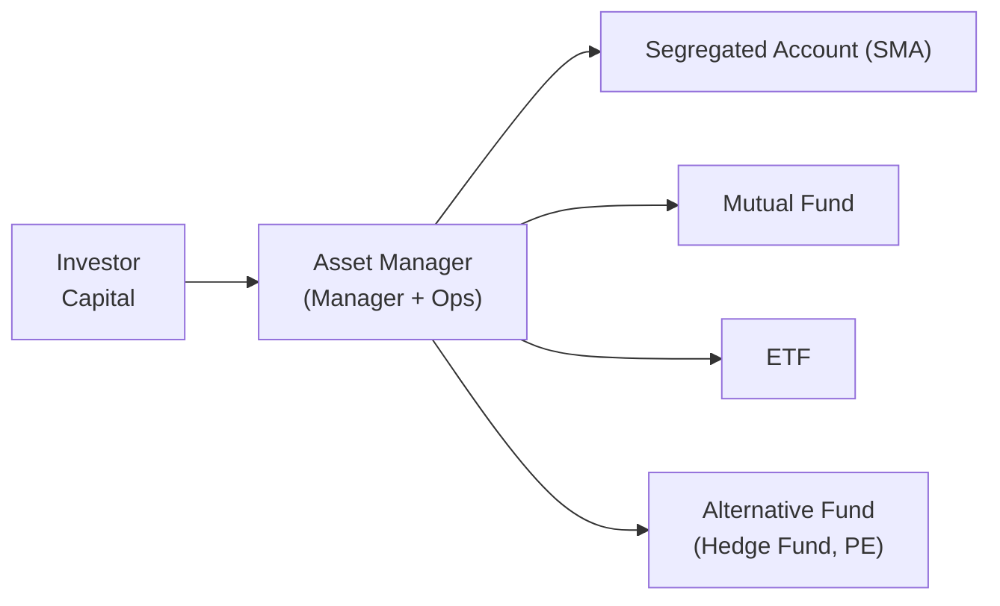

## Introduction

You know that time when you walk into a supermarket for just one thing—maybe a loaf of bread—and then you see about 15 different types of bread, all claiming to be the best? Asset management product offerings can feel a bit like that sometimes. You start wanting a straightforward portfolio, and suddenly you're presented with specialized funds, exchange-traded products, direct indexing solutions, or even micro-investing apps that let you buy fractional shares. It can be overwhelming.

But let’s take a breath. Asset managers offer a variety of product structures and service models so that different client segments can find what works best for them. This section breaks down how these products are structured, how fees are typically set up, and why technology has been such a big game-changer in expanding access. By the end, you’ll hopefully feel more comfortable with the jargon and more confident about aligning your targets—such as risk tolerance, time horizon, or even thematic preferences—with the right kind of offering.

## Common Product Structures

The overarching goal of asset managers is to connect investor capital with suitable investment strategies. Yet, the form in which these strategies are packaged can differ dramatically. Let’s explore some of the key structures:

### Segregated Accounts

Segregated accounts are a classic. Picture a high-net-worth individual or an institution—like a pension fund—who wants a customized strategy. Instead of pooling her money with other investors, she gets a dedicated portfolio, often referred to as a Separately Managed Account (SMA). The advantage? Greater control over the investment process, individual security selection, and the ability to tailor mandates for tax or ESG considerations. The trade-off is the higher cost of customization.

### Mutual Funds

A mutual fund pools money from many investors to invest in a predetermined strategy—like large-cap equities or government bonds. Mutual funds are actively managed more often than not, with a professional manager who picks underlying securities. Investors buy shares at the net asset value (NAV), usually priced once per day. While mutual funds are accessible to retail customers, they can be subject to management fees that vary widely based on the strategy’s complexity.

### Exchange-Traded Funds (ETFs)

ETFs have rocketed in popularity in the last couple of decades. They trade on stock exchanges like regular equities, augmenting liquidity and allowing intraday pricing. In practice, many ETFs track an index (like the S&P 500), but there are also actively managed and thematic ETFs. They’re often praised for lower costs relative to mutual funds. Investors who prefer to buy or sell throughout the day—or incorporate sophisticated trading strategies—tend to like ETFs for their flexibility.

### Alternative Funds

Hedge funds, private equity, venture capital, real estate funds, and other “alt” strategies belong in this category. Typically, they have higher minimum investments, longer lock-up periods, and less liquidity (especially in private equity). Yet, for experienced investors seeking alpha or diversification benefits, these funds play a key niche role. Alternative funds might demand complex due diligence and a stronger stomach for risk, but they can add that extra layer of diversification to a broader portfolio.

Below is a simple Mermaid diagram illustrating how these product structures relate to the investor:

## Service Models

Asset managers package their strategies and offerings in a variety of service models to suit different types of clients. On one extreme, you have high-touch private wealth management serving ultra-high-net-worth individuals with in-house research teams, dedicated relationship managers, estate planning, and more. On the other extreme are digital “robo-advisors,” providing automated portfolio construction for folks who just need a low-cost, user-friendly platform accessed on a mobile app.

### High-Touch Private Wealth Management

When I was first starting out in the industry, I distinctly remember a conversation with a wealth manager who described her job as part financial planner, part psychologist. And, honestly, that sums up private wealth management well: it’s about forging a trusting relationship. Clients often expect a broad suite of services: comprehensive investment planning, estate planning, tax optimization, philanthropic strategies, and sometimes next-generation educational resources. The relationship is personal, with frequent check-ins. Fees tend to be higher, typically linked to assets under management (AUM), though some firms will also include a retainer or performance-based component.

### Robo-Advisory and Mass-Market Solutions

Robo-advisors gained traction by leveraging algorithmic asset allocation, typically relying on modern portfolio theory to construct a diversified mix of passive funds. The cost structure is usually straightforward—maybe 0.25% to 0.50% of AUM annually—and because these platforms benefit from scale, they can serve clients with smaller balances and still be profitable. The trade-off is that you won’t get a phone call from a portfolio manager or dedicated advisor. But for investors who don’t want to fuss with complex decisions and want a cost-effective set-it-and-forget-it solution, robo-advisory can be quite compelling.

### Hybrid Models

Some firms offer “hybrid” models combining technology with the human touch, perhaps giving clients digital onboarding and portfolio rebalancing plus access to a (human) advisor for more complex issues. The fees are moderate—more than a pure robo platform but lower than a full-scale private wealth service. Using technology as an enabler, these hybrid models are bridging the gap in the wealth management continuum.

## Fee Structures and Incentives

Fees determine how managers get paid, but they also influence the provider’s incentives. Here are the common structures:

- Flat Fees: A single fixed payment for a range of services, unaffected by asset size or performance. Simpler for budgeting, but can misalign incentives if the manager is paid the same regardless of results.
- Tiered Fees: Many managers charge a percentage of AUM (like 1% up to a certain balance, then 0.85% on the next tier, etc.). As client assets grow, the fee rate might decline in percentage terms, which somewhat rewards loyalty and scales with the client’s net worth.
- Performance Fees: These often appear in hedge funds or high-end SMA relationships. A manager might get 20% of profits over a certain benchmark. This can be motivating but can also encourage excessive risk-taking if not properly structured (e.g., with high-water marks or hurdles).
- Hourly Fees or Retainers: Some independent advisors, especially those offering broader financial planning, might charge by the hour or a monthly retainer, partially decoupling compensation from investment performance.

It’s key that clients understand how fees are charged, because “cheapest” doesn’t always mean “best.” The fairness of the structure can affect manager behavior and the resources allocated to research. 

## Specialized Offerings: Sector, Factor, and Thematic Strategies

Beyond the classic equity or bond funds, many asset managers now host specialized products:

- Sector-Specific Funds: Focused on industries like technology, healthcare, or consumer staples. These can be more volatile but appeal to investors with a strong conviction in a particular sector.
- Factor-Based Strategies: Often revolve around academically proven “factors” such as value, momentum, quality, or low volatility. These are sometimes known as “smart beta” if implemented in a low-cost, rules-based manner, bridging the gap between passive indexing and active stock picking.
- Thematic Portfolios: Perhaps you have a strong belief that renewable energy is poised to bloom or that artificial intelligence will revolutionize multiple industries. Thematic funds (or thematic portfolios) let you put your capital behind a broader trend. They can be riskier if the theme doesn’t play out, but they can also capture tailwinds early.

## The Rise of Customized Portfolios and Direct Indexing

For investors seeking an even more personalized route, direct indexing and SMAs have gained traction. Rather than buying an index fund, direct indexing replicates an index by holding each component in the investor’s account. This approach allows for tax optimization—like tax-loss harvesting on specific securities—and personal preferences, such as excluding certain industries or companies that don’t match an investor’s environmental or social criteria.

Slightly more advanced than direct indexing, SMAs can adopt any investment strategy while customizing holdings, risk exposures, and even sector tilt. This is huge for investors wanting the look and feel of a fund while still owning the underlying securities. It’s also beneficial for clients with unique constraints or compliance restrictions. 

## Technology Platforms, Fractional Shares, and Micro-Investing

One of the best things about the modern era is that you don’t need a large initial investment to get started. Technology has paved the way for micro-investing platforms enabling fractional shares—so you can put $5 into Amazon or Tesla if you want. This democratizes access, letting smaller investors build diversified portfolios. Some platforms even let you invest your spare change from everyday purchases.

Such platforms usually bundle educational content or gamified elements (though be mindful of how “gamification” might prompt short-term thinking). But from a purely structural standpoint, fractional shares open the door for almost anyone to buy pricey securities in smaller increments—expanding capital markets participation well beyond the wealthiest segment of the population.

## Service Levels: Robo-Advice vs. Private Wealth

Below is a quick table contrasting robo-advice with private wealth management. In between these extremes, you can find many hybrid or mid-market solutions.

| Aspect                      | Robo-Advice                                   | Private Wealth Management                   |
|-----------------------------|-----------------------------------------------|---------------------------------------------|
| Minimum Investment          | Often $0 to $1,000                           | Sometimes $1M+                              |
| Fees                        | 0.25%–0.50% of AUM                            | 0.75%–2.0% (depending on complexity)        |
| Human Interaction           | Limited (mostly digital)                      | Dedicated relationship managers, frequent contact |
| Customization               | Basic (model portfolios)                      | Highly customized solutions (tax, estate planning) |
| Target Clients              | Mass market, newer investors                 | High-net-worth, ultra-high-net-worth        |
| Technology Role             | Core (algorithmic asset allocation)          | Supporting (dashboards, analytics, but relationship-driven) |

## Importance of Due Diligence and Manager Selection

With literally thousands of products out there, it’s crucial to do your homework—or hire someone who can. Manager selection often involves evaluating:

- Track Record: Look beyond raw returns. Check risk, consistency, and how performance fared in various market cycles.
- Team Stability: If key people left recently, the stated track record might not apply to the current team.
- Investment Philosophy and Process: Does the strategy rely primarily on fundamental analysis, quantitative models, or a blend? Are factor tilts intentional or accidental? 
- Operational and Compliance Strength: Behind every performance metric is a set of systems, risk controls, and governance rules that keep the ship steady.

## Aligning Product Choice with Objectives

Always keep your end goals in mind. A high-growth thematic fund might have exciting upside but might also be more volatile than you can handle. A segregated account or direct indexing solution might give you the perfect ESG alignment, but it’s possibly more expensive than a broad-based ETF. Complexity for complexity’s sake rarely pays off. Focus on the interplay between your risk tolerance, time horizon, liquidity needs, and personal preferences.

## Best Practices and Pitfalls

• Diversification Doesn’t Mean Over-Diversification: Owning 25 funds that all do the same thing is not truly diversifying.  
• Watch Out for Hidden Fees: Expense ratios, transaction costs, performance fees—make sure you want to pay what’s being charged.  
• Don’t Chase Performance: The top fund of this year might not be the one next year.  
• Reassess Periodically: Your goals or liquidity needs can change. Make sure your portfolio remains aligned with your new circumstances.  

## Case Study: An Investor’s Journey from Robo to Customized SMA

Imagine an early-career professional, Kelly, who starts investing through a robo-advisor. She invests in a basket of low-cost ETFs for a few years, appreciates the simplicity, and sees her savings grow. As her career advances and her assets accumulate, she wants more control over tax optimization and is drawn to ESG investing. Eventually, she moves her assets into a separately managed account where the manager tailors her holdings to reflect both broad market exposure and specific sustainability criteria she values. Kelly pays a slightly higher fee, but she’s okay with that because it aligns with her increasingly complex needs—plus, she feels more in sync with the strategy.

## Glossary

• Segregated Account: A personalized portfolio managed separately from other investors’ assets.  
• Thematic Portfolio: An investment approach targeting specific trends or industries (e.g., ESG, AI, or renewables).  
• Direct Indexing: Holding individual securities that replicate an index, but allowing for customization like tax optimization.  
• Separately Managed Account (SMA): A portfolio owned by a single investor, managed according to a specific strategy.  
• Fractional Shares: Partial ownership of a stock, allowing investors with smaller capital to buy high-priced shares in increments.  
• Micro-Investing: Investing small amounts of money frequently, often via mobile apps.  
• Manager Selection: Evaluating and choosing the most suitable investment manager or strategy.  
• Client Segmentation: Categorizing clients based on wealth, needs, or preferences for tailored solutions.

## References and Further Reading

• Global Investment Performance Standards (GIPS) by CFA Institute – Excellent resource on performance presentation.  
• “Private Wealth Management: The Complete Reference for the Personal Financial Planner” by G. Victor Hallman and Jerry Rosenbloom.  
• Barron’s and Financial Times – Stay updated on innovative product launches, industry mergers, and the evolving competitive landscape.  

## Exam Tips and Concluding Thoughts

On the CFA exam, be ready to apply this knowledge in scenario-based questions. They might ask you to recommend a product type (ETF vs. segregated account) given a client’s circumstances—like liquidity needs, risk profile, or sustainability preferences. Remember to detail the rationale behind the fit (or lack thereof). 

• Time is a constraint. Summarize the key advantage or disadvantage of a given service model succinctly.  
• Watch for compliance or ethical angles: For instance, are disclosures about fees transparent? Are performance fees structured ethically?  
• Hug the big picture. Your exam response should map the advantages of each product or model to investor objectives, constraints, and regulatory considerations.  

If you see a question about manager selection, highlight the interplay between a firm’s resources, alignment of incentives, and risk-control measures. And watch for any mention of “behavioral biases”—like chasing performance fees or ignoring cheaper alternatives—that might shape the appropriate client recommendation.

---

## Mastering Product Offerings and Service Models: Quiz



### Which product structure offers the highest level of customization for an investor’s unique preferences?

- [ ] Mutual Fund
- [ ] ETF
- [x] Separately Managed Account (SMA)
- [ ] Hedge Fund

> **Explanation:** SMAs allow investors to dictate specific securities and customize constraints like ESG filters or tax optimization.

### Which of the following is a common drawback of performance-based fee structures?

- [ ] They are transparent and encourage investor confidence
- [ ] They help managers align with client interests perfectly
- [x] They can encourage risk-taking if not properly structured
- [ ] They automatically protect against market downturns

> **Explanation:** Managers may take excessive risk to earn higher incentive fees, especially absent hurdles or high-water marks.

### A technology-focused thematic fund primarily invests in which of the following securities?

- [x] Companies in the technology sector
- [ ] Companies across all sectors
- [ ] Only government bonds
- [ ] Only real estate investment trusts

> **Explanation:** Thematic funds focus on a specific industry or theme, such as technology, healthcare, or renewables.

### Which statement best describes a robo-advisor’s primary advantage?

- [x] Low cost, algorithmic-based investment solutions
- [ ] Highly personalized tax and ESG customization
- [ ] Full estate planning services with in-person advisors
- [ ] Exclusion of passive instruments in favor of active picks

> **Explanation:** Robo-advisors use algorithms to keep costs low and maintain optimal allocation without extensive human intervention.

### A high-net-worth individual wants advanced estate planning and ongoing personal contact. Which service model is most likely suitable?

- [ ] Robo-advisory
- [x] Private wealth management
- [ ] A standard brokerage account
- [ ] Online discount broker

> **Explanation:** High-net-worth individuals typically require high-touch services, estate planning, and personalized contact.

### Which of the following is a potential benefit of direct indexing?

- [ ] Total elimination of all fees
- [x] The ability to harvest tax losses on individual securities
- [ ] Guaranteed outperformance of the index
- [ ] No requirement for rebalancing

> **Explanation:** Direct indexing holds individual securities of a benchmark, allowing investors to strategically capture tax benefits and customize holdings.

### In a tiered fee structure, what typically happens as the client’s asset base grows?

- [ ] The percentage fee increases at each tier
- [x] The percentage fee decreases at higher tiers
- [ ] Flat fees replace percentage-based fees for all tiers
- [ ] Fees vary randomly with market conditions

> **Explanation:** Tiered fee schedules often reward larger clients with a lower percentage fee at higher asset levels.

### Which is a key difference between a mutual fund and an ETF?

- [x] ETFs trade throughout the day, while mutual funds are priced once daily
- [ ] Mutual funds cannot invest in equity securities
- [ ] ETFs only invest in alternative assets
- [ ] Mutual funds always cost less than ETFs

> **Explanation:** ETFs can be traded intraday, whereas mutual funds are transacted once per day at the closing NAV.

### An investor wants to access partial ownership of high-priced stocks. Which approach is most suitable?

- [ ] High-minimum hedge fund
- [x] Fractional shares on a micro-investing platform
- [ ] Private placement with mandatory lock-up
- [ ] Purchasing a hedge on exchange

> **Explanation:** Fractional share programs allow investors to buy very small slices of stocks, making higher-priced shares more accessible.

### True or False: Specializing in sector funds automatically provides full diversification for an investor’s portfolio.

- [ ] True
- [x] False

> **Explanation:** Sector funds concentrate on specific industry verticals. This can lead to insufficient diversification if an investor’s entire portfolio is sector-based.


