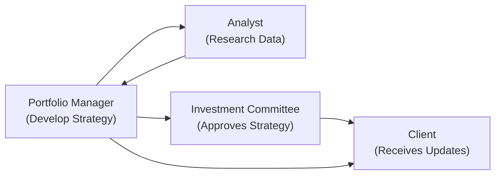

## Introduction

Communication in portfolio management—especially with clients and stakeholders—can feel sort of like juggling multiple balls at once. There’s performance data, market trends, personal expectations, evolving life events, and oh-so-many variables to keep everyone informed of. It’s easy to slip into dense financial jargon or overly complicated performance metrics that lock people out instead of drawing them in. But, trust me, clear, concise, and transparent communication stands as the bedrock for building trust and nurturing strong, long-lasting client relationships.

In this section, we’ll walk through how to tailor your communication strategies to different audiences, how to present complex financial ideas in plain language, and how you can keep folks engaged with their investments. We’ll also look at the digital tools available today—client portals, automated notifications, you name it—and consider how generational or cultural differences affect the way you approach interactions. Through real-world examples and practical advice, you’ll see how to turn the often-daunting subject of finance into an accessible conversation topic. 

## Why Communication Matters

“Why does it all matter?” you might ask. Well, when you’re managing someone’s money, you’re not just dealing with a bunch of cold, hard figures. You’re dealing with hopes, dreams, fears—even things like retirement goals or philanthropic legacies. Let’s not forget that these investments might fund someone’s home purchase, a child’s education, or a comfortable retirement. The stakes are high. Naturally, excellent communication supports a strong relationship based on mutual trust and understanding. 

If communication fails or becomes unclear, clients may develop misconceptions about how their portfolio is constructed or why it might fluctuate in volatile markets. Worse, they might not alert you to important changes in their financial needs or risk tolerance. That is why open lines of communication and consistent updates play a huge role in bridging the gap between what’s happening “under the hood” and what clients think is happening in their portfolio.

## Presenting Complex Financial Concepts in Plain Language

Some of us get a little uneasy or bored when confronted with pages upon pages of performance numbers, standard deviations, Sharpe ratios, and everything else. So, a key skill for a portfolio manager or investment professional is translating such data into straightforward insights that clients can understand. This is often referred to as “plain language disclosure.” 

### Building Blocks of Plain Language
• Avoid jargon, or if you must use it, explain it.  
• Use analogies. For instance, describing standard deviation as “variance in possible outcomes” or risk as “the chance your actual returns might differ from what you expect.”  
• Focus on the “why.” Instead of just giving a number for portfolio volatility, explain what it implies for potential drawdowns or how it might affect future cash needs.  

### Example: Explaining Risk Measures
Suppose you want to share that your client’s portfolio has a 12% annualized standard deviation. Instead of merely saying, “Your volatility is 12%,” consider clarifying:

“Your portfolio might fluctuate by about 12% around its average return over the course of a year. In other words, if we project the portfolio’s average return at around 8%, we expect that it could vary from about -4% to about +20% (roughly) in a typical year, though of course extreme market events can push it outside this range.”

By coupling numerical data with everyday language, you’re helping demystify “risk.” That fosters openness and encourages further questions from clients, which hopefully leads to deeper engagement.

## Transparent Reporting: Consistency and Honesty

Nothing builds client confidence like regular, detailed, and honest updates. Take monthly or quarterly performance reports, for instance. If a client receives a consistent, easy-to-read statement that unpacks:

• Total portfolio return over the reporting period (and year-to-date).  
• Changes in holdings (e.g., new investments, sold securities).  
• Explanations of fees charged (e.g., management fees, transaction costs).  
• A summary of market movements that affected performance (e.g., a brief commentary highlighting major events).  

…they’ll feel more informed and less likely to question unanticipated results. This approach is called “transparent reporting.” 

Let’s say in one quarter the portfolio underperforms its benchmark. You may be tempted to downplay this or drown the client in technical details. Instead, acknowledging the performance shortfall and explaining which holdings or sectors caused it, while also highlighting your tactical adjustments or your long-term rationale, can significantly boost the client’s trust in your process. It’s that openness, even about negative outcomes, that underscores your integrity.

## Strategies for Visual Communication

Sometimes, it’s not the words themselves but the way the data is displayed. Enter charts, tables, and infographics. Visual aids can simplify complicated performance metrics or macroeconomic data shifts, guiding clients through the essential takeaways more quickly. A well-designed infographic on “How interest rates have changed over time and impacted returns” can be far more digestible than pages of pure text.

### Sample Mermaid Diagram: Communication Flow

Below is a simple Mermaid diagram illustrating who typically needs to communicate with whom when managing portfolio updates. It’s a streamlined look at the communication paths among a Portfolio Manager, an Analyst, an Investment Committee, and the Client.

Notice how multiple lines of communication can converge on the client. While the client primarily deals with the portfolio manager, the analyst may provide additional context.

## Timing and Frequency of Communication

### Regular Reporting
Monthly or quarterly reports have become somewhat standard across the industry. But the timeliness of updates is just as crucial as the frequency. Some clients—particularly institutional clients—prefer monthly updates, while others might only want a quarterly check-in. Striking the right balance will both keep them informed and prevent reporting overload.

### Ad-Hoc Updates
Besides routine communications, it’s a great idea to contact clients whenever something significant happens in the market or in their portfolio. This could be a sudden, sharp market drop, or an update on a newly acquired position. These spontaneous bulletins (via email newsletters, text messages, or app notifications) can help quell panic or address speculation.

### Review Meetings
A “Review Meeting” is your classic face-to-face (or nowadays, often Zoom-to-Zoom) engagement where client and manager deep-dive into how the portfolio has performed, reassess risk tolerance, and discuss future plans. Typically scheduled in regular intervals—maybe semi-annually or annually—this meeting ensures alignment between the manager’s approach and the client’s current needs.

## Using Digital Tools to Enhance Communication

More than ever, clients expect real-time or near-real-time access to portfolio performance. Many asset managers now provide a “Client Portal,” which is a secure website or mobile app that allows the client to log in and see transactions, returns, holdings, and more whenever they like. This shift toward digital transparency can also reduce the number of on-the-spot requests for statements and performance data. 

### Benefits of Digital Communication
• On-Demand Access: Clients answer many of their own questions by viewing their online dashboard.  
• Cost-Effectiveness: Automated reporting cuts down on printing and mailing.  
• Enhanced Engagement: Clients can log in from anywhere to check on progress, which can spark more frequent dialogues around strategy.  

### Potential Pitfalls
Be cautious that too much data can spark knee-jerk reactions. Some inexperienced investors might panic if they see daily or hourly fluctuations. A best practice is to educate clients on the normal fluctuations of investments so that real-time data doesn’t cause unnecessary anxiety.

## Generational Differences in Communication Style

Let’s face it: not everyone wants an app. Some older clients might feel more comfortable with phone calls or printed reports, while younger ones might prefer short text updates or push notifications on their phone. Fully acknowledging this reality can significantly boost client satisfaction.

• Baby Boomers often appreciate more detailed, formal discussions—sometimes in person—and prefer scheduled calls.  
• Gen X might want well-structured reports but are usually comfortable reviewing PDFs, Excel files, or online dashboards.  
• Millennials or Gen Z (who are increasingly investing) typically prefer quick, on-the-go notifications and mobile apps.  

Having multiple communication channels—be it email, phone, texting, or personalized app notifications—covers all generational bases. Meanwhile, pay attention to your client’s personal preferences; never assume an age bracket dictates everything.

## Conducting Effective Review Meetings

When meeting with a client, aim to do more than just read off a performance report. Try these steps:

• Begin by revisiting the client’s objectives: “Has anything changed in your job, family, finances, or personal goals?”  
• Provide a high-level summary of the portfolio: “Overall returns this quarter, major changes to holdings, how we performed against benchmarks, and so forth.”  
• Dive into relevant performance drivers: Did certain asset classes excel? Underperform? Why?  
• Welcome questions: Turn the process into a dialogue, not a monologue.  
• End with next steps and confirm the communication plan: “We’ll meet again in six months, but you can call or email me anytime or refer to the portal for daily updates.”  

It sounds straightforward, but many people skip crucial details or gloss over potential client concerns. Asking open-ended questions can unveil a trove of insights about upcoming life events—like the desire to purchase a second home or fund a grandchild’s education. Don’t rush through it.

## Cultural Nuances and International Stakeholders

With a global client base, it’s pretty common these days to manage money for individuals or institutions from different cultural backgrounds. There might be language barriers or different customs around business etiquette. For instance, some cultures prefer relationship-building discussions before diving into the portfolio’s numbers; others want quick, data-driven communication with minimal pleasantries. By doing the necessary prep work—learning basic cultural norms or employing translation services—you’re showing you respect your client’s background, and that fosters trust. 

### Quick Tips
• Speak slowly and clearly if language differences exist.  

• Provide localized references (e.g., performance data relevant to a client’s home currency).  

• Keep an open mind: not all clients want to be approached the same way.  

• Leverage cross-cultural training or resources if your firm manages money globally.  

## Example Case Study: Meeting Different Needs

### The Retired Couple
Imagine you have a retired couple in their late 60s. They may prefer:
• Quarterly statements mailed to them, followed by a short phone call.  
• In-person meetings twice a year.  
• Plain language disclosures, focusing on the security of their income stream and capital preservation.  

### The Tech-Savvy Entrepreneur
Then there’s the tech-savvy entrepreneur in his early 30s. He wants:
• Monthly performance dashboards through a mobile app.  
• Alerts if his portfolio deviates by more than 2% from a target return.  
• The ability to “live chat” with an associate if questions come up.  

By tailoring communication to each individual, you’re showing them that you care about their needs and preferences, which further seals the bond of trust.

## Overcoming Common Pitfalls

- Overuse of Jargon: Yes, it’s tempting to show your expertise. But drowning a client in acronyms and complexity may cause confusion or mistrust.  
- Lack of Updates in a Crisis: During turbulent markets, clients need timely updates. Silence escalates fear.  
- One-Size-Fits-All Reporting: Standardized statements meet compliance but ignore personal preferences. Offer customized approaches where possible.  
- Overstating Performance: Manage expectations realistically. Avoid “best-case scenario” references that might set up future disappointments.  
- Ignoring Cultural Etiquette: Mismatched communication can lead to misinterpretations and dissatisfaction.  

## Best Practices for Clear, Honest, and Engaging Communication

• Set expectations early: Explain how often and in what form they can expect portfolio updates.  
• Create easy-to-digest summaries: Use bullets, highlight performance drivers, add short commentary.  
• Integrate visuals: Charts, infographics, and color-coding can do wonders for clarity.  
• Offer open channels: Phone, e-mail, secure client portal, text—whatever fosters real engagement.  
• Maintain consistency: If you promise monthly performance commentary, deliver monthly performance commentary.  
• Encourage feedback: “How do you feel about these updates? Is there anything else you’d like to know?”  
• Document everything: Keep records of what was shared, how it was shared, and when, ensuring full compliance with regulatory standards.  

## Regulatory and Ethical Considerations

CFA® professionals must also ensure their communications uphold the CFA Institute Code of Ethics and Standards of Professional Conduct. In particular:

• Standard I(C): Misrepresentation – All communications should be fair, balanced, and not misleading.  
• Standard V(B): Communication with Clients and Prospective Clients – Disclose the format and expected frequency of updates.  
• Standard III(A): Loyalty, Prudence, and Care – Act in your clients’ best interests.  

Following these guidelines not only meets your ethical obligations but creates a sense of reliability and professionalism that most clients greatly appreciate.

## Final Exam Tips

• Familiarize yourself with “Plain Language Disclosure” standards and be prepared to demonstrate how you would rephrase complex financial metrics in simplified terms.  
• Practice building a presentation outline that includes performance data, investment rationales, and risk factors for a hypothetical client meeting.  
• Don’t overlook the generational and cultural considerations. A question may present scenarios focusing on varied communication styles, so be ready to customize your approach.  
• Time management in the exam means you need to succinctly explain how you’d communicate results and respond to concerns. Be concise but thorough.  
• Use real-life scenarios or case studies as practice. For instance, how you’d handle a sudden market crash or a significant client liquidity event and how you’d communicate strategy adjustments.

## References and Further Reading

• Kumar, A. R. S. (2022). “Investor Relations: Principles and International Best Practices.” Provides comprehensive stakeholder communication guidelines.  
• CFA Institute. “Standards of Practice Handbook.” Emphasizes ethical communication and disclosure requirements.  
• Schwab, C. (Annual). “Modern Wealth Survey.” Offers insight into contemporary investor communication preferences and technology trends.  

---

## Test Your Knowledge: Communication Strategies with Clients and Stakeholders Quiz



### Which approach best describes “plain language disclosure” for client communications?

- [ ] Using complex financial terminologies to demonstrate professionalism
- [x] Translating investment information into understandable everyday language
- [ ] Sending out only numeric data without discussion
- [ ] Avoiding risk-related topics in performance reports

> **Explanation:** Plain language disclosure means avoiding jargon and explaining concepts in a way clients can easily understand.

### Which of the following is a direct benefit of transparent reporting?

- [ ] Reduces the need for regulatory compliance
- [ ] Ensures identical communication styles among all generations
- [x] Increases trust and discourages client misconceptions
- [ ] Eliminates the possibility of market downturns

> **Explanation:** Regular, open, and honest reporting helps clients anticipate challenges and fosters a trust-based relationship.

### Why do timely portfolio updates in a volatile market constitute a best practice?

- [x] They help prevent clients from panicking due to lack of information
- [ ] They create the impression that returns will never be negative
- [ ] They automatically reduce portfolio volatility
- [ ] They ensure you can charge additional management fees

> **Explanation:** Providing timely updates helps ease concerns and supports informed decisions, especially when the market is turbulent.

### When explaining risk measures to a client using plain language, investment professionals should:

- [ ] Only provide numerical data without elaboration
- [ ] Avoid discussing potential losses altogether
- [x] Clarify the meaning of risk metrics and the real-world implications
- [ ] Substitute all risk metrics with colorful charts only

> **Explanation:** Offering real-world context to risk metrics helps clients fully grasp how these measures affect their investments.

### What is a critical benefit of offering multiple communication channels for clients?

- [x] Aligns with different clients’ preferences and technological abilities
- [ ] Guarantees clients will never request in-person meetings
- [x] Ensures immediate acceptance of all advice given
- [ ] Eliminates the need for compliance records

> **Explanation:** Different clients have different preferences. Multiple channels (in-person, phone, email, client portals, texts) help you accommodate everyone effectively.

### Which of the following is a likely pitfall of real-time portfolio tracking?

- [ ] Improved client satisfaction and transparency
- [ ] More timely detection of fraudulent transactions
- [x] Potential for impulsive changes based on daily fluctuations
- [ ] Better data accuracy over the long term

> **Explanation:** While real-time tracking boosts transparency, it can also cause some investors to react emotionally and prematurely to normal market ups and downs.

### Why might one hold a separate review meeting beyond regular quarterly updates?

- [x] A major life event for the client might change investment goals
- [ ] To reduce disclosure and transparency
- [x] Because the portfolio manager has run out of standard content
- [ ] To delay revealing the actual performance numbers

> **Explanation:** Clients often experience life changes—marriage, retirement, an upgraded home purchase—that may require revisiting previous assumptions and updating strategies.

### How can a portfolio manager address cultural or language barriers during communication?

- [x] Provide translated materials and speak slowly if needed
- [ ] Insist on using only one language no matter the client’s background
- [ ] Omit key financial details to keep it simple
- [ ] Assign communication only to junior associates

> **Explanation:** Recognizing cultural differences and offering translated or localized materials fosters inclusivity and helps bolster clarity.

### An ideal review meeting for a client should typically:

- [ ] Only focus on performance metrics, ignoring a client’s changing financial goals
- [x] Revisit the client’s initial objectives, discuss outcomes, and welcome feedback
- [ ] Require the client to sign an NDA if returns are below market benchmarks
- [ ] Avoid discussing fees or charges until the end of the year

> **Explanation:** A comprehensive review meeting assesses performance and confirms the client’s goals, ensuring a long-term view aligned with personal needs.

### True or False: One-size-fits-all communication is the most efficient method for all client segments.

- [x] True
- [ ] False

> **Explanation:** This is actually a tricky one—“True or False” questions can throw you off. But in this question, the statement is false. A one-size-fits-all method is not effective because different clients have different preferences, technology familiarity, and generational backgrounds. Therefore, the correct answer is False. However, note that the question format might be reversed here. The correct statement is that one-size-fits-all communication is rarely ideal.


