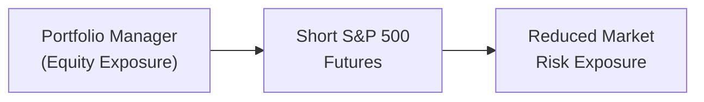

### Introduction

Believe it or not, the first time I ever used derivatives in a portfolio, I was a little nervous. I mean, they sound so fancy—futures, options, swaps. But it turns out that using derivatives for risk control isn’t all that intimidating once you understand the key concepts: You’re basically ensuring that your portfolio won’t unravel if markets move against you. Instead of selling your physical holdings—which might be complicated, time-consuming, or just plain expensive—you can turn to derivatives to manage risk exposures in a (hopefully) cost-effective way.

In what follows, we’ll explore how derivatives like futures, options, and swaps can help you hedge (or offset) some of the risk in your portfolio. Along the way, I’ll share a few personal observations, and we’ll talk about best practices, potential pitfalls, and a few real-world examples to tie everything together.

### Why Derivatives for Risk Control?

I remember sitting in a risk management meeting (in my early days as a junior analyst), and the head of trading said something like, “Well, we can either sell these 1,000 shares of stock in the open market, or we can just short a futures contract with the same notional value and keep the shares.” That was a bit of an “aha” moment: By using a short futures position, we effectively locked in our gains on the stock without having to physically sell it. This simple example shows why derivatives are so handy:

• They allow you to hedge price risk without altering your underlying holdings.  
• They can be cheaper (in terms of transaction costs) compared to liquidating a position or restructuring the entire portfolio.  
• They provide flexibility—futures, options, or swaps can be layered on top of any existing portfolio to adjust exposure.  

When we talk about “risk control,” we’re looking to mitigate threats from adverse movements in equity prices, interest rates, or currency exchange rates. Derivatives let you quickly change, reduce, or neutralize these exposures as needed.

### Common Derivatives Used for Risk Control

Derivatives come in many forms, but the following are the real workhorses when it comes to hedging:

• Futures Contracts: Contracts where you agree to buy or sell a particular asset at a predetermined price on a future date. Commonly used to manage equity, interest rate, and currency exposures.  
• Options (Calls and Puts): Contracts that give you the right (but not the obligation) to buy or sell the underlying asset at a specified strike price. They can be used to hedge downside risk (via puts) or lock in purchase prices (via calls).  
• Swaps: Private agreements—often used to exchange cash flows, such as swapping floating-rate interest payments for fixed-rate ones or exchanging currency exposures.  

#### Quick Illustrative Diagram

Let’s visualize how derivatives fit into your portfolio’s risk management in a simple flowchart:



In the diagram above, the portfolio holds some equity exposure (A). By taking a short position in S&P 500 futures (B), the manager reduces (C) the net market risk of the overall portfolio.

### Defining the Exposure and Hedge Ratio

At the core of any good derivative overlay is the hedge ratio. The hedge ratio tells you how much of your underlying position’s risk is offset by your hedge. If you have an equity portfolio worth $100 million and you decide to short futures on an equity index with a notional value of $80 million, your hedge ratio would be 0.8 (or 80%). While that ratio might sound precise, in reality, it needs careful calibration.

• A hedge ratio of 1.0 (or 100%) would, in theory, remove almost all of the portfolio’s market risk—although, as we’ll see, basis risk can still cause minor mismatches.  
• Over-hedging (a hedge ratio > 1.0) can introduce negative market exposure (a net short position) and add leverage in unexpected ways.  
• Under-hedging (a hedge ratio < 1.0) leaves you partially exposed to the underlying market moves.  

Below is a tiny code snippet in Python that shows a naive approach to calculating a hedge ratio for an equity portfolio. This is very simplified—real hedge ratios often require deeper statistical analysis.

```python
import numpy as np

portfolio_value = 100e6

# and we want to hedge 80% of the portfolio
desired_hedge_percent = 0.8

hedge_notional = portfolio_value * desired_hedge_percent

contracts_needed = hedge_notional / 50_000

print(f"Hedge Notional: ${hedge_notional}")
print(f"Futures Contracts to Short: {contracts_needed}")
```

### Basis Risk and the Realities of Hedging

One golden rule of derivatives hedging is: perfect hedges are rare. There’s something called “basis risk,” which is the risk that the price movement of the hedging instrument (let’s say, an index future) doesn’t perfectly match the price movement of your underlying asset (your portfolio might differ from the index). If your portfolio is heavily tilted toward tech stocks but you hedge using a broad market index future, you might find that your hedge underperforms if tech rallies more than the broader market.

#### Key Factors Affecting Basis Risk

• Correlation Between the Portfolio and the Hedge Instrument  
• Timing Differences (futures may have expiration dates that don’t line up perfectly with your investment horizon)  
• Contract Specifications and Underlying Indices  

Imagine you’re long a basket of emerging market bonds, but you can only find a liquid futures contract on U.S. Treasuries. Your hedge will reduce some interest rate risk, but it’s definitely going to leave you with plenty of basis risk since emerging market bonds have credit risk, currency risk, and other factors that Treasuries don’t.

### Designing a Risk Control Overlay

When a portfolio manager designs a risk control overlay, they typically follow these steps:

• Identify the Risk Exposure: Are we hedging equity market volatility, interest rate fluctuations, or currency swings?  
• Determine Hedge Ratio: What proportion of the portfolio should be hedged to meet the risk budget or risk tolerance?  
• Select the Appropriate Instrument: Futures, options, swaps, or a combination.  
• Monitor and Rebalance: Keep a close eye on the hedge’s performance, adjusting if exposures shift or if certain market events unfold.  

I recall one time we’d hedged our strong euro exposure (the portfolio was denominated in euros) using currency swaps. It seemed all good—until the euro spiked more than we anticipated. Our hedge ratio was only 50% to balance out a partial risk preference, so we still got some currency-related whiplash. That’s a prime example of how important it is to keep rechecking your hedge coverage over time.

### Leverage and Over-Hedging

Leverage is like fire in the world of derivatives: It’s super useful but also dangerous if it’s not handled with care. Because derivatives often have relatively small initial margin requirements compared to their notional value, you can unintentionally gear up your portfolio’s net exposure. Over-hedging—where your hedge ratio exceeds 1.0—can shift your portfolio from net long to net short. This might be a strategic choice, but if it happens by accident or drift, it can be a real problem. 

### Operational and Regulatory Considerations

Derivatives come with operational complexities. For instance, exchange-traded instruments (like standard futures or exchange-traded options) typically require you to post margin. OTC instruments (like many swaps) often require negotiations about collateral and credit support annexes (CSAs). There’s also a big difference in liquidity profiles. Exchange-traded markets generally have deeper liquidity, while OTC markets can be thinner or more specialized.

From a regulatory perspective, some jurisdictions have strict limits on how and whether you can use derivatives. Portfolio managers must ensure that derivative usage aligns with local laws, client mandates, and the overall Investment Policy Statement (IPS). Documenting these strategies in a clear derivatives policy statement (or as part of the IPS) is a common best practice.

### Example: Hedging Equity Market Risk with Futures

Suppose you manage a $500 million global equity portfolio that’s heavily skewed toward U.S. large-cap stocks. You’re nervous about an upcoming earnings season that might cause short-term turbulence in the markets. You decide to partially hedge 70% of your equity exposure using S&P 500 index futures.

1. You calculate your notional exposure by multiplying $500 million by 70%, which comes out to $350 million.  
2. You look up the contract size for S&P 500 e-mini futures, often around $50 times the index level. If the index stands at 4,000, each contract’s notional is $200,000 ($50 × 4,000).  
3. You need 1,750 contracts ($350 million / $200,000) to hedge a 70% exposure.  
4. As the market moves, you monitor the hedge daily or weekly (depending on your risk appetite). If your portfolio’s value changes materially, or if the index moves significantly, you rebalance contracts to maintain the 70% hedge ratio.  

### Example: Using Swaps for Currency Hedging

Let’s say your Canadian-based portfolio has a significant holding in Japanese equities, and you’re worried about a potential weakening of the yen against the Canadian dollar. One approach is to enter into a currency swap:

1. Identify the size of your yen-denominated holding, say JPY 10 billion.  
2. Determine the portion you want to hedge—maybe you want to hedge 100% given the volatility of the currency.  
3. Enter into a yen-for-Canadian-dollar swap (receiving yen, paying CAD) so that if JPY depreciates, your swap offsets losses in your Japanese equity position.  

And that’s about it—at least in concept. In practice, you’ve got to carefully negotiate swap terms, including credit risk provisions, margining requirements, and settlement dates.

### Monitoring Hedge Effectiveness

It’s tempting to set up a hedge and forget it, but that’s a big no-no. Hedge effectiveness can deteriorate over time due to:

• Changes in the portfolio’s composition.  
• Movements in the underlying index used for the futures or swap.  
• Basis risk that emerges or worsens if the correlation between the hedge and the underlying exposure shifts.  

You’ll want to regularly:

• Mark-to-market your derivative positions.  
• Calculate your net exposure (the underlying plus the derivative overlay) to ensure it’s still within your acceptable risk range.  
• Adjust the hedge ratio as needed to match changes in your portfolio or market environment.  

### Documentation and Reporting

So, you know how it goes in finance: If it’s not written down, someone’s going to question it at the next audit or compliance check. Proper documentation of your hedge strategy is critical. Typically, you’ll include a summary of:

• The derivative instruments allowed.  
• The specific exposures you’re hedging.  
• Maximum allowable leverage or notional amounts.  
• Reporting cadence for trades, margin calls, and performance updates.  

Keeping these records updated helps you demonstrate that you’ve followed your Investment Policy Statement (IPS) guidelines and that you understand the potential pitfalls of your derivative overlays.

### Final Thoughts and Best Practices

• Always define your hedge objective clearly. Is it a temporary hedge to get through a market event or a longer-term overlay to maintain a steady-state risk level?  
• Watch out for basis risk—it can sink you if you assume a perfect correlation.  
• Keep a close eye on leverage; derivatives can amplify your portfolio’s risk instead of reducing it if misused.  
• Stay on top of margin calls. Even if your hedge is theoretically offsetting losses in the underlying, you might need to post additional collateral if the derivative position is losing value.  
• Document everything. This includes the rationale, the instruments used, and the performance of the strategy.  

### Advice for the Exam

When approaching exam questions on derivatives for risk control:

• Interpret the scenario carefully to identify the appropriate derivative instrument.  
• Understand how to calculate a basic hedge ratio (they often give you portfolio value, contract size, or notional needed).  
• Watch for the mention of basis risk—exams love to ask how basis risk might impact the hedge’s effectiveness.  
• Reinforce your awareness of margin versus collateral, and remember that exam scenarios often revolve around margin calls or liquidity issues.  
• Be ready to discuss the differences between exchange-traded and OTC derivatives.  

### References

- Hull, John C. (2018). “Options, Futures, and Other Derivatives.” Pearson.  
- CFA Institute. (2023). “Derivatives and Risk Management.” CFA Program Curriculum.  
- Ritchie, M. & Fieberg, M. (2021). “Derivatives Demystified.” Wiley Online Library.

---

## Test Your Knowledge: Derivatives for Risk Control Quiz



### Which of the following best describes the role of a hedge ratio in a derivatives-based risk management strategy?

- [ ] It defines the probability of margin calls during the life of a futures contract.
- [x] It indicates what proportion of an underlying position is offset or protected by a hedge.
- [ ] It ensures there is no basis risk between the underlying asset and the hedge instrument.
- [ ] It strictly applies only to currency exchange rate hedging.

> **Explanation:** The hedge ratio helps managers decide how much of the underlying exposure is offset by the derivative position. It does not guarantee elimination of basis risk nor does it only apply to currency hedging.

### A portfolio manager of a $200 million equity fund decides to hedge 50% of the equity market exposure using S&P 500 futures. If the manager’s hedge ratio inadvertently exceeds 1.0, the portfolio would:

- [ ] Be effectively under-hedged, leaving more risk exposure than intended.
- [x] Become net short on the equity market, introducing extra leverage and potential downside risk.
- [ ] Immediately require a margin call due to regulatory constraints.
- [ ] Limit the upside potential but not the downside risk.

> **Explanation:** Exceeding a hedge ratio of 1.0 means the manager has over-hedged the underlying exposure. This effectively creates a short position, potentially introducing leverage and new risks.

### Which of the following illustrates basis risk in a derivatives overlay?

- [ ] When the desired hedge ratio matches the underlying exposure perfectly.
- [x] When the futures contract's underlying index moves differently than the portfolio's exact holdings.
- [ ] When the counterparty defaults on an OTC swap agreement.
- [ ] When the portfolio fails to meet initial margin requirements.

> **Explanation:** Basis risk occurs when the price of the hedge instrument (e.g., index futures) moves differently from the actual assets in the portfolio (e.g., a unique equity mix).

### In a currency hedge using a swap, the manager typically aims to:

- [ ] Create additional returns by speculating on interest rate differentials.
- [ ] Increase the portfolio’s volatility in foreign currency markets.
- [ ] Convert a floating interest rate exposure to a fixed rate exposure.
- [x] Exchange one currency for another to offset currency risk in the portfolio.

> **Explanation:** Currency swaps are often used to exchange foreign currency exposures for a domestic currency, thus hedging against unfavorable exchange rate movements.

### What is the most common advantage of using exchange-traded derivatives over OTC derivatives?

- [ ] Unlimited notional amounts can be traded without collateral.
- [x] Reduced counterparty risk due to clearinghouse guarantees.
- [ ] No requirement for margin or collateral at any point.
- [ ] Complete elimination of basis risk across all asset classes.

> **Explanation:** Exchange-traded instruments are standardized and guaranteed by a clearinghouse, significantly reducing counterparty risk. They still require margin, and basis risk may still exist depending on the asset.

### A manager uses equity index futures to hedge a portion of a portfolio’s equity exposure. Which of these outcomes would most likely trigger a need to rebalance the hedge?

- [x] A significant market rally changes the portfolio’s total value.
- [ ] Consistent performance of the index in line with portfolio returns.
- [ ] Stable correlation between the futures contract and the portfolio.
- [ ] A small daily fluctuation in the underlying index.

> **Explanation:** If the portfolio or market undergoes a major move, the hedge might become out-of-date or misaligned with the original hedge ratio. This necessitates rebalancing.

### How can leverage arise inadvertently when setting up a hedge with derivatives?

- [ ] By choosing an asset not correlated with the underlying portfolio.
- [ ] By using forward rather than futures contracts.
- [x] By over-hedging so that the notional amount of the hedge exceeds the portfolio value.
- [ ] By using only a partial hedge ratio (e.g., 50%).

> **Explanation:** Over-hedging can push a portfolio into a leveraged or net short position, thereby inadvertently adding leverage instead of reducing risk.

### One of the primary distinctions between futures and options as hedging tools is that options:

- [x] Provide the right but not the obligation to transact, often resulting in a premium cost.
- [ ] Fundamentally do not require margin or collateral.
- [ ] Can only be used for short-term currency hedging.
- [ ] Never experience basis risk because they are standardized.

> **Explanation:** Options grant the holder the right without the obligation to exercise, requiring the payment of a premium upfront. They still can experience basis risk and often require margin if sold (written), though buyers typically post only the premium.

### Which of the following best describes the phenomenon known as “basis risk” for a manager hedging an emerging market government bond portfolio using U.S. Treasury futures?

- [x] The underlying emerging market bonds have different yield and credit characteristics compared to U.S. Treasuries, causing imperfect hedging.
- [ ] Complete correlation exists between the bond portfolio and the futures.
- [ ] The foreign jurisdiction disallows the use of derivatives.
- [ ] The manager’s margin account is underfunded relative to daily price moves.

> **Explanation:** The fundamental mismatch in asset characteristics between emerging market bonds and U.S. Treasuries leads to basis risk.

### A portfolio manager who wants to fully hedge market exposure but remain invested in the underlying securities might:

- [x] Enter a derivative overlay that closely matches the portfolio’s value.
- [ ] Sell all physical holdings to eliminate risk.
- [ ] Rely solely on short-selling individual stocks in the portfolio.
- [ ] Avoid rebalancing the strategy once established.

> **Explanation:** By setting up a full derivative overlay (e.g., a short position in an index future matching the portfolio’s notional value), the manager can keep the physical securities while neutralizing the market exposure.


