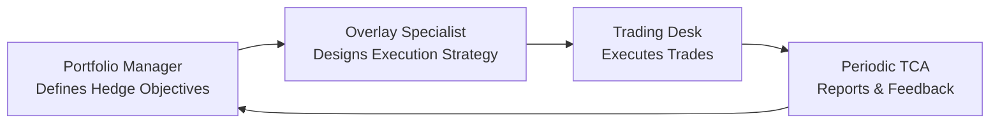

## Introduction and Context

Overlay strategies, such as currency overlays or futures overlays, have become popular among institutional investors seeking to protect portfolios or enhance returns. But here's the rub: every overlay trade you make—buying or selling futures, hedging currency exposure, or adjusting equity exposure—comes with transaction costs. On top of that, there’s often something called “slippage,” which is basically the difference between the price you expect and the price you actually get when you pull the trigger.

I recall an instance when I traded a currency hedge in a fast-moving market. I priced it out in the afternoon, but by the time the trade got filled, the market had shifted significantly, and—oh boy—my actual execution price was much worse. That difference was my slippage cost. It felt kind of like ordering an item online, seeing one price, and then discovering while checking out that the final cost was higher because of shipping, handling, and those sneaky taxes. Anyway, let’s break down the world of overlay costs and slippage, so we know how to handle them properly before they erode our alpha or sabotage our risk management goals.

## Understanding Overlay Costs

Overlay costs come in many forms. Some of them—like trading commissions and bid-ask spreads—are fairly obvious. Others—like market impact and margin fees—can be a bit trickier to quantify. When you look at anything in Chapter 10 on Portfolio Overlays and Currency Management, you’ll see that controlling or at least understanding these costs is crucial to any successful overlay strategy. 

• Trading commissions: The fees you pay your broker or exchange for placing trades. These can be per-contract or volume-based charges.  
• Bid-ask spread: The difference between the highest price a buyer is willing to pay for a derivative or security (bid) and the lowest price a seller is willing to receive (ask).  
• Market impact: If your trade is large enough or ill-timed, you might move the market price yourself. This effect is often more pronounced in thinly traded instruments.  
• Collateral or margin fees: Derivatives usually require margin. Maintaining this margin may involve paying interest, administrative costs, or tying up capital.  
• Administrative costs: This includes everything from compliance and reporting to any technology or execution platform fees.  

If you’re setting up an overlay for currency risk (say, from a global equity portfolio), you might be continuously rolling your futures contracts or forwarding your currency trades. The sum of these multiple transactions over time can add up to a surprisingly large figure.

## Defining Slippage and How It Occurs

Slippage is that subtle, often frustrating, difference between the transaction price you want and the price you actually get. In highly liquid markets with deep order books, slippage might be minimal—maybe a few basis points. But in fast-moving or less liquid conditions, slippage can balloon.

Reasons for slippage include:

• Time lag: If you first identify a price but can’t execute immediately, the market could shift in that interval.  
• Insufficient liquidity: If your order is large relative to the market’s capacity, you may have to “walk the book,” stepping through multiple limit orders, and each portion of the order might execute at progressively worse prices.  
• Volatility: Heightened volatility means that, even in the time it takes to click “buy,” the price can change quickly.  
• Adverse selection risk: The counterparty might have better pricing info or execution speed, so they’re effectively trading against you, capturing some of that pricing advantage.

Anyone who’s watched the market feed while placing an order sees those blinking quote changes: the ask ticks up a fraction of a cent, or the contract spread opens up. All these micro moves can add up, especially if you have repeated or large overlay trades.

## Magnifying Effects of High-Frequency Updates

Let’s not ignore frequency. If you’re running a dynamic overlay strategy—maybe you want to keep your portfolio systematically beta-hedged at all times—you’ll be making frequent modifications. Each of these small trades can accrue incremental costs in the form of commissions, spreads, and slippage. Over time, if the markets are choppy, slippage alone can become a significant drag. 

In places like foreign exchange markets (covered in 10.2 Currency Risk and Hedging Techniques), frequent rollovers or short-dated forward hedges might also face more volatile spreads, especially outside core trading hours. Minimizing this cost means timing your trades to more liquid sessions or using limit orders to anchor your acceptable execution range.

## Minimizing Overlay Costs with Optimal Execution

So how do you contain these costs? One word: planning. Or maybe that’s a phrase. Anyway, you need a carefully thought-out execution strategy that balances the risk of the market moving against you with the desire to control transaction costs.

• Limit Orders: Placing a limit order can help anchor your acceptable price range. You define the maximum price you’re willing to pay (or minimum price you’re willing to receive). However, limit orders risk not being filled in full if the market trades through your desired price too quickly or not at all.  
• Timing: If you’re hedging currency exposures, it might be more cost-effective to trade during overlapping sessions of key markets. Or if you’re rolling an equity futures position, doing so during normal market hours may reduce the bid-ask spread.  
• Gradual Execution: Instead of placing one massive order, break it down (sometimes referred to as slicing). This approach can reduce market impact.  
• Automated Execution Algorithms: Brokerages and banks often have algorithms designed specifically for cost minimization, timing, or volume-weighted average price (VWAP).  

Striking that balance is essential. Think of it like trying to buy or sell your house. If you absolutely must sell quickly, you might settle for a lower price. If you have the luxury of time, you might be able to wait for your ideal offer. In overlays, you can sometimes afford to trade more patiently—especially if the hedge’s timing is not urgent.

## Cost-Benefit Analysis of Overlays

At the end of the day, an overlay’s goal is to either mitigate undesirable risk or to generate alpha. But each trade you make has a cost. So, you have to weigh the expected benefits (like less currency volatility or improved risk-return trade-offs in the portfolio) against the real friction from overlay costs.

Imagine you’re running a currency overlay on a portfolio of international equities. You forecast that, unhedged, the currency fluctuations might add up to ±5% variance to your portfolio. A partial hedge might cut that fluctuation in half. Great, right? But if the repeated forward trades, rolling costs, and slippage total 1% or 2% a year, you’re left with the question: is that cost worth the 2.5% decreased volatility? That’s a classic risk-versus-cost tradeoff. 

In practice, you can gather data on typical transaction costs, look at historical or prospective volatility benefits, and then do scenario analyses—some of which can be tied back to your strategic or tactical asset allocation (see also 4.5 Tactical Allocation and Rebalancing Approaches).

## Transaction Cost Analysis (TCA) Tools

Transaction Cost Analysis (TCA) is basically a microscope for seeing exactly where and how you’re losing money in execution. TCA can answer questions like:

• Did we get good prices relative to the benchmarks?  
• How much of the cost was due to market impact vs. time delay?  
• Could a different brokerage or venue have offered better liquidity or spreads?

TCA tools typically:

• Compare actual execution price to a benchmark price, like the midpoint of the bid-ask spread at the time of order, or the Volume-Weighted Average Price (VWAP) for the day.  
• Decompose costs into spread costs, market impact, delay, and opportunity cost (unfilled shares).  
• Identify patterns (e.g., maybe you consistently do worse when trading at certain times of day or in certain markets).  

With TCA results in hand, you can refine your approach. If the analysis shows you consistently pay a wide spread for an emerging market currency hedge, for instance, you might shift your trading hours or use limit orders to reduce slippage.

Below is a simple, hypothetical Python snippet showing how you might calculate a basic TCA metric, comparing each trade’s execution price to the midpoint at the time of the trade. This is just an illustration—you should adapt it to your own data environment.

```python

import pandas as pd

# 'time', 'execution_price', 'midpoint_price', 'quantity'

def calculate_tca_metrics(trades_df):
    trades_df['price_diff'] = trades_df['execution_price'] - trades_df['midpoint_price']
    trades_df['cost'] = trades_df['price_diff'] * trades_df['quantity']
    total_cost = trades_df['cost'].sum()
    avg_cost_per_unit = total_cost / trades_df['quantity'].sum()
    return total_cost, avg_cost_per_unit

data = {
    'time': [1, 2, 3],
    'execution_price': [100.1, 100.2, 100.5],
    'midpoint_price': [100.0, 100.0, 100.3],
    'quantity': [10, 20, 15]
}

trades_df = pd.DataFrame(data)
tc, acpu = calculate_tca_metrics(trades_df)
print(f"Total cost: {tc}, Average cost per unit: {acpu}")
```

## Addressing Adverse Selection Risk in Derivatives

Adverse selection risk is often overlooked but can be significant, especially in thinly traded or off-exchange derivative markets. If you’re not as fast or well-informed as professional market makers or high-frequency traders, you might find yourself constantly executing trades at disadvantageous prices.

Best practices to mitigate adverse selection include:

• Selecting reputable counterparties or central venues with robust liquidity.  
• Timing execution to coincide with high-volume periods, thereby reducing the price advantage counterparties might gain from fleeting quotes.  
• Using request-for-quote (RFQ) platforms where multiple dealers compete, so you can compare quotes.  

Remember: an overlay is there to help your portfolio, not to gift easy money to the other side of the trade. 

## Integrating Communication Among Stakeholders

Overlay programs often involve various stakeholders: the portfolio manager who sets the overall strategy, the trading desk that executes the trades, and the overlay specialist who might be an external party managing the hedge. Clear communication ensures everyone understands cost constraints, tolerance for slippage, and trade objectives.

For instance, if your portfolio manager signals that precision is more important than speed (e.g., “I can’t accept more than 10 basis points of slippage on each trade”), the trading desk can adjust accordingly—maybe opting for limit orders or slicing. On the other hand, if the strategy demands real-time hedging to avoid basis risk, the trading desk should know speed is a top priority, and cost might be a secondary concern.

The communication might look something like this:



In this workflow, the TCA reports loop back to the portfolio manager for continuous improvements to the hedging policy. Collaboration fosters better cost management.

## Practical Case Study

Imagine an institutional investor with a sizable equity portfolio in multiple markets. The investor uses futures overlays to maintain a target beta exposure and also hedges currency. Over time, they notice that performance is trailing internal benchmarks. TCA reveals that:

• The trades are placed 30 minutes before major market open, facing wide spreads and thin liquidity.  
• The investor’s orders are large and placed all at once, creating market impact.  
• Communication between the overlay manager and trading desk is sporadic; nobody is systematically measuring daily slippage beyond a basic check in a spreadsheet.

After identifying these issues, the investor implements a phased-execution program, placing smaller trades closer to overlapping sessions, and invests in TCA tools for better visibility. Six months later, transaction costs have fallen by 25%, with slippage dropping by half, leading to improvements in net returns that align with management’s targets.

## Best Practices and Common Pitfalls

• Best Practices  
  - Conduct thorough TCA regularly, and measure against relevant benchmarks.  
  - Coordinate among portfolio management, compliance, and trading.  
  - Use limit orders or slicing strategies to reduce market impact.  
  - Time your trades for optimal liquidity windows.

• Common Pitfalls  
  - Neglecting the cost-benefit analysis. Overhedging can be as bad as being unhedged if the costs blow out.  
  - Ignoring partial fills on limit orders. You might get a fraction of the order done at a good price and then get stuck with the rest at an even worse price.  
  - Trading in illiquid markets or after hours, creating avoidable slippage.  
  - Lack of communication among internal teams about the overlay’s objectives or cost tolerances.

## Exam Tips for Assessing Overlay Costs and Slippage

• Measurement is Key: On the exam, be prepared to show how you’d isolate different cost components (e.g., bid-ask spreads vs. market impact) in a scenario.  
• Compare Benchmarks: Familiarize yourself with typical TCA benchmarks (e.g., VWAP, Implementation Shortfall).  
• Hedge Tradeoffs: The exam might ask for a recommended course of action if the cost of rolling futures is high. Demonstrate your ability to do a cost-benefit analysis.  
• Mitigation Strategies: Time-of-trade, order type, and frequency are all big points in any question dealing with slippage.  
• Ethical Standards: Stay alert to potential conflicts of interest or best execution obligations, which tie back to professional standards of practice (see 7.1 The Portfolio Manager’s Role and Fiduciary Duties).

## References

- Kissell, R. (2014). “The Science of Algorithmic Trading and Portfolio Management.” Academic Press.  
- CFA Institute. (2024). “Transaction Cost Analysis in Currency and Derivative Markets.” CFA Program Curriculum.  
- Hasbrouck, J. (2007). “Empirical Market Microstructure.” Oxford University Press.

-----

## Test Your Knowledge: Overlay Costs and Slippage



### When referring to transaction costs within an overlay strategy, which of the following costs is often the most immediately visible and easiest to quantify?  
- [ ] Market impact  
- [x] Trading commissions  
- [ ] Slippage  
- [ ] Margin fees  

> **Explanation:** While all these costs matter, trading commissions are generally the most straightforward to identify on a per-trade basis, as they're explicitly billed by brokers or exchanges.

### Which of the following is most likely to exacerbate slippage in a dynamic overlay context?  
- [ ] Trading only during peak liquidity sessions  
- [x] Placing very large orders in illiquid markets  
- [ ] Using limit orders to anchor the acceptable price  
- [ ] Reducing the frequency of overlay trades  

> **Explanation:** Large block trades in illiquid markets increase the chance of adverse market movements, thus magnifying slippage compared to smaller, staged trades.

### What is the main purpose of Transaction Cost Analysis (TCA) in an overlay program?  
- [ ] To increase the frequency of trading  
- [x] To measure and evaluate the effectiveness of trade execution  
- [ ] To justify higher commissions and fees  
- [ ] To enforce margin requirements  

> **Explanation:** TCA identifies the sources of transaction costs and measures how effectively trades are being executed, which ultimately helps refine the strategy.

### Which of the following best describes adverse selection risk?  
- [ ] Risk that an investor might over-allocate to an underperforming asset class  
- [ ] Risk that operational errors lead to unauthorized trades  
- [x] Risk that the counterparty has better information, resulting in unfavorable trade terms  
- [ ] Risk that brokers will refuse to execute a trade  

> **Explanation:** Adverse selection arises when the counterparty benefits from superior speed or information, leading you to execute at disadvantageous prices.

### Which statement best summarizes the relationship between frequency of overlay updates and slippage costs?  
- [ ] High-frequency updates always reduce slippage since you can micro-manage trades  
- [ ] High-frequency updates are irrelevant to slippage costs  
- [x] High-frequency updates may magnify slippage if markets are volatile  
- [ ] High-frequency updates can be done without proper TCA  

> **Explanation:** If you frequently adjust your overlay in volatile markets, each small trade can experience slippage, compounding overall transaction costs.

### In what scenario might a strategy use limit orders to manage overlay costs?  
- [ ] When immediate execution at any price is necessary  
- [ ] When the portfolio manager doesn’t mind paying higher transaction costs  
- [x] When the investor wants to control the execution price and can tolerate partial fills  
- [ ] When the investor has no information about market liquidity  

> **Explanation:** Limit orders set a maximum (or minimum) acceptable price, potentially controlling slippage if the market meets that price, but there’s the risk of getting only partial (or no) fills.

### Which of the following is a likely outcome of inconsistent communication between the trading desk and the portfolio manager regarding an overlay hedge strategy?  
- [ ] Enhanced execution and reduced costs  
- [ ] Faster trades with minimal slippage  
- [ ] More beneficial margin rates  
- [x] Unclear cost targets and suboptimal trade execution  

> **Explanation:** Poor communication leads to unclear objectives, such as how urgent a trade is or acceptable cost thresholds, which often results in suboptimal execution strategies.

### Why might an investor choose to slice large orders into smaller pieces for an overlay trade?  
- [ ] To ensure all trades are executed within one minute  
- [ ] To reduce the administrative cost of reporting  
- [x] To reduce market impact by gradually entering or exiting a position  
- [ ] To hide trades from regulators  

> **Explanation:** By slicing a large order, the investor can minimize abrupt changes in supply and demand, reducing the risk of moving the market.

### How does adverse selection risk typically manifest in over-the-counter (OTC) derivatives markets?  
- [ ] Lower bid-ask spreads due to multiple market makers  
- [ ] Elimination of all transaction costs  
- [x] Execution at unfavorable prices due to counterparties with superior information  
- [ ] No difference from exchange-traded securities  

> **Explanation:** In less transparent OTC markets, dealers or counterparties with better information can systematically price trades to their advantage, leaving the investor worse off.

### A transaction is executed at a price worse than the initial quoted price due to market movement during the execution process. This phenomenon is known as:  
- [x] Slippage  
- [ ] Margin call  
- [ ] Commissions  
- [ ] Fungibility  

> **Explanation:** Slippage is the difference between the price expected (or quoted) at trade initiation and the actual execution price, often due to market movement or insufficient liquidity.


