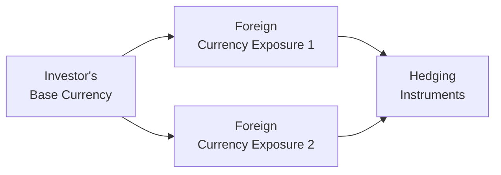

## Introduction

Investing across multiple currencies can feel exciting—kind of like bringing home souvenirs from every country you visit. But if you’ve ever traveled abroad and checked your credit card bill later, you likely realized that currency fluctuations can drastically change how much (or how little) you end up paying. Now imagine scaling that currency risk to a large investment portfolio. Even small exchange rate moves can have big impacts. This is where having a thoughtful multi-currency hedging policy really comes in handy.

## The Complexity of Multi-Currency Portfolios

A multi-currency portfolio holds assets denominated in more than one currency—like owning US equities, European bonds, and Japanese real estate investment trusts (REITs). Each asset has its own local currency exposure, which sits on top of the underlying asset returns. That currency overlay can either amplify your gains, reduce them, or even transform them into losses.

Currencies have their own volatility patterns, correlations, and interest rate differentials. Sometimes, large price movements seem to cluster (volatility clustering), making risk management that much trickier. On the flip side, exchange rates can offer some diversification benefits because not all currencies move the same way at the same time. In short, multi-currency investing can improve your return potential—but it can also create additional, sometimes unexpected, layers of risk.

## Hedging Objectives and Policy Development

A formal hedging policy is like a roadmap for managing foreign exchange (FX) risk. It is developed with three main objectives in mind:

• Reducing FX volatility: Investors often want returns in their home currency to be as stable as possible.  
• Preserving domestic currency value: Some want to minimize the risk of currency depreciation against the home currency.  
• Selectively exploiting currency trends: Others believe in actively managing currency exposures to generate additional alpha.

The key is to figure out your goals and risk tolerance first. Then the policy codifies things like:

• Permissible instruments (forwards, futures, options, cross-currency swaps, etc.).  
• Desired hedge ratios (e.g., 100% hedge on bond coupons, partial hedge on emerging currencies).  
• Rebalancing thresholds (e.g., once a currency exposure drifts 5% from target).  
• Roles and responsibilities (who makes hedging decisions, who executes trades, who monitors results).

In practice, there can be a range of approaches—from fully hedged to partially hedged or even selectively unhedged strategies. The more specific and transparent the policy, the fewer surprises you’ll have down the line. You really want to avoid the scenario where currency fluctuations chip away at carefully constructed portfolio returns simply because there was no plan in place.

## Permissible Instruments and Hedge Ratios

Permissible instruments form the toolbox for hedging. Commonly used are:

• Forward contracts (customized terms, over-the-counter).  
• Exchange-traded futures (standardized, but fewer currency pairs available).  
• Currency options (for a more flexible, though often more expensive, insurance-like approach).  
• Cross-currency swaps (useful in matching interest flows for bonds).

Once you know which tools you can use, you need to determine how much of your foreign currency exposure to hedge. Some investors prefer a 100% hedge in low-volatility asset classes like bonds, especially if they want stable income in their home currency. Others may hedge only partially to keep some upside potential if the foreign currencies appreciate.

Sometimes you’ll see a sliding scale. For example, an investor may hedge up to 50% of equity currency exposures but fully hedge bond exposures. This approach acknowledges that equity returns can be larger relative to currency moves, and partially hedging might provide a decent risk–return trade-off.

## Rebalancing Thresholds and Decision-Making

A rebalancing threshold imposes discipline. Imagine your original hedge ratio is 80%, but currency fluctuations cause your exposure to drift. If that ratio falls to 70% or rises to 90%, the policy might trigger a rebalance to restore the initial target or an allowable band (e.g., 75–85%). This ensures that the portfolio doesn’t become unintentionally over- or underhedged.

Decision-making responsibilities should be spelled out:

• Who monitors currency exposures?  
• Who decides when to rebalance or adjust hedge ratios?  
• Are there operational checks to ensure compliance?

A clearly defined workflow avoids confusion and ensures prompt action when thresholds are breached.

## Implementation in Multi-Currency Bond Portfolios

Bonds are particularly sensitive to currency volatility because many bond investors focus on stable income (coupons) or preservation of capital. Using cross-currency swaps, a portfolio manager can exchange the coupon and principal payments denominated in a foreign currency for flows in the base currency.

Let’s say your base currency is USD, but you hold a Japanese government bond that pays coupons in JPY. You might enter into a cross-currency swap that effectively “converts” those JPY interest payments into USD at a pre-agreed exchange rate schedule. This helps secure stable, predictable cash flows. It’s worth noting that cross-currency swaps can have complexities involving interest rate differentials. If the interest rates between the two currencies differ significantly, it can change both the cost and the net returns of implementing the swap.

## Equity Exposures and Net Currency Position

Equities generally have greater price volatility than bonds, so some investors are more comfortable leaving at least part of the currency exposure unhedged. Alternatively, you can aggregate multiple equity exposures into a single net currency position and perform “aggregated hedging.” If your portfolio is diversified across several currencies, you might net out offsetting exposures first, then hedge only the remainder. This reduces the number of trades.

For instance, if your portfolio is 50% invested in EUR and 30% in GBP, and you’re comfortable with a 60% total equity hedge, there might be a combined strategy to hedge each currency individually or hedge the net exposures with fewer, larger trades. This aggregated approach often lowers transaction costs and operational complexity.

## Special Considerations for Emerging and Frontier Markets

Emerging and frontier markets pose extra challenges due to higher FX volatility, lower liquidity, and higher transaction costs. Full hedging might be too expensive or operationally impractical, so some investors adopt partial hedges or leave certain exposures completely unhedged:

• Partial hedging: The policy might specify a 50% to 75% hedge on emerging market currencies to balance cost and risk mitigation.  
• Frontier markets: These can be even trickier, with illiquid or nonexistent hedging instruments. The policy might grant managers more flexibility (i.e., if it’s not viable to hedge, simply remain unhedged).

Additionally, non-deliverable forwards (NDFs) can be used where currency controls restrict the use of standard forwards.

## Tax Implications and Reporting Requirements

Tax laws can complicate currency hedging. In some jurisdictions, gains on derivatives (like forwards) might face withholding taxes, or gains could be treated differently from capital gains on the underlying asset. This can dampen (or, in rarer cases, enhance) the effectiveness of the hedge. Policies also need to address:

• Local reporting requirements (some places require separate disclosures for derivative positions).  
• Potential withholding taxes on derivative profits.  
• Accounting treatment for hedging gains and losses (is it recognized as capital gains or ordinary income?).

Skimping on the legal/tax side can create nasty surprises at year-end, so it’s crucial to define how hedging strategies will be monitored and accounted for over time.

## Ongoing Review and Adaptation

Global markets shift. Interest rates, monetary policies, and currency correlations don’t stay the same forever. One day, a currency might be stable; the next day, it might be subject to unexpected central bank interventions or capital flow restrictions. That means successful hedging policies aren’t set-and-forget. They require periodic reviews and updates:

• Does the existing hedge ratio still match the investor’s risk tolerance?  
• Have liquidity conditions changed, making it more costly or cheaper to hedge?  
• Are new instruments (like more liquid futures) available now?  
• Did the investor’s base currency or investment horizon change?

The hedging policy should be flexible enough to adapt but stable enough to avoid constant revisions. I once worked with a client who updated their policy so frequently that the real risk was the whiplash from tracking the changes. Having a well-documented framework and predetermined intervals for policy review can keep you on track.

## Practical Example: Designing a Hedging Policy

Imagine you’re the Chief Investment Officer (CIO) of a pension fund with a base currency of USD and a global allocation that includes EUR- and JPY-denominated bonds, along with a broad equity allocation spanning the US, UK, European, and Asian markets. After some deliberation, you decide on:

• Instruments: Forwards for bond exposures, options or forwards for equity exposures.  
• Hedge Ratios:  
  – 100% on fixed income denominated in EUR or JPY to stabilize coupon cash flows.  
  – 50% on equity exposures in EUR and GBP, leaving some room for currency gains.  
  – 0% for certain emerging market exposures due to high cost of hedging.  
• Rebalancing Threshold: If any currency exposure deviates by more than 5% from its target ratio, a hedge adjustment is triggered.  
• Responsibilities: The currency hedge program is monitored monthly by the risk management team, with final decisions made by the investment committee.  
• Tax and Reporting: Gains and losses from forwards are reported quarterly. The policy has strict guidelines to ensure compliance with all local and cross-border derivative regulations.  

## Visual Overview of Hedging Flows

In this simple diagram, the investor’s base currency remains the reference point. Each foreign currency exposure can either be hedged with instruments like forwards, futures, swaps, or left partially unhedged based on the policy. This aggregated view can streamline the process.

## Summary and Exam Tips

Multi-currency portfolios require a structured but flexible policy. A robust hedging framework clarifies which instruments to use, how much of each exposure to hedge, how often to rebalance, and who is responsible for each part of the process. It also ensures key considerations—like taxes, liquidity, and frontier market constraints—are addressed.

From a practical exam standpoint, be prepared to:

• Calculate hedged versus unhedged returns.  
• Evaluate the impact of currency movements on bond and equity asset classes.  
• Discuss how forward premiums/discounts or swap costs might affect hedge decisions.  
• Identify when partial hedging is more efficient than full hedging, particularly in emerging markets.  
• Show how changes in interest rates or volatility might trigger a policy review.

Remember that a sound hedging policy aims to reduce unrewarded currency risks without crippling the potential for returns. You want to keep your portfolio on track for its original objectives, instead of getting derailed by shifts in exchange rates and associated transaction costs.

## References

• Solnik, B., & McLeavey, D. (2009). “Global Investments.” Pearson.  
• Dimson, E., Marsh, P., & Staunton, M. (2022). “Currency and International Investing.” Credit Suisse Global Investment Returns.  
• CFA Institute. (2023). “Hedging Policy for International Portfolios.” CFA Program Curriculum.

## Test Your Knowledge: Multi-Currency Portfolio Management Quiz



### A portfolio manager wants to reduce FX volatility for a multi-currency bond portfolio. Which instrument is most likely used to align interest and principal flows with the base currency?

- [ ] Currency futures
- [x] Cross-currency swaps
- [ ] Equity options
- [ ] Non-deliverable forwards

> **Explanation:** Cross-currency swaps exchange coupon and principal payments in one currency for another, making them ideal for hedging foreign-currency bond cash flows.

### When designing a hedging policy, what is the primary reason for setting a rebalancing threshold?

- [ ] To maximize speculation on FX trends
- [x] To maintain the intended hedge ratio and avoid unplanned currency risk
- [ ] To eliminate all transaction costs
- [ ] To ensure derivatives are used only in emerging markets

> **Explanation:** A rebalancing threshold triggers adjustments to realign the hedge ratio when currency moves cause exposures to drift beyond acceptable ranges.

### An investor holds foreign equity positions in multiple currencies. How can aggregated hedging help?

- [x] By reducing the number of trades by netting offsetting currency exposures
- [ ] By eliminating the need to hedge entirely
- [ ] By guaranteeing no currency gain or loss
- [ ] By automatically hedging only low-volatility currencies

> **Explanation:** Aggregated hedging involves netting out offsetting currency exposures across equities so fewer overall hedging transactions are needed.

### Which is the best description of frontier market currency hedging?

- [ ] Full hedging is always required
- [ ] No hedging is possible
- [x] Partial or no hedging due to high costs and lower liquidity
- [ ] Hedging is unnecessary, as currency risk is negligible

> **Explanation:** Frontier markets often have scarce hedging instruments and higher transaction costs, leading to either partial hedging or no hedging.

### What is the primary function of a formal hedging policy in a multi-currency environment?

- [ ] To guarantee positive returns
- [ ] To ban all derivative usage
- [ ] To encourage speculative currency trading
- [x] To establish guidelines on objectives, hedge ratios, and permissible instruments

> **Explanation:** A formal hedging policy outlines the approach to managing currency risk, including which instruments are allowed, how much to hedge, and rebalancing protocols.

### Which of the following best explains why tax implications are critical in currency hedging?

- [x] Certain jurisdictions may treat derivative gains differently, affecting net returns
- [ ] Taxes never apply to FX trades
- [ ] Only losses on forwards are taxed
- [ ] Taxation does not affect hedge effectiveness

> **Explanation:** Different regions have distinct rules on taxing derivative profits or losses, which can significantly change effective hedge outcomes.

### In practice, why might an equity manager choose to hedge only some portion of the currency exposure?

- [x] Equities typically exhibit higher price volatility, making partial hedging a balanced approach
- [ ] Foreign exchange forward contracts are illegal for equity investors
- [ ] 100% hedging is more expensive than partial hedging, no matter the situation
- [ ] Interest rate differentials don’t matter for equities

> **Explanation:** The relatively higher volatility of equities can make a partial hedge more appropriate, balancing currency risk management with cost considerations.

### Which scenario would most likely trigger a policy review of hedging strategies?

- [x] Significant changes in global interest rates and volatility
- [ ] A week of stable currency markets
- [ ] The investor’s risk tolerance remains unchanged
- [ ] No major monetary policy shifts

> **Explanation:** Major global changes in interest rates or volatility can create a need to revisit the hedge ratios, instruments, and cost assumptions in the hedging policy.

### Which of the following is a potential benefit of currency hedging in a multi-currency portfolio?

- [x] Stabilizing returns in the investor’s base currency
- [ ] Guaranteeing higher returns than an unhedged portfolio
- [ ] Preventing the need for risk analysis
- [ ] Eliminating interest rate risk

> **Explanation:** Currency hedging helps reduce exchange rate fluctuations around the investor’s base currency, stabilizing returns.

### In a hedging policy, which statement is most accurate concerning bond coupon flows?

- [x] Cross-currency swaps can convert foreign coupon flows into domestic currency
- [ ] Bond coupon hedges are not necessary for stable returns
- [ ] Forward contracts alone are sufficient to hedge all bond risks
- [ ] Options are always cheaper than swaps for bond hedges

> **Explanation:** Cross-currency swaps are specifically designed to convert interest and principal payments from one currency to another, making them particularly suited for foreign bond coupons.


