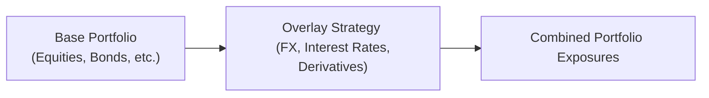

## Introduction
Sometimes, everything looks fine and dandy in your core portfolio—equities are performing, bonds are generating steady coupon income, and cash reserves are in place for liquidity needs. But then you realize there's still a lingering concern about currency swings, or you notice an untapped opportunity to capture incremental returns in the derivatives market. That’s when an overlay strategy might come to the rescue.

Overlay implementation involves managing and adjusting exposures—often in currencies, interest rates, or other derivative instruments—on top of the core portfolio. It’s like adding a layer of protective gear, or sometimes an adventurous extra topping, on an otherwise straightforward meal. As we dive into risk-return considerations, let’s walk through how overlays can influence the portfolio’s volatility, drawdowns, and potential upside.

## Basic Concept of Overlay Strategies
Overlay strategies generally have two broad objectives: (1) reduce downside risk (hedging) and/or (2) enhance returns (alpha generation). In Chapter 10.1, we introduced derivatives as a tool for risk control. Overlays often use similar derivative instruments—like futures, options, or swaps—to alter the overall exposure to market factors without changing the underlying portfolio positions.

Think of the base portfolio as having its own risk and return characteristics. Then the overlay is an add-on, using notional exposures that might be large relative to the cash invested. This can be done with minimal upfront cash, yet it influences the portfolio’s total risk and return.

A well-designed overlay might hedge some or all the foreign exchange (FX) exposure for an equity portfolio denominated in multiple currencies—cutting down on volatility from exchange rate movements. Alternatively, a manager might deploy an overlay to exploit short-term mispricings in interest rate futures, expecting a modest alpha above the benchmark.

## Changing the Risk-Return Profile
Overlay strategies can alter risk profiles significantly. If you have a skillful manager, it might look like “free” alpha. But keep in mind, everything has a trade-off in capital markets. Overlays can:

• Increase or decrease standard deviation of returns.  
• Impact maximum drawdowns during market turbulence.  
• Potentially add leverage if the notional exposure of the overlay is large.

### Small Example
Let’s say you run a $100 million portfolio generating a 6% expected return with an annualized volatility of 8%. You add a currency overlay strategy expected to earn 1% additional return with 2% additional volatility—low correlation to the core. If correlation is near zero, the combined portfolio might see incremental gains on average but with only a moderate bump in volatility. However, if correlation spikes (especially during market stress), the combined portfolio’s volatility can surge more than anticipated.

We can illustrate net returns mathematically in KaTeX:


R_\text{Combined} = R_\text{Base} + R_\text{Overlay}.


Of course, the volatility and correlation are crucial in deciding whether that sum truly delivers net gains or simply piles on more risk.

## Key Risk Metrics for Overlays
Because overlays use derivatives, risk assessment often requires more robust tools. Traditional tools like standard deviation and beta may not capture tail risk or sudden jumps in market variables. Here is where advanced metrics come in:

- **Value at Risk (VaR)**: This provides a probabilistic estimate of potential losses at a given confidence level over a specific horizon. Overlay managers consider VaR to gauge how currency or rate moves could impair portfolio value.  
- **Expected Shortfall (ES) or Conditional VaR**: More stringent than VaR, ES looks at the average loss when the portfolio loss exceeds the VaR threshold. This is especially important for derivatives that can have asymmetric payoffs.  
- **Stress Tests**: In Section 6.5 and 6.16, we discussed scenario analysis under extreme market conditions. Stress testing overlays is critical—it captures risk from large, sudden shifts in exchange rates, interest rates, or volatility regimes.

Overlay managers often conduct scenario analysis that includes:  
• Sudden large moves in currency pairs (e.g., a 10% overnight move).  
• Spikes in implied volatility.  
• Illiquidity in certain derivative instruments at roll dates.

## Gap Risk and Liquidity Considerations
One of the biggest challenges is gap risk—the possibility that prices “jump” overnight or during illiquid trading hours, bypassing multiple price levels and leaving no chance to adjust positions smoothly. This risk is especially salient for FX or interest rate overlays that trade in global markets with varying liquidity windows.

For instance, if you hold a short currency position to hedge your portfolio, an unexpected central bank announcement can propel a large overnight jump in the exchange rate. You could then wake up to outsized losses that blow through your pre-set stop strategy.

### Overlay and Liquidity Constraints
To make it more interesting (or nerve-racking), some overlay instruments—like certain over-the-counter (OTC) derivatives—may not be super liquid in stressed markets. If your overlay is set up with a forward contract that’s tough to unwind when volatility shoots up, you could face forced rollovers at unfavorable prices. That can exacerbate losses precisely when you’re trying to exit. Maintaining adequate liquidity in overlay trades is key to survival in a crisis.

## Return Enhancement via Overlays
Not all overlays are purely defensive. Some are about generating alpha. Maybe you have a viewpoint on interest rate spreads or short-term currency misalignments. Overlay managers can deploy relative-value trades—going long in one currency futures contract and short another, or using a mixture of rate swaps. When done well, these tactics can enhance the overall portfolio return.

It’s important, however, to appreciate that alpha-seeking overlays can introduce leverage. In many overlay structures, the notional value of derivatives can exceed your portfolio’s cash base. If trades go wrong, the leverage can magnify losses just as quickly as it can magnify gains.

Let’s see a simple case. Suppose your $100 million bond portfolio is expected to earn 4%. You add a currency overlay in emerging-market currencies with the goal of picking up an extra 2% annually. Because correlation is low, your risk framework suggests this might be beneficial. But if the markets turn south and you can’t unwind your emerging-market positions, you might face a double-whammy: losses in your bonds and big losses from the overlay.

## Correlation and Diversification Effects
Overlay returns can correlate strongly with the base portfolio returns—particularly during times of systemic stress. While the “numbers” might show a near-zero correlation in normal times, crises have a habit of raising correlations across previously uncorrelated assets or strategies.

High correlation between the overlay and the base portfolio means you’re not getting the diversification benefit you hoped for. If everything sells off together, your overlay might just compound overall risk rather than reduce it.

In an ideal scenario, you’d want the overlay to have a negative or low correlation with the base portfolio. For instance, a currency hedge that tends to profit when equity markets panic might balance out your equity drawdowns.

## Using Quantitative Models and Robust Scenario Analysis
A disciplined approach matters a ton for risk-return success in overlay strategies. And while managerial skill and experience are great, robust quantitative models help keep emotional biases in check. Tools include:

- **Trend-Following or Mean Reversion Models**: Automated triggers to open or close positions if the exchange rate or interest rate moves outside normal boundaries.  
- **Monte Carlo Simulations**: Generating thousands of potential market paths to evaluate how the portfolio might respond with or without an overlay.  
- **Statistical Arbitrage**: Searching for systematic patterns in currency pair movements or rate spreads.

Overlay managers must also do scenario analyses—like “What if the market moves similarly to the 2008 crisis or 2020 pandemic meltdown?” This helps them see how the overlay modifies their drawdown potential. The real trick is deciding which scenarios are most relevant for your strategy.

## Visualizing Overlay Implementation
The following simplified Mermaid diagram shows how an overlay layer interacts with a base portfolio:

With this structure, the final portfolio is no longer just the sum of stocks and bonds. It includes derivative positions that may hedge or amplify certain risk factors.

## Practical Examples and Case Study
Let’s say you manage a U.S.-based pension fund with 40% of its equity exposure in non-U.S. markets. The CFO is worried about currency risk, especially from the euro. You might set up a currency overlay for the EUR/USD exposure:

1. **Hedging Scenario**: You enter into forward contracts to sell EUR and buy USD to lock in the value of your anticipated euro-related dividends and capital gains. This reduces volatility from currency swings. However, it introduces potential opportunity cost if the euro strengthens significantly and you miss that upside.

2. **Return Enhancement Scenario**: Let’s say you believe the euro is undervalued, so you partially hedge the euro exposure or even take an unhedged overlay position. If the euro subsequently rises, you earn extra returns. Of course, if the euro collapses, you get a bigger drawdown.

A personal anecdote: I had a friend who ran a small global equity fund. She decided to go from a 50% hedge on her euro exposure to zero hedge after analyzing macro fundamentals. Well, the euro soared that quarter, and the outperformance on her fund was remarkable—investment committees applauded. But the next year, a political surprise hammered the euro. She quickly appreciated the importance of robust scenario analysis—especially when you’re leaning into an overlay for alpha.

## Best Practices and Pitfalls
- **Clear Objective**: Whether you’re hedging or seeking alpha, be precise. It’s easy to blur the two motivations and end up with a mismatched risk appetite.  
- **Leverage Constraints**: Set maximum allowable leverage levels. Overlays can get dangerously large if you’re rolling derivative contracts without strict rules.  
- **Transparent Communication**: Regularly inform stakeholders about the overlay’s exposures and potential tail risks. Overlays are less visible than the base portfolio—keeping everyone in the loop avoids surprises.  
- **Correlation Check**: Monitor correlation patterns over time, especially during stressed markets. A strategy that seemed uncorrelated in calm markets might sink when you need it most.  
- **Liquidity Management**: Include exit or roll procedures in the event of a major liquidity crunch. Large notional forward or swap positions can lock you into a corner if there’s no willing counterparty.  
- **Stress Testing**: Use historical meltdown periods (e.g., 2008, 2020) as well as hypothetical crises to see how big your drawdowns could get.

## Conclusion
Overlay strategies can be powerful tools for reshaping the risk-return profile of a portfolio. They’re especially handy if you wish to hedge currency or interest rate exposures or if you want to capture tactical alpha. However, these strategies involve sophisticated instruments and require vigilant risk controls. Gap risk, correlation shifts, and liquidity traps can turn an overlay from a prudent hedge or alpha generator into a vortex of losses.

Staying disciplined with VaR, expected shortfall metrics, and stress testing—alongside scenario analyses—helps maintain a favorable risk-return tradeoff. In practice, a combination of quantitative modeling and reasonable judgment typically yields the best outcomes. Above all, communicate your overlay strategies with stakeholders and abide by robust risk frameworks. In times of market stress, clarity can help keep an overlay from undermining the rest of the portfolio.

If you’re curious to dive deeper, the references listed below provide an outstanding foundation for exploring advanced aspects of overlay strategies.

## References
- Jorion, P. (2007). “Value at Risk: The New Benchmark for Managing Financial Risk.” McGraw-Hill.  
- Litterman, R. (2003). “Modern Investment Management: An Equilibrium Approach.” Wiley.  
- CFA Institute. (2023). “Risk–Return Dynamics in Overlay Strategies.” CFA Program Curriculum.

---

## Evaluate Your Understanding: Risk-Return Overlays Quiz



### Which of the following is a primary purpose of overlay strategies in portfolio management?
- [ ] They eliminate the need for stress tests on the base portfolio.
- [x] They can hedge existing exposures and/or generate alpha.
- [ ] They guarantee higher returns with no additional risk.
- [ ] They replace the need for currency diversification in a global portfolio.

> **Explanation:** Overlay strategies are used for hedging and alpha generation. They involve derivatives that can offset or add exposure, enhancing or controlling the risk-return profile. They do not eliminate the need for stress tests nor guarantee risk-free enhancements.

### When evaluating overlay risk, why is Expected Shortfall (ES) often preferred to VaR?
- [x] ES measures the average loss in times when VaR is breached, giving a fuller picture of tail risk.
- [ ] VaR is a more detailed metric than ES when analyzing tail events.
- [ ] ES incorporates correlation effects more accurately than VaR.
- [ ] ES is not sensitive to the magnitude of losses beyond the VaR threshold.

> **Explanation:** Expected Shortfall (Conditional VaR) captures the severity of losses beyond the VaR threshold, making it a more comprehensive measure for tail risk scenarios than VaR alone.

### A currency overlay has historically exhibited low correlation with the base equity portfolio. Which of the following best explains why this correlation might increase during a financial crisis?
- [ ] Currency exposures universally move inversely to equities in all market conditions.
- [x] Market stress often leads to a “flight to safety,” raising correlations across previously uncorrelated assets.
- [ ] Hedging currency exposures automatically lowers correlation in all environments.
- [ ] Correlations decrease in a financial crisis because investors favor derivatives.

> **Explanation:** In crises, assets that once appeared uncorrelated can suddenly become correlated due to systemic risk, liquidity shortages, and flight-to-safety behavior.

### Which of the following is the biggest concern for an overlay manager holding large overnight FX positions?
- [x] Gap risk from unexpected market-moving events.
- [ ] Positive correlation that leads to diversification benefits.
- [ ] Prohibitive borrowing margins.
- [ ] Constant roll gains on forward contracts.

> **Explanation:** Large overnight FX positions expose managers to gap risk, the possibility that currency prices jump significantly once markets reopen, bypassing levels where the manager could have taken action.

### In an alpha-seeking overlay strategy using derivatives, which of the following tactics could be employed?
- [x] Exploiting interest rate differentials through relative value trades.
- [ ] Holding only cash positions in foreign currencies without derivatives.
- [x] Adopting short-term tactical positions in currency pairs believed to be undervalued.
- [ ] Purchasing physical assets in a foreign country.

> **Explanation:** Alpha-seeking overlay strategies often involve trading derivatives, such as futures, forwards, or swaps, to exploit perceived mispricings in currencies or interest rates. Buying physical foreign assets is not typically classified as an overlay approach.

### Why might an overlay using less liquid OTC derivatives pose a problem in stressed markets?
- [x] Exiting or rolling positions could become difficult or costly in illiquid conditions.
- [ ] OTC contracts always increase portfolio diversification in stressed markets.
- [ ] The margin requirements become substantially lower in a crisis.
- [ ] OTC contracts are guaranteed by central clearing parties.

> **Explanation:** In stressed markets, less liquid OTC derivatives can be hard to exit or roll over at reasonable prices, leading to deeper losses or stuck positions. OTC contracts often don’t have the same liquidity or clearing mechanisms as exchange-traded contracts.

### Which best describes a disciplined, quantitative overlay approach?
- [x] Using statistical models and defined rules for opening, closing, or adjusting positions.
- [ ] Relying solely on a hunch or gut feeling about currency direction changes.
- [x] Incorporating scenario analyses that stress test potential outcomes.
- [ ] Avoiding any data-driven methods in favor of discretionary calls.

> **Explanation:** A disciplined, quantitative approach to overlays typically automates entry/exit decisions, relies on comprehensive modeling, and runs scenario analyses to manage risk.

### How can stress testing help manage overlay risks?
- [x] By simulating extreme market movements and revealing potential large drawdowns.
- [ ] By guaranteeing mitigation of all losses.
- [ ] By ensuring correlation remains constant during turmoil.
- [ ] By identifying the best performing asset in normal market conditions.

> **Explanation:** Stress tests simulate historically or hypothetically extreme scenarios, revealing how overlays might behave in crisis. They don’t guarantee prevention of losses but provide insights into potential vulnerabilities.

### An investor adds a short currency overlay, expecting the euro to weaken. What is the immediate risk if the euro instead appreciates dramatically?
- [x] The manager suffers potentially large losses on the short currency position.
- [ ] The manager earns extra return from the strengthening euro.
- [ ] All overlay losses are offset by the base portfolio gains.
- [ ] The position transitions into a long position automatically.

> **Explanation:** When the currency moves opposite to the manager’s position (e.g., euro appreciates sharply while you’re short), it can lead to significant losses in the overlay.

### In portfolio overlays, a high correlation between overlay returns and the base portfolio returns is generally:
- [x] Undesirable for diversification purposes.
- [ ] Recommended to ensure perfect hedging efficiency.
- [ ] The primary driver of alpha generation.
- [ ] Required to meet regulatory constraints.

> **Explanation:** When an overlay is significantly correlated with the base portfolio, it does not enhance diversification or provide strong hedging benefits. In extreme markets, this correlation can exacerbate drawdowns rather than mitigate them.


