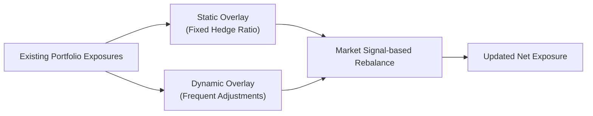

## Introduction

Have you ever heard a story of someone putting on a currency hedge at the start of the year—nice and neat—and then basically forgetting about it altogether? I remember a friend who did just that. They took a simple position (I'll call it a “set-it-and-please-don’t-make-me-adjust-it” approach!), went on to focus on other parts of the portfolio, and only revised that hedge once or twice during the year. That’s pretty much a classic static overlay strategy. Meanwhile, other folks I know would adjust these hedges, oh, practically every time the wind changed direction—sometimes capitalizing on short-term currency trends or interest rate shifts. It’s those more frequent, market-driven adjustments that define a dynamic overlay approach.

In this section, we dig into dynamic vs. static overlay approaches and how they can fit into your broader portfolio or currency management plan. We'll see that while static approaches are simpler, dynamic overlays can sometimes capture attractive short-term market opportunities. Of course, no free lunch: dynamic approaches often entail higher costs and may demand more sophisticated governance. Let’s unpack both models in detail.

## Defining Overlay Strategies

An overlay strategy, whether we’re talking currencies, equities, or other assets, is a layer of positions in derivatives or related instruments that adjust or hedge exposures without disturbing the underlying holdings. Portfolio managers often use overlays to:

• Hedge currency risk for international investments.  
• Adjust the duration of a fixed income portfolio without selling or buying actual bonds.  
• Modify equity factor exposures or sector weightings.  

Overlays can be used by pension funds, mutual funds, or even big corporate treasuries. The "overlay" piece simply means it’s placed on top of an existing portfolio structure.

The approach can be broadly static or dynamic—terms that describe how frequently (and why) these overlay positions get changed.

## Static Overlay: A “Set-and-Forget” Approach

Static overlay approaches are characterized by a predetermined hedge ratio or exposure target. You set the position (for instance, maybe you hedge 50% of your U.S. dollar exposure in a global equity portfolio) and only rebalance in two common scenarios:

• At regular intervals (monthly, quarterly, semi-annually).  
• When exposures drift too far from a defined corridor or threshold (e.g., more than ±5% from the target).  

Many managers prefer static overlays for their simplicity and cost-efficiency. It’s also reassuring for boards of trustees or investment committees who like predictable rules. If your overlay ratio is 50%, it stays 50% until the next official rebalancing date or if the hedge ratio drifts substantially. Some folks see it as a passive or rules-based method: you do what you said you’d do and don’t get swayed by market noise.

On the flip side, in a fast-moving market environment—think about how exchange rates can shift after a major geopolitical event—static overlays may expose you to missed opportunities. If your overlay never changes, you might reduce short-term gains or fail to protect the portfolio in sudden market downturns. Another risk is that static overlays do not adapt to interest rate differentials (the so-called “carry” element in currency hedging). Over time, ignoring these can get expensive or cause you to underperform more flexible strategies.

## Dynamic Overlay: Active Adaptation to Market Trends

When we say “dynamic,” we’re referring to overlay strategies that involve frequent (sometimes near real-time) adjustments to hedge ratios or exposures in response to:

• Market signals such as momentum or mean reversion.  
• Economic indicators—GDP forecasts, central bank policies, interest rate changes.  
• Technical triggers or manager judgment.  

This approach aims to capture short-term opportunities, reduce risk more proactively, or exploit alpha signals. Maybe you believe currency ABC is due for a mean reversion, so you reduce your hedge on that currency. Or perhaps your momentum model signals a strengthening currency—time to increase the hedge and lock in gains. Dynamic overlays are often based on specific quantitative models—like momentum or carry trades. Alternatively, a discretionary manager might simply hold strong views and shift the exposures in line with daily or weekly market developments.

However, as you might guess, dynamic overlays require more resources. You need sophisticated modeling capability, real-time market data, and an execution team that can handle potentially higher trading volumes. Transaction costs can eat into returns quickly, so the onus is on the portfolio manager to demonstrate that the added turnover is justified by improved performance or better risk control.

## Diagram: Static vs. Dynamic Overlay Flow

Here’s a simple flowchart illustrating how static and dynamic approaches might compare at a high level:

In a static overlay, you’d see a "Periodic Rebalance" step, while a dynamic approach incorporates "Market Signal-based Rebalance" to reflect near-term forecasts or signals.

## Governance and Pre-Approved Models

Dynamic approaches come with governance challenges. For instance, a pension fund might require strict guidelines around the parameters of a dynamic overlay strategy. They could insist on:

• Pre-approved quantitative models: e.g., "We allow a momentum model with lookback of 90 days and a carry trade with a maximum notional of 10% of portfolio assets."  
• Clearly defined risk limits: e.g., "We can’t exceed ±7% from the strategic hedge ratio in any single currency."  
• Reporting and compliance checks: e.g., "We must track the performance of dynamic overlays relative to a static benchmark and review it quarterly."

Sometimes, managers combine discretionary judgments with model outputs. For instance, they might rely on a system that flags potential trades if interest rate differentials or exchange rates breach a threshold. Then, a human manager decides whether these trades make sense based on macroeconomic or policy conditions. This is a fairly common practice but demands thorough documentation and compliance oversight.

## Evaluating Performance and Benchmarking

Measuring the value that a dynamic overlay adds (or subtracts) often involves comparing your results to an equivalent static hedge. In other words, the static hedge is your baseline, or “benchmark.” If your dynamic approach outperforms (after costs) over time, you know it has created some active alpha. If it consistently lags, that’s a red flag that your models or assumptions need revisiting—or maybe a simpler static approach is just as good.

Attempt to compare risk metrics, too. Suppose you discover that the dynamic overlay has a similar return but lower volatility relative to the static approach. That can be valuable for risk-averse clients or for meeting certain liability constraints.

## Hybrid Overlay Structures

You can probably guess that a pure static approach might feel too rigid for some environments, while a fully dynamic approach can get expensive and complex. That’s why many managers adopt a hybrid approach. For instance:

• Base Hedge Ratio: Start with a 50% static hedge.  
• Dynamic Tilt: Permit a ±10% variation from that 50% baseline.  

The manager can tactically move the hedge from 40% to 60% if they have near-term conviction about currency strength or weakness. But they never go so far as to unhedge fully or overhedge drastically beyond the established corridor. This can be more cost-effective than an open-ended dynamic overlay, and it imposes a measure of discipline that committees often like. Think of it as having some room for maneuver without swinging for the fences on every minor blip in the market.

## Practical Example: Static vs. Dynamic Implementation

Imagine a global equity portfolio invested 50% in domestic currency and 50% in foreign currency. The manager must decide how to handle the foreign currency exposure. Let’s walk through how each overlay approach might respond:

• Static Overlay:  
  - Decide on a 50% hedge ratio.  
  - Rebalance once a month to ensure the hedge ratio is roughly 50%.  
  - If market movements cause the foreign currency exposure to deviate to 45% or 55%, you reset it to 50% on the next scheduled rebalancing date.  

• Dynamic Overlay:  
  - Use a simple momentum signal: If the foreign currency has shown upward momentum over the past 30 days, you reduce the hedge ratio to 30% to maintain more exposure to potential gains. If momentum turns negative, you increase the hedge ratio to 70%.  
  - Rebalance as often as the model signals a change (maybe every week or even daily).  
  - Factor in transaction costs and ongoing model calibration.  

**Outcome:** In certain trending market environments, a dynamic approach might produce higher returns if momentum signals are reliable. However, if the momentum predictions falter and you incur repeated small losses and trading costs, the static approach might be preferable with its lower overhead.

## Common Pitfalls and Challenges

• Overtrading: Dynamic strategies can rack up excessive costs if you respond to noise rather than real signals.  
• Model Risk: Relying on flawed or outdated models can destroy value quickly if parameters are not recalibrated.  
• Governance Overload: Investment committees may hesitate to grant broad discretion for dynamic overlays without enough checks and balances.  
• Psychological Biases: A manager might become overconfident after a few correct calls and ramp up dynamic bets beyond prudent levels.  
• Liquidity Constraints: Overlays involve derivatives. Although major currency markets are typically liquid, meltdown conditions can impair liquidity and widen bid-ask spreads.

## Risk Management Considerations

Overlay strategies, whether static or dynamic, introduce an additional layer of complexity. Always consider:

• Counterparty Risk: Make sure your swaps, forwards, or options are with reliable and well-capitalized counterparties.  
• Operational Risk: More frequent trading or complex structuring might strain back-office systems, especially with dynamic overlays.  
• Regulatory Constraints: In some jurisdictions, you may face caps on derivatives usage or additional reporting requirements.

## Best Practices and Critical Takeaways

• Align Strategy With Investment Beliefs: If you have strong short-term forecasting models and careful risk controls, a dynamic overlay may pay off. Otherwise, a low-cost static approach or a modest hybrid solution might serve you better.  
• Keep Expense Ratios Front and Center: Factor in trading costs, spread widening, and possible management fees for dynamic overlays—these can erode any outperformance.  
• Conduct Regular Performance Attribution: Compare returns, volatility, and downside risk to a static benchmark. This helps confirm whether the dynamic approach is truly adding alpha.  
• Document and Follow Strict Risk Guidelines: Use corridor widths or pre-approved models that set systematic boundaries around discretionary adjustments.  
• Combine Qualitative and Quantitative Insights: A hybrid approach might incorporate a base static hedge plus dynamic tilts informed by macro views or factor-oriented models.  

## Personal Reflection

I’ve seen clients who get enamored with the idea of capturing every currency swing. But in my experience, that can sometimes lead to whiplash—both financially and emotionally. A well-thought-out, balanced approach—particularly a hybrid ladder—provides enough flexibility to respond to big market shifts without forcing you to chase fleeting moves. If you decide to go dynamic, be sure you have the expertise and risk structure in place to manage it effectively.

## References and Further Reading

• Lo, A. (2012). “Adaptive Markets: Financial Evolution at the Speed of Thought.” Princeton University Press.  
• CFA Institute. (2022). “Dynamic vs. Static Hedging Approaches.” CFA Program Curriculum.  
• Chincarini, L. (2018). “Quantitative Equity Portfolio Management: Modern Tools and Techniques.” McGraw-Hill.  

## Final Exam Tips

1. Illustrate your understanding of static vs. dynamic overlays with real or hypothetical examples—this helps in both essay and item set questions.  
2. Be ready to demonstrate how you might measure the performance of a dynamic overlay against a static benchmark—this is a common type of exam prompt.  
3. Don’t forget to address governance: Many exam questions revolve around how to safely implement or supervise overlay strategies.  
4. If you see a question asking about costs, reference the increased turnover in dynamic strategies. Show how to weigh the potential alpha against those transaction costs.  
5. Remember that risk management is a big theme: explain how overlays can either reduce or inadvertently amplify risk.  

## Test Your Knowledge: Dynamic vs. Static Overlay Approaches



### Which of the following best characterizes a static overlay strategy?  
- [x] The hedge ratio is set at the start and changed infrequently.  
- [ ] The hedge ratio is adjusted daily based on market signals.  
- [ ] The hedge ratio uses artificial intelligence to forecast fluctuations.  
- [ ] The hedge ratio is continuously changing intraday.  

> **Explanation:** A static overlay strategy typically involves setting a fixed hedge ratio and only adjusting it periodically or when a pre-set threshold is breached.

### In a dynamic overlay strategy, what is the primary rationale for making frequent adjustments?  
- [x] To capture short-term market opportunities or risk shifts.  
- [ ] To reduce transaction costs over time.  
- [ ] To ensure full hedging of every potential risk.  
- [ ] To limit the role of forecasting and analytics.  

> **Explanation:** Dynamic overlay managers often rely on short-term signals or changing market conditions to adjust hedge ratios more frequently in hopes of improving risk-adjusted returns.

### Which of the following is a potential downside of dynamic overlay approaches compared to static strategies?  
- [ ] They are less flexible in responding to currency fluctuations.  
- [x] They can involve higher transaction costs.  
- [ ] They require fewer governance protocols.  
- [ ] They have negligible implementation complexity.  

> **Explanation:** Dynamic overlays often entail more trading activity, leading to potentially higher transaction costs and added complexity.

### A pension fund invests in an international portfolio and adopts a static currency hedge ratio of 70%. Under which condition would rebalancing most likely occur if the approach is purely static?  
- [ ] Whenever the manager feels sentiment has shifted.  
- [ ] Every time the position dips below 69%.  
- [x] At scheduled intervals or when the hedge ratio drifts outside a predefined corridor.  
- [ ] It never rebalances.  

> **Explanation:** A static approach generally follows scheduled rebalancing or corridor-based triggers, not sentiment or minor changes within normal boundaries.

### Which approach is likely to appeal most to an investor who believes strongly in short-term momentum signals for currencies?  
- [ ] A static overlay with an annual rebalance only.  
- [x] A dynamic overlay that adjusts positions frequently based on momentum readings.  
- [ ] A purely discretionary approach with no analysis.  
- [ ] An approach that does not allow currency hedging.  

> **Explanation:** Investors who trust momentum or other time-sensitive signals typically find dynamic overlays beneficial because they can respond quickly to changing market conditions.

### What is one reason governance can be more complex with dynamic overlays?  
- [ ] Fewer compliance checks are necessary.  
- [x] Stronger monitoring and pre-approved models may be required.  
- [ ] The portfolio requires less risk management oversight.  
- [ ] It results in lower turnover and simpler reporting.  

> **Explanation:** Dynamic overlays often need additional oversight to ensure compliance with risk limits and model usage.

### Which characteristic commonly distinguishes a hybrid overlay?  
- [x] A baseline static hedge with a corridor for dynamic tilts.  
- [ ] Full discretionary adjustments without any corridor.  
- [ ] Zero short-term flexibility.  
- [ ] Infinite tolerance for currency exposure drift.  

> **Explanation:** A hybrid overlay generally sets a static base (e.g., 50% hedge) and allows dynamic moves within a specified +/- corridor, balancing simplicity and responsiveness.

### In performance measurement for overlay strategies, which is the best comparison baseline for a dynamic overlay?  
- [ ] A completely unhedged portfolio.  
- [x] A static hedge ratio that represents the strategic or policy benchmark.  
- [ ] Randomly assigned hedge ratios.  
- [ ] Any actively managed equity benchmark.  

> **Explanation:** The most logical way to measure a dynamic overlay’s value is to compare it to a static hedge ratio that represents the policy baseline. This helps isolate the contribution of active overlay decisions.

### A dynamic overlay that uses a mean reversion signal will do which of the following?  
- [x] Adjust the hedge assuming currency levels revert to a long-term average.  
- [ ] Always hedge fully to eliminate risk.  
- [ ] Systematically avoid interest rate differentials.  
- [ ] Permanently lock in a single hedge ratio.  

> **Explanation:** A mean reversion overlay adjusts positions when currency rates deviate significantly from their historical or fundamental average, anticipating a snap back toward that mean.

### True or False: Transaction costs in dynamic overlays are always lower because frequent hedging locks in minimal losses.  
- [x] False  
- [ ] True  

> **Explanation:** Dynamic overlays typically entail higher turnover, which can increase transaction costs. While occasionally they may reduce smaller losses, the overall costs can still be substantial.


