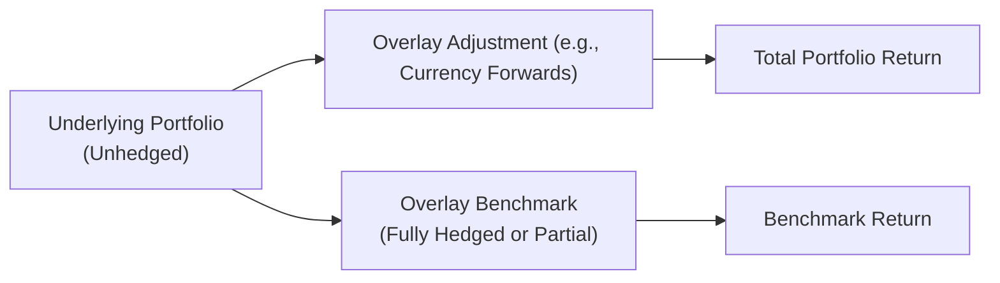
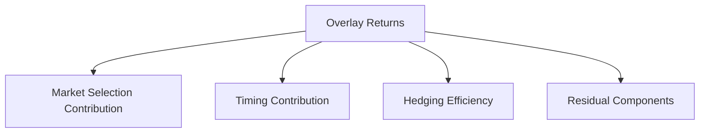

## Introduction

Benchmarking overlay performance might sound straightforward—until you realize these overlays aren’t stand-alone asset classes. They’re often layered on top of an existing portfolio, typically using derivatives or other financial instruments to manage risks (like currency or interest rate exposure) or to enhance returns (think of capturing that extra alpha). So, when we say “benchmarking,” we mean evaluating how effectively these overlay strategies contribute to (or subtract from) the main portfolio’s performance relative to some reference point.

I remember chatting with a portfolio manager friend who specialized in currency overlay. She always insisted that “the real magic is not in the overlay’s brute return, but in how well it meets the investor’s goals—whether that’s mitigating foreign exchange volatility or adding a little more oomph to the portfolio.” This notion captures the key challenge: evaluating success means tying the overlay’s results to its established objectives. Sometimes, the overlay is about hedging a certain risk at the lowest possible cost. Other times, it’s about active positioning for alpha generation.

Below, we’ll explore the fundamentals of overlay benchmarking, highlight common techniques for setting up a benchmark, and dig into performance attribution and risk-adjusted metrics. We’ll also share a few practical tips and real-world examples to clarify how this works in practice—so that by the end, you’ll have a pretty good sense of how to tackle this for your own or a client’s portfolio.

## Rationale for Overlay Benchmarks

One aspect that confuses many folks is the need for a separate benchmark in the first place. If you already have a main portfolio benchmark—like the S&P 500 for equities or a blended global bond index—why not just use that?

The problem is that an overlay typically modifies risk exposures without altering the underlying holdings. It doesn’t make sense to judge a currency overlay manager by how well the S&P 500 performed because the overlay’s scope is, well, currency. Instead, you need a benchmark that isolates the value-added (or cost) of hedging or speculating in the currency markets. Hence, the role of a specialized overlay benchmark.

An overlay benchmark answers the question: “What if I had done none of this fancy stuff?” By comparing actual overlay results to a baseline scenario—often a no-hedge or fully hedged reference—investors can see whether the overlay meets performance or risk objectives.

## Types of Overlay Benchmarks

Overlay benchmarks come in many flavors, each serving different objectives. Below are some of the most common approaches you might encounter:

• No Overlay Scenario (Unhedged Benchmark):  
  This scenario imagines that you didn’t implement an overlay at all. For instance, if you hold international equities, the unhedged benchmark might reflect the performance of those equities with zero currency hedging. By comparing your actual overlay results to this hypothetical scenario, you can assess whether your hedging strategies improved overall outcomes or not.

• Fully Hedged Benchmark:  
  Here, we assume 100% currency or interest rate hedging, whichever is relevant. The purpose is to see how a strategy that consistently neutralizes the currency or interest rate exposure compares to the actual overlay’s partial or dynamic hedging approach.

• Synthetic Overlay Benchmark:  
  Some managers might construct a custom reference—like a 50% hedged currency position or a systematic rules-based derivative overlay. This “synthetic” approach can be quite useful if your overlay strategy is designed to maintain some target hedge ratio while occasionally deviating based on market signals.

• Market or Factor Index:  
  In some advanced cases—especially if your overlay is designed to capture factor betas or alpha sources—managers may compare performance to a market-based index like an FX index or interest rate swap index. This approach is common when the overlay trades a known basket of currencies or invests systematically in rate instruments.

Ultimately, the “best” benchmark depends on the overlay’s goals. If your objective is pure risk reduction, you’ll probably look at a fully hedged or unhedged reference to gauge the net effect. If your aim is to generate alpha, you might prefer an index or a synthetic reference that reflects typical or systematic exposures in the relevant derivatives markets.

## Constructing an Overlay Benchmark

Setting up a robust overlay benchmark is both an art and a science. You want the benchmark to be:

• Transparent:  
  Everyone involved—clients, portfolio managers, and oversight committees—should know how the benchmark is built.  

• Consistent with the Overlay’s Strategy:  
  If the overlay is dynamic, the benchmark should reflect some dynamic or systematic approach, or at least be a stable reference that fairly highlights deviations.  

• Feasible to Replicate:  
  The reference should be something that can be implemented or tracked in real life without imposing unrealistic transaction costs or liquidity concerns.

As an example, consider a currency overlay aimed at hedging exposure in a global equity portfolio. If the manager typically adjusts hedges monthly based on certain macroeconomic signals, the benchmark could be a static 50% hedge ratio (or perhaps 100% hedge ratio) that’s rebalanced monthly. This gives you a stable baseline while still recognizing the periodic adjustments in real life.

To illustrate how an overlay benchmark might fit into the total portfolio, let’s look at a simple Mermaid diagram:

In this diagram, the “Overlay Adjustment” modifies the underlying portfolio’s exposures, resulting in the total portfolio return. Meanwhile, the Overlay Benchmark compares your chosen approach (e.g., partial hedge, dynamic hedge) against a consistent reference.

## Calculating Overlay Returns

Once your benchmark is in place, you need to calculate the overlay’s contribution. Essentially, you’re measuring:

$$
R_{\text{overlay}} = \frac{\left( V_{\text{Portfolio with Overlay}} - V_{\text{No Overlay}} \right)}{V_{\text{Base}}}
$$

• \\(V_{\text{Portfolio with Overlay}}\\) is the value of the total portfolio after the overlay strategy.  
• \\(V_{\text{No Overlay}}\\) is the hypothetical value of the portfolio if the overlay hadn’t been implemented.  
• \\(V_{\text{Base}}\\) is typically the initial portfolio value or a relevant notional figure.

Because overlays often require little capital (they’re typically derivative-based), the ratio might be scaled by notional amounts of the exposure hedged or some other reference. One of the biggest pitfalls I’ve seen is managers using inconsistent denominators, leading to confusion about what “excess return” truly means.

## Performance Attribution

Overlay performance doesn’t just magically appear; it usually stems from a few distinct sources you can analyze in a standard attribution framework:

• Market Selection:  
  Did the manager choose the “right” currencies or interest rates to hedge or go long/short on?

• Timing:  
  Even if a manager picks the correct markets to trade, the question is: did they do it at the right time?  

• Hedging Efficiency:  
  This is the measure of how well the overlay mitigates unwanted risk relative to its cost, which can be especially important when the overlay’s primary objective is risk reduction.

• Residual Components:  
  Transaction costs, financing costs, or slippage can all eat into returns.  
 
You can perform an attribution analysis that isolates each factor—very much like you’d do for active equity managers. For instance, you might see that half the overlay alpha came from prudent currency selection between USD and EUR, while the other half was from well-timed trades captured during certain macroeconomic announcements.

In advanced analytics, you might break out contributions by time period, or run a factor regression to see how much of the overlay’s return correlates to systematic risk factors (e.g., carry trade factor, momentum factor in currencies, etc.). This becomes especially relevant when you want to confirm whether the manager is truly generating alpha beyond these known, replicable risk premia.

## Risk-Adjusted Performance Measures

Sure, you can celebrate an overlay manager who generated a “positive 100 basis points” of overlay alpha, but not if they took a massive amount of risk to get there. That’s where risk-adjusted measures come in. Popular metrics include:

• Information Ratio (IR):  
  IR is the overlay’s excess return over the benchmark divided by the tracking error (standard deviation of the excess return). A higher IR indicates you’re extracting more return per unit of risk.  

• Sharpe Ratio (for Overlays):  
  Although typically used for entire portfolios, the Sharpe ratio can be adapted to measure the overlay’s return relative to the risk-free rate, scaled by volatility.  

• Sortino Ratio or Other Downside-Focused Measures:  
  Overlays designed primarily for hedging might place greater emphasis on downside risk metrics.

Remember, overlays are usually meant to *reduce* risk or shift risk differently, so the manager’s best “performance” might be in delivering lower volatility or narrower drawdowns, not necessarily the highest return. In these cases, you might measure effect on Value-at-Risk (VaR) or other tail risk metrics to see if the overlay stabilized outcomes.

## Practical Example: Currency Overlay in an International Equity Portfolio

Let’s consider a scenario:  
- You have a global equity portfolio (50% US stocks, 30% European stocks, 20% Japanese stocks).  
- You decide to implement a currency overlay to manage foreign exchange exposure to EUR and JPY.  
- Your overlay manager chooses which parts to hedge, when to increase or decrease hedge ratios, and occasionally even makes directional bets.

What’s your benchmark?  

• No Overlay: This would be the performance of the global equity portfolio with all that inherent FX risk.  
• Fully Hedged: A second reference might be 100% hedging for EUR and JPY exposures, rebalanced monthly.  

Your overlay might perform better than “No Overlay” during times of extreme currency volatility (such as Brexit or unexpected central bank announcements). But how does it fare against the “Fully Hedged” scenario? If it’s consistently beating that scenario with less-than-full hedge (or with active bets), you know the manager is adding skill-based alpha, not just accidently skating by on the currency lottery.

Another key detail is transaction costs. Let’s say the overlay manager trades currency forwards frequently. Those costs can reduce net gains, so you’ll want to track how effectively they balance the shield from volatility against these added expenses. It’s similar to how an active equity manager might weigh frequent turnover costs against the potential for alpha.

## Transparency and Disclosure

Because overlay strategies can be more exotic or less transparent than, say, buying a basket of stocks, it’s essential to maintain clear documentation. If I had a dollar for every time an investor was confused about how their overlay manager calculated returns or reported hedging ratios, well…I would probably reinvest it into my own portfolio.  

Investors should expect (and require) detailed explanations of:

• How the overlay benchmark is constructed.  
• Any custom or non-standard calculations.  
• The rationale for changes in hedge ratios or derivative trades.  
• The method of attributing overlay returns to specific sources.  

Open communication fosters trust. Plus, clients tend to appreciate well-laid-out references to “No Overlay” or “Fully Hedged” scenarios because it clarifies exactly what the manager did.

## Common Pitfalls

• Inappropriate Benchmark Choice:  
  A dynamic overlay pegged to a static benchmark might under- or overstate skill.  

• Opaque Calculations:  
  Overlays might involve numerous derivatives with different maturities, margin requirements, and implied financing costs. Without consistent, transparent accounting, results can look better or worse than they truly are.  

• Ignoring Hedging Costs:  
  Managers sometimes gloss over the effect of hedging costs. This might artificially inflate perceived returns.  

• Misalignment of Objectives and Evaluation:  
  If the overlay’s objective is purely risk reduction, focusing on raw outperformance might lead you astray.  

• Short Testing Periods:  
  Overlays can fluctuate widely depending on macroeconomic conditions. Evaluating them over a too-short window can be misleading.

## Best Practices for Overlay Benchmarking

• Align the Benchmark with the Overlay’s Objective:  
  If you’re aiming for risk reduction, compare volatility and drawdowns to an unhedged baseline. If you’re going for alpha, consider a fully hedged or factor-based reference.  

• Use Multiple References:  
  It’s often helpful to see how the overlay stacks up against more than one benchmark. This can highlight different dimensions of performance.  

• Incorporate Risk-Adjusted Metrics:  
  Don’t just look at absolute returns; see if the overlay is achieving the desired objective without incurring excessive risk.  

• Employ Transparent Attribution Tools:  
  Break out sources of overlay returns to see where skill truly lies.  

• Document and Disclose Methodologies:  
  Ensure that changes in hedge ratios and the subsequent calculations are always explained.

## Exam Tips for CFA Candidates

For exam-style questions, especially in scenario-based or constructed-response formats, expect to:

- Evaluate whether the overlay benchmark is appropriate for the manager's stated mandate.  
- Calculate overlay returns using hypothetical performance data and identify if the overlay added or detracted value.  
- Perform or interpret basic attribution for market selection, timing, and hedging efficiency.  
- Propose a risk-adjusted measure (like the IR) for the overlay.  
- Identify potential pitfalls (e.g., misalignment between objectives and benchmark choice).  
- Suggest improvements (e.g., a different reference or an additional risk metric).

A common pitfall in exam scenarios is to overlook the costs or the capital that’s tied up in maintaining derivative positions. Make sure you properly include any financing or rollover costs in your calculations, as these might show up in item sets that discuss currency forwards or interest rate swaps.

And watch the time management: if an essay question (constructed response) asks you to compare multiple overlay benchmarks, be concise yet thorough. Annotate the logic behind each one. The exam graders want clarity, not fluff.  

## References

- Grinold, R. C., & Kahn, R. N. (2000). Active Portfolio Management: A Quantitative Approach for Providing Superior Returns and Controlling Risk. McGraw-Hill.  
- CFA Institute. (2023). Benchmark Design for Overlay Strategies. CFA Program Curriculum.  
- Frino, A., & Gallagher, D. (2001). “Tracking S&P 500 Index Funds.” Journal of Portfolio Management.  

---

## Test Your Knowledge: Benchmarking Overlay Performance Quiz



### Which of the following best describes a “no overlay” scenario in the context of benchmarking overlay performance?

- [ ] A scenario in which the portfolio is fully hedged at all times  
- [x] A hypothetical situation where no derivatives-based overlay is applied  
- [ ] A reference that assumes partial hedging of currency exposure  
- [ ] A synthetic index measuring active currency management  

> **Explanation:** A “no overlay” scenario is the baseline case with no derivatives-based hedging or speculative positions, allowing us to measure the impact of the overlay strategy by comparing actual results against this unhedged reference.

### An investor wants to evaluate a currency overlay manager focused on alpha generation. Which benchmark might be most appropriate?

- [ ] A global equity index   
- [ ] A purely unhedged portfolio index  
- [x] A fully hedged currency benchmark or FX index  
- [ ] A bond aggregate index  

> **Explanation:** If the objective is alpha generation, a fully hedged or FX index is more suitable as it isolates the performance contribution from currency management. A global equity index or bond aggregate doesn’t isolate the currency component, leading to misaligned comparisons.

### When breaking down overlay returns into source components, which of the following is NOT typically included in basic overlay attribution?

- [ ] Market selection  
- [ ] Timing  
- [ ] Hedging efficiency  
- [x] Valuation of underlying stocks in the portfolio  

> **Explanation:** Overlay attribution isolates the performance arising from derivative hedges or trades. Valuation of underlying stocks pertains to the core portfolio, not the overlay strategy.

### Which metric specifically measures the excess return per unit of active risk?

- [ ] Sharpe Ratio  
- [ ] Sortino Ratio  
- [x] Information Ratio  
- [ ] Tracking Error  

> **Explanation:** The Information Ratio (IR) is calculated by dividing the active return over a benchmark by the tracking error, thus providing a risk-adjusted performance measure for active management.

### What is the primary function of a synthetic overlay benchmark?

- [x] To represent a systematic or rules-based hedged position that aligns with the overlay strategy  
- [ ] To mirror the performance of the original equity/bond index exactly  
- [ ] To eliminate all forms of currency exposure  
- [ ] To replicate the performance of an entirely different asset class  

> **Explanation:** A synthetic overlay benchmark is typically constructed to reflect the systematic or rules-based approach used by the overlay program, providing a relevant “apples-to-apples” point of comparison.

### If a currency overlay increases tracking error while marginally improving returns, which risk-adjusted metric could illuminate whether the extra risk is justified?

- [x] Information Ratio  
- [ ] Fully Hedged Return  
- [ ] Sharpe Ratio of the underlying index  
- [ ] Sortino Ratio with respect to the main equity benchmark  

> **Explanation:** The Information Ratio (IR) focuses on performance relative to a benchmark, scaled by tracking error. It’s ideal for seeing if the added volatility is compensated by sufficient excess return.

### In evaluating a currency overlay, which of the following outcomes would imply high hedging efficiency?

- [x] The overlay successfully reduces portfolio volatility at a relatively low cost  
- [ ] The overlay achieves the exact same return as an unhedged portfolio  
- [ ] The overlay invests in speculative currency positions without changing total risk  
- [ ] The overlay’s net effect on volatility is unclear from the data  

> **Explanation:** Hedging efficiency implies that the overlay meaningfully cuts risk (e.g., reduces currency volatility) relative to its cost. That’s the hallmark of efficient hedging.

### Why might an overlay manager’s best “performance” be demonstrated by a reduction in volatility rather than an increase in returns?

- [ ] Because currency hedges always reduce portfolio returns  
- [x] Because the overlay’s primary objective might be risk mitigation, not return enhancement  
- [ ] Because performance is commonly measured without regard to risk  
- [ ] Because overlay managers do not track returns at all  

> **Explanation:** Many overlay strategies are employed to reduce unwanted risk (e.g., currency volatility). In such cases, the manager’s “success” is measured more by stabilizing returns than by maximizing them.

### A portfolio manager uses a currency overlay that is rebalanced monthly. In constructing a relevant benchmark, which approach best captures the manager’s process?

- [ ] A static 100% hedge that never changes  
- [ ] A randomly assigned hedge ratio  
- [x] A synthetic benchmark that maintains a systematic hedge ratio, rebalanced monthly  
- [ ] No benchmark is needed since it is a derivative-based strategy  

> **Explanation:** A synthetic benchmark that’s periodically rebalanced to match the manager’s rebalancing schedule best reflects the manager’s dynamic hedging process, allowing fair evaluation of active decisions.

### True or False: In overlay strategies, consistent disclosure of methodologies and assumptions is far less important than in traditional asset management.

- [x] False
- [ ] True  

> **Explanation:** Overlay strategies often involve derivative instruments and customized calculations. Clear disclosure of all methodologies, assumptions, and cost factors is crucial for transparent evaluation, sometimes even more so than in traditional asset management.




