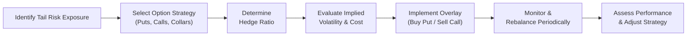

## Introduction and Overview

Tail risk is a concept that most portfolio managers occasionally whisper about in hushed tones—those rare but severe “black swan” events that can cause catastrophic losses. Essentially, it’s the risk of a market move so big that it lives out in the far edges (or “tails”) of the distribution curve for returns. It’s a bit like that uninvited guest at a party who happens to knock down all the expensive china. Unexpected and very inconvenient.

In practice, tail risk means large market losses can occur with low probability, but with such high severity that standard risk models (like normal distributions) may underestimate their impact. For instance, I once saw a market meltdown that happened so fast even the supposedly conservative managers were scrambling to figure out if their protective measures were sufficient. It’s moments like these—when your heart is pounding—that you really appreciate having a systematic plan to handle extreme scenarios. A well-structured option-based overlay strategy can help keep us calm when everything seems to be going haywire.

Below, we explore how to use option-based overlays for tail risk protection. We’ll dig into protective puts, covered calls, collars, calendar spreads, partial hedges, deep out-of-the-money (OTM) options, and the tricky world of implied volatility. We’ll also walk through hypothetical examples, highlight practical considerations, and talk about how these overlays fit into the bigger picture of cross-asset volatility trading (see also reference to “Chapter 3: Portfolio Risk and Return – Part II” on systematic vs. nonsystematic risk and “Chapter 10: Portfolio Overlays and Currency Management” for deeper insights into multi-currency exposures). Let’s dive in.

## Understanding Tail Risk and the Role of Option-Based Overlays

Tail risk refers to the probability of large unforeseen losses, usually beyond three standard deviations from the mean in a distribution of returns. While there’s a *statistical* aspect to tail risk, it’s also partly driven by investor psychology (see “Chapter 5: The Behavioral Biases of Individuals” for how panic can amplify extreme moves). The function of an option-based overlay is to mitigate these outlier losses by holding instruments that pay off if markets drop drastically—or if volatility skyrockets.

### Why Options?

Options can be structured to provide asymmetric payoffs. With a protective put, you pay a known premium to lock in some security against large drawdowns. If the market collapses, the long put helps recoup losses. If the market remains stable or even rallies, you only forfeit the option premium. This asymmetry is extremely useful because it sets a floor under your portfolio, which is why it’s often referred to as “portfolio insurance.”

In my experience, folks either love or hate paying option premiums—sometimes it feels like paying for an umbrella on a sunny day. But, as we’ll see, there are ways to offset the cost through covered calls, combining strategies (like collars), or using partial hedges. The main takeaway is that an option-based tail risk overlay can help you sleep better at night when the catastrophic headlines start piling up.

## Common Option-Based Tail Risk Strategies

### Protective Puts

A protective put is purchased while holding a corresponding underlying asset. This represents the simplest form of a tail risk hedge:  
• You own a stock (or portfolio).  
• You buy a put option with some strike price below the current market.  

If the market plummets below that strike, your put’s payoff offsets some (or all) of your losses. The downside is that you pay a premium for the put, which can be expensive, especially when volatility is high.

In formulaic terms, the payoff of a protective put at expiration is:

\\( \text{Portfolio Value} = S_T + \max(K - S_T, 0) - P \\)

Where:

- \\( S_T \\) = value of the underlying at maturity.  
- \\( K \\) = strike price of the put.  
- \\( \max(K - S_T, 0) \\) = payoff of the put option.  
- \\( P \\) = the premium paid for the put.

Essentially, you end up with a synthetically risk-limited position, capping the maximum loss to \\( (S_0 - K) + P \\) (ignoring carrying costs, interest, etc.). This ensures you have a floor on your losses.

### Covered Calls

If you’d like to generate income to help offset the cost of a protective put, you might consider writing a call on the same underlying asset. A covered call works like this:  
• You own the stock.  
• You sell (or write) a call option at a given strike price.  

If the market rallies above that strike, you must deliver the underlying at the strike price. In effect, you earn the premium for the sold call but forgo any additional upside beyond the strike. This strategy can be used to finance the purchase of a put or at least reduce the net cost—though it also limits gains.

### Collars

A collar strategy combines the protective put and covered call:

• Buy a put at strike \\(K_p\\).  
• Write a call at strike \\(K_c\\).  

Your net cash flow is the difference between what you pay for the put and what you receive for the sold call. Implausible as it sounds, sometimes you can build a “zero-cost collar” if implied volatilities align favorably—effectively hedging your downside *without* an out-of-pocket premium (though you still lose upside beyond \\(K_c\\)).

Informally, it’s like wearing both a seatbelt and a helmet: you’re protected below a certain level, but you also limit your maximum potential upside. This is a common strategy for those who really want to manage risk while controlling expenses.

### Calendar Spreads and Diagonal Spreads

Calendar spreads involve buying and selling options with different expirations (and sometimes different strikes, in which case they’re diagonal spreads). The aim here might be to “roll” your tail risk hedge to match the time frames when you believe the market is most exposed. If done systematically, you might reduce your option costs because shorter-dated options can be cheaper (though they require frequent re-hedging).

For instance, let’s say you anticipate a major potential meltdown in six months. You might buy a longer-dated put but simultaneously write a shorter-dated option to earn premium over time. If properly timed, this can reduce the overall cost of your hedge. However, if the meltdown arrives earlier than anticipated, your sold option might create additional losses. So, the calendar spread requires careful planning and monitoring.

### Partial Hedging and Ratio Approaches

Hedging 100% of your exposure is expensive, and sometimes you only want to mitigate the truly disastrous outcomes. In that case, you might choose to only hedge a portion of your exposure. For instance:

• Hedge 50% of the portfolio using deep OTM puts.  
• Maintain the rest unhedged.  

So if the market sells off by 20%, your unhedged portion suffers but your hedged portion is protected beyond a certain threshold. The ratio approach can deliver a cost-effective middle ground: it’s not as expensive, but it still provides some tail event relief.

### Deep Out-of-the-Money (OTM) Options

Some managers buy deep OTM puts because they cost less in absolute premium terms than near-the-money puts. The rationale is, “I don’t need coverage for a small drop; I only want coverage if it’s truly catastrophic.” For example, a major meltdown might be triggered by a global liquidity crisis, a currency peg break, or geopolitical shock. If that meltdown does occur, these cheap deep OTM puts might end up paying off big time. But if the market is only mildly choppy, you lose the premium with minimal offset.

---

## Monitoring Implied Volatility (IV) and Timing Considerations

Option prices reflect, among other things, the market’s perceived volatility of the underlying—commonly called implied volatility (IV). Protecting tail risk is typically most cost-effective when implied volatility is low. However, as markets get jittery, IV spikes, and option premiums become expensive—like trying to buy insurance once a hurricane is already on the horizon.

I think one of the biggest pitfalls is ignoring the “volatility-of-volatility”: sometimes, those times you need tail risk the most are exactly the times it’s priced out of reach. Best practice might be to adopt a systematic approach, layering on a portion of your hedge when volatility is calm. Then you can incrementally add or reduce based on market conditions. Keep in mind that while you’re reading signals from the volatility markets, other asset classes in your portfolio will have shifting exposure to volatility as well—especially if you hold convertible bonds, structured notes, or other derivative-laden instruments.

## Cross-Effects on Portfolio Volatility

Using options to protect tail risk can also have side effects on your portfolio’s volatility profile. For instance:

• If you’re writing calls (see the collar), you may reduce your net delta exposure to equity rallies.  
• If volatility spikes, your protective puts gain in value, but it might also lead to other positions in your portfolio losing liquidity or dropping in price for reasons unrelated to the broad market.  

Moreover, if you engage in volatility trading (like using VIX futures or volatility swaps), you want to ensure that you’re aligned across your entire book. Sometimes, managers inadvertently double-hedge or end up neutralizing the benefits of their option overlay. Thorough scenario analysis and stress testing (check out “Chapter 6: Introduction to Risk Management” on robust stress-testing frameworks) can help ensure you’re not overpaying or inadvertently amplifying risk.

---

## Practical Implementation Insights

### Cost-Benefit Analysis

Before implementing any tail-risk overlay, it’s essential to evaluate how much you’re willing to spend on protection. A protective put is analogous to an insurance policy: you pay a premium hoping never to use it, but you’re glad it’s there if disaster strikes. The general formula for “Expected Cost of Hedging” might look like:

\\( \text{Expected Cost} \approx P \times \text{Probability(No Large Drawdown)} - \text{Payoff} \times \text{Probability(Extreme Drawdown)} \\)

Of course, real markets are more complex, but this basic formula is a good conceptual start. The “probability of extreme drawdown” is not easy to estimate, but historical scenario analyses and forward-looking stress tests can guide your assumptions.

### Frequency of Rebalancing

Option-based hedges need periodic rebalancing, especially if you’re employing short-dated options or ratio spreads. Market moves can cause your option deltas to shift too (known as gamma exposure). If you’re unprepared, a dynamic rebalancing strategy might result in additional transaction costs. Some managers prefer a static overlay (e.g., buy a 6-12 month put and let it run), while others use more dynamic approaches such as rolling 1-month or 2-week puts. The latter can be more flexible but also more labor-intensive and potentially more expensive from frequent frictional costs.

### Market Conditions and Sentiment

Tail risk overlays are most commonly employed when market participants sense an unusual risk of meltdown, or when implied volatility is deemed relatively low. Although an intuitive approach is “buy tail risk when you think something big is coming,” that often leads to paying top dollar for options when fear is already in the market. A contrarian strategy might purchase protection when everything seems calm—although that unavoidably reduces your net returns in periods of normal volatility because you keep paying premiums.

### Hedging Global Exposures

Tail risk extends beyond just equity markets. Currency exposures can blow up if there’s a sudden devaluation or a regime shift (see “Chapter 10.2 Currency Risk and Hedging Techniques”). You can buy currency puts to protect from a depreciating exchange rate or combine them with calls to form currency collars. For example, a global equity investor might hold protective puts on an international equity index denominated in foreign currency while also employing currency calls to limit exchange-rate downside.

---

## Case Study: Collar Implementation on an Equity Portfolio

Let’s walk through a simplified example to illustrate how a collar might be set up. Suppose you’re managing a $10 million equity portfolio that tracks a broad index currently at 2,000 points. You’re worried about a potential 20% market drop in the next six months, but you also don’t want to pay a lot of premium.

1. You buy protective put options with a strike price of 1,800 (10% below the current index level). The cost per put is $10 per contract, each contract representing 100 shares. You purchase enough contracts to cover your $10 million notional.

2. To offset some of this premium cost, you write covered calls with a strike price of 2,050, above the current index level. You receive $7 per contract for the calls.

3. Net cost per contract = $10 (puts) – $7 (calls) = $3. Multiply that by the number of contracts used to hedge your entire position. Let’s assume you purchased 1,000 contracts total. Your net out-of-pocket premium is $3,000 per contract × 1,000 = $3 million (this is an oversimplification, ignoring actual notional coverage, but enough for demonstration).

Now you have downside protection below 1,800. In exchange, if the index rises above 2,050, you miss out on additional gains beyond the strike. Is $3 million a fair price to pay to protect potential losses far beyond 10%? That’s the big question every portfolio manager must weigh.

---

## Diagram: Workflow of an Option-Based Overlay

Below is a Mermaid diagram summarizing how an option-based tail risk overlay might look in practice:



Each step leads into the next, illustrating the cyclical nature of planning, implementing, and maintaining the hedge over time.

---

## Brief Python Example of Monitoring Payoff

Below is a very simplistic Python snippet—imagine we’re simulating the payoff of a collar for different terminal index levels:

```python
import numpy as np
import matplotlib.pyplot as plt

S0 = 2000  # current index level
K_put = 1800
K_call = 2050
premium_put = 10
premium_call = 7
num_shares = 100  # per contract

S_range = np.arange(1000, 2501, 50)  # hypothetical range of final index
payoffs = []

for S_T in S_range:
    # Protective put payoff
    put_payoff = max(K_put - S_T, 0) - premium_put
    
    # Covered call payoff
    call_payoff = -max(S_T - K_call, 0) + premium_call
    
    # Stock payoff
    stock_payoff = (S_T - S0)
    
    total_payoff = (stock_payoff + put_payoff + call_payoff) * num_shares
    payoffs.append(total_payoff)

plt.plot(S_range, payoffs, label='Collar Payoff')
plt.axhline(0, color='red', linestyle='--')
plt.title("Collar Strategy Payoff at Expiration")
plt.xlabel("Final Index Level")
plt.ylabel("Profit (USD)")
plt.legend()
plt.show()
```

This code calculates a rough payoff for a collar strategy at various final index levels. Obviously, real usage would be more nuanced with cost-of-capital, time steps, delta hedging, transaction costs, etc.

---

## Best Practices, Pitfalls, and Exam-Day Tips

• **Best Practices**  
  - Diversify hedges: Sometimes it’s wise to combine several option strategies (e.g., partial collars, ratio puts) across different maturities.  
  - Systematic approach: Consider ongoing or rolling hedges to avoid the timing trap of buying at peak volatility.  
  - Stress testing: Analyze multiple “stress points” to see how your overlay behaves under intense market shocks.  

• **Common Pitfalls**  
  - Over-adjusting: Constantly tinkering with your hedge can rack up transaction costs and cause “over-hedging.”  
  - Ignoring basis risk: Protective puts on an index might not fully hedge your specific portfolio if its composition differs.  
  - Misjudging implied volatility: Buying expensive options right when fear is highest can undermine cost-effectiveness.  

• **Exam-Day Tips for CFA Candidates**  
  - Show your work for option payoff calculations clearly, referencing both payoff formulas and underlying break-even points.  
  - Be prepared to apply these strategies to short vignettes, e.g., evaluating a scenario where implied volatility is surging.  
  - Carefully read item-set questions about partial hedging or ratio hedging and watch out for subtle details about strikes and tenors.  
  - Remember, in essay questions, articulate *why* a tail-risk hedge might be appropriate, including both qualitative (risk tolerance) and quantitative (premium cost vs. potential coverage) aspects.

---

## References and Further Reading

- Taleb, N. (2007). “The Black Swan: The Impact of the Highly Improbable.” Random House.  
- Hull, J. (2012). “Risk Management and Financial Institutions.” Wiley.  
- CFA Institute. (2023). “Option-Based Tail Risk Management Strategies.” CFA Program Curriculum.  
- “Chapter 3: Portfolio Risk and Return – Part II” for a deeper look at systematic and nonsystematic risk.  
- “Chapter 6: Introduction to Risk Management” for stress testing and operational frameworks.  

---

## Test Your Knowledge: Option-Based Overlay for Tail Risk



### Which statement best describes the purpose of a protective put?
- [ ] To generate extra income on an existing equity position
- [x] To limit downside loss by purchasing a put option against the underlying asset
- [ ] To lock in guaranteed gains above a specified stock price
- [ ] To hedge against interest rate movements in a bond portfolio

> **Explanation:** The protective put helps reduce the downside risk on an underlying position. By purchasing a put option, the investor gains the right to sell the underlying at the strike price, limiting potential losses.

### Which of the following strategies combines a protective put and a covered call on the same underlying?
- [ ] Bull Call Spread
- [ ] Butterfly Spread
- [x] Collar
- [ ] Strangle

> **Explanation:** A collar strategy is formed by buying a protective put and selling a covered call. It limits both the downside and the upside of the underlying asset within a defined range.

### In a partial hedging approach, what is the primary reason to hedge only a portion of the portfolio?
- [ ] To eliminate the need for continuous portfolio rebalancing
- [x] To reduce the overall premium cost while still offering some downside protection
- [ ] To provide unlimited upside potential without downside risk
- [ ] To improve tax efficiency under all market conditions

> **Explanation:** Partial hedging is often chosen when a manager wants to lower the cost of full protection but still mitigate extreme downside scenarios. This strategy deliberately hedges less than 100% of the portfolio.

### Calendar (time) spreads typically involve:
- [ ] Buying and selling options with the same expiring month but different strikes
- [x] Buying and selling options with the same strike but different expiration dates
- [ ] Buying a call and a put on the same underlying with the same strike and expiration date
- [ ] Selling multiple calls and puts at the same expiration date

> **Explanation:** A calendar spread involves two options with identical strikes but different expiration dates, allowing the investor to exploit time decay differences or specific market expectations.

### When implied volatility increases significantly, which of the following typically occurs under stable market conditions?
- [x] The cost of buying options rises
- [ ] The cost of buying options declines
- [ ] The risk premium for options disappears entirely
- [ ] There is no effect on option premiums

> **Explanation:** Higher implied volatility generally means higher option prices (premiums), as the market perceives a greater chance of large price moves.

### A protective put strategy:
- [x] Is essentially a long position in the underlying plus a put option purchase
- [ ] Is a short position in the underlying plus a put option sale
- [ ] Is the opposite of a collar
- [ ] Eliminates any downside exposure

> **Explanation:** The protective put is a long position in the underlying security plus a long put, providing downside protection while retaining upside participation (minus the cost of the put).

### Which statement about deep out-of-the-money (OTM) puts is generally true?
- [x] They have a lower premium cost but may require very large market moves for a payoff
- [ ] They have no role in tail risk management
- [ ] They cost more in premium than near-the-money puts
- [ ] They offer unlimited protection with no downside beyond the premium

> **Explanation:** Deep OTM puts are cheap in premium but only become valuable when the market drops substantially below the strike price. They’re commonly used to hedge severe tail risk.

### Which strategy best offsets the cost of buying puts to hedge a portfolio?
- [x] Selling calls on the same underlying asset (covered calls)
- [ ] Buying additional risky assets to boost returns
- [ ] Selling the underlying portfolio
- [ ] Purchasing treasury bonds

> **Explanation:** By selling calls on the same asset, you receive premium income that can help reduce the net cost of your protective puts.

### All else being equal, a tail risk hedge using options is likely to be more expensive under which scenario?
- [x] High implied volatility environment
- [ ] Low implied volatility environment
- [ ] Perfectly normal distribution of returns
- [ ] When interest rates are falling

> **Explanation:** Option premiums rise with implied volatility. When implied volatility is high, hedges cost more because the market expects greater potential price swings.

### True or False: A collar provides unlimited upside potential while limiting downside risk.
- [ ] True
- [x] False

> **Explanation:** A collar constrains both the downside risk (due to the protective put) and the upside potential (due to the written call). It does not allow unlimited gains beyond the call’s strike price.




