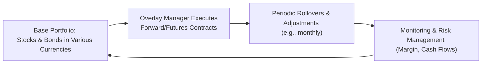
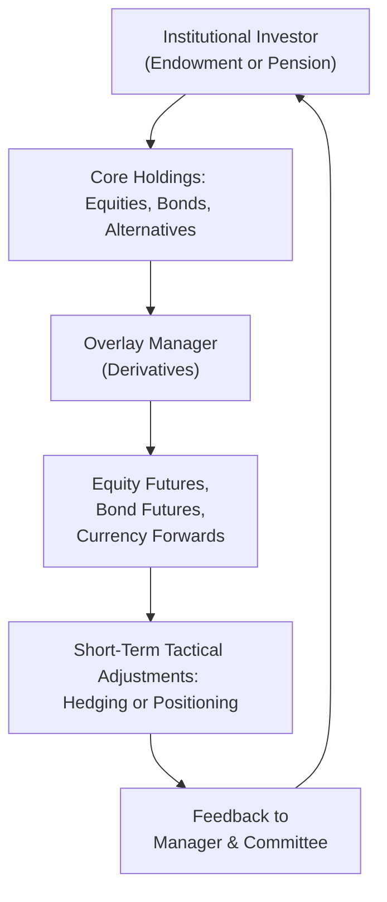

## Introduction
Overlay strategies may sound a bit abstract at first, but trust me, once you see how they work in actual portfolios, it all starts to click. Think of an overlay as an additional “layer” on top of a base portfolio—one that’s used to hedge certain risks (like interest rates or currency fluctuations), implement tactical views, or even rebalance a portfolio quickly without disturbing the underlying allocations too much. Overlays can be vital in multi-asset portfolios, as they enable you to take advantage of short-term mispricings or protect against potential market turbulence. 

The following sections explore real-world examples and lessons learned—some good (“phew, that strategy saved us!”) and some not-so-good (“uh-oh, maybe we over-levered there!”). We’ll reference ideas from earlier discussions in this volume, including Ch. 10.2 on currency risk and hedging techniques, Ch. 10.3 on equity and fixed-income overlays, as well as cross-linking concepts from risk management frameworks in Ch. 6.

## A Pension Fund’s Duration Overlay
Let’s start with a scenario I saw up close. A large pension fund anticipated rising interest rates and was concerned about the impact on its long-duration fixed-income portfolio. If rates go up, bond prices generally go down, leaving the fund exposed. The pension fund’s Investment Policy Statement (IPS)—which you might recall from Ch. 4.1—called for a certain duration target to meet future liabilities, but the managers had flexibility to modify duration within a specific band.

• Objective: The pension wanted to hedge part of its interest rate risk, believing rates were likely to rise within the next 12 months.  
• Strategy: They engaged in a duration overlay—essentially taking short positions in interest rate futures (for instance, short positions in long-term Treasury futures) so that if interest rates rose, the short futures positions would profit and offset some of the portfolio losses.  
• Result: Over the course of the year, interest rates did inch higher, and the futures overlay reduced the portfolio’s overall volatility. That allowed the fund to stay on target with its liability-driven mandates (see Ch. 4.7 on liability-driven investing) while not drastically altering its core portfolio holdings.  

That’s the success story. But the managers also noted some friction: they needed to maintain collateral for the futures positions, and if interest rates had unexpectedly dropped, the overlay would have introduced unnecessary losses. This real-life example highlights the importance of having thorough scenario analyses like those covered in Ch. 2.12.

## Currency Overlay in Practice: Protecting Against Exchange-Rate Swings
Another common application of overlays is currency hedging—particularly for investors venturing into international markets. Let’s imagine a global equity manager based in the United States with significant exposure to European equities denominated in euros (EUR). If the USD/EUR exchange rate makes a big, unexpected move, it could overshadow the returns (or amplify losses) of the underlying equity investments.

• Objective: Stabilize returns by mitigating currency volatility.  
• Strategy: The manager might use forward contracts on the EUR/USD to lock in exchange rates for a portion (or all) of the cross-currency flows. These forward contracts can be continuously rolled over. Alternatively, if the portfolio is extremely large, the manager might use currency futures on the euro or currency swap agreements (see Ch. 10.6).  
• Case Study in Action: I recall a colleague whose portfolio got hammered when the euro depreciated sharply against the U.S. dollar. Had they used even a partial overlay to hedge, the negative impact on returns would have been softened. But at the time, it seemed “too costly,” or so they thought.  

Eventually, that same manager adopted a systematic currency overlay program. Interestingly, it didn’t just reduce volatility—it also improved risk-adjusted returns by curbing the unpleasant surprises that come from big currency swings. Of course, currency overlays aren’t free; they require transaction costs and constant monitoring. But for many global investors, this approach can be a game-changer.

## Multi-Asset Overlays for Rapid Rebalancing
Picture an endowment that invests in equities, fixed income, and commodities. Maybe it has an IPS that sets target weights: 60% stocks, 30% bonds, and 10% commodities. But markets change quickly, right? And sometimes the endowment’s investment committee believes there’s a short-term opportunity—say, commodity prices are oversold, or equity markets look frothy.

• Objective: The endowment wants to adjust allocations quickly without fully selling or buying underlying assets (which could trigger taxes, fees, or execution delays).  
• Strategy: Implementing a multi-asset overlay using equity index futures, bond futures, or commodity swaps. Essentially, they’ll take positions in derivatives—like going long on an S&P 500 futures contract or a broad commodity index swap—to adjust exposure on the margin.  
• Real-World Example: One endowment rapidly shifted 5% of its total portfolio from bonds to commodities using futures—literally within a day. They didn’t have to redeem their bond mutual funds or physically buy commodity ETFs. Instead, they used the overlay to capture short-term gains and then unwound the position a few months later, once the mispricing corrected.  

The big advantage is speed plus cost efficiency. The main risk is that if the derivative positions move against you, or you fail to monitor your margin requirements, you can run into trouble fast.

## Overlays During Market Stress
Now, about those times when markets get, well, chaotic. Overlays can suddenly feel like your best friend or your worst enemy. During a financial crisis, derivatives markets might become volatile or even illiquid. Correlations among assets may spike, meaning your “hedge” might not function as expected.

• Liquidity Trap: Let’s say you hold a short volatility overlay. When volatility skyrockets, your short vol positions may impose heavy margin calls at exactly the worst time. Liquidating the base portfolio or other assets to meet those calls can push you into a margin call spiral, further exacerbating losses.  
• Correlation Spikes: If you were relying on low correlations between asset classes, note that in a crisis, everything tends to drop together. This can undermine the benefits of your carefully crafted overlay.  
• Negative Gamma: An option overlay might carry negative gamma. That can lead to a scenario where each incremental price movement forces you to “chase” the market, amplifying losses on the way down (Ch. 10.15’s discussion on using option overlays for tail risk is relevant here).  

It’s during these stressful times that robust risk management frameworks, as discussed in Ch. 6, come to the fore. Regular stress testing, contingency planning, and close oversight by an investment committee can literally save a portfolio from meltdown.

## 2008 Financial Crisis Example
You’ve probably heard how 2008 was a watershed moment for many investment strategies. Overlay programs were no exception.

• Some Funds: They used overlays to quickly pivot to more defensive stances—shorting equity index futures or buying put options on major indices. This hedge approach mitigated massive drawdowns.  
• Others: Overconfidence, or possibly a lack of scenario analysis, led to painful experiences. Think about one fund that was heavily shorting credit spreads via derivatives. When spreads gapped out (i.e., soared higher) in the crisis, the short positions incurred losses even bigger than the underlying portfolio. In addition, that fund faced margin calls, causing it to liquidate illiquid assets at fire-sale prices.  
• Lessons Learned:  
  – Overlays can become expensive to roll over when volatility is high.  
  – Counterparty risk shot up—some managers realized their derivatives counterparties were at risk of default, prompting them to exit or restructure hedges.  
  – Negative gamma exposures proved lethal without adequate capital buffers.  

In retrospect, the key takeaway from 2008 is that overlays are powerful tools but magnify both your skill and your mistakes. One of my mentors used to say, “Derivatives don’t turn a poor portfolio into a good one, they just reveal your risk appetite faster.”

## Governance, Stress Testing, and Risk Controls
We often forget the soft side of implementing overlays—the checks and balances. But in any robust overlay program:

• Alignment with IPS: Ensure that the design and objectives of the overlay respect the Investment Policy Statement constraints in Ch. 4.1. For instance, you can’t use an overlay to exceed your risk tolerance or deviate from the stated risk budget (Ch. 4.8).  
• Oversight and Reporting: Most institutions create committees or working groups that meet regularly to review the overlay positions, margin usage, and scenario tests. Some committees hold special sessions during crisis periods or schedule ad hoc calls if volatility spikes.  
• Stress Testing: Going beyond VaR (value at risk) or simple daily risk metrics, a best practice is to run multi-factor stress tests that simulate “what if the market opens 5% lower tomorrow, and the euro also drops 3%, all while credit spreads widen?” If the results look too horrifying, you might want to adjust your overlay.  
• Post-Event Analysis: After any big market move, it’s vital to dissect how the overlay performed—did it protect as planned, or did correlations shift? Did we have enough collateral? Did we face margin calls? Thorough post-event reviews of overlay performance help refine future strategy (Ch. 6.16 describes stress testing in extreme market conditions).

## Using Diagrams to Understand Overlays
Sometimes, an old-fashioned flow chart (or a fancy modern one) helps illustrate how overlays sit atop the base portfolio. Let’s take a simple currency overlay as an example.

Notice the continuous loop of monitoring and risk management. The base portfolio remains intact while the overlay manager adjusts notional currency exposure via forward or futures contracts. Any changes (like a big drop in the base portfolio’s value) would feed back into decisions on how much currency exposure to hedge.

Below is a simplified multi-asset overlay chart that might help illustrate how different parts interact:

This cycle highlights that the base portfolio invests in standard instruments and that the overlay is an additional layer to rapidly shift exposures or hedge risks.

## Exam Relevance and Practical Tips
If you’re studying for the CFA® exam, your test questions will often ask how or why a manager would implement an overlay. They might give you a scenario with a rising rate environment or a sudden currency shock, then ask you to propose solutions and weigh the trade-offs. In essay-type questions, you might need to:

• Justify the use of specific derivatives based on the portfolio’s objectives.  
• Calculate partial hedges or full hedges and show the effect on overall portfolio duration or currency exposure.  
• Discuss governance considerations, such as margin requirements or the potential for correlation spikes.  

You can apply the lessons from these case studies to any question about overlay usage: always link it back to the IPS, risk budget, and scenario testing. Don’t forget to address potential pitfalls like liquidity or negative gamma.

## References and Further Reading
• IMF Staff Report. (2009). “The Role of Derivatives in the Financial Crisis.” International Monetary Fund.  
• Golub, B., & Crum, R. (2010). “Risk Management Lessons from the Crisis.” Journal of Derivatives.  
• CFA Institute. (2024). “Overlay Strategy Case Studies.” CFA Program Curriculum.

## Overlay Strategy Knowledge Check



### Which of the following best describes the primary purpose of a duration overlay for a pension fund?
- [x] Reducing or adjusting sensitivity to interest rate changes without altering the core bond holdings.
- [ ] Boosting the fund’s volatility by incorporating leverage.
- [ ] Eliminating all default risk in fixed-income holdings.
- [ ] Avoiding the need for rebalancing among equities and bonds entirely.

> **Explanation:** A duration overlay typically aims to fine-tune interest rate sensitivity. It doesn’t necessarily eliminate default risk or remove the need for all rebalancing.

### In a currency overlay strategy, which instrument is commonly used to hedge exchange rate risk for a globally invested portfolio?
- [x] Forward contracts on currency pairs.
- [ ] Equity put options.
- [ ] Commodity futures.
- [ ] Overnight interest rate swaps only.

> **Explanation:** Currency overlays frequently use forward contracts on specific currency pairs. The other instruments listed are not typically used for a currency hedge on global equity holdings.

### What is a potential downside of using multi-asset overlays for quick tactical rebalancing?
- [x] Increased complexity and the risk of significant margin calls if positions move against the portfolio.
- [ ] Elimination of all volatility from the underlying portfolio.
- [ ] Inability to react to short-term market changes swiftly.
- [ ] Mandatory reduction of transaction costs.

> **Explanation:** Multi-asset overlays do allow rapid rebalancing but come with higher complexity and potential margin calls, particularly during volatility spikes.

### How can correlation spikes during market stress negatively affect an overlay?
- [x] Hedge strategies may break down if previously uncorrelated assets all move in the same direction.
- [ ] They always reduce derivative costs, making hedging easier.
- [ ] They guarantee a positive total return for the overlay.
- [ ] They are irrelevant in currency hedging situations.

> **Explanation:** When correlations spike, assets often move together, undermining hedges that assume offsetting movements across different asset classes.

### In the 2008 financial crisis, which factor significantly impacted overlay strategies?
- [x] Rapidly increasing counterparty risk in derivative markets.
- [ ] Elimination of all liquidity hazards in futures markets.
- [ ] Guaranteed gains from short selling credit spreads.
- [ ] Universal success of negative gamma exposures.

> **Explanation:** Many overlay managers had to reassess their positions due to the surging counterparty risk and widening bid-ask spreads in derivative markets.

### Why might a pension fund choose a partial hedge rather than a full hedge in a duration overlay?
- [x] They expect moderate rate moves but wish to maintain some upside potential if rates decline.
- [ ] They want to eliminate all interest rate risk.
- [ ] They are required by regulation to hedge 100% of the duration.
- [ ] They incorrectly believe partial hedging is free.

> **Explanation:** A partial hedge can mitigate some risk but still keep exposure to potential gains if interest rates move in a favorable direction. Full hedging often comes with higher costs and a total loss of upside.

### How does negative gamma exposure potentially amplify losses in a volatile market?
- [x] It requires frequent rebalancing in a manner that chases adverse market movements.
- [ ] It permanently locks in gains due to continuous positive option delta.
- [ ] It eliminates margin requirements.
- [ ] It is automatically hedged by correlation spikes.

> **Explanation:** Negative gamma means each move in the underlying asset may force further adjustments, potentially “chasing” losses during volatility surges.

### Which risk management tool is crucial for planning how an overlay will respond to severe market shocks?
- [x] Stress testing with extreme scenarios.
- [ ] Only standard deviation calculations.
- [ ] Ignoring margin requirements.
- [ ] Passive buy-and-hold overlay strategy.

> **Explanation:** Stress testing with hypothetical extreme conditions is vital to understanding how overlays could behave during market shocks and to ensure adequate risk controls.

### What is the purpose of “post-event analysis” after a significant market move?
- [x] Evaluate how the overlay responded under real stress and refine future strategies.
- [ ] Demand immediate margin calls from counterparties.
- [ ] Render the overlay manager’s powers void.
- [ ] Eliminate all open derivative positions by default.

> **Explanation:** Post-event analysis is about learning from the overlay’s performance and improving future decision-making. It’s not about automatically liquidating positions or nullifying contracts.

### Overlays, when effectively governed and monitored, can:
- [x] Be used to quickly adopt defensive stances, potentially mitigating large losses.
- [ ] Substitute all underlying holdings, removing them from the portfolio.
- [ ] Eliminate any chance of negative returns.
- [ ] Function only during rising markets.

> **Explanation:** Overlays are supplementary tools, not replacements for underlying holdings. They do not guarantee no losses but can significantly reduce downside in certain conditions.


