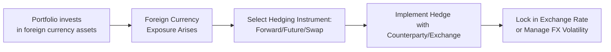

## Introduction and Context

Currency risk can be a real headache for any portfolio manager investing across borders. You might be super proud that your international equity picks gained 10% last quarter, but—oops—your home currency also appreciated considerably, wiping away a chunk of that profit. Or maybe the opposite happened, and you got lucky with a currency tailwind that magnified your gains. Either way, these foreign exchange (FX) fluctuations introduce added volatility and uncertainty into the investment process, prompting many global investors to seek some sort of hedge.

In this section, we’ll walk through the fundamental concepts behind currency risk, discuss why managers might adopt hedges, and explore both passive and active hedging approaches. We’ll also talk about real-world concerns like costs, basis risk, and liquidity constraints, providing examples along the way. Finally, we’ll mix in some personal advice, plus important CFA exam tips on how to analyze currency risk management. Let’s dive in.

## Why Currency Risk Matters

The moment your portfolio includes assets denominated in any currency other than your own base currency—whether it’s a stock, bond, or real estate holding—you’re automatically exposed to exchange rate changes. If the foreign currency weakens against your base currency, you’ll lose purchasing power on your investment returns (when converted back). Conversely, if the foreign currency strengthens, your returns can expand beyond the asset’s local performance.

• Example: Imagine a European investor who buys US stocks. If the US dollar weakens against the euro, the investor might lose out even if the stock price rises somewhat.  
• Fundamental Risk: These currency movements can be unpredictable, influenced by macroeconomic trends, interest rate differentials, geopolitical events, and everything in between.

## Key Hedging Instruments

When it comes to currency risk management, the classic toolkit includes:

• Currency Forwards: Private, over-the-counter (OTC) agreements to exchange one currency for another on a set date at a specified rate. They’re typically customized in terms of notional amount, settlement date, and currency pair.  
• Currency Futures: Exchange-traded contracts with standardized maturities, contract sizes, and settlement procedures. Often used when managers want transparency, an exchange’s credit backing, and easy liquidity (although the standardization can lead to imperfect matching of dates and amounts).  
• Currency Swaps: Agreements in which two parties exchange principal and interest payments in different currencies. These can also be structured for interest-only exchanges or principal re-exchanges at maturity. Swaps can be especially valuable when dealing with bonds that pay coupons in a foreign currency.  

### Quick Mermaid Diagram: Basic FX Hedging Flow

This simple flowchart illustrates how a portfolio initially gains currency exposure, which then leads to a decision on which instrument to use (forwards, futures, or swaps), and finally results in a hedge implementation that locks in or moderates exchange rate fluctuations.

## Hedge Ratios and Target Exposures

The hedge ratio—what portion (often expressed as a percentage) of the currency exposure you decide to offset—is a key implementation decision. This ratio can range from 0% (no hedge) to 100% (fully hedged), or even more than 100% (overhedged) if you’re actively speculating on currency moves. The ratio typically depends on:

• Risk Tolerance: If you or your clients are very risk-averse, you might prefer a high hedge ratio to minimize the impact of currency swings on portfolio returns.  
• Market Outlook: If you think the foreign currency will strengthen, a lower hedge ratio could allow you to benefit from favorable valuation changes.  
• Hedging Costs: Forward contracts might be cheap or expensive depending on short-term interest rate differentials, liquidity conditions, and available counterparties.  
• Investment Horizon: Short-term investors might prefer a tighter hedge, while long-horizon investors can ride out currency cycles.  

Mathematically, you could express it like this:

$$
\text{Hedge Ratio} = \frac{\text{Notional Hedged}}{\text{Total Currency Exposure}}
$$

If your total exposure to foreign currency is \$10 million (for example, in foreign equity investments), hedging \$5 million would imply a 50% hedge ratio. You might dial that up or down depending on your market conviction.

## Passive vs. Active Currency Overlay

A currency overlay refers to the part of portfolio management dedicated solely to managing currency exposures. There are two broad approaches:

• Passive Overlay: The goal here is simply to neutralize the currency impact. You might set a static hedge ratio (say 100%) and roll forward contracts periodically, adjusting for changes in asset values. Think of it like “set it and forget it,” but with some mechanical rebalancing each month or quarter.  
• Active Overlay: This approach aims to generate alpha (excess returns) by making tactical or strategic bets on currency movements. If you believe the euro is undervalued, you might partially hedge or even go “unhedged” for some portion. If you think the yen is going to collapse, you could hedge more aggressively or set up currency option strategies to profit from that move.  

Some managers prefer a blend—using a large passive hedge ratio (like 80%) to control risk while opportunistically adjusting the final 20% to reflect their views.

## Basis Risk and Imperfect Hedges

One slight hassle in currency hedging is what we call basis risk. It occurs when the instrument you use to hedge doesn’t perfectly match your actual exposures. For instance:

• Settlement Mismatch: You might hold foreign assets with a certain maturity or distribution schedule, but your currency futures or forwards might settle on different dates.  
• Different Currency Pairs: Your portfolio might be denominated in euros, but your hedge might use a euro-USD pair that isn’t exactly the same as your actual exposure. This can introduce small (or sometimes large) mismatch losses.  

Minimizing these mismatches is key, but you usually can’t eradicate them entirely. You just have to watch your contract details carefully, track the forward points (for forward contracts), and monitor rolling costs.

## Carry Trades and Negative Carry

Many times, I’ve heard folks say, “Well, I don’t want to hedge because I’ll lose out on the interest rate differential.” They’re referring to something called the cost of carry. If a currency you’re hedging has a much higher short-term interest rate than your home currency, you might have to pay that difference when implementing a forward-based hedge. Conversely, if the foreign currency’s interest rate is lower, you might earn a small credit.

• Positive Carry: If you’re hedging a low-interest-rate currency while your home currency has a higher rate, you might earn a small premium.  
• Negative Carry: If you’re hedging a high-interest-rate currency and your home currency is the low-rate currency, your hedge will cost you more.  

And that can get more nuanced if you try to turn it into a carry trade (borrowing in one currency to invest in a higher-yielding currency). That’s a deliberate speculation that can be risky if exchange rates move against you.

## Hedging Costs and Operational Considerations

Aside from the cost of carry, you’ve got other direct or indirect expenses:

• Bid-Ask Spreads: Whether you’re transacting forwards, futures, or swaps, you can lose a bit on each trade if the market is wide or illiquid.  
• Roll Costs: If you’re continually extending your hedge, you pay or receive a roll cost (the difference between the near leg and the far leg of the forward or future).  
• Operational Complexity: Maintaining numerous forward contracts for multiple currency exposures can be operationally tedious. You might need special expertise on the team or an external overlay manager.  
• Margin Requirements: If you use currency futures, you’ll have daily mark-to-market requirements that tie up margin.  

All of these factors combine to influence your decision on whether and to what extent you want to hedge.

## Example: 50% Hedge Ratio in Practice

Say you manage a global equity portfolio worth $100 million, with $40 million in Japanese stocks, $30 million in European stocks, and $30 million in US stocks. Assume your home base is the UK, so your main currency is GBP.

• Potential Hedge Ratio: You decide to hedge 50% of both your JPY and EUR exposures but leave the USD unhedged.  
• Implementation: You get into six-month forward contracts on JPY and EUR for half their notional amounts.  
• Monitoring: You’ll track the hedge monthly or quarterly and rebalance as needed. If the yen or the euro moves significantly, you might adjust the ratio.  

You might choose 50% after analyzing your overall risk tolerance and deciding that leaving some portion unhedged could allow you to benefit from favorable currency swings. Alternatively, you might find it cheaper to hedge just some portion because the cost of hedging might be too high in certain currencies.

## Documentation and Transparency

A critical aspect of currency hedging—often overlooked—is having a clear, documented hedging policy. This policy should outline:

• Objectives: Are you looking merely to reduce volatility, or also to generate alpha?  
• Instruments Allowed: Forwards, futures, swaps, or options? Specific guidelines help reduce confusion and keep the process consistent.  
• Hedge Ratios: The baseline ratio or range (e.g., 50% to 100%), plus triggers for reevaluation.  
• Governance: Who is accountable for implementing and monitoring hedges? How often do you report to the board or to clients?  
• Review Process: You might reevaluate your hedge ratio every quarter or during major market shifts.  

Having these guidelines fosters consistency and transparency, which helps you avoid knee-jerk decisions that might harm the portfolio.

## Exam Tips and Key Takeaways

• Understand Instruments Thoroughly: Be comfortable explaining how forwards, futures, and swaps work in currency context. Know the definition of each, their typical settlement cycles, and their sources of basis risk.  
• Hedge Ratio Calculations: On the CFA exam, you might be asked to calculate or adjust a hedge ratio given certain exposures and notional amounts. Make sure you’re comfortable doing basic calculations—even if they initially look like word problems.  
• Passive vs. Active Overlay: Be ready to discuss both strategies in detail. This might appear in an item set comparing cost, complexity, and potential alpha.  
• Carry and Interest Rate Differentials: Watch for questions about how forward points or forward premia/discounts work. The exam might test your knowledge of how interest rate differentials tie into forward currency pricing.  
• Basis Risk: Expect scenario-based questions. You could be given mismatch conditions (like different settlement dates or partial hedge ratios) and asked to compute or comment on leftover exposure or potential gains/losses.  
• Stay Organized: In your constructed response answers, structure your discussion logically. Outline the rationale for hedging and mention key implementation steps.  

## References

- Black, F. (1989). “Universal Hedging: Optimizing Currency Risk and Reward in International Equity Portfolios.” Financial Analysts Journal.  
- CFA Institute. (2022). “Currency Management.” CFA Program Curriculum.  
- Madrigal, T. (2020). “Fundamentals of Currency Risk.” Journal of Portfolio Management.

 

## Test Your Knowledge: Currency Risk and Hedging Quiz



### Which of the following best describes currency forwards?

- [ ] Exchange-traded contracts with standardized terms.  
- [ ] Contracts offset by daily margin settlements.  
- [x] Private agreements to exchange one currency for another at a future date and a predetermined rate.  
- [ ] An arrangement to sell currency immediately at the spot rate.  

> **Explanation:** Currency forwards are private, over-the-counter agreements rather than exchange-traded standardized contracts (those are futures).  

### A portfolio manager holds a €1 million position in an asset but wants to limit exposure to fluctuations between euros and US dollars. Which action characterizes a "passive" hedge?

- [x] Entering into forward contracts to fully offset the €1 million exposure at regular intervals.  
- [ ] Utilizing currency options to speculate on the EUR/USD movement.  
- [ ] Keeping 0% hedge ratio while monitoring the currency market.  
- [ ] Frequently changing the hedge ratio based on short-term currency forecasts.  

> **Explanation:** Passive hedging typically aims to fully offset or neutralize the currency exposure without attempting to generate alpha via market timing.  

### If a manager expects a foreign currency to appreciate against their home currency, how might this impact their decision to hedge?

- [ ] They would likely increase their hedge ratio.  
- [ ] They would likely fully hedge the exposure.  
- [x] They might reduce the hedge ratio to benefit from the anticipated currency appreciation.  
- [ ] They would eliminate their foreign currency holdings altogether.  

> **Explanation:** If the manager forecasts that the foreign currency will rise, they might choose not to hedge (or to only partially hedge) so as not to miss out on potential currency gains.  

### Which of the following statements about currency futures is most accurate?

- [ ] They are always settled by physical delivery in practice.  
- [ ] They can be customized for any notional amount.  
- [x] They are standardized exchange-traded contracts with margin requirements.  
- [ ] They are always cheaper than forwards.  

> **Explanation:** Currency futures are standardized contracts traded on an exchange, and they typically come with margin requirements. Unlike forwards, they’re less customizable.  

### A negative carry situation arises when:

- [ ] The foreign currency’s interest rate is below the investor’s home currency rate.  
- [ ] The currency pair is perfectly correlated with the investor’s equity holdings.  
- [x] The foreign currency’s interest rate is higher than the home currency’s, causing the hedger to pay the rate differential.  
- [ ] A manager miscalculates future currency movements.  

> **Explanation:** Negative carry happens if you hedge into a currency that has a higher interest rate than your base currency, meaning you pay the difference.  

### Basis risk in currency hedging can occur when:

- [x] The hedging instrument does not perfectly match the currency exposure’s size or settlement period.  
- [ ] The foreign currency experiences a sudden devaluation.  
- [ ] The hedge ratio is set to 100%.  
- [ ] The manager decides not to roll forward any positions.  

> **Explanation:** Basis risk arises from imperfect matching between the derivatives used (e.g., forward date or currency pair) and the underlying exposure.  

### When implementing a currency swap, the investor typically:

- [ ] Buys currency spot and resells it to a counterparty.  
- [x] Exchanges principal and/or interest payments in two different currencies.  
- [x] Agrees on interest payments in each other’s currencies.  
- [ ] Avoids all interest rate exposure.  

> **Explanation:** A currency swap usually involves both principal and interest payments being exchanged. In some structures, only interest is swapped and the principal is re-exchanged at maturity.  

### Which of the following is a primary benefit of a passive currency overlay?

- [x] Reduced FX risk without active speculation on currency movements.  
- [ ] Guaranteed alpha from favorable exchange rate moves.  
- [ ] Elimination of roll costs associated with forwards.  
- [ ] Ability to profit from expected short-term currency fluctuations.  

> **Explanation:** Passive overlays reduce foreign exchange risk without deliberately seeking to profit from market movements.  

### Which factor commonly influences changes in forward points or currency forward premia/discounts?

- [x] Interest rate differentials between two currencies.  
- [ ] Volatility of equity markets.  
- [ ] Corporate dividends in the foreign market.  
- [ ] GDP differences over the long term.  

> **Explanation:** Forward rates are heavily influenced by the difference in short-term interest rates between two currencies.  

### In the context of partial hedging, which statement is true?

- [x] A partial hedge leaves some portion of the currency exposure unhedged, allowing for potential currency gains or losses on that portion.  
- [ ] A partial hedge is meant to always produce a guaranteed gain.  
- [ ] A partial hedge eliminates basis risk.  
- [ ] A partial hedge always attempts to profit from currency arbitrage opportunities.  

> **Explanation:** A partial hedge, say 50%, reduces volatility but still leaves some exposure to currency movements.  


