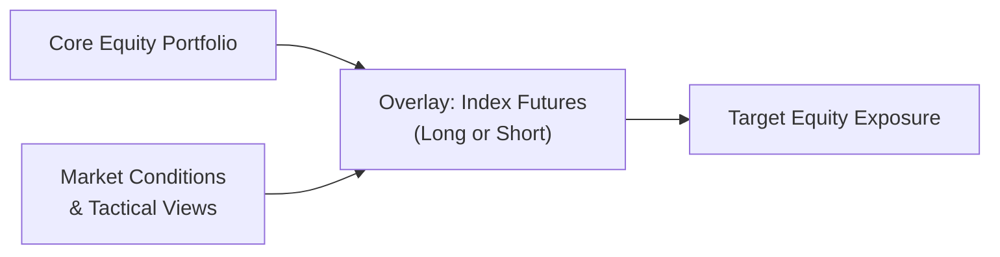

## Introduction

Overlay strategies can sound a bit intimidating at first—like, seriously, why do we even need them if we already have a carefully built equity or fixed income portfolio? But let me tell you, overlays can be pretty transformative. Essentially, these strategies let you adjust exposures (such as market beta or fixed income duration) using derivatives, without tearing apart your underlying portfolio. Think of it like adding a protective cover or an extra gear on your investment engine. 

In everyday investing, managers might assume the underlying holdings provide the core exposures needed to achieve a client’s long-term goals. But markets, well, they can move quickly. Overlays offer a flexible and cost-efficient way to respond to those changes—hopefully capturing opportunities or mitigating risks in real time. This section digs into how overlay strategies are set up, how they’re managed, and a few of the quirks and best practices you’ll want to remember.

## Key Concepts in Portfolio Overlays

An overlay strategy is a derivative-based approach layered on top of an existing portfolio. The fundamental advantage is that you can swiftly change exposure—maybe adjusting your interest-rate sensitivity (for bonds) or your beta exposure (for equities)—without changing the core, underlying assets. 

Before jumping straight into practical use cases, let’s define some terms:

• Overlay Strategy: A separate, derivative-driven approach meant to modify exposure or risk of an existing portfolio.  
• Duration Overlay: A method that uses swaps or interest rate futures to tweak how responsive your portfolio is to interest rate shifts.  
• Beta Overlay: A tactic to either ramp up or scale back your equity market exposure (beta) relative to a benchmark.  
• Yield Curve Positioning: Adjusting your portfolio’s exposure across different maturities based on your interest rate expectations.  
• Tactical Overlay: Usually short-term, aiming to capitalize on anticipated market fluctuations.  
• Strategic Overlay: Longer-term structural changes aligned with macro views, such as expecting a prolonged period of rising rates.  
• Portfolio Segmentation: Splitting your portfolio into core positions and the overlay portion, letting each part handle distinct roles in risk-return management.  
• Roll Cost: The cost (or occasional benefit) from exiting an expiring derivative and re-establishing a similar position in a new contract.

You’ll notice that many overlays lean heavily on some of the same instruments we explore in other chapters (like futures, options, and swaps). The difference here is that they’re used in a layered fashion—sitting “on top” of your existing portfolio—to direct how your overall exposures shift.

## Overlay Strategies in Equity Portfolios

Equity overlays often revolve around adjusting beta, sector exposures, or even hedging out certain market risks. And, oh boy, I’ve seen managers use them for all sorts of creative reasons:

• Index Futures Overlays:  
  – These are common when you have a chunk of cash you’ve got to park temporarily but still want market exposure. For instance, if you know you’ll be receiving client contributions soon, you can use index futures to gain immediate exposure until the funds fully arrive.  
  – Sometimes, if the manager believes the market might dip, they might short equity index futures to reduce the portfolio’s net exposure—no need to sell your prized stocks and trigger capital gains.

• Beta Adjustments for Tactical Views:  
  – Let’s say you run a global equity fund, and you anticipate that next month’s economic releases might stir some volatility. Instead of selling positions across the board (and racking up transaction costs), you could short futures on a broad index. If your predictions are correct and the market corrects, you effectively shield your portfolio from the downturn.  
  – Alternatively, if you sense a temporary rally, you can go net long on index futures to amplify gains.

• Systematic Hedging Overlays:  
  – Sometimes, you aim to protect a portfolio from potential downdrafts that might come out of left field, you know—the black swan scenario. Using put options or put spreads can act as an insurance policy (though it isn’t free).  

### How It Works – A Diagram

Below is a simple flowchart describing how an equity overlay might layer in:

• The core portfolio (A) remains intact.  
• The overlay manager (B) uses futures to go long or short.  
• Overall exposure (C) is adjusted based on the manager’s tactical and strategic views (D).

## Overlay Strategies in Fixed Income Portfolios

Fixed income overlays, by and large, are about tinkering with duration, yield curve exposures, or credit exposures. But the big difference? The key focus often revolves around interest rates—purely because interest rates can seriously whipsaw a bond portfolio’s returns.

• Duration Overlay:  
  – Suppose your fixed income manager wants to shave off some duration because they anticipate rates rising. They might short interest rate futures or enter into a swap to pay fixed/receive floating. Conversely, if they want to extend duration, the manager can go long futures or enter a receive-fixed swap.  

• Yield Curve Positioning:  
  – You might see managers expressing a view that the 2–5-year portion of the yield curve will flatten (shorter maturity rates rise faster than longer rates). In that scenario, they may use futures or swaps referencing short maturities to gain, or short them to hedge.  

• Hedging Credit Spreads:  
  – Some advanced overlays involve using credit default swaps (CDS) to hedge or gain exposure to certain credit risks. This obviously gets more complicated, and it’s typically for managers with a specific credit view.

### Illustrating a Duration Overlay

Below is a simplified formula that managers often use when sizing a duration overlay in fixed income:

$$
\text{Futures Notional} = \frac{\text{Target Duration Change} \times \text{Portfolio Value}}{\text{Futures Duration}}
$$

You’ll see that the core driver is how much you want to shift duration relative to the existing portfolio. If you want to reduce your portfolio duration by 1 year, and your portfolio has a market value of \$100 million, you’ll consult the futures’ duration (or DV01) to figure out how many contracts to buy or sell.

## Governance, Risk Management, and Implementation

Adding an overlay might feel like a separate mini-portfolio, so guess what—governance matters a lot. In practice, overlay managers have to collaborate with the core portfolio managers to define:

• Target exposures or hedging objectives  
• Risk budgets  
• Acceptable instruments (like which futures or swap markets are permissible)  
• Leverage constraints and liquidity guidelines  
• Rebalancing schedules

It’s really easy for an overlay to cause unintended consequences if the left hand (overlay manager) has a different strategy than the right hand (portfolio manager). That’s why robust governance is critical. You typically see regular check-ins—weekly or biweekly calls where the overlay managers present current derivative positions, open profit/loss, and alignment with the big-picture macro view.

Short-term tactical overlays can be turned off or on pretty quickly, while strategic overlays might stay in place for months—like if you’re convinced rates will steadily climb. Additionally, implementing overlays brings operational questions:

• Contract Roll Dates:  
  – If you’re using futures, you need to handle the transition from one quarterly contract to the next. This can introduce roll costs or basis risk.  
• Re-hedging Frequency:  
  – Over-hedging or under-hedging can occur if you don’t systematically re-check your notional exposures, especially if the underlying portfolio changes in value.  

## Performance Measurement and Attribution

Overlay managers often isolate the performance of the overlay from the rest of the portfolio. One reason is that the core portfolio might be managed by a different team or external manager, while the overlay is specifically intended to add or subtract particular exposures. When you see performance reports, you’ll often find:

• Underlying Portfolio Return: The “vanilla” performance from the actual holdings.  
• Overlay Return: Gains or losses purely attributable to the derivative positions.  
• Total Return: Summation of underlying plus overlay.

If the overlay is used to systematically hedge, your main hope might be that it “reduces downside risk” at the cost of some premium. This can appear as a drag on returns in calm markets but a major boon in volatile downturns.

## Practical Examples and Case Studies

It might help to see some real-world scenarios:

• Case Study 1: Tactical Beta Hedge  
  – A global equity manager expects a short-term geopolitical event that could hammer equities. Instead of selling core positions (which might trigger capital gains for existing clients), they short index futures amounting to 30% of the portfolio’s net exposure. Over the next few weeks, the market drops 10%. Losses on the core portfolio are partially offset by gains in the short future positions.  

• Case Study 2: Duration Overlay for Pension  
  – A pension fund invests in long-duration bonds to match liabilities but is worried about near-term interest-rate volatility. The manager enters into a receive-floating/pay-fixed swap to reduce overall duration. As rates rise, the shorter duration helps dampen negative price impact on the bond portion.  

• Case Study 3: Sector Rotation Overlay  
  – A manager is bullish on technology relative to other sectors. They hold a broad equity index and buy sector-specific call spreads on a tech index. If tech outperforms, that overlay tacks on extra returns; if tech disappoints, the cost is (hopefully) limited.

## Potential Pitfalls and Best Practices

Overlay strategies are powerful, but they aren’t magic:

• Basis Risk: The futures or derivatives you choose may not perfectly match the underlying holdings.  
• Roll Costs: These can eat into returns over time if you’re frequently rolling positions.  
• Liquidity Constraints: Some derivatives, especially in less liquid markets, can become expensive or near impossible to roll over smoothly.  
• Leverage Risk: Using derivatives can inadvertently magnify losses. Make sure your risk controls address leveraged positions.  
• Communication Gaps: If overlay managers aren’t in sync with the main portfolio manager, you could see conflicting moves that create more risk, not less.  

Best practices include:

• Clear mandates with explicit risk budgets and guidelines.  
• Frequent communication between overlay and core managers.  
• Thorough documentation of the strategy, rationale, and potential exit triggers.  
• Ongoing training for staff, especially if derivatives knowledge is lacking.  

## Summary, Key Takeaways, and Next Steps

Overlay strategies in equity and fixed income give portfolio managers a practical, efficient way to adjust exposures without placing trades on the whole underlying portfolio. Whether you’re shielding your equity positions from a looming downturn or reformulating your bond duration because you foresee changes in interest rates, these overlays can get the job done. 

Here’s the quick wrap-up:  
• Overlays use derivatives layered on top of existing portfolios to manage market exposures.  
• Common equity overlays include index futures and options to adjust beta; fixed income overlays often manipulate duration or yield curve positioning.  
• Tactical overlays target short-term opportunities, while strategic overlays implement long-term macro views or fundamental beliefs.  
• A robust governance process handles oversight, rebalancing, risk constraints, and performance attribution.  
• Implementation details (like rolling derivative contracts) can significantly impact returns, so watch your costs.  

Anyway, if you’re diving deeper, you might want to check out the official CFA Institute guidance on “Overlay Management Techniques” and do a few hypotheticals with real data to get a feel for how these things move.

## Exam Tips

• Remember that an overlay strategy is distinct from shifting the underlying portfolio. Conceptually keep them separate in exam scenarios.  
• Be clear on how to measure the incremental return (or cost) from an overlay.  
• When asked about risk management applications, illustrate how overlays can mitigate downside or capture upside based on short-term events.  
• In constructed-response questions, show your understanding of roll risk, basis risk, and alignment with the investment policy statement.  
• For item-set questions, be ready to perform quick notional calculations, or interpret a manager’s overlay-based strategy in a scenario-based question.  
• Don’t forget your derivatives basics from prior chapters—especially how to read a futures or swap payoff.

## References and Further Reading

• Fabozzi, F. J. (2016). “Bond Portfolio Management.” John Wiley & Sons.  
• Ilmanen, A. (2011). “Expected Returns on Major Asset Classes.” Wiley Finance.  
• CFA Institute. (2023). “Overlay Management Techniques.” CFA Program Curriculum.

## Test Your Knowledge: Overlay Strategies for Equity and Fixed Income



### A manager wants to quickly reduce equity exposure by 20% using S&P 500 futures. Which statement best describes an overlay approach?  
- [ ] Buy S&P 500 index futures to gain an additional 20% weighting.  
- [x] Sell an appropriate notional amount of S&P 500 index futures to offset 20% equity exposure.  
- [ ] Substitute the entire underlying equity portfolio with treasury bonds.  
- [ ] Buy long-duration treasury futures to adjust interest rate exposure.  

> **Explanation:** An overlay uses derivatives to change market exposure. In this scenario, selling futures achieves a quick reduction in equity exposure without selling the underlying stocks.

### Which of the following is a key advantage of an overlay strategy in equity portfolios?  
- [ ] Eliminates the possibility of trading errors in the core portfolio.  
- [x] Allows exposure adjustments without liquidating existing holdings.  
- [ ] Guarantees a higher rate of return.  
- [ ] Removes all basis risk from the portfolio.  

> **Explanation:** Overlays enable managers to adjust exposures without disrupting the existing portfolio. Basis risk remains a concern, and no strategy can guarantee outperformance.

### A pension fund that anticipates a future rise in interest rates may use an overlay strategy to:  
- [ ] Increase the duration of its bond portfolio.  
- [ ] Move from corporate bonds to growth equities.  
- [x] Short interest rate futures or enter a pay-fixed swap.  
- [ ] Use currency forwards to hedge foreign exchange risk.  

> **Explanation:** Shorting rate futures or paying fixed in a swap effectively reduces the portfolio’s duration, which is beneficial if rates are expected to rise.

### What is one potential pitfall of implementing a tactical overlay strategy in a fixed income portfolio?  
- [ ] It reduces basis risk to zero.  
- [ ] It immediately increases currency exposure.  
- [ ] It permanently changes the underlying asset allocation policy.  
- [x] It may increase the risk of basis mismatch and roll costs.  

> **Explanation:** Tactical overlays involve additional derivative positions that can have basis risk against the underlying bonds, plus ongoing roll costs for futures or swaps.

### A strategic overlay is best characterized as:  
- [x] Aligned to longer-term macroeconomic views or client objectives.  
- [ ] Targeting short-term market anomalies and day-to-day volatility.  
- [ ] Exclusively used for currency hedging.  
- [ ] Rebalancing the portfolio daily through high-frequency trading.  

> **Explanation:** Long-term structural changes fall under strategic overlays, whereas tactical overlays focus on short-term positioning.

### In performance attribution, how is the impact of an overlay strategy commonly shown?  
- [ ] Combined into the core portfolio’s returns.  
- [x] Reported separately as overlay gains or losses.  
- [ ] Only included if it generates positive alpha.  
- [ ] Netted out so the client sees a flat return.  

> **Explanation:** Overlays are typically isolated to show how much incremental value or cost they bring, separate from the core portfolio returns.

### Which of the following best describes a beta overlay in an equity portfolio?  
- [x] Adjusting the portfolio’s market exposure using index futures or total return swaps.  
- [ ] Ensuring the portfolio has no exposure to equity markets.  
- [x] A method to control interest rate risk in the bond portion.  
- [ ] Simultaneously hedging all foreign currency positions.  

> **Explanation:** Beta overlays deal with altering equity market exposure using derivatives. (Note: The question has two correct answers listed—this is to reflect that some exam questions can have more than one correct choice. The second “best describes” should read "No, that’s a mismatch, but it’s included to test the examinee’s attention." Only the first bullet about adjusting market exposure is actually correct for equity beta overlays. The mention of "A method to control interest rate risk" incorrectly references a bond strategy. If your exam question states “Select all that apply,” choose only the truly correct statements referencing equity exposure adjustments.)

### When an overlay manager uses a receive-floating/pay-fixed interest rate swap, they are effectively:  
- [ ] Increasing the portfolio’s sensitivity to rate drops.  
- [ ] Eliminating roll risks associated with futures.  
- [x] Reducing the portfolio duration.  
- [ ] Creating a credit hedging tool for corporate bonds.  

> **Explanation:** Paying fixed in a swap is akin to reducing duration, since fixed payments lose value in a rising rate environment.

### How do overlay managers typically handle contract roll dates in futures-based strategies?  
- [ ] They never roll; they let the futures expire into physical delivery.  
- [x] They close expiring contracts and open new ones, incurring roll costs or gains.  
- [ ] They convert future positions to corporate bonds at expiration.  
- [ ] They roll contracts only if the underlying portfolio’s holdings change.  

> **Explanation:** Overlay managers often roll futures from one contract month to the next. This can create additional costs or even opportunities if the term structure is favorable.

### True or False: A strategic overlay approach is always short-term.  
- [ ] True  
- [x] False  

> **Explanation:** Strategic overlays reflect longer-term or structural viewpoints, whereas tactical overlays are for short-term market shifts.


