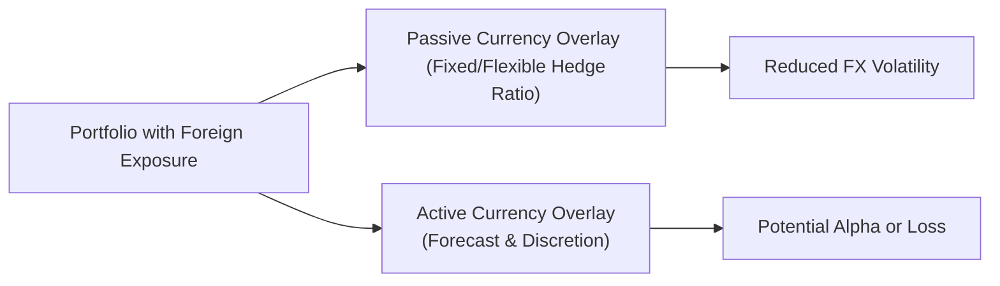

## Introduction and Context

Imagine you’re managing a global portfolio, and you see that a good chunk of returns—or losses—can come simply from shifting exchange rates. Sometimes you just want to avoid that headache, right? Other times, maybe you want to take advantage of those currency swings. That tension between doing nothing more than neutralizing your currency risk versus actively seeking to profit from FX movement is what this discussion is all about. In this section, we’ll explore the differences between passive currency management and active currency management, the motivations behind each, the practical tools required, and how CFA candidates might apply these techniques to real portfolios.

## Passive Currency Management Overview

Passive currency management is kind of like setting your cruise control on the highway. You’re deciding on a hedge ratio—say, 100% or 50%—and then you re-hedge as necessary, without trying to guess where the market is going. The primary objective here is to reduce volatility and limit the impact of unpredictable foreign exchange rate fluctuations on the home-currency value of your investment portfolio.

### Key Characteristics of Passive Strategies

• Pre-Determined Hedge Ratio  
• Minimal Discretion and Forecasting  
• Lower Alpha Potential, Lower Costs  
• Offer Stabilized Domestic Returns  

A typical passive hedging approach may say: “Let’s hedge 70% of our foreign currency exposure at all times.” Then, every month (or quarter), the portfolio manager adjusts derivative positions (e.g., currency forwards or futures) to restore that 70% hedge. This can be suitable for institutional investors—like pension plans—who prefer more predictable cash flows in their base currency.

### Pros and Cons of Passive Hedging

• Pros: Simplicity, relatively low cost, stable returns in home currency.  
• Cons: Opportunities to generate alpha from currency moves are forgone. Residual risk (if not fully hedged) can still occur.  

Often, big institutions with long-term liabilities in a single currency (think: pension plans or insurers paying claims in the domestic currency) adopt passive policies so they don’t have to worry about normal market fluctuations from foreign holdings. Of course, if there is a strong appreciation in foreign currencies, the benefit might be mostly hedged away.

## Active Currency Management Overview

Active currency management is for those who think they can do better than the random walk of FX rates, or at least for those who want to try. Instead of automatically locking in a hedge ratio, the manager forecasts currency movements and adjusts exposures accordingly with the hopes of outperforming a benchmark.

### Core Ideas Behind Active Approaches

• Discretionary or Systematic Forecasting  
• Dynamic Hedge Ratios  
• Attempts to Add Alpha (Excess Returns)  
• Higher Costs and Complexity  

A manager relying on active currency decisions will watch for signals—maybe it’s interest rate differentials that indicate a carry trade, or fundamental data like inflation trends pointing to a potential currency appreciation, or even technical indicators (e.g., moving averages) that suggest when to up or reduce the hedge ratio.

Perhaps you’ve heard a friend say, “Oh, the euro is getting pretty strong against the dollar these days; I should adjust my exposure.” That’s exactly the kind of thinking that goes into active currency management. Of course, it’s not just a hunch for professionals—there’s real modeling involved, but there is still an inherent uncertainty in forecasting exchange rates.

### Potential Benefits and Risks

• Benefits: Opportunity to generate higher returns, leverage specialized FX insights.  
• Risks: Forecasting errors, higher costs, potential for amplified losses if bets turn sour.  

Active managers often deal with more transactions, incurring higher transaction costs. There’s also the need for a specialized research infrastructure to monitor markets around the clock.

## Comparing Active and Passive Currency Approaches

The table below summarizes some of the fundamental differences between passive and active currency management:

| Feature                          | Passive                                         | Active                                                  |
|----------------------------------|-------------------------------------------------|---------------------------------------------------------|
| Primary Objective                | Reduce FX volatility in home currency           | Generate alpha or enhance returns                       |
| Hedge Ratio                      | Fixed or systematically rebalanced              | Dynamic, changes based on market forecasts             |
| Forecasting/Research             | Minimal, rules-based                            | Complex, can include macroeconomic and/or technical     |
| Costs                            | Lower (fewer trades, simpler execution)         | Higher (frequent trades, research staff, risk controls) |
| Benchmark                        | Typically a neutral (fully or partially hedged) | Customized currency index or absolute return measures   |
| Skill Dependency                 | Low                                             | High                                                   |

### Simple Mermaid Diagram

Below is a simple visual representation of how a global portfolio might interface with both passive and active currency overlay strategies:

## Methods of Implementation

### Passive Implementation

Passive currency managers typically use forward contracts to lock in an exchange rate for a future date. Let’s say you hold a Euro-denominated bond. You can sell euros forward against your home currency each month or quarter, ensuring that if the euro weakens, you’re somewhat shielded from losses in your domestic-currency value. Rebalancing occurs periodically to maintain the hedge ratio.  

For example, if you’re half-hedged, you might systematically roll over forward contracts covering 50% of your Euro exposure. Trading is relatively straightforward, and the main question from the manager’s perspective is, “Is our hedge ratio still at 50%?” You rarely deviate from that plan.

### Active Implementation

Active currency managers often rely on:

• Fundamental models: Assess interest rate differentials, purchasing power parity (PPP), inflation outlook, trade balances, and macroeconomic signals.  
• Technical analysis: Use price trends, momentum indicators, moving averages, breakout signals, or chart patterns.  
• Quantitative modeling: Incorporate historical patterns, regression models, machine learning to identify profitable currency strategies.  

Let’s say your models show the euro is likely to appreciate due to improving economic indicators in the Eurozone. An active manager might reduce or completely eliminate a hedge on euro exposures, effectively going “long EUR” to collect prospective gains. If that forecast is right, you add alpha to the portfolio. But if it’s wrong, you expose yourself to negative currency movements.

## Cost Considerations

One big difference in deciding active vs. passive is cost. Active management can require:

• Sophisticated research or data analytics.  
• Round-the-clock monitoring—FX markets trade 24/7 on weekdays.  
• Potentially frequent rebalancing or short-term trades.  
• Higher staff overhead (specialized currency trading desks).  

Because of these costs, we typically see only larger, more resource-rich asset managers adopting active FX overlays—especially if they believe they have an “edge” in currency forecasting.

## Performance Measurement and Benchmarks

### Passive Benchmarks

A passive FX hedge benchmark might be a fully hedged index representing your underlying asset classes with no currency risk or a partially hedged version if your policy is less than 100% coverage. For instance, you could measure performance relative to a “50% hedged global equity index” if that aligns with your stated hedge ratio.

### Active Benchmarks

Active currency management demands a different approach—perhaps a custom currency index that mirrors the currency mix of your foreign holdings. Another approach is seeing how your currency strategy performed relative to a standard unhedged or passively hedged approach. If you want to see if your currency bets added value, you’d measure your actual returns minus the passive hedged returns.

## Risk Controls in Currency Management

### Stop-Loss Orders

Stop-loss orders come into play when you want to automatically close out or adjust a position if the currency moves against you by a specified amount. For instance, if your short EUR position becomes too costly as the euro appreciates, you’d have a stop-loss to limit further damage.

### Maximum Position Limits

Active managers also set a maximum position limit to avoid overexposure to any single currency. Maybe you don’t want your net short or long in a certain currency to exceed 25% of your total portfolio value. That keeps you from making inadvertently huge bets that could overshadow the rest of your allocations.

### Diversification

Even with currency overlay strategies, diversification across multiple currencies can reduce large single-currency shock to the portfolio. For example, if you’re bullish on the U.S. dollar, maybe you don’t go all-in at 100% net long USD. Instead, you scale in with multiple trades in different currency pairs.

## Real-World Example

Let’s say you manage a U.K.-based global equity portfolio, and about 40% of your equity exposure is denominated in U.S. dollars, 30% in euros, and 30% in yen. Suppose your investment policy states you aim to hedge 80% of your FX exposure passively (because you can’t stomach big currency swings) but allow for 20% to be actively managed for potential extra returns.  

One month, your research suggests that the dollar is poised to strengthen. You might remove the hedge on your dollar exposure within that 20% discretionary sleeve. Meanwhile, you maintain 80% of it passively hedged. If the dollar does appreciate, you gain alpha on that unhedged portion. If the dollar unexpectedly weakens, you only have a partial downside because most of your portfolio is still hedged. This kind of blended active/passive approach is fairly common in the real world, balancing risk mitigation with modest alpha seeking.

## Best Practices and Pitfalls

• Know Thyself: Be realistic about your ability to predict currency movements.  
• Keep an Eye on Transaction Costs: Don’t let frequent trades eat away any potential alpha.  
• Evaluate Hedging Ratio Sensitivity: Determine how changing from 0% to 50%, or from 50% to 100%, affects portfolio volatility and returns.  
• Risk Monitoring: Watch for tail risks in currency markets, particularly around major economic announcements or geopolitical shocks.  
• Performance Attribution: Separate the impact of currency strategy from stock or bond selection to see if active currency truly adds value.  

## Deciding Between Active and Passive

The final choice often depends on:  
• Your risk tolerance (or that of your sponsor/client).  
• Belief (or not) in currency market inefficiencies that can be exploited.  
• Availability of skilled currency managers.  
• Budget for research and trading costs.  

Some investors are more than happy to keep it simple and go fully passive—especially if their main concern is stable returns in their home currency. Others, seeking a bit more return potential, might incorporate active currency overlays or hire external FX specialists.

## Exam Tips for CFA Candidates

• Understand how currency overlays fit within overall portfolio objectives and constraints (liquidity, legal, time horizon).  
• Be prepared to show how an active currency manager can produce alpha or losses.  
• Review how stop-loss orders, maximum position limits, and other risk management tools might appear in a case study.  
• Know how to measure performance versus a hedged or unhedged benchmark.  
• Be ready to recommend an approach (active or passive) based on a client’s risk profile, cost tolerance, and skillset.  

Below, we’ll reinforce these ideas with a brief quiz. Practicing scenario questions can help you see how the exam might test both conceptual understanding and practical portfolio scenarios.

## Test Your Knowledge: Active vs. Passive Currency Management Quiz



### 1. A core rationale for passive currency management is:
- [ ] generating alpha by forecasting currency trends
- [x] minimizing the influence of FX fluctuations on domestic returns
- [ ] seeking arbitrage opportunities in multi-currency pairs
- [ ] exploiting economic fundamentals for profit

> **Explanation:** Passive currency management focuses on reducing volatility and protecting domestic-currency return outcomes, rather than trying to profit from currency movements.

### 2. Relative to passive strategies, active currency management typically:
- [ ] has lower transactions costs
- [ ] does not seek to enhance returns
- [x] involves complex forecasting and higher trading costs
- [ ] adheres strictly to a pre-set hedge ratio

> **Explanation:** Active currency strategies involve discretionary or systematic forecasting, frequent adjustments, and higher costs from additional trades and research.

### 3. Which of the following is most consistent with an active currency management approach?
- [x] Adjusting hedge ratios based on anticipated interest rate differentials
- [ ] Maintaining a fixed hedge ratio of 80%
- [ ] Automatically rolling over forward contracts without market insight
- [ ] Using only neutral currency benchmarks for performance measurement

> **Explanation:** Active managers dynamically alter positions based on a variety of signals, including interest rate differentials, economic data, or technical indicators.

### 4. A manager uses a stop-loss recommendation in currency trading primarily to:
- [x] limit potential losses if the currency moves against the position
- [ ] maximize returns by letting profitable positions run
- [ ] guarantee a certain profit on all currency trades
- [ ] ensure no currency exposure at any point in time

> **Explanation:** Stop-losses exit or hedge positions once losses reach a threshold, thereby limiting further downside.

### 5. Passive currency management is best described as:
- [x] systematic and designed to reduce volatility
- [ ] frequent trading to profit from short-term market moves
- [x] cost-effective for many investors
- [ ] reliant on macroeconomic forecasting

> **Explanation:** Passive management usually involves systematic hedging with minimal forecasting, seeking to reduce volatility in the home currency.

### 6. The primary difference between a fully hedged portfolio and an unhedged portfolio is:
- [x] a fully hedged portfolio neutralizes foreign currency risk
- [ ] a fully hedged portfolio incorporates macroeconomic forecasting
- [ ] an unhedged portfolio has zero currency exposure
- [ ] an unhedged portfolio is not affected by currency movements

> **Explanation:** A fully hedged portfolio aims to remove exposure to currency fluctuations, while an unhedged portfolio allows changes in FX rates to impact returns.

### 7. A maximum position limit in an active currency strategy functions as:
- [x] a risk control to prevent overexposure in any single currency
- [ ] a method for enhancing returns through leveraging a single currency
- [x] a rule to keep daily volume of trades below a specific threshold
- [ ] a cost-reduction strategy focusing only on major currencies

> **Explanation:** Maximum position limits curb large bets in a single currency, preventing undue concentration risk.

### 8. In measuring performance of an active currency manager, an appropriate benchmark might be:
- [x] a custom index reflecting the currency composition in the portfolio
- [ ] a cash benchmark with no reference to currency movements
- [ ] only a domestic equity index
- [ ] the risk-free rate

> **Explanation:** Active currency performance often compares results to a relevant currency basket or partially hedged index that mirrors the manager’s investable universe.

### 9. Which of the following best describes a blended strategy in currency management?
- [x] Hedging a majority of the portfolio to reduce risk while actively managing a portion
- [ ] Maintaining 100% hedged month after month
- [ ] Eliminating hedges entirely to maximize currency exposure
- [ ] Using additional leverage to short major currency pairs

> **Explanation:** A blended approach enables partial hedging for stability while allowing some discretion over a sliver of the exposure to pursue alpha.

### 10. The main reason for higher costs in active currency management is:
- [x] increased trading frequency and need for research staff
- [ ] lower fees associated with passive overlay programs
- [ ] the use of currency options instead of currency futures
- [ ] less reliance on currency forecasts

> **Explanation:** Actively managed currency programs often have numerous trades, research analysts, and other overhead that make them more expensive than simple passive approaches.



## References and Further Reading

- Taylor, M. P. (1995). “The Economics of Exchange Rates.” Journal of Economic Literature.  
- CFA Institute. (2022). “Active and Passive Approaches in Currency Hedging.” CFA Program Curriculum.  
- Lyons, R. K. (2001). “The Microstructure Approach to Exchange Rates.” MIT Press.  

Feel free to check out these sources for a deeper dive into currency theory, as well as the official CFA curriculum for guidance on how currency overlay strategies often appear in practice. Above all, remember that the question of whether to adopt a passive or active approach depends heavily on your (or your client’s) appetite for complexity, cost, and risk.
