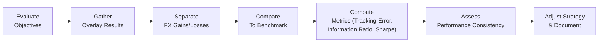

Currency overlay might seem like a fancy term at first. But in simple terms, it’s all about how we handle the foreign exchange (FX) exposure of a portfolio separately from the underlying assets. This can help ensure that you, or the institution you represent, are either hedging away foreign currency risk or actively seeking to generate alpha (that’s fancy speech for “excess returns”) from currency moves. It’s a fascinating process, although I’ll admit that the first time I saw a currency overlay manager in action, I felt a little overwhelmed by all the moving pieces. But trust me, getting to grips with the core ideas isn’t so bad once we break it all down.

This article focuses on a critical dimension of currency overlays: evaluating how successful (or unsuccessful) these programs have been. That means we’ll look at how to measure performance and isolate whether the currency strategy was actually worth the time, effort, and cost. We’ll also talk about how to interpret that performance in different market scenarios, because, as you know, the currency markets can get downright wild at times. Anyway, let’s dive in.

Understanding the Goals of Currency Overlay

A currency overlay is essentially a strategy to manage the foreign exchange exposure of an international investment portfolio. There can be multiple forms:

• A passive hedge that simply tries to neutralize the currency effect.  
• A fully active overlay that attempts to generate additional returns from currency fluctuations.  
• A hybrid approach that employs partial hedging plus tactical bets on certain currencies.

One key reason we separate out the currency exposure is that an investor might have a good reason to own foreign assets (for example, stocks in Europe or Asia), yet also wants to manage or exploit the swings in exchange rates. Sometimes, an investor just wants to reduce risk by removing currency volatility from the equation. Other times, they believe they can add a bit of alpha by selectively hedging certain currencies or occasionally going net-long or net-short. Regardless of the reason, once a currency overlay is in place, we need tools and metrics to see if it’s working.

Isolating the Currency Component of Returns

When a global portfolio invests in foreign assets, its total return is driven by two big factors:

1. The performance of the underlying assets themselves (like a European stock index or an emerging-market bond).  
2. The change in the exchange rate between the foreign currency and the investor’s base currency (e.g., hedging from euros back to US dollars).

Evaluating a currency overlay program involves extracting that second component. Practically, we look at how the FX decisions contributed to (or detracted from) the overall portfolio return, net of hedging costs. It’s a bit like checking how the sauce on your pasta dish tastes by itself—you want to know if it’s delicious or if it’s overshadowing the rest of the meal.

We typically compare the results with a reference point, also known as the currency benchmark. For a purely passive hedge, the benchmark could be a 100% hedged version of the portfolio. In an active overlay scenario, the manager might choose a neutral benchmark that is unhedged or partially hedged, depending on the agreed-upon strategy. The difference between the realized currency returns and the benchmark’s currency returns is our measure of effectiveness.

Performance Attribution Framework

Performance attribution helps us understand exactly what’s driving returns. In the context of currency overlays, we often split things into:

• Strategic Overlay Contribution: Did the long-term decision to systematically hedge or remain unhedged add or subtract value overall, after accounting for costs? This part is less about active trading bets and more about the baseline policy.  
• Tactical Overlay Contribution: How did short-term (or more frequently updated) currency positions create incremental gains or losses beyond the strategic posture?

In practice, we isolate the currency effect from the rest of the portfolio’s returns, then break it down into these two components. This approach is akin to dissecting the performance of a global equity portfolio into broad asset-allocation choices and finer stock-picking results. Here, the “stock picking” is replaced by tactical currency bets.

Here’s a little story: I once worked on an evaluation report for a fund that had a full currency overlay program in place. The manager insisted they had done “fantastically well,” but the sponsor was suspicious. Turned out that the fund’s overall equity holdings had soared (pure luck in an epic bull market), but the currency manager’s tactical bets had actually detracted from what the portfolio would have earned with a simple passive hedge. By applying a thorough performance attribution framework, we could identify the overlay’s negative contribution. The moral: thorough attribution is crucial if we want to avoid conflating the skill of your underlying investments with currency exposure management.

Metrics for Currency Overlay Performance

A variety of metrics exist for evaluating performance. The main ones include:

• Realized Currency Gains or Losses: The straightforward measure of actual profit or loss from fx trades or hedges.  
• Cost of Hedging: The difference between the forward currency rates used in a hedge and the spot rates at settlement, plus transaction costs and any associated fees.  
• Tracking Error: The volatility of the difference between the overlay’s performance and that of the relevant benchmark (often a passive hedge).  
• Potential Alpha: The part of returns above the cost of hedging and beyond what would have been achieved by a pure passive hedge.  
• Risk-Adjusted Ratios: For instance, the Sharpe ratio if we treat the overlay as a “mini portfolio,” or the information ratio comparing the overlay’s active return with its tracking error relative to the benchmark.

In formulas, the information ratio (IR) is often used to gauge skill. Let’s define:

• Rᵖ as the overlay’s return,  
• Rᵦ as the benchmark’s return,  
• σ₍ₚ₋ᵦ₎ as the volatility of (Rᵖ − Rᵦ).

We get:

$$
\text{Information Ratio} = \frac{(R_{p} - R_{b})}{\sigma_{(p-b)}} 
$$

If your currency overlay manager is consistently generating a positive IR, it suggests that their active decisions are adding value relative to the benchmark, net of risk. An IR that bounces around from strongly positive to strongly negative might indicate that the manager’s talent is mostly luck or that the style only works in certain market regimes. Some folks might prefer the Sharpe ratio, but the IR specifically focuses on how the manager is doing relative to the overlay’s stated benchmark.

Volatility of Results in Different Market Regimes

Remember how we said currency markets can get wild? Sometimes you’ll see trending markets where one currency is on a steady upward or downward path. Other times, you’ll be stuck in a sideways environment with random spikes and dips. The manager might do great in one environment (say, stable trends) and get hammered in sidewinders. This is why it’s important to look at results across different regimes. 

You can do this by segmenting your performance data by market conditions—bullish, bearish, or range-bound. If your overlay manager only makes money in strong trends, you should at least expect some lumps in sideways markets. This is normal. But if they claimed their approach works “everywhere,” and then you see big drawdowns in half of those regimes, a note of caution might be warranted.

Correlation with the Broader Portfolio

Another crucial aspect is correlation with the rest of the portfolio strategies. Let’s say you run an equity and fixed income portfolio where you’re already using certain hedging strategies or directional bets. If your currency overlay manager also pursues a strategy that drastically ramps up your exposure to, for example, emerging market currencies, you might unknowingly amplify your total portfolio’s risk. If you’re not monitoring correlation, you might be doubling down on risk factors you didn’t intend to. So, correlation analysis is part of the job—currency overlay shouldn’t exist in a silo.

Manager Due Diligence and Process Review

Overlay managers need to be supervised just like any other manager. You wouldn’t hand over your entire equity portfolio to a random manager without periodic check-ins, performance reviews, and an assessment of whether they’re sticking to the plan, right? Same approach here. Ideally, you conduct:

• Annual or semiannual due diligence sessions.  
• A review of the manager’s trade history, their compliance with risk guidelines, and the rationale behind their tactical decisions.  
• A consistency check of how the manager is implementing the overlay objectives that were spelled out in the investment mandate.

I recall a real-life scenario: one currency overlay manager was supposed to run a conservative hedge, but over time, their positions got more speculative—seemingly to chase higher returns. That pivot was never disclosed. Only after some large losses did the sponsor realize the manager had strayed far from the stated guidelines. Periodic due diligence might have caught these changes before the damage got big.

Shrinkage and Advanced Statistical Approaches

Currency returns can be notoriously volatile and “fat-tailed” (meaning big moves happen more frequently than you’d expect in a nice, tidy normal distribution). Some advanced managers use shrinkage techniques, Bayesian updates, or other fancy statistical frameworks to manage the data used in evaluating performance. Essentially, these approaches reduce the impact of extreme events when computing ex-ante forecasts of risk and return. 

For instance, you might see a scenario where an overlay manager uses an ex-post process with historical data, but they apply a shrinkage factor that brings outlier returns closer to the mean. This helps produce more reliable predictions for the next period—less prone to dramatic overreaction from a single crazy day of currency movement. Over time, these refined ex-ante forecasts can guide more stable hedge ratio decisions or highlight potential alpha opportunities.

Documenting Lessons Learned

Finally, no evaluation is complete unless we record the lessons learned and incorporate them into an updated plan. Maybe the main lesson is that the manager is delivering consistent alpha, or maybe the lesson is that overlay strategies are just a cost center offering minimal risk reduction. Either outcome is valuable information. The point is to incorporate that knowledge into your future strategy. As the currency environment evolves, your approach may need to adapt—and that feedback loop is critical to staying relevant.

Below is a simple conceptual diagram illustrating the evaluation process. Take a quick look:

In practice, each of these steps might be repeated multiple times per year, adjusting for monthly or quarterly results.

Practical Example

Let’s suppose a pension fund invests in a global equity portfolio denominated in various currencies: USD, EUR, GBP, and JPY. The pension’s base currency is USD. Our hypothetical currency overlay manager’s objective is to hedge anywhere between 50% and 100% of the currency exposure, depending on their macro view.

• Over a one-year period, the global equity portfolio gains 10% in local terms.  
• The US dollar strengthens against certain currencies by 5%, so the unhedged portion of the portfolio sees a slight negative impact from FX.  
• The overlay manager actively adjusts hedge ratios. Early on, they decide to hedge 80% of the EUR and 60% of the GBP exposure, while leaving the USD and JPY unhedged.  
• Over six months, the euro edge weaker while the pound rises. The hedge on the euro effectively avoids that negative impact, while the partial hedge on the pound reduces potential gains.  
• Net effect of the overlay? +0.5% after fees and transaction costs, compared to a purely passive hedge that would have yielded +0.3% in currency returns.

Evaluating success here involves seeing that the overlay added +0.2% alpha (the difference between +0.5% and +0.3%). But if it took too much risk (evident from a high tracking error or large drawdowns), we might question whether the manager’s approach was worth it. Adding a Sharpe or information ratio dimension clarifies if that excess 0.2% was truly efficient.

Risk-Adjusted Measures

The risk side of the story is super important. Did the manager take monstrous leveraged positions to earn that fraction of alpha? Did the overlay’s volatility spike at inopportune times? We can look at the Sharpe ratio of the overlay as we would any sub-portfolio:

$$
\text{Sharpe Ratio} = \frac{(R_{overlay} - R_{f})}{\sigma_{overlay}}
$$

where \\( R_{overlay} \\) is the overlay’s return, \\( R_{f} \\) is the risk-free rate, and \\( \sigma_{overlay} \\) is the overlay’s standard deviation of returns.

If the manager systematically hits a high Sharpe ratio in multiple periods, you’re probably dealing with a skilled currency strategist. On the other hand, a negative or near-zero Sharpe ratio might reveal that while the manager occasionally hits it big, they also experience frequent offsetting losses. Understanding how the manager performs relative to a risk-free measure is fundamental for deciding whether their fees are justified.

Integration with Overall Portfolio Risk

We’ve emphasized correlation with the broader portfolio, but it’s worth revisiting because it’s one of the biggest pitfalls I see. Sometimes people hire a currency overlay manager who does well in isolation, but when you mix that strategy with the rest of the fund’s positions, you find that your total risk might spike—especially if the manager’s positions line up with equity or credit exposures. A thorough evaluation will incorporate scenario testing: “What if global equities tank and the US dollar rallies? Will the currency overlay offset some losses or inadvertently magnify them?”

Exam Tips for CFA Candidates

• Watch out for scenario-based exam questions that ask you to dissect a currency overlay’s returns. You’ll typically need to isolate the overlay portion, measure alpha against a passive benchmark, and interpret risk-adjusted performance.  
• Be prepared to calculate or interpret tracking error, information ratio, and possibly the Sharpe ratio in a currency context.  
• The exam might throw in a question about correlation with the rest of the portfolio and how that influences total risk—be ready to do a quick calculation or a conceptual explanation.  
• Keep an eye on how currency overlay decisions relate to an Investment Policy Statement (IPS). The question might revolve around whether the manager is adhering to a specified hedge ratio or taking allowed off-benchmark positions.

Summary

Evaluating currency overlay programs means carefully isolating their effect on the total returns, comparing them against relevant benchmarks, and analyzing whether they meet long-term strategic objectives and short-term tactical goals. Key components of the evaluation process include:

• Identifying realized FX gains/losses and hedging costs.  
• Applying performance attribution frameworks to differentiate strategic vs. tactical overlay results.  
• Using risk-adjusted measures, such as the Sharpe ratio or information ratio, to assess whether active currency decisions added value relative to the risk incurred.  
• Investigating how overlay performance holds up across shifting market regimes.  
• Monitoring correlation with other portfolio strategies to avoid unintended risk concentrations.  
• Employing advanced statistical techniques (like shrinkage) to refine expected performance forecasts.  
• Maintaining robust documentation and frequent manager due diligence to ensure objectives remain aligned.

In the end, a currency overlay can function as a risk reducer or an alpha generator, or a little bit of both. Whether it succeeds hinges on the manager’s skill, the hedging framework, the cost of implementation, and how it all integrates with the rest of the portfolio. By following the thorough evaluation processes discussed here, you’ll be better equipped to figure out if that overlay manager is really worth their salt—or if they’re just adding to your sleepless nights.

References & Further Reading  
• Campisi, S. (2012). “Evaluating Currency Overlay Managers.” Journal of Investing.  
• CFA Institute. (2024). “Attribution Techniques for Overlay Strategies.” CFA Program Curriculum.  
• BlackRock Investment Institute. (2019). “Currency Hedging and Its Implications.”  

## Test Your Knowledge: Evaluating Currency Overlay Performance



### When isolating the currency component in an international portfolio, which of the following is the primary focus?

- [ ] The performance of the underlying assets in local currency.
- [ ] Risk factors related to equities and fixed income only.
- [x] The impact of exchange rate fluctuations on total returns.
- [ ] Variations in risk-free interest rates.

> **Explanation:** The goal is to separate how changes in exchange rates affect the portfolio’s overall returns, distinct from the underlying assets’ local performance.

### Which measure would a currency overlay manager use to assess risk-adjusted performance relative to a benchmark specifically dedicated to FX exposure?

- [ ] Sharpe Ratio
- [ ] Sortino Ratio
- [x] Information Ratio
- [ ] Maximum Drawdown

> **Explanation:** The information ratio compares the manager’s active FX return versus a currency benchmark, relative to the tracking error. The Sharpe ratio is also valid but is more general and compares returns over a risk-free rate rather than a specific overlay benchmark.

### A manager’s currency overlay returns appear excellent in trending markets but are lackluster in sideways markets. What does this suggest?

- [ ] The manager is skilled in all market conditions.
- [x] The manager’s strategy is heavily reliant on trend-following.
- [ ] Currency markets rarely experience sideways movements.
- [ ] Exchange rates are fully predictable in the long run.

> **Explanation:** Consistently strong returns in trending environments suggest a trend-following bias, which often suffers when markets consolidate or trade sideways.

### In performance attribution for a currency overlay, strategic contributions refer to:

- [ ] Short-term bets made based on technical indicators.
- [x] Long-term hedging or unhedging decisions made as part of policy.
- [ ] Intraday speculation on currency pairs.
- [ ] Unrelated asset allocation choices.

> **Explanation:** The strategic component is tied to long-term policy decisions—like deciding on a baseline hedge ratio over time—while tactical decisions (short-term bets) are evaluated separately.

### If the cost of hedging exceeds the FX gains in a passive hedge strategy, the currency overlay program will:

- [ ] Always produce negative returns.
- [ ] Automatically outperform an unhedged portfolio.
- [x] Underperform its benchmark if the benchmark is a full hedge.
- [ ] Not influence the portfolio's risk exposure.

> **Explanation:** If hedging costs eat up all possible gains, the overlay will likely trail a benchmark that assumes an effectively lower-cost or more efficient hedge.

### The correlation between the currency overlay and the rest of the portfolio is essential because:

- [x] High correlation might increase overall portfolio risk unintentionally.
- [ ] Low correlation guarantees high outperformance.
- [ ] Correlation does not affect total portfolio returns.
- [ ] Performance attribution is impossible without a correlation measure.

> **Explanation:** Correlation indicates how two return streams move together. If the overlay’s returns are highly correlated with existing risks in the portfolio, it could compound total risk.

### A currency overlay manager claims to hedge 80% of foreign currency exposure but quietly starts speculating beyond established limits. Which best practice helps catch such behavior?

- [ ] Rely solely on monthly return statements.
- [ ] Assume the manager always follows the guidelines.
- [x] Perform periodic manager due diligence and strategy reviews.
- [ ] Avoid setting a baseline hedge ratio altogether.

> **Explanation:** Regular due diligence (including real-time checks on positions and adherence to guidelines) is crucial to ensure the manager’s actual activities match the stated policy.

### In times of high currency volatility, shrinkage techniques in evaluating manager performance are used to:

- [ ] Remove the impact of volatility entirely.
- [ ] Exaggerate the performance dispersion of the manager.
- [x] Reduce the effect of extreme outlier data on performance forecasts.
- [ ] Convert actual returns to risk-free returns.

> **Explanation:** Shrinkage methods “pull in” outliers toward the mean to produce more stable (and often more realistic) estimates of risk and return in the face of extreme volatility.

### Which of the following best describes tactical overlay contributions?

- [ ] They are intended to hedge all currency exposures.
- [x] They represent short-term adjustments based on market conditions.
- [ ] They are exclusively linked to strategic long-term policy.
- [ ] They track passive currency index returns only.

> **Explanation:** Tactical contributions stem from active, short-term modifications to the currency hedge ratio or speculative positions that differ from the long-term policy stance.

### A currency overlay strategy shows a consistently positive information ratio compared to its benchmark. Is this evidence of value addition?

- [x] True
- [ ] False

> **Explanation:** Yes, a persistently positive information ratio indicates that the active currency decisions made by the manager add value relative to the benchmark, after adjusting for risk.




