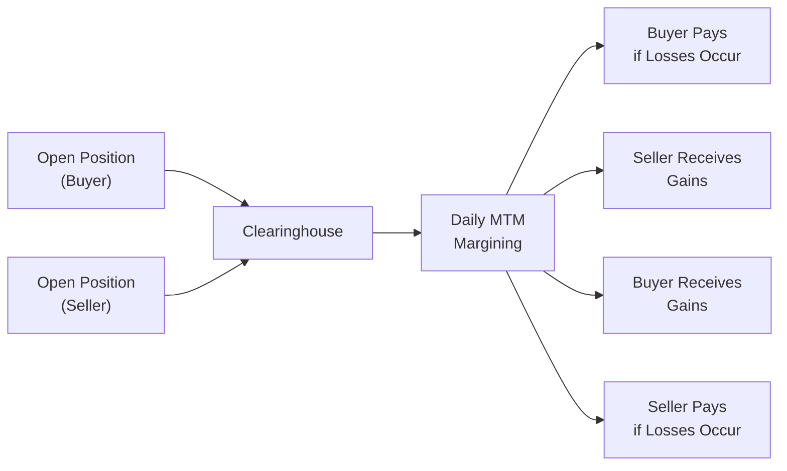
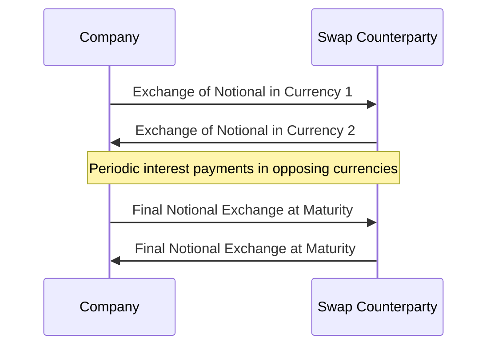

## Introduction

If you’ve ever traveled abroad and exchanged currency at the airport (probably hurriedly, and maybe a little worried that you might get a not-so-great rate), you’ve experienced a tiny taste of the foreign exchange (FX) market. Now, imagine doing that on a much bigger scale—like hedging millions or billions of dollars. This is where instruments such as forwards, futures, and currency swaps really come into play for portfolio managers.

These tools—collectively known as derivatives—help manage currency risks and exposures. They can look a bit intimidating at first, but once you get the hang of them, they become invaluable in a global investment toolkit. In this section, we’ll explore:
• How forwards differ from futures.  
• Why swaps are so popular for managing both currency and interest rate exposures.  
• Key operational factors like margining and credit support.  
• Practical considerations when deciding which instrument to use.  

Let’s jump right in and unpack these contracts in a friendly, step-by-step way.

## Key Distinctions Among Forwards, Futures, and Swaps

Most students I’ve met—myself included at one time—tend to lump forwards, futures, and swaps into a single category of “stuff that hedges currency risk.” While that’s broadly correct, these instruments each have distinct features. One might be more flexible, another might be more standardized, and a third might provide a more elegant solution to both currency and interest rate exposures.

### Forwards
A forward contract is basically a private agreement between two parties (often a bank and an investor) to exchange a certain amount of one currency for another at a predetermined exchange rate on a specific date in the future. Since it’s a private contract, you can tailor specifics such as the notional amount and maturity date to fit your exact needs. That said, with such customization comes counterparty risk: if the other side defaults, you’re out of luck unless you’ve got a mechanism like a collateral agreement or a credit support annex (CSA) in place.

#### Pricing and Interest Rate Parity
In principle, forward pricing is governed by covered interest rate parity, which (in simplified form) says that at initiation:


F = S \times \frac{(1 + i_d)^T}{(1 + i_f)^T},


where  
• \\( F \\) is the forward rate (domestic currency price of foreign currency),  
• \\( S \\) is the spot exchange rate,  
• \\( i_d \\) is the domestic interest rate,  
• \\( i_f \\) is the foreign interest rate, and  
• \\( T \\) is the time to maturity in years (or fraction of a year).

This means if domestic interest rates are higher than foreign rates, the forward price of the foreign currency will be lower than the spot rate (reflecting that you could earn more interest at home). In practice, banks quote “forward points” (premiums or discounts to the spot rate), which reflect these interest rate differentials.

If you’re curious how you might do a quick calculation, here’s a short Python snippet:

```python
spot_rate = 1.10  # USD per EUR
risk_free_domestic = 0.02  # 2% per year
risk_free_foreign = 0.01   # 1% per year
time_to_maturity = 1       # one year

forward_rate = spot_rate * ((1 + risk_free_domestic) / (1 + risk_free_foreign))**time_to_maturity
print(f"Forward rate for 1 year: {forward_rate:.4f} USD/EUR")
```

This simple snippet just applies the interest rate parity formula. Keep in mind real-world trading might incorporate more nuanced interest rates, day count conventions, and compounding frequencies.

### Futures
Futures contracts, by contrast, are standardized instruments traded on regulated exchanges such as the Chicago Mercantile Exchange (CME). You can’t customize the notional amount or maturity date—those are set by the exchange. So, you might see currency futures for commonly traded pairs (like EUR/USD) with standard contract sizes and expiration cycles.

#### Daily Mark-to-Market and Margin Requirements
One of the big differences is daily settlement, or “mark-to-market.” Every day, gains or losses on your open futures position are realized. If the market moves against you, you might receive a margin call, requiring you to top up your margin account. This daily settlement process reduces credit risk because the exchange’s clearinghouse effectively guarantees the trade (in exchange for its margin rules). It’s a more transparent system but might feel like a hassle if you want to just “set it and forget it,” because you must keep an eye on margin requirements.

#### Example of Daily Flows
Below is a simple Mermaid diagram showing how a futures contract’s daily mark-to-market might flow between the buyer and the seller via the exchange.



In a rising market (where the currency moves in favor of the buyer), the buyer is credited by the clearinghouse. Conversely, the seller must pay losses to the clearinghouse, which flows to the buyer’s account, and vice versa.

### Currency Swaps (and Cross-Currency Swaps)
A currency swap, sometimes called a cross-currency swap, involves exchanging principal and interest payments in one currency for principal and interest in another currency. This can be done with or without interest rate components—though, more commonly, you manage both the currency and interest rate exposure in a single contract. 

#### Typical Swap Structure
Let’s say you have a company issuing debt in euros but needing U.S. dollars. You could do a cross-currency swap: you pay interest and principal in euros to your swap counterparty, and in return, you receive interest and principal in U.S. dollars. At the inception, you typically exchange notional amounts. Upon maturity of the swap, you exchange the same notional amounts back.

Swaps are often used by corporations that have liabilities in one currency but want exposure in another—without having to pay higher financing costs. Portfolio managers can use them to transform certain assets or liabilities into an entirely different currency form for yield, diversification, or cost reasons.

You can visualize the flow in a simplified timeline:



#### Combining Interest Rate Swaps and Currency Exchange
Sometimes you’ll see the term “Cross-Currency Interest Rate Swap.” This is basically an interest rate swap layered on top of a currency swap. For instance, if you want to pay a fixed rate in EUR and receive a floating rate in USD, you could structure a cross-currency interest rate swap accordingly. It’s especially handy for global corporations or investment funds that want to manage both interest rate risk and FX risk in one package.

## Operational and Risk Considerations

### Margining and Collateral
• **Futures:** You provide initial margin (a good faith deposit) and must maintain the maintenance margin. Mark-to-market occurs daily. If your account dips below the maintenance margin, you get a margin call. This system greatly reduces credit risk.  
• **Forwards and Swaps** (OTC instruments): You’re dealing directly with a counterparty. If you sign a Credit Support Annex (CSA), it may require either party to post collateral based on the market value of the contract. This is similar to margining on an as-needed basis but is typically not daily.  

### Credit Risk vs. Liquidity Risk
• **Forwards:** Private contracts. High customization. Some liquidity risk (you can’t just exit easily without finding a new counterparty or renegotiating with the existing one). Also, you have exposure to counterparty default unless you have robust collateral arrangements.  
• **Futures:** Traded on an exchange with high liquidity, standardized sizes, and daily mark-to-market. Clearinghouse stands behind the trades, so less counterparty risk.  
• **Swaps:** Typically used for longer-term exposures. They can significantly reduce financing costs or alter the currency composition of assets/liabilities. But the credit risk can be higher than with exchange-traded futures. Collateral or CSA agreements are key.  

### Handling Forward Points and Futures Pricing
Remember that both forward and futures prices should reflect interest rate differentials, if no arbitrage opportunities exist. In futures markets, the daily settlement might cause small deviations in pricing, especially when short-term interest rates fluctuate.

In practice:
• Forward points for a currency pair might reflect the specific overnight or short-term interest rates in each currency.  
• Futures quotes come in standardized forms, like EUR/USD futures with a tick size of 0.0001.  
• The cost of carry and convenience yield concepts from commodity markets can be relevant to currencies, especially if there are constraints on short-selling or if there are capital controls in place.  

## Practical Selection Criteria

Choosing between a forward, a futures contract, or a currency swap usually depends on your objectives:

• **Flexibility**: If you need a highly customized contract size or unusual maturity date, a forward might be best. If you’re hedging a very standard currency exposure over a typical cycle (like a quarterly, widely traded contract), a futures contract may offer liquidity and transparency.  
• **Credit Risk**: If you’re concerned about your counterparty defaulting, futures are safer—they’re exchange-traded and guaranteed by the clearinghouse. But a well-structured forward or swap with a CSA can also mitigate credit risk effectively.  
• **Costs**: Futures typically involve exchange fees and margin calls, but no direct premium. Forwards and swaps often have embedded bid–ask spreads that might be larger for less liquid currency pairs.  
• **Time Horizon**: For short- to medium-term hedges, forwards and futures are common. For longer horizons, a currency swap can be more convenient, especially if you also want to swap interest payments.  

A real-world example is a U.S.-based asset manager who invests in European equities. She might want to hedge her euro exposure back to U.S. dollars. If it’s a short-term tactical bet, she might just use a futures contract on the euro, rolling it monthly or quarterly. If the exposure is large, or her client has a unique settlement date, she might arrange a forward contract. Or if she has a long-term liability in euros, she could engage in a currency swap to pay euros and receive dollars, effectively removing the currency risk from her liabilities.

## Illustrative Example: Hedging an Overseas Investment

Imagine you’re a portfolio manager at a large U.S. pension fund. You’ve decided to invest \$100 million in euro-denominated corporate bonds for diversification. But you’re worried about a decline in the euro relative to the dollar over your 1-year holding period.

- **Forward Approach**: You contact a bank and enter into a 1-year forward contract, agreeing to sell euros and buy dollars at, say, 1.0850 USD/EUR in one year. That locks in your exchange rate for when you convert any principal or coupon to USD.  
- **Futures Approach**: Alternatively, you could buy euro futures on the CME. The contract might be standardized at 125,000 euros per contract, so you’ll need multiple contracts to hedge \$100 million worth of euro exposure. You’ll deal with margin requirements. Gains or losses are “settled” daily in your futures account.  
- **Swap Approach**: If you plan a multi-year bond exposure and also want to alter the interest payments from euros to dollars, you could engage in a currency swap. You might swap your euro payments for USD payments at a certain exchange rate, effectively “locking in” your currency flow and interest rate exposure.  

In each scenario, you’re addressing currency risk, but the day-to-day operational mechanics and credit risk profile differ significantly.

## Common Pitfalls and Challenges

1. **Insufficient Collateral Management**: Misjudging your daily margin calls for futures or incorrectly forecasting your potential mark-to-market exposure on forwards/swaps can lead to liquidity crunches.  
2. **Settlement Mismatch**: If your asset matures in 45 days but your futures contract rolls in 30 days, you face a gap that must be managed.  
3. **Basis Risk**: The hedge might not move in perfect step with the underlying currency exposure, especially if you use an off-currency hedge or your instrument has a different underlying settlement mechanism.  
4. **Counterparty Risk**: Without a CSA, forward and swap contracts can expose you to the credit state of your counterparty over the contract’s life.  
5. **Regulatory Constraints**: Some countries impose legal hurdles or capital controls that make standard instruments costly or unavailable.  

## Best Practices and Strategies

- **Confirm Your Hedge Ratio**: Know exactly how much currency exposure you want to hedge. Over- or under-hedging can create undesired exposures or leave you partially unprotected.  
- **Monitor Interest Rate Differentials**: These drive forward/futures pricing, so if local or foreign interest rates change markedly, your hedge cost or payoff could shift.  
- **Leverage the Clearinghouse**: If your biggest worry is credit risk, exchange-traded futures can provide peace of mind at the cost of daily settlement (and potentially narrower contract terms).  
- **CSA Arrangements**: If you frequently use OTC contracts (forwards or swaps), a well-structured CSA clarifies how and when collateral is posted. This reduces the net credit exposure.  
- **Keep It Simple Starting Out**: If you’re new to currency derivatives, it’s often less stressful to start with a standard futures hedge. Once you’re comfortable, you can explore more refined solutions like swaps for more complex needs.

## Conclusion and Exam Tips

The interplay of forwards, futures, and currency swaps underpins the daily operations of global financial markets. For portfolio managers, each contract is like a different wrench in your toolbox. Forwards let you customize exactly what you need and when you need it. Futures give you standardized trading, liquidity, and the support of an exchange’s clearinghouse. And currency swaps—and particularly cross-currency interest rate swaps—can tackle both interest rate and exchange rate problems in one go.

For exam purposes, don’t forget:
• Understand how forward points relate to interest rate differentials (covered interest rate parity).  
• Be able to calculate the forward price, especially in multi-choice or item-set questions that test your knowledge of currency conversions.  
• Know the difference between exchange-traded futures (mark-to-market, margin calls) vs. OTC forwards (customizable, but carries counterparty risk).  
• Recognize the structure of a currency swap: initial notional exchange, periodic interest payments, and final notional exchange.  

Time-management tip: When dealing with a question about which instrument to use, quickly identify the relevant factors: horizon, customization, credit risk tolerance, and cost. This often reveals the “best fit” solution. Also, read the question carefully to see how the exam question frames the scenario—some details might hint strongly that “a standard futures contract is enough” or “a cross-currency swap is needed for a multi-year liability.”

## References for Further Study

- Hull, J. (2018). “Options, Futures, and Other Derivatives.” Pearson.  
- Magee, D., & Chambers, D. (2019). “Forward vs. Futures: Key Differences.” Investment & Wealth Monitor.  
- CFA Institute. (2023). “Swaps and Their Applications.” CFA Program Curriculum.  

These materials offer a deeper dive into the quantitative details, advanced hedging strategies, and practical usage guidelines. They’re excellent companions if you want to see more real-world examples or explore advanced pricing models.

---

## Test Your Knowledge: Forwards, Futures, and Currency Swaps



### Which of the following is a primary motivation for adopting cross-currency swaps?
- [ ] To achieve a strictly short-term hedge
- [x] To manage interest rate and currency exposures simultaneously
- [ ] To remove the need for collateral requirements
- [ ] To capitalize on intraday currency volatility

> **Explanation:** Cross-currency swaps combine currency exchange and interest rate components, allowing parties to manage both currency exposure and interest rate differentials in one instrument.

### Which statement best describes the difference between forward contracts and currency futures?
- [ ] Forwards typically have lower credit risk than futures
- [x] Forwards are customized and traded OTC; futures are standardized and exchange-traded
- [ ] Both are standardized contracts with daily mark-to-market
- [ ] Currency futures and forwards have identical margin requirements

> **Explanation:** Forward contracts are OTC instruments with negotiable terms, while futures are standardized contracts traded on exchanges with daily settlement.

### In a forward contract, “forward points” primarily reflect:
- [x] The interest rate differential between the two currencies
- [ ] The daily margin interest accruals on the contract
- [ ] The difference between notional amounts
- [ ] The credit spread of the issuing counterparty

> **Explanation:** Under covered interest rate parity, the forward rate is driven by the differential in interest rates between the two currencies. Forward points adjust the spot rate to reflect this difference.

### One advantage of futures over forwards for currency hedging is:
- [ ] Confidentiality of contract terms
- [ ] Lack of margin calls
- [x] Reduced counterparty risk due to clearinghouse guarantees
- [ ] Unlimited customization of contract maturities

> **Explanation:** Since futures are exchange-traded and guaranteed by the clearinghouse, the counterparty risk is lower compared to OTC forwards.

### Which of the following best characterizes the principal exchanges in a currency swap?
- [x] The principal is usually exchanged at inception and re-exchanged at maturity
- [ ] The principal is never exchanged in any form
- [ ] The principal is exchanged only if interest rates move beyond a pre-defined range
- [ ] The principal is exchanged daily based on mark-to-market calculations

> **Explanation:** In a typical currency swap, notional principals are exchanged when the swap begins and again at the end, with interest payments swapped periodically in between.

### An investor seeking a hedge for a small, non-standard currency holding for an exact 75-day period would likely prefer:
- [x] A forward contract, because it can be customized to the exact maturity needed
- [ ] A currency swap, because it typically includes daily margin calls
- [ ] A standardized futures contract with an 85-day maturity
- [ ] A cross-currency swap to eliminate principal exchange

> **Explanation:** For a non-standard holding and period (75 days), a forward is the easiest to customize.

### Daily mark-to-market applies to which contract type?
- [x] Currency futures
- [ ] Forwards
- [x] Some exchange-traded swap products
- [ ] Physical currency notes

> **Explanation:** Standard currency futures undergo daily marking to market, and some exchange-traded swap-like products may also have daily settlement. Traditional forwards do not.

### What is a key characteristic of margin requirements in futures contracts?
- [x] They require both an initial margin and a maintenance margin
- [ ] Margin is paid at maturity only
- [ ] Margin changes are prohibited before expiration
- [ ] Margin calls are optional for exchange-traded contracts

> **Explanation:** Futures contracts require traders to post initial margin and maintain maintenance margin levels, ensuring the clearinghouse is protected from credit risk.

### Which situation commonly creates basis risk in currency hedging?
- [x] When the hedge instrument and the underlying asset do not move in perfect tandem
- [ ] When the currency spot rate is higher than the forward rate
- [ ] When both instruments settle on the same date
- [ ] When the domestic interest rate is lower than the foreign interest rate

> **Explanation:** Basis risk arises when the hedging instrument doesn’t perfectly correlate with the movement of the hedged asset, leading to imperfect offsets in gains and losses.

### A portfolio manager chooses to hedge currency risk using a cross-currency swap rather than a series of forward contracts. Which statement is most likely true?
- [x] The manager wants to lock in both currency exchange and interest rate payments drawn from different currencies
- [ ] The manager is seeking to benefit from daily mark-to-market price movements
- [ ] The manager desires a short-term hedge with minimal counterparty exposure
- [ ] The manager wants an exchange-traded product with standardized maturities

> **Explanation:** A cross-currency swap is typically used to manage both currency and interest rate risks simultaneously over a longer horizon.


