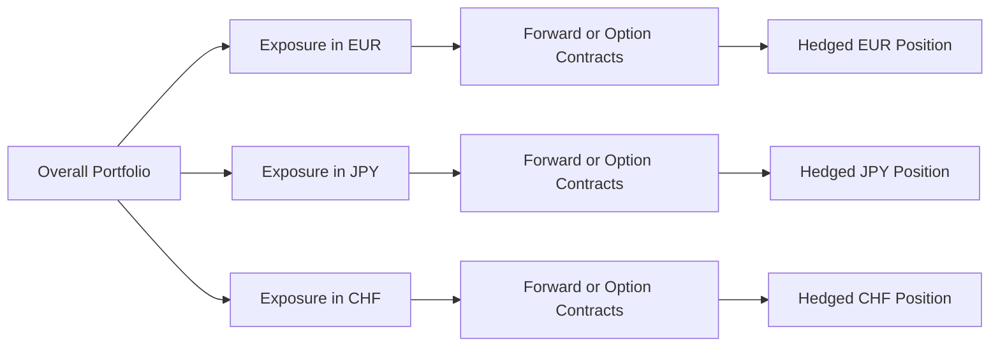

## Introduction

I remember, back in my early days on a small trading desk, we had a big client who imported machinery from across three continents. Every month, they faced unpredictable swings in currency values, especially concerning the euro, USD, and yen. We tried simple forward contracts, but, well, that quickly got messy because we had different deliveries in different months, and we kept rolling half the time. That’s when we realized we needed a more advanced approach—layered hedges and multi-currency hedging structures—to manage the whole rampaging beast.

In global portfolios, the complexity of currency exposures can be overwhelming. You might have euro obligations, sterling receipts, a yen-denominated asset, and—just to spice things up—a few exotic currencies in emerging markets. A straightforward forward might not cut it. Complex currency hedging strategies are there to help, but they require sophisticated modeling, a clear understanding of correlation risk, and a robust governance framework. Let’s dig into how these strategies work, and how you might tame that multi-tentacled currency monster.

## Layered Hedging Structures

Layered hedging (sometimes called rolling hedging or laddering) involves staggering multiple derivative contracts—often forwards or futures—with overlapping maturities to manage currency exposures over time. The idea is to avoid a single large hedge rollover on a specific date, which might coincide with an unfavorable shift in exchange rates.

### How Layered Hedging Works

1. You split your total exposure into segments.  
2. Each segment is hedged with a separate forward contract or, in some cases, a swap.  
3. The maturities of these contracts are spaced out at intervals (e.g., monthly or quarterly) that align with your projected cash flows.  
4. As each contract nears maturity, you roll it forward, but only for a fraction of the total exposure—thus smoothing the potential impact of exchange rate volatility.

It might help to think of it like building a ladder with each rung representing a segment of your currency exposure. When one rung expires, the next rung is still in place, and you keep replacing each rung over time. This approach is especially useful when you have regular, predictable foreign currency cash flows (like monthly imports or exports).

#### A Quick Example

Suppose you expect to pay €1,200,000 over a 12-month period. Instead of executing one big forward contract for the entire amount for exactly 12 months, you might choose four separate three-month forward contracts of €300,000 each, each offset by a month in start date. Each contract helps hedge a portion of the exposure, so that any single major rate move affects only part of your total position.

## Multi-Currency Exposure Considerations

It gets more complicated when your portfolio or your business has exposure in multiple currencies. Let’s say you have significant liabilities in euro, assets generating yen profits, and some minor obligations in the Swiss franc as well. The biggest challenge is ensuring that, at rebalancing points, one hedge doesn’t offset the positive effect of another currency’s appreciation or depreciation unintentionally—leading to cross-currency mismatch.

### Coordinating Hedges

When implementing multi-currency hedges:

- Identify the net exposures for each currency pair.  
- Decide on the appropriate derivative instrument for each currency (forwards, swaps, vanilla options, or more complex structures).  
- Track correlations among currencies; for instance, the euro and Swiss franc might move in somewhat similar directions against the dollar, though not perfectly, so hedging decisions for these two might require a combined analysis.

Below is a simple diagram illustrating how interwoven multi-currency hedges can look:



Each currency exposure is addressed with an appropriate derivative structure. Yet the portfolio manager must track how they all move together and whether there is net overhedging or underhedging across the basket. Essentially, you’re juggling multiple balls without letting one slip.

## Option-Based Currency Hedging

Sometimes, we want to leave the door open for potential currency gains. Options can be fantastic for that if we can handle the premium costs. Options confer optionality—the right but not the obligation to buy or sell a currency at a predetermined strike price.

### Why Use Options?

- Asymmetric payoff: You can hedge downside risk yet still benefit if rates move in your favor.  
- Flexibility: You can tailor strike prices, maturities, and payoff structures.  
- Controlled risk: Maximum loss is limited to the option premium (if you’re a buyer).

#### Example: Buying a Put Option

Imagine you’re a U.S.-based investor who bought shares of a European company, and you plan on selling it in six months once the position matures. You fear a decline in the EUR/USD exchange rate. You could purchase a EUR put/USD call option to lock in a minimum sale price for your euros. The cost is the premium, which might be small or large depending on market volatility and time to expiration. If the euro falls significantly, your put option gains value, offsetting your currency losses on the underlying asset. If the euro rallies, you can simply let the put expire worthless and keep the gains on the currency side.

## Collar Strategies

A collar strategy might come in handy when you want to hedge some downside but also don’t want to pay a big premium for a plain-vanilla option. A currency collar typically involves:

- Buying a put option to protect against adverse currency movements.  
- Selling a call option on the same notional amount (and often around the same maturity) to generate premium income.  

In many cases, the premium received from selling the call helps offset or fully cover the cost of buying the put. The tradeoff is that your upside is capped if the exchange rate moves favorably. Still, collars can be a neat way to get partial protection at a more manageable cost.

### Visual Representation of a Collar Payoff

Below is a simplified payoff chart (ignoring premiums for clarity):

```mermaid
graph LR
    A["Exchange Rate Falls"] -- Gains from Put -> B["Collar Payout"]
    A["Exchange Rate Rises"] -- Loses from Sold Call -> B["Collar Payout"]
    A["Stays in Middle"] -- Minimal Impact -> B["Collar Payout"]
```

The idea is: if the exchange rate falls below the put strike, the put offsets losses; if it rises beyond the call strike, your gains on the underlying currency exposure stop because you “sold away” that upside.

## Digital (Binary) Options

Digital or binary options pay a fixed amount if the underlying currency crosses a specified threshold at maturity. Some advanced currency hedges might layer in these binary payoffs for targeted event protection—perhaps to guard against a big shock in an emerging market currency. They can be cheaper at times (since they have no payoff in a moderate scenario) but are generally considered more speculative or specialized. 

These instruments can be combined with standard forwards or vanilla options to create unique payoff profiles, similar to structured notes.

## Complex Payoff Structures and Structured Notes

If you think standard forwards, swaps, or options don’t precisely match your exposure, some investment banks or specialized providers can engineer bespoke structured notes embedding multiple derivatives and features. For instance, a single note might:

- Provide partial upside in one currency,  
- Have a digital payoff if a second currency crosses a barrier,  
- Include a corridor structure that gradually increases payoff as an exchange rate migrates within a band.

These multi-leg swaps or notes are designed to match specific risk tolerances, cost constraints, and market views. Of course, you’ll want to keep an eye on the complexity: ironically, a “guaranteed” structure can hide substantial embedded costs or basis risks. 

## Correlation Risk

When you have more than one currency in play (and who doesn’t in a global portfolio these days?), correlation risk becomes a big deal. If two currencies move together more than expected, your “diversification” might be less effective than you hoped. Conversely, if they diverge in a sudden shift, that can also wreak havoc on your hedging program.

### Practical Modeling Approaches

- Correlation Matrices: Estimate pairwise correlation among currencies using historical data, but keep in mind that correlations shift in times of crisis.  
- Scenario Analysis: Construct stress scenarios (e.g., a major recession in the eurozone, an Asian market meltdown) to see how your entire currency hedge package might perform.  
- Regular Recalibration: Update your correlation assumptions at least quarterly, or more often if macro conditions are shifting dramatically.

## Operational and Regulatory Nuances

Now, I once had a friend who tried to hedge an exposure in a currency with strict capital controls—the bureaucracy alone was mind-boggling. Emerging market currencies often bring extra operational complexities, from local regs to limited liquidity, drastically impacting both the cost and feasibility of certain hedges.

- **Capital Controls:** Some countries restrict how much local currency can exit or how many forward contracts foreigners can hold. This can lead to onshore vs. offshore pricing differences (like the typical onshore vs. offshore renminbi market in China).  
- **Tax and Accounting:** Gains or losses on currency hedges may trigger immediate taxable events, or require specialized accounting treatment in different jurisdictions.  
- **Legal Documentation:** Cross-border derivative contracts can be subject to local netting opinions, collateral rules, and sign-off from local regulators.

Being aware of these factors isn’t just a nice-to-have; it’s crucial to anticipating friction costs and ensuring your hedge actually works as intended.

## Risk Modeling and Hedge Effectiveness

A critical aspect of complex hedges is making sure you’re measuring hedge effectiveness accurately and continuously. This typically involves some combination of:

- **Basis Risk Analysis:** Are the instruments used perfectly matching your exposures, or is there a mismatch (e.g., using a similar but not identical currency pairing)?  
- **Mark-to-Market Monitoring:** Even if your hedge is “effective,” large daily mark-to-market swings can trigger margin calls—affecting liquidity.  
- **Greeks and Sensitivity Analysis:** For option-based structures, measuring delta, gamma, vega, and theta can provide insight into how quickly or severely your hedge’s value can change with the exchange rate or volatility shifts.

In practice, portfolio managers and risk analysts set up dashboards to track exposure, hedge coverage ratio, and realized vs. expected outcomes. This fosters decisions like whether to roll a portion of a layered hedge earlier or to adjust collar strikes midstream.

## Putting It All Together: A Case Study

Let’s say you’re an asset manager dealing with a multi-asset international portfolio:

- 40% in U.S. equities (USD exposure),  
- 30% in eurozone equities (EUR exposure),  
- 20% in Japanese bonds (JPY exposure),  
- 10% in an emerging market currency like the Brazilian real (BRL).

You might do a layered forward hedge for your EUR exposure, because you’ve got consistent rebalancing into and out of European stocks. Meanwhile, with JPY you might use an option-based structure—say, a collar—if you want to limit downside risk but keep some of the upside if the yen appreciates. For your BRL exposure (which can be extremely volatile), you might consider a partial hedge with a digital option that triggers if BRL depreciates beyond 15% from today’s level, offset by a standard forward on half the notional. 

All these pieces have to be monitored together, as the correlations among USD, EUR, JPY, and BRL can shift dramatically in stressful markets.

## Best Practices and Pitfalls

- **Start with a Clear Mandate:** Know your hedging objectives—are you mitigating volatility, locking in cash flows, or speculating on favorable currency moves?  
- **Assess Liquidity Constraints:** Complex hedges often involve less liquid instruments, especially in emerging markets—be mindful of bid-ask spreads and the possibility of large slippage.  
- **Regularly Review Hedge Ratios:** Don’t “set it and forget it.” Reassess coverage ratios as your portfolio’s composition evolves or if market conditions shift.  
- **Model Stress Scenarios:** Currency crises happen (just ask anyone who lived through the Asian Financial Crisis, or more recently, big swings in the Turkish lira).  
- **Educate Stakeholders:** Complex hedges can be confusing. Keep clients, senior management, or board members informed via simple dashboards and scenario analyses.

## Final Exam Tips

For the CFA exam, especially on scenario-based questions, be ready to:

- Explain the rationale behind choosing a layered hedge vs. a single forward.  
- Contrast the benefits of an option-based strategy (with premium costs) to a forward-based strategy (with no upfront cost).  
- Calculate potential outcomes of a collar strategy, highlighting the strike prices.  
- Discuss how correlation risk can compromise multi-currency hedges.  
- Evaluate how local regulations or capital controls might affect hedge implementation.  

Time management is key. If you see a question with multiple sub-questions about currency hedging, systematically identify the exposure, pick the correct derivative tool, and demonstrate the payoff or outcome under various scenarios. Don’t go off on tangents; stay focused on the question’s specifics and show your ability to handle real-world complexities.

## References and Further Reading

- Brealey, R., Myers, S., & Allen, F. (2020). “Principles of Corporate Finance.” McGraw-Hill.  
- Della Maestra, F. (2017). “Advanced FX Option Strategies.” Journal of Derivatives.  
- CFA Institute. (2023). “Complex Currency Management Techniques.” CFA Program Curriculum.  

---

## Test Your Knowledge: Complex Currency Hedging Strategies



### A portfolio manager decides to use a layered hedging approach for currency exposures. What is the primary benefit of layered hedges over a single large forward?

- [ ] Achieving the highest possible returns on the underlying currency exposure
- [x] Smoothing the impact of exchange rate fluctuations over time
- [ ] Eliminating all transaction costs for hedges
- [ ] Increasing speculative leverage

> **Explanation:** Layered hedges involve multiple forward positions with staggered maturities, reducing the risk that a single rollover date will coincide with unfavorable exchange rates.

---

### An investor owns European assets and expects to sell them in six months. To hedge against a fall in the euro’s value, the investor buys a euro put. Which of the following best describes the nature of this hedge?

- [x] It offers downside protection with the possibility of letting the option expire if exchange rates move favorably
- [ ] It requires no premium payment and unlimited upside potential
- [ ] It eliminates both downside and upside risk
- [ ] It imposes an obligation to sell euros at a predetermined strike price

> **Explanation:** A put option confers the right (not obligation) to sell euros, providing downside protection for a premium cost while still allowing the investor to benefit from favorable euro strength.

---

### In a collar strategy, which of the following statements is correct?

- [ ] The upside gains are unlimited, but there is no downside protection
- [ ] There is no impact from currency movements beyond the sold call strike
- [ ] Premium paid for the put is always higher than the premium received for the call
- [x] The strategy provides downside protection at the cost of capping upside potential

> **Explanation:** A collar involves buying a put to hedge downside, while selling a call to offset the put’s premium. This limits upside gains if the currency appreciates beyond the call strike.

---

### When managing multi-currency exposures, the main reason to assess cross-currency correlation is to:

- [ ] Obtain guaranteed currency diversification
- [x] Understand the potential for simultaneous adverse moves in multiple currencies
- [ ] Predict future returns with perfect accuracy
- [ ] Ensure that each currency is hedged identically

> **Explanation:** Correlation risk can result in multiple currencies moving adversely at the same time. By monitoring cross-currency correlation, managers can adjust hedges to avoid unintended concentration risk.

---

### An onshore/offshore pricing discrepancy often arises for currencies subject to capital controls. How might this impact hedging?

- [ ] It eliminates any need for hedging, as prices converge
- [x] It can create higher costs or limited liquidity in the offshore market
- [ ] It mandates using only swaps, not forwards
- [ ] It boosts transparency, reducing bid-ask spreads

> **Explanation:** Capital controls can lead to pricing differences between onshore and offshore markets, escalating transaction costs or limiting liquidity for hedging instruments.

---

### A digital (binary) option on a currency typically:

- [x] Pays a fixed amount only if the currency crosses a specified barrier
- [ ] Has a linear payoff that increases with currency appreciation
- [ ] Eliminates the need for capital in hedging
- [ ] Combines multiple notional amounts into a single contract

> **Explanation:** Digital options pay a discrete, fixed amount if the currency finishes above (or below) a predetermined level, unlike the continuous payoff of vanilla calls or puts.

---

### An investor sells a call option on EUR/USD to partially finance the purchase of a put option. Which best describes the structure?

- [ ] A synthetic zero-cost swap
- [ ] A calendar spread
- [x] A collar strategy
- [ ] A currency futures straddle

> **Explanation:** Selling a call to fund the purchase of a put on the same currency exposure is a classic collar arrangement.

---

### If a fund manager wants to protect against large currency moves but does not want the cost of standard options, which structure might be considered?

- [ ] Naked call option
- [ ] Plain vanilla currency swap
- [x] Currency collar
- [ ] No hedge is necessary

> **Explanation:** A collar strategy involves buying a put and selling a call (or vice versa), reducing or eliminating the net premium cost while offering partial protection.

---

### Which of the following is a disadvantage of a multi-leg layered hedge approach?

- [ ] Perfect correlation is guaranteed
- [x] There can be incremental transaction costs associated with rolling multiple positions
- [ ] It results in zero volatility of currency exposures
- [ ] It prohibits partial hedging strategies

> **Explanation:** Layering multiple forward contracts can increase transaction costs and administrative complexity compared to a single hedge.

---

### True or False: A complex structured note can embed multiple currency options, effectively tailoring the payoff to the investor’s specific risk tolerance and market view.

- [x] True
- [ ] False

> **Explanation:** Structured notes can include various embedded derivatives—such as digital options, currency swaps, or collars—to match the investor’s desired payoff profile.


