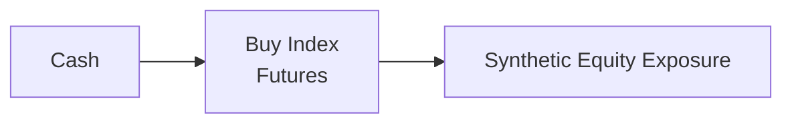

## Introduction

Have you ever wanted the returns of a specific stock index or currency pair without actually purchasing the underlying assets outright? Well, that’s where synthetic exposures come in! By using derivatives—like futures, forwards, and swaps—you can replicate the economic performance of a physical or “cash” market position. In other words, you can lock in something that looks and feels like ownership (or a short position) in an asset class without needing to hold the asset in your portfolio. It’s sort of like pretending to live in a fully furnished show home (in a good way), where you get the amenities without the long-term ownership burdens.

This flexibility has profound implications for portfolio management. You can shift your strategic or tactical exposures pretty darn fast, potentially slice your trading costs, and even circumvent certain trading restrictions that come with directly holding assets. But, as always in finance, synthetic positions carry their own set of nuances regarding liquidity, margin requirements, counterparty risk, and more. This section will introduce you to the concept of synthetic exposures, how derivatives replicate “real” positions, and the related benefits, pitfalls, and best practices.

## Why Synthetic Exposure Matters

Synthetic exposures are no gimmick. They are super important because:

• Speed of Execution: Need to pivot your portfolio’s equity allocation overnight? Rather than individually transacting in dozens of stocks, you might buy or sell an index futures contract in one fell swoop.  
• Lower Transaction Costs: In some cases, trading derivatives (especially on liquid exchanges) can be more cost-effective than physically assembling a portfolio of securities.  
• Capital Efficiency: Derivatives often require only a margin (collateral) deposit rather than the full notional amount, freeing up capital for other investment opportunities.  
• Tax Considerations: Depending on the jurisdiction, the gains and losses realized from derivatives might be taxed differently than those from direct holdings.  
• Access to Hard-to-Trade Markets: In illiquid or restricted markets, it might be easier to replicate an exposure synthetically than to invest in the underlying securities.  

Sometimes I joke that synthetic exposures are like renting a place for the ski season: if you just want the best slopes (returns) without the year-round maintenance costs (storage, custody, or illiquidity), a synthetic might be your answer.

## Key Building Blocks of Synthetic Positions

When creating a synthetic position, you basically rely on the unique payoff structure of a derivative (or a combination of derivatives). Let’s walk through some fundamental derivatives you’ll likely use:

### Futures and Forwards

• Futures: Standardized contracts traded on an exchange, where you agree to buy (or sell) a specific asset at a set price on a future date. Examples include equity index futures (like S&P 500 futures) and currency futures.  
• Forwards: Customized contracts (traded over-the-counter, or OTC) with more flexibility regarding expiration and underlying assets. Currency forward contracts can be used to lock in an exchange rate or gain synthetic exposure to a foreign currency.  

By buying an equity index future, you effectively gain the returns of that index—price gains plus dividends (indirectly embedded in the futures pricing)—minus the financing cost implied in the futures price.

### Swaps

• Total Return Swap (TRS): Allows you to receive the total return (price appreciation plus dividends) of an asset (like a stock index) while paying a floating interest rate (plus or minus a spread).  
• Interest Rate Swap (IRS): Exchange fixed interest payments for floating interest payments or vice versa. This might come in handy for altering your fixed income exposure synthetically.  

These can be super handy in “portable alpha” strategies (discussed later), where you receive total return from one index and pay something else, effectively transferring the alpha you generate onto a different beta exposure.

### Options

• Calls and Puts: While typically used for hedging, options can be constructed to provide synthetic exposures. For instance, a protective put combined with a bond position can replicate a call option payoff, giving you equity-like upside with limited downside.  
• Option Spreads: Various combinations of calls and puts can provide upside or downside payoffs that mimic certain asset exposures.

## Creating Synthetic Equity Exposure

Let’s say you want to “buy” an equity market without physically holding the stocks. Perhaps you want the performance of the S&P 500 but don’t want to slash through the administrative tasks of rebalancing a big basket of individual stocks. One straightforward way is:

1. Buy S&P 500 Index Futures.  
2. Maintain cash in short-term instruments or margin accounts to support those futures.  

By doing so, your portfolio’s return approximates the performance of the S&P 500, subject to small differences like transaction costs and the cost of carry. Easy, right?

#### A Simple Example

Suppose your portfolio has $1 million in cash, and you want to gain exposure equivalent to an S&P 500 basket worth $1 million:

1. You check that each futures contract on the S&P 500 has a notional value of, say, $250 times the index level. If the index is at 4,000, one contract has a notional value of $1,000,000 ($250 × 4,000).  
2. You buy one futures contract.  
3. You post margin, say 5% of notional (which is $50,000). The remaining $950,000 could be used for other investments or kept in a money market fund for liquidity.  

Now your returns will largely mirror the S&P 500 index. But remember, if that index drops significantly, you could face margin calls requiring you to bring in additional cash.

## Currency Exposures

Synthetic currency exposures are also quite common. Suppose you want exposure to the euro (EUR) but are holding U.S. dollars (USD). You could:

• Buy EUR through currency futures on an exchange.  
• Enter a forward contract to buy EUR in the OTC market at a specified date.  

In both cases, you effectively secure the economic returns associated with holding euros without physically converting your USD into EUR. This might be super useful if your investment guidelines or local capital controls limit direct currency transactions.

## Cost and Financing Considerations

“Okay,” you might say, “this synthetic stuff seems great—why doesn’t everyone just do it all the time?” As always, there are costs and risk factors:

• Bid-Ask Spreads and Commissions: Even though derivatives can be liquid, wide bid-ask spreads or high commissions can eat into your returns.  
• Margin Requirements: Futures and some swaps require margin or collateral. If your underlying portfolio uses up that capital, it might hamper your flexibility.  
• Embedded Financing Cost: Futures prices incorporate the cost of carry—meaning if interest rates are high, or if the underlying pays dividends, the futures price might reflect that.  
• OTC Credit Risk: For forwards and swaps, you deal with a counterparty. If they default, you might lose that hedge or exposure. Exchange-traded instruments reduce this risk through clearinghouses.  

Some folks do extensive cost modeling before jumping into synthetic exposures because, for instance, large positions in currency swaps might become expensive or risky if the swap spreads widen. It’s like rummaging through the grocery store sale bins: sure, it might be cheaper overall, but watch out for hidden catches.

## Risk Management and Counterparty Considerations

In earlier chapters, you saw how crucial it is to manage risk across all your exposures. With synthetic positions, the key differentiators are:

• Counterparty Risk: In the OTC market, especially for custom swaps, you’ll need robust credit analysis. Don’t skip out on due diligence.  
• Liquidity Risk: Sometimes, the derivative you need might not have a deep market, or it might be expensive to roll over (like certain currency forwards).  
• Mark-to-Market Process: Because derivatives fluctuate in value, you’ll be posting (or receiving) variation margin. This can introduce cash flow volatility, requiring you to keep extra liquidity on hand.  
• Portfolio Guidelines: Ensure that your Investment Policy Statement (IPS) permits derivative usage. Synthetic exposures can sometimes get complex, and you’ll want to be sure you comply with legal and regulatory constraints.

## Portable Alpha Strategies

A particularly exciting (well, as exciting as finance can get) concept is “portable alpha,” where alpha from one market is “ported” onto another market’s beta. It goes something like this:

1. You have a skilled manager who can generate alpha in a specialized area—say small-cap equities.  
2. You simultaneously want exposure to the broad equity market (S&P 500).  
3. Instead of physically holding the S&P 500, you invest your cash in the alpha strategy (small cap) and use derivatives (like index futures) to overlay or replicate the S&P 500’s beta return on top.  

In that sense, you can capture alpha from your manager while still locking in normal market exposure. You see this used quite a bit in hedge fund or multi-asset strategies. Managing it, though, involves keeping track of correlations, margin usage, and the dreaded “double whammy” if the alpha portion and the synthetic beta portion both go against you. Yikes.

## Regulatory and Tax Aspects

Different regions treat derivative transactions differently for tax and regulatory purposes. In some jurisdictions, capital gains realized through futures might be taxed at a different rate than gains realized from direct ownership of the underlying asset. Additionally:

• Short-Term vs. Long-Term Gains: The holding period for derivatives can differ from that for the underlying securities.  
• Wash Sale Rules: Some tax codes have rules (e.g., in the U.S.) that can restrict claiming losses if a substantially identical position is re-established within a short window.  
• Regulatory Reporting: Large derivative positions might require additional disclosures to regulators (like the CFTC in the U.S. or other local authorities).

Anyway, always consult with a tax professional or a compliance officer before piling into derivatives. That’s probably the least exciting but most important part of the conversation, trust me.

## Practical Example of Implementation

Here’s a quick scenario from personal experience (slightly sanitized, of course). Some years back, I was working with a portfolio manager who wanted immediate exposure to European equities but faced operational delays opening custody accounts overseas. Instead of waiting around, they turned to Euro Stoxx 50 futures to gain synthetic exposure. Within an hour, they replicated a $10 million position, effectively tracking that market without physically owning the stocks. Later—once the back-office stuff was sorted out—they unwound the futures position and transferred to direct share ownership. The quick pivot avoided the risk of missed market opportunities.

## Diagrams: Synthetic Replication Flow

Below is a simple Mermaid diagram showing how you might structure cash plus a derivative to create a synthetic equity position:

In straightforward terms, you hold your cash in a margin account and use a futures contract to get the equity market’s exposure.

## Best Practices and Potential Pitfalls

• Diversify Counterparty Relationships: Relying on a single counterparty for large OTC trades can be risky.  
• Monitor Margin Requirements: Be prepared for margin calls in volatile markets—having to scramble for cash can be super unpleasant.  
• Align with IPS Guidelines: Always double-check your official mandate or any client-imposed restrictions on derivatives usage.  
• Mind Roll Costs: Many derivative contracts have expiration dates. Rolling them requires paying spreads and transaction fees, which can eat into returns.  
• Model Scenario Analysis: Stress test your synthetic positions under extreme market conditions or sudden liquidity shifts.  

## Exam Tips and Key Takeaways

1. Don’t Underestimate Financing Costs: Factor in the cost of carry or implied interest rates embedded in futures and forwards.  
2. Understand the Payoff Structures: Distinguish between total return swaps, interest rate swaps, and just plain-vanilla futures. Each has unique cost and risk impacts.  
3. Watch Out for Operational Risks: Documentation errors or incorrect position sizing can wreak havoc. Keep rigorous records!  
4. Know Why You’re Doing It: Synthetic exposures should align with either a strategic or tactical goal—it’s not “derivatives for derivatives’ sake.”  
5. Remember the Implementation Timelines: Derivatives can be fast, but settlement timelines, margin calls, and periodic contract rolls are part of the puzzle.

In the CFA exam context, you’re likely to see scenario-based questions where you have to decide if a synthetic approach is cheaper or more efficient than a physical approach, or how to handle margin calculations, or how to best measure and manage the embedded risks. Time management is crucial—practice explaining the rationale of synthetic exposures succinctly while also demonstrating you’ve considered the risk, cost, and regulatory angles.

## References and Further Reading

- Pope, P. (2018). “Derivatives-Based Strategies for Synthetic Exposures.” CFA Institute Conference Proceedings.  
- Ebrahimi, T. (2021). “Portable Alpha in Practice: Evidence from Hedge Fund Strategies.” Journal of Alternative Investments.  
- CFA Institute. (2023). “Synthetic Positions and Their Applications.” CFA Program Curriculum.

## Test Your Knowledge: Synthetic Exposure and Portable Alpha



### Which of the following best describes a synthetic exposure?
- [ ] Directly purchasing the underlying asset with borrowed funds.  
- [ ] Earning risk-free interest in a money market account.  
- [x] Replicating a physical market position by using derivative instruments.  
- [ ] Allocating a portion of a portfolio into a foreign market’s short-term bonds.  

> **Explanation:** Synthetic exposures replicate the returns of an asset or index without direct ownership, typically through derivatives such as futures, forwards, or swaps.

### What is one advantage of using futures for synthetic exposure?
- [ ] Eliminates all counterparty risk, including exchange default risk.  
- [ ] Guarantees a lower cost than cash markets in every scenario.  
- [x] Often requires less initial capital outlay (margin) compared with direct purchases.  
- [ ] Provides indefinite exposure without the need to roll over contracts.  

> **Explanation:** Futures typically require a margin deposit rather than the full notional amount, thereby increasing capital efficiency. However, rolling futures and monitoring counterparty risk through the clearinghouse are necessary considerations.

### In a portable alpha strategy, alpha and beta refer to:
- [x] Separating outperformance (alpha) from market exposure (beta) and combining them flexibly.  
- [ ] Two identical measures of risk-adjusted performance from a single asset.  
- [ ] Alternative ways to hedge currency exposure with derivatives.  
- [ ] Fixed income durations that match liability cash flows.  

> **Explanation:** Portable alpha is about generating alpha from one strategy (e.g., a hedge fund) and then overlaying a different beta exposure, often using derivatives.

### How does a total return swap create a synthetic position in an equity index?
- [ ] By physically delivering all shares listed in the underlying index.  
- [x] By paying or receiving the price returns and dividends of the index in exchange for a separate payment.  
- [ ] By requiring no collateral or margin during its life.  
- [ ] By simultaneously selling calls and buying puts.  

> **Explanation:** A total return swap typically involves receiving the total return of the index and paying a floating rate (or vice versa). This arrangement synthetically replicates ownership of the index.

### What is a primary risk when using currency forwards to gain synthetic FX exposure?
- [x] Counterparty default in the OTC market.  
- [ ] Unlimited liability under exchange regulations.  
- [ ] Inability to hedge the exposure to global equity moves.  
- [x] No cost to hedge, resulting in zero credit risk.  

> **Explanation:** Because forwards are OTC instruments, there is potential for counterparty default. Exchange-traded futures mitigate much of that risk via clearing mechanisms.

### Which cost element is most likely embedded in the pricing of equity index futures?
- [ ] No cost if the underlying asset pays dividends.  
- [ ] Flat price, independent of interest rates or dividends.  
- [x] The cost of carry, reflecting dividends and interest rates.  
- [ ] Physical delivery fees, because all index futures settle physically.  

> **Explanation:** Equity index futures account for expected dividends and prevailing interest rates. The result is the so-called “cost of carry.”

### Why might an investor choose synthetic exposure over direct asset ownership?
- [ ] To ensure they pay higher transaction fees.  
- [x] To efficiently adjust market exposure and potentially lower transaction costs.  
- [ ] Because it has zero correlation to underlying asset prices.  
- [ ] To guarantee zero tax liabilities.  

> **Explanation:** Synthetic exposure can be more agile and cost-efficient, especially for broad market or tactical adjustments, but it still shares correlation with the underlying asset and can have tax implications.

### Which of the following is the best description of margin in futures trading?
- [ ] A fee paid by the buyer to defer settlement indefinitely.  
- [ ] A penalty for failing to deliver physical securities.  
- [x] Collateral posted to guarantee performance of contract obligations.  
- [ ] A cost that covers transaction fees for the life of the contract.  

> **Explanation:** Margin is collateral to ensure that both sides can handle daily mark-to-market fluctuations. It’s not a fee but rather a performance bond.

### In the context of synthetic exposures, roll costs refer to:
- [x] The transaction and spread costs of replacing expiring derivative contracts with new ones.  
- [ ] Deviations between the synthetic price and the underlying asset's spot price.  
- [ ] The cost of physically transporting commodities to the delivery location.  
- [ ] Corporate actions on the underlying assets.  

> **Explanation:** Derivative contracts (futures, forwards) typically have expiration dates. Continuously maintaining a position requires “rolling” into a new contract, incurring transaction and potential spread costs.

### True or False: Portable alpha strategies allow an investor to combine alpha generation in one market with synthetic beta exposure to a different market.
- [x] True
- [ ] False

> **Explanation:** Portable alpha precisely involves extracting alpha from one strategy (e.g., small-cap equity, hedge fund, or specialized approach) and overlaying a derivative-based beta exposure to a different market.


