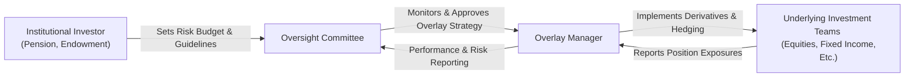

## Introduction

Overlay management often feels like a mysterious force at large institutions—those big pension plans, endowments, or insurance funds that always seem to keep risk under tight control. I remember, not too long ago, visiting a major pension fund’s headquarters (huge, imposing building) and being struck by how seamlessly their overlay management team integrated with the rest of the investment operations. Behind the scenes, a dedicated group was using derivatives and off-balance-sheet instruments to balance exposures, reduce unintended bets, and align the overall portfolio with the institution’s risk budget. And sometimes, it all feels like magic.

But it's not magic—it’s a structured, disciplined approach to controlling risk and seeking subtle excess return. In this article, we’ll unpack the nuts and bolts of institutional overlay management. We’ll also dive into how these practices fit within an organization’s governance frameworks, compliance requirements, and performance reporting structures. Finally, we’ll explore how technology and real-time risk dashboards—once considered optional luxuries—have become absolutely essential tools in the overlay manager’s arsenal.

## Understanding the Role of Overlay Management

Overlay management is essentially the use of derivatives or other offsetting instruments to adjust (or “overlay on top of”) an existing portfolio’s exposures. These exposures can be in currency, interest rates, or even cross-asset risk positions. The reason it’s called an “overlay” is because the underlying portfolio still exists—equities, bonds, alternatives, etc.—but you layer on top a set of derivative positions aimed at aligning the portfolio with the institution’s overall risk and return objectives.

I recall a conversation with a friend who works as an overlay manager: “We’re not running an entirely separate fund,” he said. “We’re basically a team of ‘exposure adjustors’ who make sure the entire portfolio is consistent with the CIO's view and the plan’s strategic asset allocation.” Typically, institutional overlay programs focus on four main areas:

• Currency overlays.  
• Duration overlays.  
• Beta overlays (equity, fixed income, or multi-asset).  
• Volatility management (using options, volatility swaps, etc.).  

Overlay strategies can be fine-tuned to hedge risk, enhance return, or both—always, of course, within the constraints of a well-defined risk budget and strict compliance policies. Large organizations might have a dedicated overlay manager or use third-party overlay providers, depending on internal resources and expertise.

## Key Components of Institutional Overlay Practices

Overlay management at institutional scale comprises several pillars:

• Governance and Oversight Committees.  
• Formal Policy Documentation.  
• Separate Account Structures or Internal Overlay Desks.  
• Robust Communication Across Teams.  
• Real-Time Technology Solutions.  
• Ongoing Performance Reporting and Audits.

We’ll cover each of these in detail below.

## Governance Frameworks

Governance frameworks provide the checks and balances that ensure overlays aren’t just random “patches” slapped onto a portfolio. Many large endowments or pension funds have oversight committees—often sub-committees of the board or senior investment committees—responsible for setting the scope of overlay programs and monitoring their day-to-day risk. These committees typically:

• Approve the overarching overlay strategy (e.g., currency hedging levels, target duration ranges).  
• Review performance reports and potential policy breaches.  
• Align overlays with the institution’s medium- to long-term objectives, including liability-driven investing (LDI) mandates.  
• Determine escalation procedures for exception events.  

Sometimes, the oversight committee includes individuals with specialized derivative knowledge who can keep track of complex strategies and help interpret risk dashboards. If we imagine the organizational structure as a flow of authority, overlay managers frequently report into these committees, ensuring transparency and accountability.

## Formal Policy Documentation

For large institutions, everything is spelled out in policy documents—no guesswork allowed. These documents might look long and a bit dry, but they are the backbone of a well-run overlay program. They typically outline:

• Permissible instruments: futures, forwards, swaps, options, structured notes.  
• Leverage and net market exposure limits.  
• Collateral management rules, such as eligible collateral types and haircuts.  
• Escalation procedures for breaching risk limits or encountering operational difficulties.  

In addition, these documents define who within the organization has the authority to change or deviate from preset guidelines, making sure no single person can override risk controls arbitrarily. That’s especially important when you’re dealing with derivatives, which have the potential to introduce leverage and hidden counterparty exposures.

## Separate Account Structures and Internal Desks

Overlay positions can be managed in either a separate account structure or through an internal overlay desk. Let’s break down the differences:

• Separate Account Structure:  
  - The overlay strategy is carved out into its own legal or operational account.  
  - The institution can directly monitor, measure, and report on overlay positions.  
  - This approach isolates risk exposures and can be beneficial from a compliance standpoint.  

• Internal Overlay Desk:  
  - The overlay responsibilities are housed within the same corporate structure or investment team.  
  - Sometimes more efficient, as the desk can dynamically respond to exposures in real-time.  
  - May require more advanced internal expertise and technology infrastructure.  

Large institutions with deep in-house capabilities (like major insurance companies or big pension plans) will often opt for an internal desk approach. Others who lack the scale or specialized staff might prefer establishing a separate account with an external overlay manager.

## Communication Across Investment Teams

One of the overlay manager’s biggest headaches is wading through multiple data streams from all the different teams: equity, fixed income, hedge funds, private equity, real estate, and more. The reason is straightforward: offsetting and netting out unwanted exposures can only be done if you know where those exposures exist.

Without good collaboration, the result can be more risk or less efficiency. You might remember a classic fiasco: the equity desk and the fixed income desk each put on currency hedges that canceled each other out, leading to pointless transaction costs. Good communication means:

• Swift updates between portfolio managers and the overlay desk.  
• A standard template or platform for reporting daily positions.  
• Real-time risk dashboards assisting the overlay manager in netting out exposures across asset classes.  

An example approach might be a weekly cross-team check-in to discuss upcoming operational or strategic shifts. Perhaps the real estate group is finalizing a property sale in Europe, which will alter the portfolio’s euro exposure by a certain date. The overlay manager can then preemptively adjust currency hedges. This synergy also helps mitigate “surprises” from each silo.

## Liability-Driven Investing (LDI) for Pension Plans

For pension funds (and sometimes insurance portfolio managers), liability-driven investing is a core strategy that shapes the entire approach to overlays. These institutions aren’t just looking at the asset side of the balance sheet; they’re obsessed—rightly so—with how assets behave relative to liabilities. In LDI:

• The asset portfolio attempts to match the duration and other characteristics of the liability stream.  
• Overlays can be used to extend or reduce duration if the underlying securities don’t provide the exact needed exposure.  
• Minimizing surplus volatility (the difference between assets and liabilities) is typically the ultimate objective.  

You may see a major pension plan use interest rate swaps to stretch the duration of the portfolio beyond what’s available in the cash bond market. For example, the overlay manager might structure a swap that effectively transforms short-duration corporate bonds into a portfolio that behaves more like a 30-year bond portfolio, closely matching liability duration. The result is a smoother path for pension plan funding levels.

## Technology Solutions and Real-Time Tools

Institutional overlay managers often rely on specialized risk analytics platforms and real-time dashboards. Some might joke that an overlay manager’s best friend is the risk system. Without up-to-date data on net exposures, it’s nearly impossible to implement the correct overlay. Technology solutions might:

• Aggregate positions from multiple asset classes into a consolidated risk view.  
• Enable scenario analysis to see how a shock event—like a sudden spike in interest rates or currency disruptions—would affect the integrated portfolio.  
• Track margin requirements and collateral levels in near real-time.  
• Provide alerts or notifications when certain risk thresholds or policy limits are breached.  

These features become critical in fast-moving markets, where currency, interest rates, and other variables can shift rapidly.

Below is a simple Mermaid diagram illustrating a typical overlay management framework in a large institution:



## Performance Reporting and Audits

Overlay strategies add complexity, so robust performance reporting and independent audits ensure stakeholders understand the program’s overall value-add and risk profile. Typically, these performance reports detail:

• Actual exposures, both gross and net, pre- and post-overlay.  
• The cost of overlay implementation (transaction costs, margin, etc.).  
• Gains or losses from derivative positions.  
• Risk metrics such as Value-at-Risk (VaR), stress test results, and any limit breaches.  

Many institutions schedule periodic performance audits, sometimes quarterly or annually. Independent auditors or specialized consultants assess whether the overlays adhered to policy guidelines and whether they generated the intended risk or return outcomes. These audits can be especially important for building trust with boards, regulators, and stakeholder groups—like plan participants, in the case of pension funds—who rely on the fiduciary oversight of the institution.

## Practical Example: Currency Overlay for a Global Endowment

Let’s say an endowment has 50% of its equity exposure in international markets. The investment committee wants to hedge around 50% of that foreign currency exposure (yet remain open to some upside). The overlay manager might implement a rolling strategy of currency forwards to hedge these exposures. Here’s how it might break down in practice:

• The equity team invests in Japanese, European, and British equities. They provide the overlay manager with daily or weekly position updates showing net currency exposures in JPY, EUR, and GBP.  
• The overlay manager sells a portion of these currencies forward against the base currency (say, USD) for three-month durations.  
• Every month, the overlay manager “rolls” a segment of these forwards to maintain a consistent 50% hedge ratio.  
• Performance reporting details how the hedge impacted returns (both positively and negatively) and how it reduced currency volatility overall.  

This approach is quite common and can become more nuanced if the endowment decides to incorporate protective options rather than linear forwards, or if the hedge ratio is dynamically adjusted based on perceived market conditions.

## Surplus Volatility Example for Pension Funds

A more advanced example might involve a pension plan that wants to reduce surplus volatility. The plan’s liabilities have an effective duration of 15 years, while its assets (mix of equities and medium-duration bonds) average around 7 years. The plan is underfunded and particularly sensitive to interest rate risk—if rates drop, liabilities (valued using discount rates) will rise faster than assets, exacerbating the deficit.

The solution? Long-duration interest rate swaps or Treasury futures overlays to lengthen the asset duration from 7 years closer to 15. On top of that, the plan might employ an equity overlay that scales down exposure when volatility climbs above certain thresholds, effectively acting like an optional risk budget method. Performance reporting then focuses not just on absolute returns but on how effectively these overlays protect the plan’s funded ratio.

## Common Pitfalls and Challenges

One might assume that having an overlay manager solves everything, but in practice there are plenty of pitfalls:

• Data Gaps: Poor communication or missing exposure data from different investment teams can lead to incomplete overlay strategies.  
• Over-Hedging or Under-Hedging: Currency exposures or interest rate positions can shift rapidly, making static hedge ratios out of date.  
• Liquidity Mismatch: Derivatives may require posting margin or collateral, and if the underlying assets are illiquid, bridging that gap can be tricky.  
• Counterparty Risk: Over-the-counter (OTC) derivatives bring in credit risk unless properly collateralized.  
• Operational Complexity: Running a large overlay program can strain internal systems and staff if not well funded and managed.  

Recognizing these risks is part of building a robust overlay policy and governance structure. Many institutions mitigate these issues through advanced risk modeling, real-time margining, and by maintaining relationships with multiple reputable counterparties.

## Short KaTeX Example: Surplus Volatility Notation

Occasionally, you’ll see surplus volatility expressed in mathematical form. Let \\( A_t \\) be the value of assets and \\( L_t \\) the value of liabilities at time \\( t \\). Then surplus is:


S_t = A_t - L_t


If the institution measures volatility of surplus, \\(\sigma_{S}\\), it’s influenced by multiple alpha or beta sources, interest rates, credit spreads, and other factors. Overlay strategies aim to minimize \\(\sigma_{S}\\) through appropriate derivative positioning.

## Brief Python Snippet: Estimating Overlay Hedge Ratios

Sometimes, institutions perform back-of-the-envelope scripting to see how different hedge ratios might affect portfolio variance. Below is a small Python snippet for demonstration:

```python
import numpy as np

underlying_portfolio = np.random.normal(0, 0.01, 1000)  # 1% daily vol
hedge_instrument = np.random.normal(0, 0.012, 1000)      # 1.2% daily vol

best_ratio = None
lowest_var = float('inf')
ratios = np.arange(0, 2.0, 0.01)  # test hedge ratios from 0 to 2

for r in ratios:
    # combined daily returns
    combined_returns = underlying_portfolio + (-r * hedge_instrument)
    var = np.var(combined_returns)
    if var < lowest_var:
        lowest_var = var
        best_ratio = r

print(f"Optimal Hedge Ratio: {best_ratio:.2f}")
print(f"Resulting Variance: {lowest_var:.6f}")
```

This snippet randomly simulates daily returns for an underlying portfolio and a hedge instrument, then loops through candidate hedge ratios to find the ratio that minimizes variance. While extremely simplified (no transaction costs, no correlation drift, etc.), it demonstrates how institutions might prototype or backtest certain overlay strategies.

## Conclusion and Practical Exam Tips

Overlay management is a powerful technique in an institutional setting: it efficiently fine-tunes a portfolio’s exposures to align with specific risk and return objectives. Whether it’s matching pension liabilities, hedging currency for an endowment, or trimming equity beta during turbulent markets, overlays can be a robust line of defense (and sometimes offense).

If you’re preparing for an exam or interview related to this topic, here are a few tips:

• Know Your Governance Flow: Understand who approves the overlay strategy, how it’s monitored, and what happens when you breach a limit.  
• Memorize Key Terms: Overlay Manager, LDI, Collateral Management, and Surplus Volatility are essential concepts.  
• Understand Practical Mechanics: Breaking down how a forward contract might hedge currency exposure—or how swaps adjust duration—often appears in exam questions.  
• Watch Out for Implementation Costs: Institutions care about transaction costs, slippage, collateral, and margin calls—factors that can erode net returns.  
• Keep an Eye on Real-World Pitfalls: Counterparty risk or data mismatch are common weaknesses in overlay strategies.  

Overlay management is not about being flashy; it’s about being precise, consistent, and aligned with an organization’s broader objectives. In my opinion, that’s what makes it so fascinating: it’s the behind-the-scenes superpower that keeps big portfolios calmly on track—through the storms of market volatility and beyond.

## References and Further Reading

- Clark, G. (2015). “Institutional Overlay Management: A Practical Guide.” Pension & Investments.  
- Merton, R. C. (1974). “On the Pricing of Corporate Debt and Pension Liabilities.” Journal of Finance.  
- CFA Institute. (2023). “Institutional Practices in Derivatives and Overlay Management.”  

---

## Test Your Knowledge: Institutional Overlay Management Essentials



### Which of the following best describes institutional overlay management?

- [ ] Owning a fully separate portfolio of stocks and bonds.  
- [x] Using derivatives to adjust existing portfolio exposures across multiple asset classes.  
- [ ] Replacing the investment policy statement with frequent trading.  
- [ ] Eliminating fiduciary oversight to gain operational autonomy.  

> **Explanation:** Overlay management uses derivative instruments and supplementary exposures to fine-tune or hedge existing portfolio positions, rather than replacing or replicating the entire underlying portfolio.

### Which committee typically oversees institutional overlay management?

- [ ] The operations back-office committee.  
- [ ] The marketing committee tasked with public relations.  
- [x] A specialized sub-committee or the board’s investment committee.  
- [ ] The government trade bureau.  

> **Explanation:** Overlay programs are usually overseen by a specialized sub-committee or an arm of the board, ensuring policies and procedures align with broader organizational objectives.

### Which of the following best aligns with a liability-driven investing (LDI) approach?

- [ ] Overweighting cash for immediate use.  
- [x] Matching portfolio duration to liability duration.  
- [ ] Avoiding bonds altogether and focusing on equities.  
- [ ] Optimizing short-term trading profits.  

> **Explanation:** Under LDI, the institution focuses on asset–liability matching, especially duration, to reduce funded status volatility.

### What is surplus volatility?

- [x] The fluctuations in the difference between a fund’s assets and liabilities.  
- [ ] The volatility of only fixed income assets in an institution’s portfolio.  
- [ ] Another term for currency exposure in an international portfolio.  
- [ ] Market risk associated with hedge funds only.  

> **Explanation:** Surplus volatility refers to the changes in the difference between a fund’s assets and its liabilities over time, a key concern for pension and insurance portfolios.

### How do separate account structures contribute to effective overlay management?

- [x] They keep derivative exposures segregated for better tracking and compliance.  
- [ ] They eliminate the need for performance reporting.  
- [x] They allow for detailed monitoring of policy adherence and risk.  
- [ ] They consolidate all asset classes into a single undocumented account.  

> **Explanation:** When managed as a separate account, overlay exposures are ring-fenced, allowing precise monitoring, compliance checks, and clarity on each overlay transaction.

### Which factor is most likely to cause difficulties in currency overlay strategies?

- [ ] Having minimal exposure to international markets.  
- [x] Rapid changes in underlying asset pricing and shifting currency exposures.  
- [ ] Excessively stable foreign exchange markets.  
- [ ] Performing monthly performance audits.  

> **Explanation:** Currency overlay strategies rely on constantly updated data regarding exposures. If underlying exposures shift faster than the overlay can adjust, this can create inefficiencies or lead to under-/over-hedging.

### Which of the following is a legitimate concern when utilizing OTC (over-the-counter) derivatives for overlay purposes?

- [x] Counterparty credit risk if the counterparty defaults.  
- [ ] Zero cost in transacting.  
- [x] Lack of standardized collateral procedures.  
- [ ] Guaranteed unlimited liquidity under all market conditions.  

> **Explanation:** OTC derivatives expose the institution to the creditworthiness of the counterparty. Furthermore, unlike exchange-traded instruments, collateral and liquidity provisions may vary considerably.

### What is the main purpose of having an escalation procedure in an overlay policy?

- [ ] To punish overlay managers for profit misses.  
- [ ] To immediately liquidate all positions when markets move 1%.  
- [x] To have a clear chain of authority for resolving policy breaches or limit violations.  
- [ ] To bypass senior management entirely.  

> **Explanation:** Escalation procedures ensure that any deviation from policy or risk limit can be swiftly communicated to the correct oversight level for corrective action or authorization.

### Which technology capability is generally most valuable for overlay management?

- [x] Real-time exposure aggregation across all asset classes.  
- [ ] Infrequent portfolio updates received via fax.  
- [ ] Closed-form reports that cannot be customized.  
- [ ] Manually inputting prices at month-end.  

> **Explanation:** Overlay managers need up-to-the-minute data for timely decision-making. Aggregating exposures across equities, bonds, currencies, and alternatives makes real-time risk control feasible.

### True or False: Performance audits of an overlay program often include verifying compliance with investment guidelines and examining the net performance impact of derivatives.

- [x] True  
- [ ] False  

> **Explanation:** Performance audits serve to ensure that the overlay strategies have adhered to the established guidelines and have effectively added or preserved value as intended.


