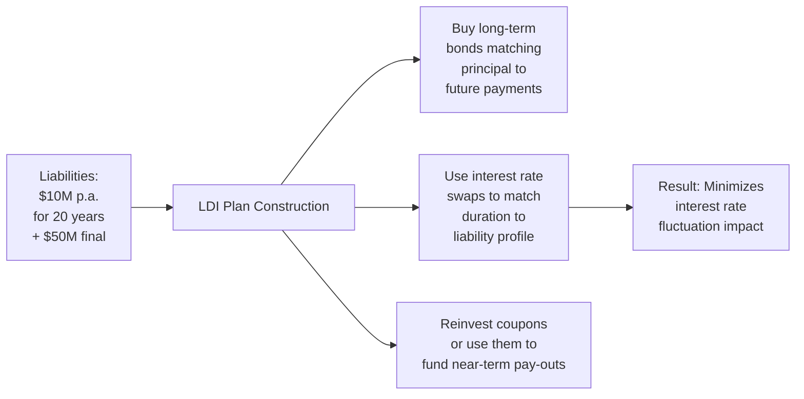

## Introduction

Hey, have you ever found yourself puzzling over how to build or manage a bond portfolio that not only meets a benchmark but also addresses future obligations or hunts for a little extra yield? I definitely have. Once, as a junior analyst, I remember staring at a mountain of bond data, trying to figure out why a “core portfolio” wasn’t delivering all the returns the client wanted. And I also asked, “Is it worth taking on extra risk to bring in more yield?” Well, you’re not alone if you’ve faced similar questions. In this section, we’re going to talk about three major approaches to fixed income portfolio management—Core, Core-Plus, and Liability-Driven Investing (LDI)—and hopefully make it feel less daunting.

Think of these strategies as different paths leading to a final destination (stable returns, risk management, liability matching, etc.). Each path has its own detours, risk tolerance, and scenic routes. We’ll walk through the key ideas, share some practical examples, and highlight best practices, along with a few pitfalls. By the end, you should see how these strategies fit into the bigger world of fixed income investing, and maybe even get some inspiration for how you might want to structure your own portfolio or one you manage on behalf of a client.

## Core Fixed Income Strategies

Core fixed income strategies are often thought of as the bedrock of a bond portfolio. Let’s be honest: when you think of “fixed income,” you probably picture government bonds, investment-grade corporate bonds, and mortgage-backed securities (MBS) with a churn of stable interest payments. And that’s exactly what a core strategy focuses on. The idea is to assemble a portfolio that mirrors a well-known, broad-market benchmark—like the Bloomberg U.S. Aggregate Bond Index, or “the Agg” for short—while managing risk, maintaining transparency, and ensuring ample liquidity.

### Characteristics of a Core Strategy

1. High-Quality Holdings:  
   Core portfolios typically invest in top-tier credits: U.S. Treasuries, investment-grade corporate bonds, agency MBS, and sometimes AAA-rated securitized products. The aim is to minimize default risk so that total returns are driven more by interest rates and macroeconomic trends rather than credit blowups.

2. Benchmark-Focused:
   The manager’s “scorecard” is usually how well the portfolio tracks the chosen benchmark. Tracking error is a big deal in core investing because institutional clients, like pension funds or large endowments, want predictable results that align closely with the broad market.

3. Moderate Duration & Low Credit Risk:
   Because the emphasis is on investment-grade or near-investment-grade bonds, the interest rate risk is moderate (depending on the benchmark’s duration). Credit risk is also not extremely high—certainly lower than in high-yield or emerging-market bonds.

4. Liquidity & Transparency:
   High-quality bonds typically trade more easily. Transparency in pricing and valuations is also more straightforward. That can be super important for institutions needing to meet redemption requests or reallocate quickly.

5. Limited Opportunity for Alpha:
   The flip side of lower risk is typically lower alpha potential. If you’re invested mostly in government and highly rated corporate bonds, it can be challenging to outperform the benchmark without taking on additional risk or straying from the benchmark too far.

### Why Core Might Be Right for You

Core strategies are an excellent fit when your main objective is stable income and moderate volatility. If you have to manage assets for a risk-averse client—perhaps a retiree or a stable pension plan—then a core strategy can be your go-to approach. It’s easy to monitor, less prone to massive drawdowns, and you generally know what to expect when interest rates shift or credit spreads widen or tighten modestly.

### Example: Simple Core Bond Portfolio

Imagine you manage a $50 million bond portfolio. Your benchmark is the Bloomberg U.S. Aggregate Bond Index. You buy a mix of 40% U.S. Treasuries, 35% investment-grade corporates, and 25% agency mortgage-backed securities. You keep your portfolio’s duration extremely close to the Agg’s duration (roughly 6.5 years, give or take). 

If the Agg returns 4.0% this year, you might aim to land somewhere between 3.8% and 4.2%, with minimal deviation. That’s what we mean by minding your tracking error.

## Core-Plus Strategies

All right. So let’s say your boss or your client wants a little more excitement in their returns. They’ve noticed that sometimes high-yield bonds or emerging market debt do well when the economy is humming along. That’s where core-plus strategies come in. “Core” is still at the heart of the portfolio, but you’re adding an extra slice of risk exposure to boost potential returns.

### Characteristics of Core-Plus

1. Diverse Sectors:
   Aside from typical core holdings, a core-plus manager might venture into high-yield bonds, emerging market bonds, bank loans, or non-agency securitized products. These “plus” sectors offer the chance for higher yield but naturally come with more volatility and credit risk.

2. Alpha Generation:
   Higher-risk segments can yield higher returns, especially in market upswings. Managers may exploit inefficiencies in these segments or gain from spread compression in riskier assets.

3. Larger Tracking Error:
   The minute you diverge from the standard benchmark, you open the door to bigger deviations in returns. That means your performance can swing above or below the Agg by a more noticeable margin. This can be totally acceptable, even desired, if your investment mandate tolerates higher risk.

4. Broader Investment Mandate:
   Core-plus strategies might also use derivatives more actively, particularly to gain or hedge exposures in foreign currency denominated bonds, or to short parts of the market they’re less bullish on. There’s typically more manager discretion here than in strictly core portfolios.

### When to Opt for Core-Plus

You might choose a core-plus strategy if the investor has a slightly higher risk appetite, a longer time horizon, or a desire to potentially beat the standard benchmark by 100 to 200 basis points, net of fees. Endowments, foundations, or certain high-net-worth individuals who value additional yield could be good candidates.

### Balancing “Core” and “Plus”

Now, how big should that “plus” slice be? That’s the million-dollar question. If it’s too small, you barely affect return differentials beyond the standard benchmark. If it’s too large, you can end up with blowout risk if the plus sector tanks. In practice, managers often apply a target range—say, 10–20% of the overall portfolio—dedicated to higher-yielding or opportunistic sectors.

Here’s a neat formula often used to estimate overall portfolio return:


\text{Expected Return}^{\text{Core-Plus}} \approx (w_{\text{core}} \times r_{\text{core}}) + (w_{\text{plus}} \times r_{\text{plus}})


Where:
• \\( w_{\text{core}} \\) is the weight in core assets.  
• \\( w_{\text{plus}} \\) is the weight in plus assets (with \\( w_{\text{core}} + w_{\text{plus}} = 1 \\)).  
• \\( r_{\text{core}} \\) and \\( r_{\text{plus}} \\) are the expected returns of those segments.

Sure, it’s simplified, but it helps managers quickly gauge what they might earn or lose depending on their allocations.

### Example: Core-Plus in Action

Imagine you’re running a $100 million bond portfolio. You might put $80 million into a stable, benchmark-oriented set of Treasuries and IG (investment-grade) corporates, while using the remaining $20 million for high-yield corporate debt and some emerging market bonds. Over several years, you witness a scenario like this:

• IG corporates yield ~3.5%  
• Treasuries yield ~2.5%  
• High-yield bonds yield ~6.5%  
• Emerging market bonds yield ~5.0%  

Because the 20% allocated to “plus” exposures are higher-yield, your total portfolio return could outpace a vanilla core portfolio—assuming those riskier bonds don’t blow up in a downturn.

## Liability-Driven Investing (LDI)

If you’re managing a pension fund or insurance company portfolio, matching liabilities is the name of the game. Liability-Driven Investing (LDI) is a strategy that shapes and molds your bond investing around future obligations—like pension benefit payments—so that interest rates and timing of cash flows line up with your liabilities.

### Key Principles of LDI

1. Duration Matching:
   The first step is often to match the portfolio’s duration with the duration of the liabilities. If your liabilities have an effective duration of 12 years, you want your portfolio to be equally sensitive to interest rate changes. This way, an upward shift in rates that lowers the value of your bond portfolio is offset (at least partially) by a corresponding reduction in the present value of liabilities.

2. Cash Flow Matching:
   Another approach is to literally match the timing of bond coupon and principal payments to the dates you owe outflows to beneficiaries. This can provide a nearly perfect hedge against reinvestment risk and interest rate risk, though it might be harder to implement if your liabilities extend far into the future.

3. Hedging with Derivatives:
   Swaps, futures, and options can be used to fine-tune the interest rate exposure. One common approach in LDI is to hold a portion of the portfolio in more liquid, lower-duration instruments, then use interest rate swaps to achieve the overall duration you need.

4. Immunization:
   Immunization is a fancy word for structuring a portfolio so that changes in interest rates won’t significantly affect your ability to meet obligations. This is usually done by carefully balancing duration and convexity. However, it’s not foolproof if large shifts or curve twists occur, or if there are changes to liability estimates themselves (like changes in mortality rates for pensions).

### Why LDI Matters

LDI is especially useful for institutions with well-defined future payouts—pension plans, insurance companies, or even certain endowments. The primary goal isn’t to beat a market benchmark but to ensure the money will be there when needed. In an environment where interest rates can move significantly, LDI helps mitigate the risk that a rise in rates or an unexpected shift in the forward yield curve will cripple your ability to meet future obligations.

Yes, you might sacrifice some raw return potential. But if your mission is to ensure that retirees get their pension checks on time, or that insurance payouts are properly funded, that reliability is paramount.

### LDI Example with a Pension Fund

Consider a pension fund obligated to pay $10 million annually over the next 20 years, after which it has a final balloon payment of $50 million (for a total of $250 million in future liabilities). If you simply invest in a standard core strategy, you might see a mismatch. Because if interest rates spike, the present value of your liabilities could decrease—but so does the value of your bond portfolio, perhaps in an uncoordinated or suboptimal way. Under LDI, you’d build or acquire securities (or derivative exposures) that precisely line up with those $10 million outflows each year, and cover that final balloon with a matching instrument. Even if interest rates fluctuate, the net impact on your assets and liabilities is minimized.

Below is a simplified illustration of how LDI can be structured with bond maturities and liability payments:



In this mermaid diagram, we see how the manager uses a combination of bond maturities and derivatives to ensure that the liability profile is closely matched. As a result, the interest rate movement’s net effect on the plan’s funding status is reduced, which is pretty much the main objective of LDI.

## Evaluating Risk-Return Tradeoffs Among the Three

You might be wondering, “Which is best: Core, Core-Plus, or LDI?” Actually, the answer depends entirely on the investor’s needs.

1. **Risk Tolerance:**  
   If an institution or client truly can’t handle much volatility, or if they measure performance strictly against a broad bond benchmark, a core strategy might be best. If they have a moderate risk appetite, adding the plus segment can make sense. And if the main worry is meeting future liabilities, LDI might be the ultimate approach.

2. **Return Expectations:**  
   Core tends to deliver stable, benchmark-oriented results. Core-plus can offer higher returns but also bigger drawdowns. LDI might not emphasize benchmark outperformance at all, focusing instead on immunizing or hedging liability risk.

3. **Duration and Interest Rate Sensitivity:**  
   In LDI, everything revolves around the liability’s duration. In core and core-plus, the duration typically falls near a standard bond market index—often around 6 to 8 years for many broad U.S. benchmarks.

4. **Liquidity Requirements:**  
   Core portfolios usually hold more liquid securities (e.g., Treasuries), while core-plus can hold less liquid assets or more volatile corporates. In liability-driven investing, liquidity is balanced against the exact needs of liability payouts. Sometimes, LDI managers hold more cash or near-cash instruments to meet short-term obligations and rely on derivatives to manage overall duration.

5. **Tracking Error & Manager Constraints:**  
   Core portfolios keep it low, while core-plus can accept a higher tracking error if it means capturing extra yield. LDI managers often track liabilities rather than a market index, so the concept of tracking error is replaced by measures of funded status volatility or liability mismatch risk.

## Practical Implementation Notes

### Portfolio Construction

One of the trickiest parts about building these portfolios is blending top-down (macro) decisions with bottom-up (security selection) analysis.

- In **Core** strategies:  
  Construction is fairly benchmark-centric. You might do a sector allocation that’s close to the index weighting, with minor overweights or underweights based on perceived mispricings. Security selection can be important, but you typically don’t want to deviate too far from the index.

- In **Core-Plus** strategies:  
  You might have a base (the “core”) plus an opportunistic sleeve for higher risk-return exposures. Asset allocation decisions become significant. For instance, deciding whether to invest in 10% high-yield or 15% EM bonds can drastically alter volatility and return. Manager skill in credit analysis and market timing can have a big impact.

- In **LDI**:
  Construction is more about matching the liability’s cash flows and duration, or setting up derivative exposures that replicate that alignment. Depending on the plan sponsor’s risk preference, you might choose partial immunization (to keep some upside potential) or a full immunization approach.

### Potential Pitfalls

1. **Interest Rate Shifts in LDI**  
   If liabilities aren’t perfectly matched (for instance, if there’s basis risk between your assets and your liabilities), you can still suffer. Also, big parallel or non-parallel shifts in the yield curve can cause mismatches.

2. **Credit Blowups in Core-Plus**  
   If your plus holdings are too large a slice, a spike in default rates could hammer you. Think back to 2008–2009, when a meltdown in subprime mortgages (a plus sector) took down many funds.

3. **Over-Concentration**  
   Even in core portfolios, overweighting certain sectors can lead to unintended risk concentration. In core-plus, it’s even easier to concentrate in a single “hot” sector, which can blow up if the macro environment changes.

4. **Rebalancing**  
   Managing your duration exposure or credit exposure requires constant rebalancing. Especially in an LDI approach, if interest rates change significantly, you need to adjust your derivative positions or bond holdings to stay matched with liabilities.

5. **Changes to Liability Assumptions**  
   In LDI, if your estimates of future payout times or amounts are off (say, pensioners live longer than expected), your liability base changes, forcing you to adjust quickly.

### Using Technology and Analytics

Modern portfolio management software can do wonders for these strategies. Tools leveraging big data and machine learning help managers better forecast credit spreads or interest rate movements (though nothing is perfect, of course). Python has become fairly popular for bond analytics, offering libraries for interest rate curve construction and risk metrics. Below is a brief snippet illustrating a conceptual approach (very simplified) for computing portfolio duration in Python:

```python
import numpy as np

bonds = [
    (98.0, 3.0, 0.035, 5),
    (101.5, 4.0, 0.04, 7),
    (105.0, 5.0, 0.045, 10),
]

def macaulay_duration(price, coupon, ytm, t):
    # Convert coupon percent to decimal, assume annual, simplified
    coupon_payment = coupon
    cfs = [coupon_payment] * t
    cfs[-1] += 100  # principal redemption
    durations = []

    for i in range(t):
        pv = cfs[i] / ((1 + ytm) ** (i+1))
        # time weighting
        durations.append((i+1)*pv)

    return sum(durations) / price

duration_values = []
for (price, coupon, ytm, maturity) in bonds:
    d = macaulay_duration(price, coupon, ytm, maturity)
    duration_values.append(d)

portfolio_duration = np.mean(duration_values)
print(f"Approx. average duration: {portfolio_duration:.2f} years")
```

Of course, real-world computations are more intricate (with semiannual coupons, day-count conventions, yield curve building, and so forth). But this snippet highlights how a manager or analyst might quickly compute (or approximate) bond durations.

## Best Practices and Strategies to Overcome Common Issues

1. **Regular Liability Reviews**:
   If you’re doing LDI, update your assumptions about your liabilities often. Nothing kills a “perfect hedge” like an inaccurate forecast of outflows.

2. **Set Clear Risk Budgets**:
   For core-plus, define how much risk you can stomach from plus sectors. Make sure you’re measuring and monitoring this risk continuously—especially credit and liquidity risks.

3. **Scenario Analysis**:
   Test how each strategy reacts to interest rate spikes, credit spread widens, or curve flattenings. You don’t want to discover a hidden vulnerability the hard way. This might involve models or spreadsheet-based scenario tools.

4. **Diversification**:
   Within core-plus, avoid piling too heavily into a single high-yield sector or region. Consider a balanced approach across multiple “plus” exposures.

5. **Communication with Stakeholders**:
   If you’re managing money for a board or for clients who aren’t finance experts, it helps to explain what each strategy does in plain English. Especially for LDI clients who might not know why you’re “giving up” potential returns to hedge interest rates.

## Cross-References

Curious about measuring and managing portfolio risks? See Sections 2.3 and 3.1–3.5, where we introduced the building blocks of return and risk as well as systematic vs. non-systematic risk. Plus, in Chapter 6, we dig deeper into risk governance—something you’d definitely want to consider if you’re implementing an LDI approach for a large institution.

And if you’re itching to know about interest rate derivatives or currency overlays, check out Chapter 10 for an in-depth discussion on overlay strategies, many of which tie into LDI or core-plus expansions.

## Exam Tips for CFA® Candidates

• Know the basic definitions: “Core,” “Core-Plus,” and “LDI.”  
• Practice a sample question on duration matching vs. cash flow matching.  
• Understand how adding plus sectors affects tracking error.  
• Familiarize yourself with immunization (it’s not just a fancy word—there are direct formula-driven calculations that might pop up in the exam).  
• Keep in mind that LDI is more about liability matching than benchmark outperformance; exam questions will likely stress that difference.  
• Don’t forget about how derivatives—particularly swaps—can be used to achieve or maintain target durations.

## References and Further Reading

• Fabozzi, F. (Ed.). (2021). Bond Markets, Analysis, and Strategies. McGraw-Hill.  
• CFA Institute. (current edition). Fixed Income Readings in the CFA® Program Curriculum.  
• “The Liability-Driven Investment (LDI) Approach.” Pensions & Investments Magazine, available at www.pionline.com  

---

## Comprehensive Practice: Core, Core-Plus, and LDI Exam Questions



### Which of the following best characterizes a Core Fixed Income Strategy?

- [x] It focuses on high-quality, liquid investment-grade bonds with minimal tracking error relative to a standard benchmark.  
- [ ] It includes allocating at least 50% to emerging market debt.  
- [ ] It primarily uses cash-flow matching for all future liabilities.  
- [ ] It involves over-allocating to high-yield in search of alpha.  

> **Explanation:** A Core strategy is anchored in high-credit-quality bonds, closely tracking a broad benchmark such as the Bloomberg U.S. Aggregate Bond Index.

### Which statement best distinguishes Core-Plus from a purely Core strategy?

- [ ] Core-Plus mandates always have shorter durations.  
- [x] Core-Plus strategies allow for incremental allocations to riskier fixed income sectors (e.g., high-yield, EM debt) to seek higher returns.  
- [ ] Core-Plus mandates restrict managers to time cash flows to future liabilities.  
- [ ] Core-Plus mandates do not invest in government bonds.  

> **Explanation:** The essential difference is that Core-Plus approaches incorporate additional segments outside the investment-grade universe, such as high-yield and emerging market bonds, to pursue extra yield and potential alpha.

### In a Core-Plus strategy, what is the primary downside of significantly increasing the “plus” portion?

- [ ] It reduces tracking error to near zero, limiting alpha.  
- [x] It raises the overall portfolio volatility and the risk of underperforming the benchmark if credit conditions worsen.  
- [ ] It eliminates liquidity from the portfolio altogether.  
- [ ] It forces the manager to use only structured products.  

> **Explanation:** The “plus” segment typically carries more credit risk and can underperform during market downturns, thus increasing the risk of the total portfolio.

### Which best describes the main purpose of Liability-Driven Investing (LDI)?

- [ ] To outperform broad-market bond benchmarks by a large margin.  
- [ ] To hold primarily equities that pay high dividends.  
- [x] To align or match the duration and cash flows of assets with future obligations.  
- [ ] To maximize portfolio turnover for tax advantages.  

> **Explanation:** LDI strategies are used to manage interest rate risk and match cash flows so an institution can make future liability payments with minimal shortfall risk.

### When implementing an LDI strategy, which instrument is frequently used to adjust the portfolio’s interest rate exposure without shifting the underlying bond holdings?

- [ ] High-yield corporate bonds.  
- [ ] Exchange-traded funds (ETFs).  
- [ ] Collateralized mortgage obligations (CMOs).  
- [x] Interest rate swaps.  

> **Explanation:** Interest rate swaps are commonly employed to manage or realign a portfolio’s duration to match liability durations.

### Which best illustrates the idea of “immunization” within an LDI framework?

- [x] Constructing a portfolio whose value remains sufficient to meet future liabilities, regardless of small changes in interest rates.  
- [ ] Avoiding any kind of derivative use.  
- [ ] Investing exclusively in high-yield issuers based on market momentum.  
- [ ] Matching the portfolio’s credit rating to the pension fund sponsor’s credit rating.  

> **Explanation:** Immunization is about balancing the portfolio’s interest rate risk in such a way that, for small parallel shifts in the yield curve, the portfolio and liability value changes offset each other.

### A portfolio manager wants to add 15% in high-yield bonds to a core portfolio. Which outcome is most likely?

- [x] The portfolio’s potential return and volatility both increase.  
- [ ] The portfolio’s duration drops significantly.  
- [ ] The likelihood of default risk decreases.  
- [ ] The portfolio becomes entirely immune to interest rate risk.  

> **Explanation:** Adding high-yield bonds can enhance returns but also increases volatility since high-yield securities are sensitive to credit conditions and can significantly underperform in downturns.

### Which is a common metric used in Core Fixed Income Strategies to measure deviation from the benchmark?

- [ ] Information ratio.  
- [ ] Duration mismatch.  
- [ ] Sortino ratio.  
- [x] Tracking error.  

> **Explanation:** Core strategies emphasize low tracking error, which measures how closely a portfolio follows its benchmark returns.

### In a liability-driven approach for a pension fund with known future cash outflows, which method ensures that actual bond coupon and principal repayments coincide with liability payouts?

- [ ] Barbell approach.  
- [ ] Core-Plus approach.  
- [x] Cash flow matching.  
- [ ] Tactical asset allocation.  

> **Explanation:** Cash flow matching arranges coupon and principal payments to match liability payment dates, making it an effective approach for precise outflow management.

### True or False: Core-Plus strategies generally maintain a lower correlation to standard bond indices compared to pure Core strategies.

- [x] True  
- [ ] False  

> **Explanation:** Because Core-Plus strategies include riskier or less conventional bond segments (e.g., high-yield, emerging markets), their correlation to the standard benchmark is typically lower than a pure Core portfolio limited to government and investment-grade bonds.


