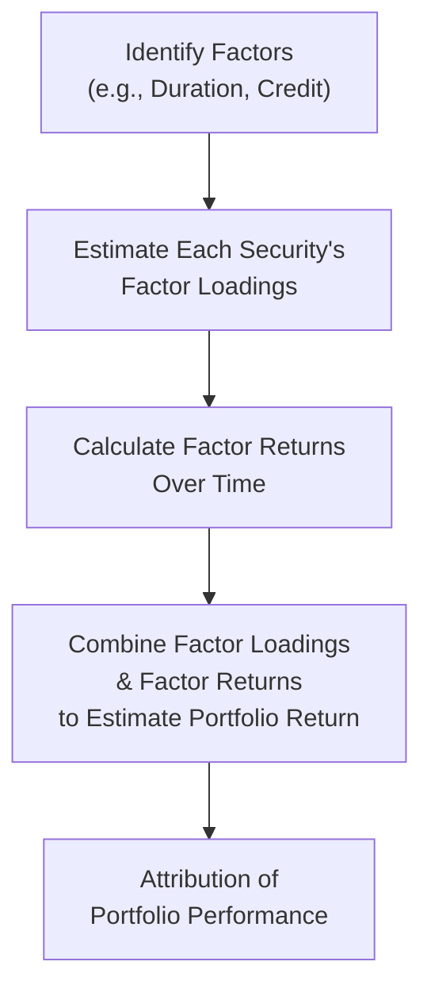

## Overview and Motivation

Every time I look back at my early days analyzing bond returns, I remember scratching my head and thinking, "So, this security is up 0.3% today. Is that from a yield curve shift, or from credit spread tightening, or something else entirely?" Factor analysis is exactly the tool that resolves this confusion. By breaking down a bond or fixed income portfolio’s returns into distinct risk (and return) drivers—like duration, credit, and liquidity factors—we can figure out what’s really powering our portfolio’s performance. 

This section explains how factor analysis works in fixed income, provides a sense of how you might tilt or hedge specific factors, and highlights some best practices and pitfalls.

## The Concept of Factor Analysis in Fixed Income

Factor analysis in fixed income is a systematic approach to decomposing the total returns of a portfolio (or single bond) into categories of risk and return. The idea is: if we can identify the main culprits behind fluctuations in bond values—like changes in interest rates, changes in credit spreads, or changes in market liquidity conditions—we can manage and optimize those exposures more effectively. 

At the heart of it, factor analysis suggests that any bond’s return can be broken down into the following typical contributors:

• Interest rate risk (captured by the “duration factor”)  
• Credit risk (captured by the “credit factor”)  
• Liquidity risk (captured by the “liquidity factor”)  
• Idiosyncratic or sector-specific factors (capturing unique risk beyond the major systematic drivers)

Yes, it might sound a bit academic at first. But, oh boy, once you see it in practice, you’ll realize how factor analysis can help you zero in on the exact exposures you want in your portfolio—and hedge or avoid the ones you don’t.

## Duration Factor

The most familiar factor in fixed income is the “duration factor,” which measures a security’s sensitivity to changes in interest rates. If rates come down while you’re holding a bond, you’re usually in for a bit of a gain (since bond prices tend to rise when yields fall). Conversely, if rates go up, bond prices typically drop. The magnitude of this change is roughly captured by the bond’s duration.

### Parallel vs. Key Rate Shifts

An important subtlety here is that yield curve changes can be parallel (when rates shift uniformly across all maturities) or they can be more localized—like a shift just in the 2-year yield, or a steepening in the mid-range of the yield curve. Sometimes you’ll hear the term “key rate duration,” which measures duration exposure at specific key points along the yield curve. If you want to incorporate that detail into your factor analysis, you might break out the duration factor across multiple maturities or “key rates,” not just a single broad measure of interest rate risk.

### Example: Estimating Duration Exposure

Maybe we have a portfolio that’s heavy on longer-maturity corporate bonds. The overall effective duration is 8 years. If interest rates rise by 0.5% across the yield curve (parallel shift), we might expect the portfolio to lose about 4% in value (because 8 × 0.5% = 4%). In factor terms, that’s the “duration factor” doing its thing.

## Credit Factor

If you’ve ever watched how high-yield bonds can gyrate with the ups and downs of economic outlooks, you’ll know that changes in credit spreads can be critical. The “credit factor” captures movement in spreads relative to Treasuries (or another risk-free benchmark). When economic data suddenly looks gloomy, credit spreads often widen. That’s negative for the price of the bond (the yield goes up to compensate for perceived higher credit risk), leading to losses on the bond’s market value. Conversely, if credit risk subsides, spreads narrow, bond prices rise, and returns improve. 

### Measuring Credit Spreads

Credit spreads are typically measured in basis points (bps) above a risk-free benchmark. For instance, a corporate bond might trade at a spread of +200bps over similar-maturity Treasuries. If that spread narrows to +180bps, the bond’s price is likely to rise, generating a gain attributable to the credit factor. If the spread jumps to +250bps, that suggests the market is pricing in more risk, so the bond’s price falls.

### Example: Credit Spread in a Corporate Bond

• A bond’s yield is 5.0%.  
• That bond’s Treasury benchmark yield is 3.0%.  
• So the credit spread is 2.0% (200bps).  

If spread tightens to 1.7% (170bps) due to improved economic indicators, the bond’s yield drops from 5.0% to 4.7% (assuming the underlying Treasury yield is unchanged at 3.0%). As yield falls, the bond price goes up. The return from this “spread tightening” is the credit factor’s contribution to your total return.

## Liquidity Factor

Fixed income markets aren’t always the most transparent. Some bonds don’t trade very often, especially if they’re from smaller issuers, have unusual structures, or are in emerging markets. In times of market stress—remember 2008 or the early days of 2020—liquidity can vanish in an instant, leading to big price swings as dealers widen their bid/ask spreads significantly.

### Example: Liquidity Shocks in the Pandemic

During the initial phases of the 2020 COVID-19 pandemic, even U.S. Treasuries sometimes behaved oddly as investors scrambled for cash. The liquidity premium soared for risk assets, which showed up as significant yield spread widening—partly due to credit concerns, but also partly to liquidity-driven selling pressure. If your portfolio was overweight certain less liquid corners of the market (for instance, local municipal bonds with thin trading volumes), you probably experienced quite a bit of pain from a “liquidity factor.” 

## Sector and Idiosyncratic Factors

Beyond these “big three”—duration, credit, and liquidity—other sector or idiosyncratic factors might matter:

• **Mortgage prepayment risk**: Agency mortgage-backed securities (MBS) have unique prepayment characteristics; changes in interest rates can trigger prepayments or refinances.  
• **Emerging market (EM) risk**: Emerging market bonds can have currency and geopolitical risks that behave differently compared to developed markets.  
• **Sector-driven supply/demand**: Think about U.S. corporate vs. Euro corporate vs. high-yield energy bonds, each of which can show unique behaviors from supply, regulation, or macro conditions.

## How Factor Analysis Is Applied in Practice

So, how do we do this in real life? In a typical factor model, we represent each bond’s return as a combination of factor exposures multiplied by factor returns. For example, for bond i:

(1) Rᵢ = βᵢ,₁ × F₁ + βᵢ,₂ × F₂ + βᵢ,₃ × F₃ + … + εᵢ

Where:
• βᵢ,₁ is the exposure (or “loading”) of bond i to Factor 1.  
• F₁ is the realized return of Factor 1 over a certain period.  
• εᵢ is the idiosyncratic component.  

### Mapping to Duration, Credit, and Liquidity

You might define:
• F₁ = Duration Factor Return  
• F₂ = Credit Factor Return  
• F₃ = Liquidity Factor Return  

Then you estimate each bond’s exposure (βᵢ,₁, βᵢ,₂, βᵢ,₃) via regression or other statistical techniques. Summed over your entire portfolio, you get a picture of how each factor is driving your total returns.  

### Visualizing a Simple Two-Factor Model

Below is a quick Mermaid diagram showing how a two-factor approach might flow in your analysis—just for illustration:



In reality, you’ll often see more than two factors, but the structure of the process remains similar.

## Tilting and Hedging with Factor Analysis

Once you understand which factors you’re exposed to, you can proactively decide how to tilt or hedge your portfolio. 

• **Tilting**: Maybe you think corporate spreads are going to tighten because the economy is picking up. You can overweight the “credit factor” by buying more corporate bonds relative to your benchmark.  
• **Hedging**: Let’s say you’re worried the Federal Reserve might unexpectedly hike rates. You can hedge out some of your duration risk—maybe by shorting Treasury futures or using interest rate swaps.  

### Practical Example with Factor Tilts

Imagine you manage an investment-grade corporate bond portfolio and your factor analysis reveals the following exposures:

• Duration Factor Beta = 1.2  
• Credit Factor Beta = 1.0  
• Liquidity Factor Beta = 0.8  

If you see a near-term recession risk, you might feel squeamish about credit risk. One approach is to reduce your credit factor beta (e.g., rotate into safer, higher-quality names) and maybe hedge out some of your liquidity risk by shifting a portion of the portfolio into more liquid Treasuries or well-traded corporate benchmarks. This reduces your potential losses if credit spreads blow out.

## Factor-Based Risk Models

Many large asset managers use sophisticated risk models to measure factor exposures at the portfolio level. These models:
• Evaluate each underlying security’s factor loadings.  
• Aggregate them up to see the portfolio’s net exposure to each factor.  
• Run scenario analyses to see how the portfolio might behave under certain factor shocks (e.g., a 50bps parallel shift in rates, or a 100bps widening in high-yield credit spreads).

In the case of structured products like MBS, these risk models can be quite complex, factoring in prepayment models and other non-linear behaviors.

### Portfolio Stress Testing in Python (Example)

Below is a tiny snippet in Python, just to illustrate how you might run a quick factor shock test. This is obviously very simplified, but it gives a flavor:

```python
import numpy as np

# [Duration Factor, Credit Factor, Liquidity Factor]
portfolio_factor_beta = np.array([1.2, 1.0, 0.8])

factor_shocks = np.array([0.003, 0.005, 0.002])  # in decimals

impact_estimate = portfolio_factor_beta * factor_shocks

print("Factor Shock Impact (approx):", impact_estimate)
print("Total portfolio impact:", impact_estimate.sum())
```

Again, that’s super simplistic, but it shows the general idea: multiply factor exposures by factor changes, sum them up for an approximation of portfolio impact.

## Alpha Generation with Factor Analysis

One of the big selling points of factor analysis (beyond risk management) is that it helps you figure out where you’re actually adding value (alpha). If your portfolio is systematically overweight certain factors and you earn “excess returns,” it might just be compensation for bearing those factor risks, not true manager skill.

• If the majority of your outperformance is explained by having a big credit bet, you’re not generating alpha so much as being paid for a risk exposure.  
• True “alpha generation” is the part of your return that can’t be explained by the risk factors in your model.

So, if you consistently generate returns above and beyond what your factor model predicts, that’s presumably skill (or luck—but hopefully skill!).

## Common Pitfalls and Challenges

### Overfitting

Sometimes, in an attempt to capture every conceivable nuance, analysts can overfit their factor models. They define so many factors (MBS spreads, corporate curve flattening, convexity, etc.) that the model picks up random noise, rather than meaningful drivers.

### Data Limitations

Fixed income data can be messy. Bonds don’t trade frequently, so price data might not be super reliable or might be stale. This can lead to questionable factor estimates.

### Shifting Regimes

Markets shift. A factor that explained returns beautifully in the last decade may behave differently when the macro environment changes drastically. If you rely purely on historical data, you might miss regime changes—like sudden changes in Fed policy, recessions, or black swan events.

### Implementation Costs

Tilting or hedging factor exposures might sound simple in theory, but transaction costs, bid-ask spreads, and market impact can all eat into returns. Make sure you factor in liquidity constraints and costs before implementing big changes.

## Putting It All Together

Factor analysis in fixed income is both a conceptual framework and a set of practical tools. By systematically decomposing returns into duration, credit, liquidity, and possibly other factors, you gain clarity about where your risks lie and how to reconfigure your portfolio to match your market outlook. You also figure out where real skill might be lurking—beyond just reaping risk premia.  

I recall a conversation with a colleague who once insisted that her portfolio’s outperformance came from “superior bond selection.” But factor analysis revealed most of the gains were from a heavy tilt toward high-yield credit in a risk-on environment. Hey, that’s not necessarily bad, but it’s not the same as alpha. Understanding that distinction can change your entire approach to portfolio management.

## Glossary

• **Factor Analysis**: Statistical method used to decompose returns into explanatory risk “factors.”  
• **Duration Factor**: The portion of a bond’s return driven by changes in interest rates.  
• **Credit Factor**: The portion of returns driven by changes in issuer credit spreads or default risk.  
• **Liquidity Factor**: The risk premium associated with holding less liquid securities, which can cause pronounced market movements under stress.  
• **Alpha Generation**: Returns over and above those explained by risk factors or the benchmark.

## References and Further Reading

• Ilmanen, A. (2011). Expected Returns. Wiley.  
• AQR Asset Management, White Papers on Fixed Income Factor Strategies.  
• BlackRock, Research on Factor Risk Premia.  

## Final Exam Tips

• Know the definitions: The CFA exam often includes scenario-based questions that require you to interpret how each factor (duration, credit, liquidity, etc.) contributes to returns or losses.  
• Practice your decomposition: If a question presents “Bond A,” “Bond B,” and “Bond C,” each with different spread, maturity, and liquidity characteristics, you’ll likely need to break down the return differences.  
• Watch for edge cases: The exam might slip in examples involving emerging markets, high-yield issues, or structured products. Understand that factor exposures can be very different in those contexts.  
• Manage your time: If an essay (constructed response) question asks for a factor-based decomposition, plan your solution approach before you dive into your calculations.  
• Cite the relevant factor: In explaining performance, directly reference “duration factor,” “credit factor,” or “liquidity factor.” The CFA exam grading rubrics typically reward precise referencing.  

---

## Test Your Knowledge: Factor Analysis in Fixed Income Quiz



### 1. Which of the following statements best describes the duration factor in fixed income?

- [ ] It measures sensitivity to changes in credit spreads.
- [x] It measures a bond's sensitivity to changes in interest rates.
- [ ] It measures the portion of a bond's return due to liquidity premiums.
- [ ] It measures random fluctuations unrelated to market drivers.

> **Explanation:** The duration factor captures the effect of interest rate movements on bond prices. A higher duration implies greater sensitivity to interest rate changes.

### 2. In a fixed income portfolio, if "credit factor" exposure is high, which situation is most likely?

- [ ] The portfolio holds a large portion of ultra-short Treasury bills.
- [x] The portfolio's returns are more influenced by changes in corporate bond spreads.
- [ ] The portfolio is impervious to market liquidity issues.
- [ ] The portfolio has no default risk whatsoever.

> **Explanation:** Credit factor exposure indicates that the portfolio is sensitive to corporate or issuer credit spreads, implying holdings in securities subject to credit risk.

### 3. Which of the following events most likely represents a “liquidity factor” shock?

- [x] Dealer bid-ask spreads widen dramatically, making the market difficult to trade.
- [ ] The yield curve flattens by 25bps due to central bank action.
- [ ] Corporate default rates spike, increasing credit spreads.
- [ ] Equity prices rally on positive earnings announcements.

> **Explanation:** A liquidity factor shock involves reduced market liquidity, as reflected in wider bid-ask spreads.

### 4. You are performing a factor analysis and find that your portfolio's alpha is near zero. What does this most likely imply?

- [ ] The portfolio is generating significant skill-based returns.
- [x] The portfolio's excess returns are primarily explained by its factor exposures.
- [ ] The portfolio has no exposure to any systematic factors.
- [ ] The portfolio is not subject to market movements at all.

> **Explanation:** If alpha is near zero, it suggests that your excess returns are being driven largely by factor exposures rather than manager skill.

### 5. Which factor would you most likely hedge if you anticipate a rapid increase in credit defaults?

- [ ] Duration factor
- [x] Credit factor
- [ ] Liquidity factor
- [ ] Idiosyncratic factor

> **Explanation:** If default risk is rising, that is captured in credit spreads, so you'd hedge the credit factor to reduce downside from widening spreads.

### 6. Considering a bond with an 8-year effective duration, what is the approximate price change if interest rates rise by 50 basis points across the curve?

- [ ] +4%
- [x] -4%
- [ ] +0.4%
- [ ] -0.4%

> **Explanation:** Price change ≈ duration × change in yields = 8 × 0.50% = 4% decrease.

### 7. Which statement is most accurate regarding the implementation costs of factor hedging?

- [x] Transaction costs, bid-ask spreads, and market impact can significantly lower net benefits.
- [ ] Implementation costs are negligible when hedging bond market factors.
- [ ] Factor hedging strategies are almost always more cost-effective than doing nothing.
- [ ] Hedging typically offers a guaranteed return boost with no downside.

> **Explanation:** Factor hedging strategies can be expensive, especially in less liquid markets, reducing net benefits of hedging.

### 8. In factor analysis, what does the term “betas” (β) generally refer to?

- [ ] The risk-free return contributed by each bond.
- [x] The estimated exposures of a bond or portfolio to each systematic factor.
- [ ] The yield advantage of Treasuries over corporate bonds.
- [ ] A bond's default probability.

> **Explanation:** Betas (or factor loadings) measure how much a bond or portfolio is exposed to each factor (e.g., duration, credit).

### 9. Which of the following challenges in fixed income factor analysis stems from limited market activity?

- [x] Stale or infrequent bond pricing data.
- [ ] Overabundance of frequent trade prints at fair value.
- [ ] Excessive liquidity with no bid-ask spreads.
- [ ] Forced parallel yield curve movements with no local shifts.

> **Explanation:** Infrequent trading can lead to outdated or stale pricing, complicating factor analysis and risk modeling.

### 10. True or False: A high “alpha” in a factor-based model always indicates superior manager skill.

- [x] True
- [ ] False

> **Explanation:** By definition, alpha represents returns not explained by systematic factors. If your factor model is well specified, persistent alpha is usually attributed to manager skill (though luck could also be a factor, the usual conclusion is skill).


