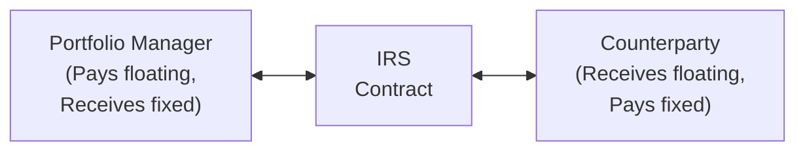

## Introduction

Listen, I still remember the first time I watched a portfolio manager hastily implement an interest rate swap (IRS) to tame a runaway duration mismatch in a bond portfolio—complete mixture of intrigue and mild panic. It's kind of like watching someone rapidly remodel a kitchen wall: if they know what they're doing, it goes quickly and smoothly. But if not—well, fragments can fly everywhere.

Anyway, in this section, we’ll dig into the use of derivatives in fixed income management. Our goal is to show how these instruments (interest rate swaps, futures, options, and credit default swaps) help managers hone interest rate exposure, hedge credit risk, or dial up credit exposures, all while dealing with the complexities of margin calls, counterparty risk, and shifting regulations. 

We’ll keep things straightforward but thorough enough that, by the end, you’ll have a solid sense of each derivative’s purpose, the operational mechanics, and the potential pitfalls that may arise.

## Why Use Derivatives in Fixed Income?

There’s that old expression in finance: sometimes it’s easier to “move the derivative than move the bond.” Buying and selling physical bonds can be expensive and time-consuming. On top of that, certain specialized issues may be illiquid. Derivatives can be used to:

• Quickly adjust the portfolio’s duration.  
• Hedge or gain exposure to specific risks—interest rate, credit, or spread.  
• Potentially lower transaction costs compared to trading the underlying bonds.  
• Implement strategies that are otherwise hard to set up (e.g., a pure credit hedge in certain niche markets).

Of course, derivatives also carry distinct operational and regulatory challenges. We’ll get to those soon.

## Core Types of Fixed Income Derivatives

### Interest Rate Swaps

An interest rate swap (IRS) is a contract where two parties exchange streams of interest payments—one paying a fixed rate and receiving a floating rate, and the other receiving fixed and paying floating. The notional principal doesn’t usually change hands (although it might in certain exotic swaps). For the typical plain vanilla swap, the notional principal merely serves as a calculation base for interest payments.

Here’s a high-level look at an IRS in a simple diagram:

The manager’s goal might be to turn a floating-rate exposure into a synthetic fixed-rate exposure (or vice versa). For example, if you manage a bond portfolio stacked with fixed-rate securities, but you suspect interest rates might climb, you could pay fixed in a swap (and receive floating). That effectively lowers the portfolio’s duration because you’re offsetting some portion of your fixed-rate exposure with a derivative that benefits from rising rates.

#### Duration Adjustment with Swaps

Duration is a measure of a bond (or portfolio) price sensitivity to interest rate changes. If you think rates are headed up, you generally want a shorter duration. If you think rates are going down, you might want to extend duration.

Paying fixed (and receiving floating) in a plain vanilla interest rate swap reduces duration. Conversely, receiving fixed (and paying floating) in a swap increases duration. The ability to move duration up or down on short notice, without having to buy/sell individual bonds, is why swaps are a mainstay for many managers.

### Bond Futures

Bond futures—especially Treasury futures—are a popular way to adjust interest rate exposure. They’re standardized exchange-traded contracts, so you face an exchange clearinghouse rather than a private counterparty. This reduces counterparty risk, though margin requirements apply, and your position is marked-to-market daily.

You can take a long position in a bond future if you want to increase your duration (benefiting from rate declines), or short one to decrease duration (benefiting from rising rates). The big advantage with futures is usually liquidity and transparency. The disadvantage can be the mismatch between the deliverable bond underlying the future and the bond you actually hold in your portfolio, which can introduce basis risk.

#### Example: Duration Adjustment with Treasury Futures

Let’s say you have a $100 million bond portfolio with a duration of 6, but your target duration is 4. You want to shed 2 duration units. In a simplified formula:

$$
\text{Number of Futures Contracts} = \frac{(\text{Target Duration} - \text{Current Duration}) \times \text{Portfolio Value}}{\text{Futures Duration} \times \text{Futures Price}}
$$

If you know the futures contract has a duration of 5.5 (just an example) and a price around $120,000 per contract (again hypothetical), you’d compute:

• Duration difference: (4 – 6) = –2  
• Portfolio Value: $100,000,000  
• Futures Duration: 5.5  
• Futures Price: $120,000

Plug this all in:

• Numerator = –2 × $100,000,000 = –$200,000,000  
• Denominator = 5.5 × $120,000 = $660,000

So you get roughly –303 contracts. A negative sign implies you’d go short 303 bond futures to reduce the portfolio’s overall duration from 6 to 4. (Please note actual calculations in real practice can be more nuanced.)

### Interest Rate Options (Caps, Floors, and Swaptions)

Interest rate caps and floors are options on floating interest rates. For instance:

• A cap pays you if rates rise above a certain level (useful when you’re worried about rising rates if you’re paying floating).  
• A floor pays you if rates drop below a certain level (useful if you’re receiving floating).

Swaptions give you the right (but not obligation) to enter into a swap as either a fixed-rate payer or receiver. Suppose you expect rates to move sharply but aren’t certain of the direction. You might buy a payer swaption in case rates rise. If they do, you can exercise, become a fixed-rate payer in the swap, and reduce your duration. If rates stay flat or fall, you let the swaption expire with a known cost (the premium).

### Credit Default Swaps (CDS)

CDSs have revolutionized credit risk management. A CDS is basically an insurance contract on a bond or a basket of bonds. The protection buyer pays a periodic premium (the CDS spread) to the protection seller. If a credit event occurs (e.g., issuer defaults or experiences a restructuring event), the seller compensates the buyer for losses.

Managers use CDS to hedge or assume credit exposure without trading the underlying. If you’re worried about an issuer’s credit risk, you can buy protection on that issuer’s bond. If credit risk truly materializes, your CDS pays out. Conversely, if you think an issuer’s credit risk is overestimated by the market, you could sell protection and receive that CDS spread. Let me tell you, though, because I worked with credit managers who used CDS heavily, once you start layering on multiple CDS positions, your daily risk calculations get complicated quickly. But it’s powerful once you master it.  

## Exchange-Traded Versus OTC

Derivatives can be exchange-traded or traded over-the-counter (OTC). Exchange-traded derivatives, such as Treasury futures (or some standardized options), carry lower counterparty risk because the exchange clearinghouse guarantees performance. You do, however, need to maintain margin and deal with standard contract specifications.

OTC instruments can be tailored. For example, you might want a unique notional schedule for an interest rate swap or a customized credit risk basket for a basket CDS. In these cases, you negotiate bilateral contracts with a counterparty — typically a large bank or broker. This is great for customization, but:

• Counterparty risk can be higher.  
• Collateral requirements can vary.  
• Documentation can be quite extensive, usually governed by an International Swaps and Derivatives Association (ISDA) Master Agreement.  

## Collateral and Margin Requirements

OTC deals often include a Credit Support Annex (CSA) detailing how parties post collateral. Whenever the derivative’s market value moves in your favor, your counterparty might have to post collateral (and vice versa) to shield you from default risk. Large daily moves in the market can result in margin calls. 

With exchange-traded derivatives, margin is posted to the clearinghouse. Initial margin is like a deposit, and variation margin is posted or returned as the contract is marked-to-market daily. Missing a margin call can lead to forced liquidation, a headache no one wants.

## Implementation Case Study

Let’s consider a scenario. You manage a bond portfolio primarily invested in investment-grade corporates and Treasuries. Suddenly, you anticipate a short-term rate hike by the central bank. You want to reduce your portfolio duration from 7 to 5, but you don’t want to sell your bonds because they’re relatively illiquid or have embedded capital gains you’d prefer not to realize right away (tax considerations, etc.).

• Step 1: Evaluate the interest rate environment. You’re expecting a rate hike in the next quarter.  
• Step 2: Decide on the derivative. A short position in Treasury futures or paying fixed on a swap would do the trick.  
• Step 3: Set the size of the trade. Based on your portfolio value and the difference in duration, you calculate the notional you need to hedge (as shown in the formula earlier).  
• Step 4: Confirm collateral or margin arrangements. If you do it via futures, your clearing broker might require daily margin. If you do it via a swap, your CSA with the bank might specify how you handle collateral calls.  
• Step 5: Monitor. Rates are notoriously variable, so keep an eye on the trade’s payoff and ensure your hedge ratio is still suitable if rates behave unexpectedly.

## Risks and Challenges

### Counterparty Risk

In an OTC swap or CDS, you rely on the counterparty’s ability to pay you if your trade operates in your favor. Naturally, if they default, you might be stuck with market losses. That’s why collateral and netting agreements are vital.

### Mark-to-Market Volatility

Derivatives are marked-to-market daily. You might see big swings in your margin requirements that must be met in cash or near-cash securities, especially if you have a large notional outstanding. This volatility can create liquidity strains if not carefully managed.

### Basis Risk

Sometimes, your hedge might not perfectly match the underlying exposure. For instance, you might hold corporate bonds but hedge with Treasury futures. The yield on corporates relative to Treasuries can shift unpredictably, leaving you with partial or “basis” risk. 

### Regulatory and Compliance Requirements

Post-financial-crisis rules like Dodd-Frank in the U.S. and EMIR (European Market Infrastructure Regulation) in the EU have significantly changed how OTC derivatives trading is reported, cleared, and collateralized. Certain standardized swaps must clear through central counterparties (CCPs); trades might have to be reported to trade repositories; and margin rules have become more stringent.

This can impact costs and the operational framework for derivative use, sometimes making it more burdensome for smaller or mid-sized asset managers.

## Best Practices

• Maintain robust documentation (ISDA Master Agreement, collateral schedules, netting agreements).  
• Stress-test your derivative positions under multiple interest rate, credit spread, and liquidity scenarios.  
• Double-check that your derivative product actually matches your hedging or speculative intent.  
• Keep close track of margin availability and potential margin calls during market stress—no one wants to be forced to unwind a position at the worst possible moment.  
• Adhere to risk limits that reflect your investment policy statement (IPS)—as we discussed earlier in Chapter 4 regarding establishing guidelines for acceptable derivative usage.  
• Constantly monitor your credit exposures if you are both buying and selling credit protection in CDS markets.

## Personal Observations

I once worked with a colleague who used interest rate options to hedge a large mortgage-backed securities (MBS) portfolio. The market ended up whipsawing, so yes, the portfolio was “protected,” but the manager had to roll those options more often than expected. You’d be surprised how quickly options can expire and how that short time horizon complicates a presumably straightforward hedge. If you don’t factor in the cost of constantly rolling those positions, you face an expensive surprise.

## Conclusion and Exam Tips

Derivatives open doors for fine-tuning fixed income portfolios but come with responsibilities: margin management, credit risk evaluation, and a good handle on market behavior under stress. For your exam, focus on:

• Understanding how each derivative (IRS, futures, options, CDS) modifies or hedges duration, yield curve, or credit risk.  
• Knowing quick calculations for approximate hedge ratios (like the futures contract duration hedge formula).  
• Awareness of how to incorporate collateral or margin calls in real-life situations.  
• Recognizing how basis risk, regulatory changes, and liquidity constraints can affect derivative strategies.  

Be prepared for exam questions that combine conceptual knowledge (e.g., how to shift duration) with scenario-based problem solving (e.g., deciding among an interest rate swap, bond futures, or an options approach). Also watch for questions testing your understanding of netting, margin requirements, and the difference between exchange-traded and OTC derivatives.

## References and Further Reading

• Choudhry, M. (2019). The Mechanics of Interest Rate Derivatives. Wiley.  
• ISDA (International Swaps and Derivatives Association). (n.d.). Guidelines and Documentation. Retrieved from www.isda.org  
• Hull, J. (2021). Options, Futures, and Other Derivatives (10th ed.). Pearson.  

---

## Test Your Knowledge: Using Derivatives in Fixed Income Management



### Which derivative instrument is most commonly used to adjust a bond portfolio’s duration quickly?  
- [ ] Short selling corporate bonds  
- [ ] Buying credit default swaps  
- [x] Using interest rate swaps  
- [ ] Issuing new bonds  

> **Explanation:** Interest rate swaps let you effectively convert fixed-rate exposure into floating-rate exposure (or vice versa), so they’re frequently used to alter the portfolio’s interest rate sensitivity (duration) without transacting in the underlying bonds.

### When a portfolio manager “pays fixed” in an interest rate swap, what happens to the portfolio’s duration?  
- [ ] Duration increases significantly  
- [x] Duration decreases  
- [ ] Duration does not change  
- [ ] Duration only changes if rates rise  

> **Explanation:** Paying fixed in a swap is similar to taking a short position in a fixed-rate bond—thus lowering the portfolio’s overall duration because you benefit if rates rise.

### Which of the following is a key difference between exchange-traded bond futures and OTC interest rate swaps?  
- [ ] Swaps involve no notional principal  
- [ ] Bond futures require no collateral  
- [x] Exchange-traded derivative positions are marked-to-market through a clearinghouse  
- [ ] OTC derivatives are risk-free instruments  

> **Explanation:** A major difference is that exchange-traded contracts settle through a clearinghouse with daily margining. OTC swaps are privately negotiated and come with greater counterparty risk, necessitating collateral posting under bilateral agreements.

### A credit default swap (CDS) buyer receives:  
- [ ] An upfront premium from the protection seller  
- [ ] Floating rate payments in exchange for fixed  
- [x] A payout if the reference entity experiences a credit event  
- [ ] Higher basis risk compared to a bond future  

> **Explanation:** A CDS buyer purchases protection against a reference entity’s default. If the bond issuer defaults (or experiences another credit event under the contract terms), the CDS provides a compensatory payout.

### Default risk on an OTC derivative is most heavily influenced by:  
- [ ] The volume of treasury futures traded  
- [x] Counterparty credit quality and collateral arrangements  
- [ ] Regulatory deadlines for trade reporting  
- [ ] When the next central bank meeting is scheduled  

> **Explanation:** OTC derivatives face counterparty risk. The creditworthiness of each party and the collateral posted under ISDA agreements determine the magnitude of default risk.

### If a portfolio manager anticipates a sharp increase in interest rates but wants to maintain existing bond holdings, which strategy makes the most sense?  
- [ ] Buying a payer swaption  
- [x] Paying fixed in an interest rate swap  
- [ ] Receiving fixed in an interest rate swap  
- [ ] Buying bond futures  

> **Explanation:** Paying fixed in a swap will reduce duration, mitigating rate risk. If rates rise, the swap position benefits from receiving floating while paying fixed.

### Which of the following best describes a potential disadvantage of using futures to hedge duration?  
- [ ] They can only be traded OTC  
- [x] Basis risk if the futures contract and underlying bonds differ  
- [ ] Daily margining makes them costless  
- [ ] Unlimited credit exposure down the road  

> **Explanation:** The main disadvantage of futures hedging is basis risk if the futures contract’s underlying isn’t a perfect match with the bonds held in the portfolio.

### Collateral posting for an OTC swap is generally governed by:  
- [ ] Central bank regulations alone  
- [ ] Exchange clearinghouse rules  
- [x] A Credit Support Annex (CSA) under the ISDA Master Agreement  
- [ ] Tax authorities  

> **Explanation:** The ISDA Master Agreement, along with a Credit Support Annex (CSA), dictates how two parties exchange collateral for an OTC derivative contract.

### Derivatives can be used in fixed income management to:  
- [x] Quickly adjust portfolio duration and hedge interest rate changes  
- [ ] Increase operational overhead and legal complexities only  
- [ ] Eliminate basis risk entirely  
- [ ] Avoid regulatory oversight altogether  

> **Explanation:** The primary motivators include adjusting exposures rapidly and hedging specific risks. However, you can’t eradicate basis risk entirely, and regulatory oversight remains a reality.

### True or False: Selling protection in the CDS market exposes you to the risk of issuer default.  
- [x] True  
- [ ] False  

> **Explanation:** A CDS protection seller must compensate the buyer if a credit event occurs. Consequently, the seller faces the full brunt of the issuer’s default risk.


