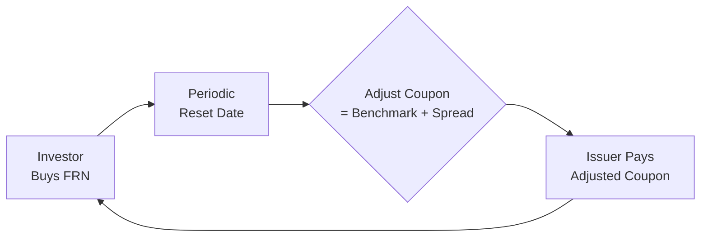

## Introduction

Have you ever felt that queasy, uncertain feeling when interest rates start climbing faster than you can keep track, and you’re left wondering if your portfolio’s fixed income investments will suddenly drop in value? I remember the first time I encountered a sudden rate spike. I had a friend who was happily holding a 10-year fixed rate bond—until the market yield shot up. Day after day, the bond’s market value seemed to tumble, leaving my friend with a paper loss that felt pretty painful. That’s precisely the scenario where floating rate instruments can come in and save the day.

Floating rate notes (FRNs) are impacted less by interest rate moves because their coupon payments reset periodically at a rate linked to a reference benchmark—like LIBOR or SOFR—plus a spread. In this article, we’ll dig deep into how FRNs help manage interest rate risk, how managers attempt to capture spread movements, and what features you should watch for if you incorporate these notes into your fixed income strategy.

## Key Characteristics of Floating Rate Notes

### The Basics
A floating rate note (FRN) is a debt instrument that pays variable coupons tied to a benchmark interest rate. The most common benchmarks historically have been the London Interbank Offered Rate (LIBOR) and, increasingly these days, the Secured Overnight Financing Rate (SOFR). The coupon—often expressed as “Reference Rate + X bps”—resets on specific calendar dates (e.g., quarterly or semi-annually) so that the coupon generally moves in tandem with short-term market interest rates.

When the reference rate rises, the coupon payment for the FRN is adjusted upward at the next reset date. Conversely, if the reference rate falls, the coupon payment is usually revised downward.

For example, a typical coupon calculation might look like this in formula form:


\text{Coupon Payment} = \left(\text{Reference Rate} + \text{Quoted Spread}\right) \times \text{Face Value} \times \frac{\text{Days in Coupon Period}}{\text{Base Days}}


Common day-count conversions (e.g., Actual/360) apply depending on the market convention.

### Duration and Interest Rate Sensitivity
One of the major perks of FRNs is their relatively low duration compared with fixed-coupon bonds. Duration, in a nutshell, measures how sensitive a bond’s price is to changes in yield. Because FRN coupon rates reset periodically, effective duration can be very short, especially if the reset frequency is frequent (e.g., monthly or quarterly).

From a portfolio management perspective, this means that if you’re expecting rising interest rates, FRNs can help mitigate the potential price declines that come with holding long-dated fixed-rate instruments. In a sense, the FRN’s floating coupon structure can keep pace with—at least partially—short-term shifts in the broader rate environment.

## Transition from LIBOR to SOFR

LIBOR used to be the superstar among reference rates, widely used in derivatives, loans, and FRNs. However, with the LIBOR phase-out, many new floating rate debt issuances reference SOFR. SOFR is a measure of the cost of borrowing cash overnight collateralized by U.S. Treasury securities, making it more transaction-based and arguably more robust.

For global portfolios, it’s essential to note that each market may have its own locally preferred reference rate. Managers should carefully analyze the liquidity and credit risk components inherent in each benchmark. Moreover, if you purchased older FRNs tied to LIBOR, you’d likely see a fallback clause addressing a shift to alternative reference rates. This can affect spread dynamics.

## Spread Management: Capturing Credit and Liquidity Differentials

### Understanding the Spread
While the reference rate sets the adjustable anchor, there’s also a spread component, sometimes called the “credit spread” or simply the “quoted margin.” This spread reflects the issuer’s credit risk relative to the benchmark. In addition, a portion of the spread may also incorporate liquidity factors—particularly in times of market stress when even highly rated issuers can see elevated spreads.

When we say “spread management,” we’re talking about managing and potentially profiting from shifts or dislocations in this portion of the yield. Even if the reference rate remains stable, changes in perceptions of credit risk, liquidity conditions, or broader market sentiment can cause the spread to widen or tighten.

### Tactical Spread Positioning
Portfolio managers often rotate among FRNs with varying credit or liquidity profiles in anticipation of how spreads might move. For instance:

• If a manager believes corporate credit quality will deteriorate, they might shift away from low-rated or high-yield FRNs toward higher-rated instruments, reducing potential losses from a widening spread.  
• If they expect an improvement in credit markets, they might look to capture alpha by buying higher-yielding FRNs anticipating spread tightening.

### Example: Spread Widening
Let’s say a manager holds a floating rate note from a bank. The coupon is SOFR + 300 basis points (bps). Suddenly, that bank’s credit rating is adversely reviewed and there’s negative news coverage, causing new issuance spreads for that bank to jump to SOFR + 500 bps. The market price of the front book note drops since investors can now get a richer spread for new issues. If you hold the existing security, you’ve effectively lost some capital value because that original note is now less attractive. Spread management strategies aim to anticipate, hedge, or exploit these shifts.

## Reset Frequency and Portfolio Considerations

FRNs typically reset quarterly, but monthly, semi-annual, or even weekly resets exist. The shorter the reset period, the closer the FRN stays to current interest rate conditions. However, there can be trade-offs:

- More frequent resets can mean better alignment with short-term rates—thus lower interest rate risk.  
- Less frequent resets might offer a higher base spread if the issuer wants to compensate investors for the slightly higher interest rate risk in the period between resets.

In practice, managers might blend FRNs with different reset frequencies to fine-tune liquidity or match the cash flow needs of a portfolio. For example, a manager with monthly liability payouts might love monthly-reset FRNs because the coupon changes closely match the pattern of cash outflows.

## Floor and Ceiling Clauses

### Floors
Ever worried that rates might go so low you barely earn any coupon? In some FRNs, there’s a “floor” rate. This ensures that if the benchmark rate drops below a certain threshold, the coupon rate can’t drop below that floor. This is often beneficial for investors in a declining interest rate environment. However, floors can come with a price—issuers might offer a lower spread to offset the embedded protection you’re getting.

### Ceilings (or Caps)
In the opposite direction, “caps” or “ceiling” clauses put an upper limit on the coupon rate. Corporations or banks sometimes embed these caps to avoid unlimited coupon liability if short-term rates surge. If you expect rates to skyrocket, you’ll need to watch out for these caps, as they put a lid on your potential incoming cash flow.

## Why Use FRNs in a Rising Rate Environment?

It’s straightforward: with all else being equal, if you hold a fixed coupon bond in a rising rate environment, the market value typically declines. This is because the bond’s coupon is locked, and newly issued bonds would offer higher yields. FRNs, however, adjust upwards with rising rates, so market prices generally remain more stable. That means you’re less exposed to capital losses from interest rate hikes.

Of course, no free lunch here. Because your coupon gets reset higher, in times of sharply rising rates, issuers pay more. But if you’re the investor, that’s precisely the upside: you get a coupon that keeps pace with short-term benchmarks. And if credit spreads remain stable or tighten, it can be quite a comfy spot.

## Integrating FRNs into Portfolio Management

### Hedging Interest Rate Risk
One big reason portfolio managers purchase FRNs is to hedge or reduce interest rate risk. Suppose you have a liability stream that grows with short-term rates—like a floating rate liability. By holding FRNs, your asset side of the balance sheet also resets with interest rates, offsetting (to a degree) your liabilities’ sensitivity.

### Capturing Spread Moves
Managers skilled at reading macro signals, corporate fundamentals, and technical market indicators might exploit spread volatility. If you think credit conditions will improve for a particular sector, you might overweight FRNs in that sector to lock in a higher spread before it tightens.

### Liquidity Considerations
FRNs can sometimes be more liquid in certain market segments, especially short-term notes. However, liquidity can dry up under stressed market conditions—so it’s not a given. Always watch the average daily trading volumes and bid-ask spreads to see where liquidity stands.

## Case Study Illustration

Let’s do a simplified scenario:

- You have a $1 million portfolio heavily invested in 5-year corporate bonds with a coupon of 3%, while short-term rates stand at 1%. Suddenly, the central bank signals multiple rate hikes, and the yield curve shifts upward. The 2-year yield jumps 50 bps, and the 5-year yield jumps 70 bps.  
- The market price of your 3% fixed-rate bond falls, let’s say, by about 3–4% (depending on its duration).  
- Meanwhile, an FRN from the same issuer might have a coupon of SOFR + 250 bps. If overnight SOFR rises, the floating coupon will also rise, leaving its market price less affected by the move in rates.

If you were worried about the interest rate environment, you might have sold part of your fixed-rate holdings and bought FRNs, mitigating some capital loss exposure.

## Diagram: Floating Rate Note Structure

Below is a simple Mermaid diagram explaining the cash flow structure for an FRN. The steps show how a bond’s coupon resets against a benchmark plus a fixed spread.



Reading the diagram from left to right:
• The investor buys the FRN.  
• On each reset date, the coupon is recalculated (benchmark + spread).  
• The new coupon rate is applied until the next reset date.  
• At the end of that period, the issuer pays the investor the coupon.  
• The cycle continues through the life of the note.

## Simple Python Snippet: FRN Coupon Calculation

Sometimes it’s fun to see a quick code snippet to demonstrate how a floating coupon might be calculated for a single period, especially if you’re building a small analytics tool.

```python

face_value = 1000000
reference_rate = 0.025  # 2.5% reference rate
spread = 0.015          # 1.5% spread
days_in_period = 90
day_count_year = 360

periodic_coupon = (reference_rate + spread) * face_value * (days_in_period / day_count_year)

print(f"Coupon for current period: ${periodic_coupon:,.2f}")
```

Here, reference_rate = 2.5% (0.025) and spread = 1.5% (0.015). The day count basis is 360, and we used 90 days in the period. You can adjust the parameters as needed.

## Potential Risks and Pitfalls

- Credit Risk: If the issuer’s credit quality deteriorates, the FRN’s spread might widen, leading to potential mark-to-market losses.  
- Liquidity Risk: FRNs could become illiquid if there’s a flight to safety in the market.  
- Cap Risk: If your FRN has a coupon cap, in a sharply rising rate environment, your coupon might hit the ceiling.  
- Basis Risk: If your liabilities are pegged to a different benchmark rate than your FRN (e.g., you owe payments linked to EURIBOR, but your assets pay SOFR coupons), you could have some mismatch in performance.

## Exam Tips for CFA Candidates

• Know the formula for a floating coupon calculation. The exam might ask for how to compute the coupon given a reference rate, spread, and day count convention.  
• Understand how changes in the spread or benchmark rate affect FRN valuations. Exam vignettes often present scenarios with spread widening or tightening.  
• Be prepared to discuss reasons for investing in FRNs specifically for rising rate protection or to match liability profiles.  
• Remember to factor in floors and caps when evaluating total return potential.  
• Spread management questions might test your understanding of how portfolio managers shift credit exposure to capture risk premium changes.

## Final Thoughts

Floating rate instruments can be a powerful tool in a rising rate environment, giving you something akin to a built-in shield against interest rate risk. And from a spread management angle, they also present opportunities to benefit when market risk premiums shift. Just be sure to keep an eye on credit risk, liquidity conditions, and those subtle contract provisions such as floors and caps. With the transition to SOFR and other new benchmarks, it’s also essential to remain vigilant about potential basis risk and fallback clauses in legacy notes.

In my opinion, FRNs are a bit like the adjustable-rate mortgage of the bond world: they keep you from being locked into a fixed rate when short-term interest rates drift in unexpected directions. But as with any adjustable strategy, the details (like floors, caps, resets, or waivers) matter—and how you manage the spread is the real dealmaker in optimizing your returns.

## References and Further Reading

- ICMA (International Capital Market Association): Guides on floating rate bond conventions.  
- New York Fed: Transition from LIBOR to SOFR (www.newyorkfed.org).  
- CFA Institute Level I and II Curriculum readings on the bond market, referencing yield measures, durations, and floating rate structures.  

---

## Test Your Knowledge: Floating Rate Instruments and Spread Management



### FRNs and Rising Rates
- [x] They have lower duration risk because coupons reset with market rates.
- [ ] They are more sensitive to interest rate movement than fixed rate bonds.
- [ ] They do not include any credit spread component.
- [ ] They guarantee higher total returns whenever rates rise.

> **Explanation:** Floating rate notes have variable coupon payments that adjust periodically, resulting in lower interest rate sensitivity (i.e., lower duration) compared with fixed-rate bonds.

### Spread Management Techniques
- [x] Managers can shift among various issuers’ FRNs to capture tightening or widening of credit spreads.
- [ ] Spread management only applies to equity portfolios.
- [ ] Spreads remain unaffected by credit or liquidity conditions.
- [ ] Spread changes never affect FRN prices.

> **Explanation:** Spread management in fixed income often involves reacting to or anticipating changes in credit spreads. Equity and bond spread dynamics differ, so focusing on FRNs is about capturing or hedging the credit spread component relative to the benchmark.

### Components of FRN Coupon
- [x] Reference rate plus a spread.
- [ ] Fixed coupon only.
- [ ] Index-linked coupon minus fees.
- [ ] Reference rate minus the bond’s credit rating.

> **Explanation:** An FRN’s coupon is typically the reference rate (e.g., LIBOR or SOFR) plus a fixed spread that reflects credit risk differences from the benchmark.

### Benefit of Floors in FRNs
- [x] Protect the investor if the reference rate falls below a certain level.
- [ ] Prevent the coupon from ever rising.
- [ ] Eliminate credit risk completely.
- [ ] Fix the coupon, removing the floating feature.

> **Explanation:** Floors set a lower bound for the coupon rate, ensuring a minimum coupon if the benchmark rate drops too low. It does not fix the coupon, only establishes a minimum.

### Cap Feature on FRNs
- [x] Limits the maximum coupon the issuer must pay.
- [ ] Eliminates default risk.
- [x] Potentially restricts investor gains in a sharply rising rate environment.
- [ ] Lowers the credit spread to zero.

> **Explanation:** Caps protect the issuer by imposing a ceiling on coupon payments, meaning the investor’s upside is capped. This can limit total returns if interest rates rise significantly.

### Reset Frequency
- [x] More frequent resets align coupons more closely with short-term rates.
- [ ] Always occurs daily.
- [ ] Never affects pricing or valuation.
- [ ] Cannot be negotiated between issuer and investor.

> **Explanation:** Reset frequency is part of the bond’s terms. More frequent resets reduce interest rate risk because the coupon is updated more quickly.

### Spread Widening Impact
- [x] FRN prices may fall as investors demand a higher spread for new issuances.
- [ ] FRNs become immune to any price movement.
- [x] Existing holders could see mark-to-market losses if spreads widen significantly.
- [ ] Coupons remain fixed if spreads widen.

> **Explanation:** When spreads widen for a particular issuer, the market value of existing notes typically falls. This can create mark-to-market losses for current holders of that issuer’s notes.

### LIBOR vs. SOFR
- [x] SOFR is a transaction-based rate backed by Treasury repo transactions.
- [ ] LIBOR remains the only key reference rate for all new issuances.
- [ ] SOFR has no ties to market-based transactions.
- [ ] Both rates are set identically by the same panel banks.

> **Explanation:** SOFR is widely adopted as a more transparent and transaction-based rate, while LIBOR is phasing out due to issues with panel bank submissions.

### FRN Use in Liability Matching
- [x] FRNs can help align asset cash flows with floating-rate liabilities.
- [ ] FRNs increase mismatch in liability-driven portfolios.
- [ ] They are not used in LDI strategies.
- [ ] They are restricted to hedge funds only.

> **Explanation:** Liability-driven investors with floating-rate obligations can use FRNs to match or hedge those obligations more effectively.

### True or False: An FRN with a cap and a floor is essentially immune to yield curve shifts.
- [x] True
- [ ] False

> **Explanation:** If you have both a floor and a cap in a fairly narrow band, the coupon essentially stays within that band, which can reduce the bond’s sensitivity to large yield curve shifts. However, watch for credit risk or large swings beyond the trigger points.


