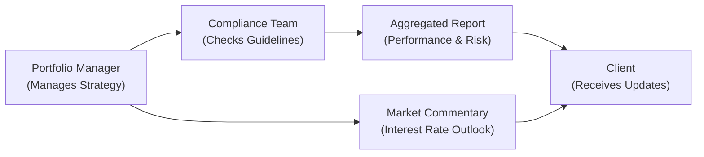

## Introduction

Effective communication and transparent reporting are at the heart of every successful fixed income strategy. I still remember the time, years ago, when I had my very first meeting with a local municipality’s treasurer. I was so caught up in the complexities of duration targets and credit spreads that I started rattling off terms like “z-spread” and “matrix pricing” right away. The response? A polite but somewhat blank stare. That moment taught me an invaluable lesson: delivering robust information is only half the job. Ensuring the client actually understands it is just as important, if not more.

In fixed income portfolio management, we often deal with a variety of benchmarks, multiple layers of risk management, and evolving interest rate outlooks. Clients, however, need a concise explanation of what’s happening with their investments, why it’s happening, and how it aligns with their goals. The sections below explore the essential components of investor communication, from key performance metrics to scenario analyses and compliance reporting. Aligning all these elements can build trust and transparency that truly bring a fixed income strategy to life.

## The Goals of Effective Communication

Many portfolio managers want to dive straight into calculations. But hold on—communication in fixed income goes beyond metrics and numbers. It’s about translating those numbers into a narrative the client can connect with. Whether you’re updating a large foundation or a retiree’s trust, your respective audiences need these essentials:

• Timely delivery of information: Monthly or quarterly reports that don’t arrive on time risk losing client confidence.  
• Transparency about performance and portfolio changes: Even a small shift in duration or sector allocation can be important to explain.  
• Forward-looking insights: An interest rate outlook or a brief market commentary can reduce confusion and help clients make informed decisions.  
• Risk exposure clarifications: Provide not just the “what” but also the “why” behind changes in risk levels.  

I recently worked with a retired professional who was deeply concerned about inflation’s impact on the real return of his bond portfolio. A short phone chat—discussing the role of Treasury Inflation-Protected Securities (TIPS), yield to maturity (YTM), and sector allocation—was all it took to ease his worries. This real-world example underlines how meaningful transparency can be in strengthening relationships.

## Essential Metrics for Fixed Income Reporting

You want to strike a balance between being thorough and not inundating the client with excessive detail. Below are some must-have metrics that clients typically want to see—presented in straightforward ways.

### Yield to Maturity
Yield to Maturity (YTM) is a classic measure that estimates the total return anticipated if the bonds in your portfolio are held until their final maturity date. Clients often misunderstand this metric, expecting it to be a guaranteed payoff. Gently remind them that YTM is based on current market prices and assumptions about reinvestment of coupons. Nothing is “guaranteed” except the stated bond coupons and principal redemption (subject to credit risk if non-government).

A quick Python snippet (purely for demonstration) to approximate YTM might look like this:

```python
def approximate_ytm(face_value, price, coupon_rate, years_to_maturity):
    annual_coupon_payment = face_value * coupon_rate
    return (annual_coupon_payment + (face_value - price)/years_to_maturity) / ((face_value + price)/2)

# Bond details:
#  - Current Market Price: $980
#  - Years to Maturity: 5
ytm_estimate = approximate_ytm(1000, 980, 0.04, 5)
print(f"Approximate YTM: {ytm_estimate:.2%}")
```

While it's not the exact formula for yield to maturity, it’s a classic approximation that can help you illustrate the concept.

### Average Duration
When it comes to sensitivity to interest rates, duration reigns supreme. Average duration (often effective duration) tells both managers and clients how a portfolio might respond to a 1% change in rates. In practice, many managers will emphasize the portfolio’s duration in relation to a benchmark’s duration—such as the Bloomberg U.S. Aggregate Bond Index—to highlight how aggressively or defensively they’re positioned.

### Spread Duration
Spread duration (sometimes called “credit spread duration”) measures the sensitivity of your portfolio to changes in credit spreads. For a client who invests heavily in corporate bonds, agencies, or mortgage-backed securities, understanding how the portfolio might react to a sudden widening or tightening of spreads can be crucial. Stressing that spread duration is not the same as interest rate duration helps clarify that economic or marketplace events can independently affect credit spreads—and thus portfolio returns.

### Sector Allocation
Clients often want to see how their money is distributed across government bonds, corporate bonds, mortgage-backed securities, and other subsets. When describing sector allocation, try to keep it high-level. Many individuals appreciate a chart with broad categories rather than an avalanche of sub-sectors.

### Top Holdings
Listing top holdings offers transparency. Big names like U.S. Treasuries, major corporate issuers (e.g., Apple or Toyota bonds), or well-known government agencies can offer familiarity. Consider adding a short commentary—e.g., “This bond is AAA rated and was added for additional duration stability.”

### Turnover
Turnover illustrates how often you buy and sell securities in the portfolio. A higher turnover might indicate a more active approach, potentially leading to higher transaction costs. A lower turnover might align with a more buy-and-hold style. Since turnover can impact both taxes (where applicable) and costs, it’s worth explaining in plain language. You might say, “We adjust positions based on market signals but keep turnover modest to limit transaction costs.”

## Stress Testing and Scenario Analysis

Let’s face it: interest rates never just sit still, and credit spreads can shift with market sentiment. Stress tests and scenario analyses help convey how portfolios might perform under different conditions. For instance, you might model a parallel upward shift of 100 basis points in the yield curve or a credit spread shock reminiscent of 2008–2009.

I often approach scenario analysis with something like this:

- Baseline Scenario: Market rates remain stable, with modest changes aligned to consensus forecasts.  
- Rate Spike Scenario: Rates rise by 100 basis points.  
- Recession Scenario: Rates drop by 50 basis points, but credit spreads widen by 100 basis points.  

In the client report, present these scenarios in a simple table. For instance:

| Scenario               | Estimated Portfolio Return | Key Drivers                                 |
|------------------------|----------------------------|---------------------------------------------|
| Baseline               | +4.2%                     | Stable rates, stable credit spreads         |
| Rate Spike (+100bps)  | –2.5%                     | Price declines due to higher yields         |
| Recession & Spread Widening | –4.0%             | Lower rates but larger credit spread impact |

Highlight key factors: “Under the recession scenario, the positive effect of falling interest rates is offset by significant spread widening, leading to an overall negative return.” This is client-friendly language that can help them understand potential volatility.

## Communicating Derivatives, Leverage, and Off-Benchmark Exposure

Some clients get nervous when they hear “derivatives,” so the approach to communication should be calm, clear, and straightforward. If the portfolio uses interest rate futures to adjust duration or credit default swaps to hedge risk, mention these tools in an easy-to-digest summary:

- Purpose: “We use interest rate futures to quickly adjust portfolio duration without selling our existing holdings.”  
- Exposure: “We have a net notional exposure of 5% in credit default swaps to hedge a portion of our corporate bond investments.”  

Off-benchmark exposures—like an allocation to emerging market debt in a high-grade portfolio—might be used strategically for yield enhancement. Clients should know what portion of the portfolio falls outside the “normal range.” If the client’s guidelines allow for up to 10% in off-benchmark allocations, you might say, “Currently, 8% of your portfolio is invested in emerging market sovereign bonds to add diversification and potential yield benefits.”

## Regular Reporting Intervals

Monthly or quarterly updates keep communication lines open. In these updates, you might include:

• Performance summary: Net of fees, versus benchmark or stated objectives.  
• Portfolio allocation changes: Sectors, durations, credit qualities.  
• Market commentary: Brief perspective on interest rate outlook or credit conditions.  
• Compliance reporting: Any breaches of guidelines or constraints.  

Having a standard reporting template with these sections can help ensure consistency over time. It also sets client expectations that each report will follow a recognizable pattern.

## Best Practices in Client-Friendly Language

We’ve all spoken “Bond Geek” at times. But the best approach is to sprinkle in plain language throughout:

• Use analogies: “Think of your bond portfolio as a seesaw. When interest rates on one side go up, bond prices on the other side can come down.”  
• Offer definitions in parentheses: “We increased the portfolio’s yield by investing in credit risk—i.e., bonds with higher yields but potentially higher default risk.”  
• Confirm that they understand: Ask a quick, “Does that make sense?” or “Any specific part you want me to clarify?” during conference calls or email communications.  

## Illustration: The Reporting Workflow

Below is a simple Mermaid diagram showing how key information flows among a portfolio manager, a compliance team, and the client. It helps illustrate the distinct roles each party plays in ensuring accurate, reliable, and timely communication.



The portfolio manager coordinates data with the compliance unit to ensure all guidelines are met. A consolidated report is then generated and delivered to the client, often paired with up-to-date market commentary.

## Ensuring Compliance Reporting

Compliance reporting is the backbone of professional portfolio management. If any guideline is breached—say, an over-concentration in a single issuer or a duration that exceeds policy limits—clients must be informed promptly. Reporting these breaches is not just about following regulations; it also highlights your commitment to the client’s best interests.

Global Investment Performance Standards (GIPS®) by the CFA Institute reinforce the importance of fair presentation of investment performance. These standards require consistency in calculations, disclosures, and the treatment of portfolios. In the realm of fixed income, being GIPS-compliant can build additional trust, as it demonstrates that performance results are transparent, consistent, and globally comparable.

## Putting It All Together: A Sample Report Outline

Here is a condensed sample outline you might adapt for a quarterly or monthly client report:

• Executive Summary – A quick performance recap, including alpha or beta comparisons, if relevant.  
• Portfolio Positioning and Changes – Discussion on duration vs. benchmark, sector rotation, or new bond additions.  
• Performance Drivers and Detractors – Which bonds or segments contributed most positively or negatively.  
• Risk Metrics – Duration, spread duration, yield to maturity, exposure by credit quality.  
• Compliance Overview – Confirmation that everything aligns with the Investment Policy Statement (IPS).  
• Market Outlook – Brief commentary on expected rate movements, central bank actions, or broad credit market conditions.  
• Glossary of Terms – Definitions (e.g., spread duration, turnover) for those less familiar with bond lingo.  

A short anecdote or personal comment can add a bit of spice—perhaps referencing a major economic release or a corporate earnings season that impacted the bond market. But keep it succinct. Clients typically appreciate clarity and brevity.

## Final Exam Tips

• Scenario-based prompts often ask how to communicate performance changes to clients. Focus on clarity, consistency with guidelines, and alignment with clients’ objectives.  
• When answering constructed-response questions, give a concise explanation of key metrics (yield, duration) and mention how you would address potential concerns.  
• Expect item sets that require you to interpret compliance or GIPS-related data. Understand how to spot potential breaches, misrepresentations, or misleading metrics.  
• Leverage knowledge of fixed income fundamentals (such as average duration and credit spread risk) to justify recommended communication approaches.  
• Always tie reporting back to the client’s covenants, such as their Investment Policy Statements (IPS).  

## References and Further Reading

• CFA Institute. Global Investment Performance Standards (GIPS®): https://www.cfainstitute.org/ethics-standards/gips-standards  
• FINRA’s studies on corporate bond market liquidity and transparency: https://www.finra.org  
• CFA® 2025 Level I, Volume 9: Portfolio Management, Chapters 11.1–11.10 for deeper coverage of fixed income strategies and benchmark considerations.  

----------------------------

## Test Your Knowledge: Communication & Reporting in Fixed Income



### Which of the following metrics is most commonly used to measure a fixed income portfolio’s sensitivity to changes in interest rates?

- [x] Duration
- [ ] Bond Beta
- [ ] Average Coupon
- [ ] Turnover

> **Explanation:** Duration measures how a bond or a portfolio of bonds will react to changes in interest rates. A 1% change in interest rates would lead to approximately a duration times 1% change in price.

### In a quarterly client report, you want to illustrate the portfolio's balance of corporate vs. government bonds. Which of the following is the most client-friendly method?

- [ ] Send them a list of every bond purchased or sold that quarter.
- [ ] Provide them with a lengthy spreadsheet of each bond’s individual coupon.
- [x] Include a pie chart or bar chart showing the percentage allocation by sector.
- [ ] Omit it entirely to avoid overwhelming them.

> **Explanation:** Visualizing sector allocation through a pie or bar chart provides an understandable, straightforward way to see how the portfolio is split, without excessive detail.

### If a fixed income manager uses credit default swaps to hedge risk, how should this be communicated to clients?

- [ ] Keep it undisclosed to avoid alarming them with derivatives.
- [x] Explain briefly why and how the swaps are used, focusing on risk mitigation.
- [ ] Provide only the total notional amount without description.
- [ ] Do nothing because compliance reporting is optional for swaps.

> **Explanation:** Transparency is key. Even if clients are less familiar with derivatives, you owe them a straightforward explanation of the role and potential benefits/risks.

### An investor observes that your monthly report shows both “yield to maturity” and “yield to worst.” What is the best way to explain this difference?

- [ ] They are essentially the same metric, no real difference.
- [ ] Yield to maturity applies only to Treasuries, while yield to worst applies only to corporates.
- [x] Yield to worst accounts for potential early call or put features, while yield to maturity is based on holding to final maturity.
- [ ] Yield to worst only appears when a portfolio is underperforming.

> **Explanation:** Yield to worst often factors in any embedded options (calls, puts) and picks the worst-case scenario for the investor’s yield. Yield to maturity assumes the bonds are held until final maturity, ignoring calls/puts.

### A portfolio manager includes an “Interest Rate Spike” scenario in the client’s quarterly review showing a –3% return projection. Which of the following best describes the manager’s goal?

- [x] Illustrate how changes in rates may negatively impact the portfolio.
- [ ] Warn the client they must withdraw funds immediately.
- [ ] Overstate the potential losses to justify extra fees.
- [ ] Show that the manager’s forecasts are always accurate.

> **Explanation:** Scenario analyses are used to demonstrate potential outcomes, not definite predictions. It’s a tool to help clients understand risk exposure and to inform asset allocation decisions.

### When linking interest rate outlook to fixed income portfolios in a report:

- [x] Provide a brief explanation of expected central bank policy and its potential effect.
- [ ] Omit any mention of rates to focus on past performance only.
- [ ] Use highly technical language to show expertise.
- [ ] Dismiss client concerns about rate changes.

> **Explanation:** Offering a concise interest rate outlook can help clients anticipate market shifts. Avoid jargon whenever possible.

### In presenting spread duration to a client:

- [x] Emphasize that it measures the portfolio’s sensitivity to changes in credit spreads.
- [ ] Explain it’s essentially the same as yield to maturity.
- [x] Warn that a wide spread can mean higher risk in certain environments.
- [ ] Claim it is a guaranteed measure of returns.

> **Explanation:** Spread duration is different from interest rate duration. It focuses on changes in credit spreads, which often react differently from base interest rates. Larger spreads can mean higher potential returns coupled with greater credit risk.

### A client complains about “higher turnover” in their bond portfolio. Which explanation is most appropriate?

- [x] Turnover reflects how frequently securities are bought and sold; higher turnover may align with an active strategy seeking market opportunities.
- [ ] Turnover is totally irrelevant and not worth explaining.
- [ ] Turnover always lowers returns.
- [ ] Turnover is only relevant for equity portfolios.

> **Explanation:** Turnover is a metric reflecting portfolio trading activity; it impacts costs and may be part of an active strategy. Explaining these elements offers insight into your approach.

### Compliance reporting in fixed income ensures:

- [x] Adherence to investment guidelines and client objectives.
- [ ] Minimal bureaucratic procedures, mostly optional.
- [ ] That the portfolio is 100% risk-free.
- [ ] No mention necessary of regulatory breaches.

> **Explanation:** Compliance reporting maintains discipline and transparency, aligning the manager’s actions with both regulations and client mandates.

### A portfolio has average duration of six years, and interest rates are expected to rise by 1%. Based on the concept of duration, which statement is most accurate?

- [x] The portfolio’s value may decline by around 6%.
- [ ] The portfolio’s yield will drop by 6%.
- [ ] The portfolio’s value is unaffected by rate changes.
- [ ] The portfolio will automatically outperform if credit spreads tighten.

> **Explanation:** Duration indicates that for a 1% rise in interest rates, the portfolio could lose approximately 6% in value, holding other factors constant.


