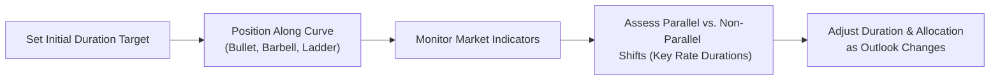

## Introduction to Duration Targeting

If we’re being totally honest, one of the trickiest (and sometimes most exciting) parts of fixed-income portfolio management is figuring out exactly how much interest rate risk to take on. This process is known as “duration targeting,” and let's just say it involves a healthy mix of discipline and well-honed intuition. When I was a junior analyst—yeah, back in the day—I once underestimated how sensitive my bond holdings were to a rate hike. You can guess how thrilled my boss was. So, hopefully, by diving into this section, you can avoid that particular pitfall.

Duration targeting essentially means you’re aligning your portfolio’s average duration with your outlook on interest rates. If you expect rates to fall, you typically want more duration exposure to benefit from price appreciation. If you expect rates to rise, you dial back on duration to protect yourself from potential losses. But of course, it’s not just about hunches. It’s typically about reading the data, analyzing macro signals, and setting a prudent target that matches client objectives and risk tolerances.

## Measuring and Understanding Duration

Duration, in practice, is the sensitivity of a bond’s price to changes in interest rates, measured in years. For a portfolio, it’s usually the weighted average of the durations of the individual bonds, with the weights typically corresponding to the market values of those holdings.

We often talk about Macaulay Duration in an academic sense (the weighted average time to receive each bond payment), and Modified Duration in a more practical sense (the approximate percentage change in bond price for a 1% change in yields). Formally:

$ \text{Modified Duration} = \frac{\text{Macaulay Duration}}{1 + \frac{y}{m}} $

where  
• y = yield to maturity (annualized),  
• m = number of coupon periods per year.

In a portfolio context, we combine the durations of the individual bonds or instruments, often weighting them by the proportion of the portfolio’s value. Our decisions revolve around whether that overall duration is high, moderate, or low based on our best guess (or forecast) of coming interest rate moves.

Let’s do a quick Python snippet (some folks find Python super handy for these tasks):

```python

bonds = [
    {'market_value': 1000000, 'duration': 4.5},
    {'market_value': 750000,  'duration': 6.0},
    {'market_value': 500000,  'duration': 2.5}
]

total_mv = sum(b['market_value'] for b in bonds)
weighted_duration = sum(b['market_value'] * b['duration'] for b in bonds) / total_mv

print("Total Portfolio Market Value:", total_mv)
print("Portfolio Weighted Average Duration:", round(weighted_duration, 2))
```

This snippet calculates a rough measure of your portfolio’s overall duration. In reality, you’d incorporate factors like convexity or embedded options (if they exist), but for day-to-day monitoring, a weighted average duration is a good start.

## Yield Curve Positioning Basics

Right alongside your decision on how much duration risk to take is the question of how to distribute that duration across the yield curve. You know—do you cluster your holdings around the short end, the intermediate maturities, or the long end? Or some combination of each?

To figure this out, managers often look at the “shape” of the yield curve, which can be:

• Normal (upward sloping)—longer maturities have higher yields than shorter ones.  
• Flat—short and long maturities offer roughly the same yield.  
• Inverted—short-term yields are higher than long-term yields (often a sign the market expects rates to fall in the future or a recession might be coming).

This shape can change, sometimes quite suddenly, due to monetary policy shifts, changing economic conditions, or sudden risk-off/risk-on sentiment in the markets.

## Common Portfolio Strategies

### Bullet Strategy

The bullet strategy is like putting all your eggs in one basket—but you’re being strategic about it. You concentrate maturities around a single point on the yield curve. If you strongly believe, for example, that the 5-year segment of the curve is going to perform better than other maturities, you can “load up” on bonds with around 5 years to maturity. 

The bullet strategy typically works well if you see reliably stable yields in that maturity segment or if you have a very specific liability in that time frame. However, if the yield curve shape changes in a way that disadvantages that point (say, if the 5-year yield spikes unexpectedly), you can get caught off guard.

### Barbell Strategy

A barbell strategy involves splitting your allocations between short-term and long-term maturities, essentially leaving out the intermediate segment. The idea is that you have some short-term bonds that can be reinvested at higher yields if rates rise, and some long-term bonds that lock in higher yields (and possibly bigger capital gains) if rates start going down. It’s like the best of both worlds—assuming the middle part of the curve isn’t where you want to be.

This can also be a bit more complex to manage because you have to pay close attention to what’s happening on both ends of the yield curve simultaneously. It also carries different types of reinvestment risk at the short end and greater price volatility at the long end.

### Ladder Strategy

The ladder strategy, which we’ll expand on in Topic 11.7, spreads maturities across multiple points along the yield curve. Imagine having bonds maturing every year or two over the next decade. While this won’t always produce the absolute best performance, it can reduce risk and smooth out your cash flows. Many wealth managers use a ladder for clients who need consistent cash flows or who might be sensitive to reinvestment risk.

## Best Practices for Yield Curve Positioning

• Stay on Top of Macroeconomic Signals: Keep an eye on indicators like GDP growth, inflation, employment data, and central bank policy. If the central bank is hinting at future rate hikes, you might want a shorter duration to protect yourself. If the central bank is more dovish, you might extend duration to capture yield.  
• Understand Your Client’s Objectives: A bullet strategy aimed at a single maturity might be great if it matches a client’s liability schedule, e.g., a big expense around that time.  
• Be Prepared for Non-Parallel Movements: Yield curves rarely move in a neat, parallel fashion. They steepen, flatten, or even twist. Key rate durations can help measure sensitivity at specific points.  

## Key Rate Durations and Non-Parallel Shifts

If all yields moved up or down equally, we’d call it a parallel shift. But in reality, different maturities often shift by different amounts. That’s where key rate durations come in handy. Instead of just looking at the portfolio’s single “average duration,” you break it down by maturities—like the 2-year, 5-year, 10-year points, etc. Each key rate duration tells you how sensitive your portfolio is if rates at that particular maturity shift by 1%.

Key rate durations help you see if your barbell might be overly exposed to changes in the short and long ends but not the middle, or if your bullet strategy is fully dependent on how one point of the curve behaves. It’s especially important for large institutional portfolios that might have many complex securities.

## Monitoring and Adjusting Strategies

As the old saying goes, “Nothing is as constant as change.” This certainly holds true for interest rates. One minute, the central bank is telegraphing hikes; the next month, they might pivot because of slowing economic data. You can’t just set a duration target and walk away. You also can’t rely on your yield curve positioning to remain ideal for the next two years.

• Revisit Duration Regularly: Check if current economic data aligns with your forecast. If it doesn’t, adjust your target.  
• Monitor Sector Spreads: Sometimes, yield differences among government, corporate, or municipal bonds in the same maturity range can offer clues about market sentiment or opportunities.  
• Use Scenario Analysis or Stress-Testing: Evaluate how portfolio value would change if rates rise or fall by a certain percentage, or if the curve flattens or steepens drastically.  

Below is a simple visual overview:



Notice how the process loops from adjusting duration and allocation back to monitoring again—because markets can flip on a dime.

## Real-World Scenario Example

Imagine you’re managing a pension fund, and you expect interest rates to rise gradually over the next 12 months, primarily at the short and intermediate segments. However, you think the long end might barely budge due to subdued inflation forecasts and strong global demand for long-duration assets.

• Duration Target: You might shorten the portfolio’s duration (relative to your benchmark) so you’re not caught off guard by rising yields in the short/mid segment.  
• Yield Curve Position: You adopt a “barbell” approach, emphasizing short-dated bonds (where you can reinvest quickly if rates do climb) and long-dated bonds (which might gain if the long end stays low or dips even further).  
• Ongoing Monitoring: You set up monthly check-ins, watch economic data closely, and remain ready to tweak your allocations as new information flows in.

## Potential Pitfalls

• Overconfidence in Forecasts: It’s easy to become enamored with your own analysis, but remember that yields and central banks are notoriously hard to predict.  
• Ignoring Convexity: Duration is crucial, but convexity matters too—especially for bonds with embedded options.  
• Lack of Liquidity: Sometimes, in an effort to chase yield, managers end up in less liquid bonds. If the market turns, rebalancing can become challenging.  

## Exam Tips

• Always practice calculating portfolio duration in a variety of ways—especially weighted average duration.  
• Be ready to discuss how bullet and barbell strategies differ in terms of reinvestment risk, price volatility, and yield curve exposure.  
• Understand how to interpret parallel vs. non-parallel shifts through key rate durations and scenario analysis.  
• Keep in mind the big picture: Duration targeting and yield curve positioning are never in a vacuum. It’s about meeting the client’s risk-return objectives.  

## References and Further Reading

- Tuckman, B., & Serrat, A. (2011). Fixed Income Securities: Tools for Today’s Markets. Wiley.  
- CFA Institute Research Foundation. (Various Publications).  
- Explore the Federal Reserve’s website (www.federalreserve.gov) for treasury yield curve data and policy statements.  

## Practice Questions: Duration Targeting and Yield Curve Positioning



### Which of the following best describes duration targeting in a fixed-income portfolio?

- [ ] Focusing on a single maturity point for all bond investments.
- [ ] Matching the coupon rate of the bonds to the market index.  
- [x] Adjusting the portfolio’s average duration to align with outlook on interest rates.  
- [ ] Allocating only to short-term instruments.  

> **Explanation:** Duration targeting means you’re positioning your bond portfolio’s overall sensitivity to interest rates in line with your market outlook and the client’s objectives.

### A barbell strategy in yield curve positioning typically involves:

- [ ] Investing primarily in medium-term bonds.
- [ ] Placing most of the bond portfolio in floating-rate notes.  
- [x] Splitting allocations between short-term and long-term maturities.  
- [ ] Buying equal amounts of each maturity within a specific range.  

> **Explanation:** Barbell strategies cluster exposure at the short and long ends, leaving out the intermediate maturity segment.

### One key advantage of following a bullet strategy is:

- [x] Concentrated maturities can align well with a specific liability.  
- [ ] Higher reinvestment flexibility than most other strategies.  
- [ ] Greater protection against non-parallel yield curve shifts.  
- [ ] Immediate hedge against corporate credit spreads.  

> **Explanation:** A bullet strategy focuses on a narrow maturity range, which is beneficial if there is a known liability you need to meet or if you have a strong view that a certain maturity point will outperform.

### Which metric measures the sensitivity of a bond or portfolio to movements at specific points of the yield curve?

- [ ] Convexity  
- [ ] Macaulay Duration  
- [ ] Modified Duration  
- [x] Key Rate Duration  

> **Explanation:** Key rate durations measure how a security or portfolio responds to yield curve shifts at specific maturities, capturing non-parallel movements.

### The yield curve is inverted if:

- [ ] Long-term rates are equal to short-term rates.  
- [ ] Short-term rates are lower than long-term rates.  
- [x] Short-term rates are higher than long-term rates.  
- [ ] The curve remains unchanged despite changes in global markets.  

> **Explanation:** An inverted yield curve occurs when short-term yields exceed longer-term yields, often signaling potential economic slowdown or lower future rates.

### If you believe interest rates at the long end of the curve will remain stable, but short-term rates will rise, one strategy might be:

- [x] A barbell approach emphasizing short and long maturities.  
- [ ] A bullet strategy focused on 2-year maturities.  
- [ ] Extending duration significantly in intermediate maturities.  
- [ ] Doing nothing and assuming a parallel shift.  

> **Explanation:** A barbell strategy can be used to maintain exposure to stable long-end rates, while short durations can help manage rising rates at the short end.

### A portfolio manager who wants to reduce overall interest rate risk, but maintain exposure to different maturity segments, might consider:

- [ ] A bullet strategy in the 10-year range only.  
- [ ] A barbell strategy focusing heavily on 30-year bonds.  
- [ ] A strongly leveraged long strategy in corporate bonds.  
- [x] A ladder strategy spacing maturities across different intervals.  

> **Explanation:** Spreading maturities (laddering) can lower reinvestment risk and reduce volatility versus concentrating the portfolio in a single maturity segment.

### One typical way to gauge how your portfolio might behave under non-parallel yield curve shifts is to:

- [ ] Calculate portfolio average coupon.  
- [x] Conduct scenario analyses using key rate durations.  
- [ ] Compare only to a single benchmark index.  
- [ ] Ignore macroeconomic signals entirely.  

> **Explanation:** By using key rate durations for scenario analysis, you can see how changes in certain points along the yield curve might affect portfolio value.

### When the Federal Reserve signals multiple rate hikes in the near future, a manager aiming to limit interest rate risk would most likely:

- [x] Shorten the portfolio’s average duration.  
- [ ] Increase exposure to longer-term bonds.  
- [ ] Switch all investments into high-yield bonds.  
- [ ] Assume yield curve moves will be parallel.  

> **Explanation:** Anticipating rising short-term rates, managers typically reduce portfolio duration to limit price risk from rising yields.

### The following statement is true regarding yield curve positioning:

- [x] Macroeconomic expectations and central bank policy are critical considerations for duration targeting.  
- [ ] A barbell strategy has no exposure to short-term maturities.  
- [ ] A bullet strategy always outperforms in rising rate environments.  
- [ ] Key rate durations are irrelevant.  

> **Explanation:** When deciding how to position along the curve, understanding central bank policy signals, economic data, and yield curve shape is essential.


