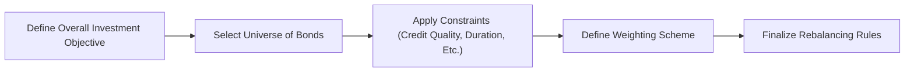

## The Role of Benchmarks in Fixed Income Portfolios

I have to admit, when I first started dabbling in fixed income strategies, I was amazed by how often advisors and portfolio managers would just pick the Bloomberg U.S. Aggregate Bond Index without any second thoughts. It’s like a reflex—someone says “U.S. bonds,” and there goes The Agg. But in reality, benchmarks play a much deeper role than simply serving as a yardstick for returns. Benchmarks define how portfolio managers select securities, monitor credit and duration, and ultimately assess performance. Benchmarks also connect closely with risk management, as described in earlier risk-oriented sections like (6.1 Definition and Scope of Risk Management). A good benchmark provides structure; a poor benchmark can distort decision-making or misalign the portfolio’s objectives.

At their core, benchmarks are reference portfolios that represent a specific market or strategy. In fixed income, these benchmarks typically contain a broad selection of bonds—varying in credit quality, maturity, coupon type, and region—to reflect the risk/return profile of that market. 

• If you’re managing an investment-grade bond fund, you might compare performance to the Bloomberg U.S. Aggregate Bond Index.  
• If you’re taking a more global approach, you might look at the Global Aggregate Index, which includes international investment-grade issues.  

But that’s just the tip of the iceberg. Let’s dive deeper into the considerations for selecting or constructing a benchmark that aligns with a portfolio’s specific style, risk tolerance, and investment objectives.

## Key Factors in Benchmark Selection

### Sector Weightings
Sector weightings within a fixed income benchmark can significantly influence performance. If the benchmark is heavily weighted in corporate bonds, for instance, a manager who invests predominantly in government securities might lag the benchmark whenever corporate spreads tighten. Conversely, the manager may outperform when those spreads widen.

It’s very important for the portfolio manager to be transparent: “Here’s where I deviate from the benchmark,” or “Here’s why I’m allocating more to Treasuries.” Understanding these differences in sector composition is key to explaining performance to clients—or preparing for questions in an exam scenario.

### Credit Quality
Credit quality is also a major driver of performance side by side with sector weighting. If the index holds mostly investment-grade securities, then a portfolio stuffed with high-yield bonds will carry a different risk profile (and hopefully a different return trajectory). For instance, an asset manager might say, “We’re using the Bloomberg U.S. Aggregate Bond Index, but only as a broad measure of the bond market. We know we’re taking on more credit risk than the index to achieve higher yields in the long run.” That’s absolutely critical to articulate.

### Duration and Interest Rate Sensitivity
Duration is the dreaded “D” word for many new analysts. But trust me, once you get the hang of it, it becomes one of the most powerful tools for matching your risk exposure. Some broad-market benchmarks target an intermediate duration (maybe around 6–8 years), whereas specialized benchmarks for short-term bonds only have durations of 1–3 years. Matching the portfolio to a benchmark with the right duration ensures that interest rate sensitivities align with investment objectives—especially if you’re running a liability-driven investing (LDI) strategy (see 4.7 Liability-Driven Investing and Pension Portfolios for more on LDI).

### Regional Exposure
In global bond portfolios, you want a clear picture of how much is allocated to, say, U.S. markets versus Europe, Asia, or emerging markets. A global aggregate index might be heavily weighted toward developed markets, thereby underrepresenting emerging markets if that’s a big part of one’s strategy. Always take time to confirm that the benchmark’s geographic distribution is relevant to your strategy.

### Turnover and Rebalancing Rules
Benchmarks change over time. Bonds mature, ratings shift, and new issuances enter the market. Broad indices rebalance on a regular schedule—say, monthly—while removing expired securities at maturity. A mismatch in rebalancing frequency between a portfolio and its benchmark can cause differences in performance that have nothing to do with security selection skill. It’s also worth being aware of the transaction costs associated with frequent rebalancing, which might be embedded in the total return of the index but not necessarily spelled out (read more on transaction costs in 3.12 Incorporating Transaction Costs in Performance Analytics).

### Liquidity and Market Accessibility
Liquidity differences matter, especially when aiming to replicate the risk exposures of a broad index. Certain bonds in the index might trade only sporadically, making them tough to acquire or offload at a favorable price. If your chosen benchmark includes a lot of less liquid sectors, you could end up with either higher costs or an inability to match the index’s exposures. 

### Tracking Error
Tracking error is a measure of the volatility of the difference in returns between a portfolio and its benchmark. Mathematically, you’ll often see it expressed as  


\text{Tracking Error} = \sqrt{\mathrm{Var}(R_p - R_b)},


where \\(R_p\\) is the portfolio return and \\(R_b\\) is the benchmark return. If the benchmark is not well-aligned with your strategy—different duration, credit, or region exposures—tracking error can balloon, making it tough to argue that you’re doing a good job at capturing the benchmark’s intended performance.

## Building or Customizing a Benchmark

While standard benchmarks such as the Bloomberg U.S. Aggregate Bond Index or the Global Aggregate Index are widely accepted, sometimes neither will precisely match a client’s desired risk-return profile. In such cases, constructing a custom benchmark—or modifying an existing index—offers a more precise fit.

Here’s a quick visual of how one might go about constructing (or customizing) a benchmark:

### Defining Investment Objectives
Start with the portfolio’s broader objective: Is the main goal capital preservation, income generation, or matching certain liabilities? This step ensures that the custom benchmark’s structure directly aligns with the end-use—similar to how we discuss risk budgeting in 4.8 Risk Budgeting in Portfolio Construction.

### Selecting the Bond Universe
Pick from government bonds, corporates, mortgage-backed securities, asset-backed securities, or emerging market debt. For a global portfolio, also decide whether to include local-currency bonds, which can introduce foreign exchange complexities (see Chapter 10: Portfolio Overlays and Currency Management for more on currency hedging).

### Applying Constraints
Constraints might be socially responsible investment (SRI) filters or environmental, social, and governance (ESG) screens. There might also be constraints based on average duration or legal limitations. Some pension portfolios require an interest rate hedge to match liabilities, so the constraint might be a specific duration target (e.g., 10 years, matching the plan’s liability duration).

### Weighting Scheme
Should securities be weighted by market value or by fundamental factors such as credit rating, volatility, or sector risk contribution? Some managers prefer equal weighting or fundamental weighting to avoid biases present in standard market cap–weighted benchmarks (which can overweight the largest issuers).

### Rebalancing Rules
Determine how often the custom benchmark is updated, how matured bonds are replaced, and how changes in credit rating are handled. For instance, if a bond loses its investment-grade rating, does it exit right away, or do you wait until a scheduled reconstitution date?

## Benchmark Risk Factors and Potential Pitfalls

Who knew choosing or creating a benchmark could be complicated, right? Well, let’s talk about the potential pitfalls.

• Liquidity Mismatch: You may include illiquid bonds in your benchmark, but if your real portfolio can’t readily buy or sell them, you end up with a misaligned reference for performance.  
• Sector and Credit Mismatch: It’s not just about going off-benchmark; sometimes the mismatch is unintentional. If your portfolio systematically avoids high-yield credit while the benchmark includes it, you’ll always be at risk of underperforming in bull markets and outperforming in downturns, purely based on credit risk.  
• Overly Frequent Turnover: If your benchmark rebalances constantly, you could face higher transaction costs. Conversely, an infrequent rebalancing schedule might cause your index to become stale.  
• Measurement Issues: In some emerging markets, pricing data can be unreliable. If your benchmark is using “fair value” estimates for illiquid securities while your real trades reflect different conditions, big tracking error can arise.

## Real-World Example: Pension Fund Custom Benchmark

Let’s say you’re working with a pension fund that wants to hedge the interest rate risk of its liabilities but also generate excess returns through selective credit exposure. One approach is to build a custom benchmark that includes:

• A subset of investment-grade corporate bonds with durations longer than 10 years.  
• A small allowance for high-yield issues to reach a target yield.  
• Some Treasury STRIPS for precise duration matching.  

The manager might define it so that 60% of the index is in Treasuries (to lock down that interest rate sensitivity) and 40% in a diversified basket of corporate bonds. Then, they’d rebalance quarterly. By doing so, they create a reference that reflects real constraints (liability matching) and real return goals (outperformance through corporate spreads). 

## Tying Benchmarks to Performance and Asset Allocation

Benchmarks aren’t merely yardsticks for how you did last quarter. They shape your entire allocation, from deciding your exposure to credit risk, to your sector bets or overweight positions. Many portfolio managers begin asset allocation with a strategic benchmark that sets their “neutral” weighting. They then apply small tilts based on tactical views, anchored in macroeconomic factors (see 1.6 Integration of Macroeconomic Indicators in Portfolio Decisions). If the manager believes interest rates will fall, they might extend duration relative to the benchmark. Or if they anticipate economic expansion, they might modestly overweight corporate bonds, given that spreads could tighten.  

This approach ensures discipline: the portfolio manager sets a baseline that’s presumably optimal for the client’s risk/return objectives, then justifies any deviance from that baseline as an active decision. When performance results come in, the manager can attribute outperformance or underperformance to these active tilts, as detailed in 3.10 Portfolio Performance Attribution Techniques, rather than random luck.

## Common Pitfalls in Benchmark Construction

• Inconsistent Methodology: If you’re building your own benchmark, be sure to document how you select, weight, and remove securities. Without a standardized process, it’s all too easy for the benchmark to become a moving target.  
• Revising History: This is a sneaky one. Occasionally, index providers or internal processes can change the constituents retroactively. That makes it look like the index always had these constituents (survivorship bias). Real-world performance never had the luxury of that perfect hindsight.  
• “Missing the Forest for the Trees”: Sometimes, managers get too granular with their custom benchmark. That can lead to complexity that doesn’t truly reflect the overall risk posture. Keep it logical and aligned with the main objective.

## Practical Exam Tips

• When you see an exam question about choosing a fixed income benchmark, highlight the major factors: sector weights, duration, credit quality, liquidity, and rebalancing schedules.  
• Make sure to connect the benchmark selection to the investor’s objectives, constraints, and risk tolerance (see 4.1 The Investment Policy Statement for tying everything together).  
• If a question covers performance attribution, remember that mismatch with the benchmark’s characteristics can create tracking error. You can usually draft a paragraph explaining how the mismatch led to differences in returns.  
• Be ready to compute or interpret tracking error using the formula provided, or estimate the effect of yield curve shifts on the portfolio vs. the benchmark.  
• For scenario-based questions, consider how changes in market conditions (like a credit spread widening or an unexpected rate hike) would affect a portfolio’s performance relative to its chosen benchmark.  

## Conclusion and Summary

Selecting or constructing a suitable benchmark is the backbone of a coherent fixed income strategy. A well-chosen benchmark helps ensure that the portfolio is measured according to relevant criteria—consistent sector, credit quality, duration, liquidity, and rebalancing rules. This alignment in turn makes performance evaluation fair and transparent, enabling managers to defend their choices before clients, boards, or exam graders alike. 

Anyway, I hope you can see how benchmarks, though they may sound like an afterthought to some, really dictate the blueprint for how we measure success in fixed income strategies.

## Glossary

• Benchmark: A standard index or reference used to measure portfolio performance.  
• Bloomberg U.S. Aggregate Bond Index: A dominant benchmark for investment-grade U.S. bonds.  
• Global Aggregate Index: A benchmark covering international investment-grade fixed income markets.  
• Tracking Error: The divergence between a portfolio’s returns and a benchmark’s returns.  
• Custom Benchmark: A benchmark tailored to specific investment guidelines and constraints.

## References & Further Reading

• CFA Institute. Global Investment Performance Standards (GIPS®).  
• Index provider websites (Bloomberg, ICE, FTSE Russell) for methodology details.  
• Chapter 4 (Portfolio Planning and Construction) in this volume for more on constraints and asset allocation.  
• Chapter 3 (Portfolio Risk and Return – Part II) for deeper insight into performance measurement and attribution.

---

## Test Your Knowledge: Fixed Income Benchmarks



### Which factor is most commonly used to represent interest rate risk in a bond benchmark?

- [ ] Credit spread
- [x] Duration
- [ ] Liquidity premium
- [ ] Yield to worst

> **Explanation:** Duration reflects the sensitivity of bond prices to interest rate changes, making it the primary indicator for interest rate risk in a fixed income benchmark.

### When constructing a custom fixed income benchmark, which of the following steps should typically occur first?

- [x] Defining the overall investment objective
- [ ] Determining the weighting scheme
- [ ] Applying socially responsible investment filters
- [ ] Finalizing rebalancing rules

> **Explanation:** A solid understanding of the portfolio’s objective ensures that every subsequent step—whether credit quality constraints or weighting scheme—aligns with that ultimate goal.

### Suppose a manager wants to limit credit risk. Which of the following would most likely be used as a benchmark?

- [ ] A customized emerging market high-yield index
- [ ] An equal-weighted high-yield corporate bond index
- [ ] A short-duration U.S. high-yield index
- [x] The Bloomberg U.S. Aggregate Bond Index

> **Explanation:** The Bloomberg U.S. Aggregate Bond Index focuses on investment-grade bonds, which typically involve lower credit risk than high-yield indices.

### A portfolio with a longer duration than its benchmark is most at risk from which unexpected market development?

- [ ] Credit spread tightening
- [x] Rising interest rates
- [ ] A wave of corporate upgrades
- [ ] A drop in default rates

> **Explanation:** Longer duration amplifies the negative impact of rising interest rates on bond prices, which would cause the portfolio to underperform a shorter-duration benchmark.

### Which of the following statements regarding benchmark turnover is correct?

- [x] High turnover in a benchmark may increase transaction costs for managers strictly tracking that benchmark
- [ ] Low turnover ensures more accurate pricing of illiquid bonds
- [x] High turnover does not impact the portfolio’s sector allocation
- [ ] Turnover has no effect on tracking error

> **Explanation:** High turnover typically means more frequent trading to maintain alignment with the benchmark, which can increase transaction costs. Also, high turnover can lead to changes in sector allocations, so watch for that type of mismatch in real exams.

### A mismatch between a portfolio’s credit quality composition and that of its benchmark most directly increases:

- [ ] Duration risk
- [ ] Liquidity risk
- [x] Tracking error
- [ ] Inflation risk

> **Explanation:** Deviating from the benchmark’s overall credit quality can cause performance differences that translate into higher tracking error.

### Which of the following is a potential pitfall when using a broad-based bond index as a benchmark?

- [x] Including illiquid securities that the portfolio cannot practically hold
- [ ] Excluding Treasury securities
- [x] Using only short-duration bonds
- [ ] Overstating the presence of investment-grade debt

> **Explanation:** Broad indices often include bonds that may not be liquid in the real market. This mismatch leads to possible higher costs or an inability to replicate index exposures.

### In creating a custom benchmark, the decision on how to replace matured or downgraded bonds typically enters which step?

- [ ] Identifying the bond universe
- [ ] Applying constraints
- [ ] Selecting the weighting scheme
- [x] Defining rebalancing rules

> **Explanation:** Rebalancing rules dictate how and when securities are added or removed, addressing matured or downgraded bonds.

### Which of the following best describes the purpose of a socially responsible investment (SRI) filter in benchmark construction?

- [x] To exclude certain issuers based on ethical, environmental, or governance criteria
- [ ] To weight bonds based solely on their size
- [ ] To reduce overall portfolio duration
- [ ] To increase overall portfolio yield

> **Explanation:** SRI filters aim to align the portfolio with specific ethical or governance values, removing issuers that do not meet those standards.

### A portfolio benchmarked to the Global Aggregate Index would likely have exposure to:

- [x] International investment-grade bonds
- [ ] Only U.S. Treasuries
- [ ] A single emerging market
- [ ] No foreign-exchange risk at all

> **Explanation:** The Global Aggregate Index includes government and corporate investment-grade bonds from multiple regions, bringing international exposure and potential currency fluctuations into play.


