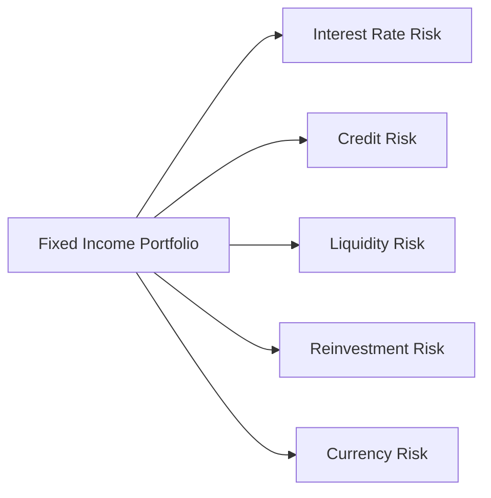
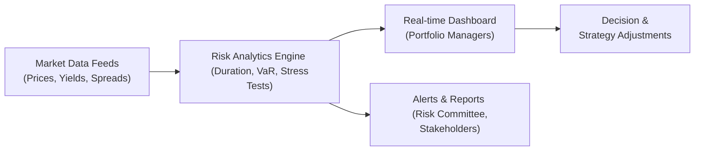

## Introduction

Anyone who’s ever invested in bonds or fixed income securities—whether it’s a government bond fund in their retirement account or a high-yield corporate bond in a trading portfolio—knows that “fixed” doesn’t always mean “safe.” Sure, you get a predictable coupon, but the market value of those securities can fluctuate significantly when interest rates move or when credit spreads widen. I remember, early in my career, feeling both a thrill and a bit of nervous anticipation every time central banks hinted at hikes or cuts—because I’d seen firsthand how quickly bond prices could react.

In this section, we’ll walk through the major forms of risk that shape fixed income portfolios and explore the wide range of tools practitioners use to keep those risks in check. We’ll lean on both the quantitative measurements (like Value at Risk and duration) and the qualitative aspects (like issuer fundamentals and regulatory changes). And we’ll keep an eye on practical issues such as communication and real-time reporting to ensure you can link theory to practice.

## Key Risks in Fixed Income Investing

Fixed income securities may have been long associated with “steady returns,” but they are anything but free from risk. Below are some of the most common types:

• Interest Rate Risk: This is the most familiar one. As yields go up, bond prices go down—particularly for longer-duration bonds.  
• Credit Risk: Corporations and governments may default on their debt obligations, which can severely impact bond valuations.  
• Liquidity Risk: Some bonds, especially in turbulent markets or niche segments, can be challenging to sell without significant price concessions.  
• Reinvestment Risk: If rates decline, the coupons or principal you receive may have to be reinvested at lower yield levels, reducing overall returns.  
• Currency Risk: For global or multi-currency portfolios, exchange rate fluctuations can amplify or erode returns.  

To visualize how these various risks connect with your portfolio, consider the simple diagram below:



Each arrow indicates how a particular risk source can affect your portfolio holdings.

## Quantitative Tools for Monitoring Fixed Income Risks

### Duration and Convexity

Many of us learn early on that duration is the “bond’s sensitivity to interest rate changes.” More formally, duration approximates the percentage change in a bond’s price for a 1% change in yield. Let’s say a portfolio has a duration of 5. If interest rates go up by 1%, the portfolio’s value is expected to drop by approximately 5%. That’s obviously a rough estimate, which is why we often incorporate convexity—another measure that adds a second-order adjustment, capturing the curvature of the bond’s price-yield relationship.

Here’s a simplified formula for Macaulay duration (though in practice you’ll meet versions like modified or effective duration):


\text{Duration} = \sum_{t=1}^{T} \Bigl(\frac{t \times C_t}{(1 + y)^t}\Bigr) \Big/ \sum_{t=1}^{T} \Bigl(\frac{C_t}{(1 + y)^t}\Bigr)


Where:  
• \\(C_t\\) = Cash flow (coupon or principal repayment) at time \\(t\\)  
• \\(y\\) = Yield per period (assuming annual or semiannual compounding)  
• \\(T\\) = Number of time periods to maturity  

Convexity refines that duration estimate by making allowance for the fact that as yields change, duration itself changes. If you’re running a portfolio with complex structures—like mortgage-backed securities or callable bonds—you’ll rely on convexity more heavily because those embedded options complicate price behavior.

### Value at Risk (VaR)

Value at Risk, often shortened to VaR, provides a probabilistic estimate of potential losses under “normal” market conditions. For instance, a one-day 99% VaR of \$1,000,000 would mean that there is only a 1% chance the portfolio will lose more than \$1,000,000 in one day (given normal conditions). 

In fixed income contexts, VaR can reflect both interest rate moves and credit spread volatility. Yet, VaR has known limitations—it typically assumes normal distributions or historical volatility patterns, so it might underestimate tail risk. That’s why practitioners often complement VaR with more rigorous or specialized approaches, such as scenario analysis or credit VaR models.

### Credit VaR

Credit VaR zooms in specifically on credit risk by modeling potential losses from credit events—like rating downgrades or outright defaults. Implementing a credit VaR framework might involve:

• In-house or third-party credit models that compute default probabilities.  
• Transition matrices showing the likelihood of an issuer migrating from one credit rating to another over a given time horizon.  
• Loss given default (LGD) assumptions reflecting what fraction of the investment might be recoverable if a default occurs.  

Credit VaR can be significantly more complex than interest rate VaR, since default risk isn’t as easily captured by smooth yield curve shifts.

### Scenario and Sensitivity Analyses

Scenario analysis begs the question: “What happens to my portfolio if the economy experiences a severe downturn?” or “What if the central bank unexpectedly hikes rates by 200 basis points?” With scenario analysis, you imagine a set of market conditions different from the usual environment and then recalculate potential portfolio outcomes. Sensitivity analysis, on the other hand, might change just one variable at a time (e.g., shift the yield curve up by 50 bps) to see the effect on portfolio value. 

In practice, you can do a quick scenario analysis in Python, as shown below:

```python
import numpy as np

base_prices = np.array([102, 105, 99, 100])
shock_scenario_factor = 0.98  # e.g. a 2% downward shock in bond prices

shocked_prices = base_prices * shock_scenario_factor

portfolio_change = np.sum(shocked_prices) - np.sum(base_prices)
print(f"Portfolio value changes by: {portfolio_change} units")
```

This is obviously a simplified example, but it shows how you can tweak variables to see how the overall portfolio might respond.

## Applying Stress Tests for Real-World Resiliency

Stress testing is like scenario analysis on steroids: you deliberately push the envelope to see how your portfolio might behave in extreme or even implausible situations. Here are a few types of stress tests:

• Parallel Yield Curve Shifts: Suppose you shift the entire yield curve up (or down) by a large amount (e.g., 300 basis points).  
• Non-Parallel Yield Curve Shifts: Maybe the short end remains stable, while the long end rises sharply.  
• Spread Widening: Evaluate how widening credit spreads (for example, during an economic crisis or a sector-specific meltdown) could impact corporate or high-yield bonds.  
• Economic Shocks: Incorporate dramatic events—like sudden GDP contraction, severe deflationary or inflationary environments, or unexpected policy moves from major central banks.

In Chapter 6 (“Introduction to Risk Management”), we explored the foundational concepts of risk frameworks. Stress testing is a prime example of how you can integrate those frameworks to anticipate “what-if” outcomes. The goal is not so much to predict the future with certainty, but to see which positions might be particularly vulnerable under extreme conditions.

## Qualitative Assessment: Beyond the Numbers

Of course, risk monitoring isn’t just about equations and models. Let’s face it, the 2008 global financial crisis showed us that a stack of fancy math doesn’t guarantee an accurate picture of risk. As an investor or portfolio manager, you’ll also want to keep tabs on:

• Issuer Fundamentals: Are corporate earnings weakening? Is the company’s leverage climbing?  
• Regulatory Changes: New capital requirements can sometimes reshape bond demand and supply.  
• Macroeconomic Indicators: GDP trends, employment data, inflation rates—these factors can shift rates and risk sentiment.  

I recall meeting an experienced bond fund manager who made it a habit to read corporate earnings transcripts as religiously as the morning paper. Whenever you see reckless expansions of leverage in an economic boom, it can be a canary in the coal mine—suggesting that credit risk may be on the ascent.

## The Human Element: Communication and Oversight

Even the best risk metrics are only as good as your team’s ability to interpret and act on them. This means fostering open dialogue among risk managers, portfolio managers, traders, and even compliance folks. Why? Because a small mismatch in understanding can lead to big consequences.

Some best practices include:  
• Weekly or monthly risk committee meetings where major shifts in portfolio duration or credit exposures are flagged and justified.  
• “Red Flag” alerts that automatically notify senior management when certain threshold values (say, portfolio VaR or sector concentration) are breached.  
• A culture of transparency. If a hedge or strategy didn’t work out as intended, or if an analyst suspects an issuer’s fundamentals are deteriorating, that information needs to rise to the top fast.

It’s also crucial to keep clients or stakeholders in the loop. Chapter 7 (“Professional Practices in Portfolio Management”) dives deeper into client reporting and communication standards.

## Integrated Platforms and Real-Time Reporting

Technology has reshaped how we monitor fixed income portfolios. Cloud-based systems, real-time feeds, and sophisticated dashboards let portfolio managers slice and dice their exposures on the fly. You might see heatmaps displaying sector or duration concentration and dynamic VaR measures updated as market quotes stream in.

Here’s a conceptual workflow of an integrated risk monitoring system:



• Market Data Feeds: Provide continuous updates on bond pricing, yield shifts, and credit spreads.  
• Risk Analytics Engine: Crunches the numbers on the portfolio’s bond holdings to calculate key metrics (duration, VaR, etc.).  
• Real-time Dashboard: Offers a user-friendly interface where portfolio managers can quickly spot trouble areas.  
• Alerts & Reports: Trigger notifications when risk limits are breached and provide daily or weekly risk summaries.  
• Decision & Strategy Adjustments: Managers can then rebalance or use derivatives to hedge, shifting the portfolio’s duration or credit exposure as needed.

• Comprehensive coverage: Tools link to trading desks, compliance modules, and back-office systems so that changes can be executed swiftly.

## Putting It All Together

Monitoring risk in fixed income portfolios calls for a holistic strategy. You can’t purely rely on statistical models or purely on qualitative hunches. You really need both. You also want ongoing communication among various stakeholders and a technology platform that surfaces actionable risk data in real time.

One last point: while we use all these measures—duration, VaR, scenario analysis—to keep risk in check, remember that financial markets have a way of surprising us all. The point of risk monitoring is preparedness, not necessarily complete prediction. By staying vigilant, updating your models regularly, and communicating effectively, you can keep your fixed income ship steering straight even in choppy waters.

## Glossary

• Interest Rate Risk: The potential for bond prices to decline when yields rise.  
• Credit VaR: A counterparty or issuer risk measure that uses Value at Risk techniques to estimate potential credit-related losses.  
• Convexity: A measure of the second-order sensitivity of a bond’s price to changes in yield.  
• Liquidity Risk: The risk of being unable to sell or buy a security quickly without a major price concession.  
• Scenario Analysis: The process of evaluating a portfolio under hypothetical market or economic conditions.  

## References and Further Reading

• Jorion, P. (2007). Value at Risk: The New Benchmark for Managing Financial Risk. McGraw-Hill.  
• BIS (Bank for International Settlements). Various reports on market risk measurement:  
  <https://www.bis.org/>

• Chapter 6 of this Volume: “Introduction to Risk Management,” for fundamental risk frameworks.  
• Chapter 7 of this Volume: “Professional Practices in Portfolio Management,” for communication and compliance standards.

## Exam Tips

• Make sure you understand how duration and convexity interact. If you see an item-set question about yield curve risk, consider both measures.  
• VaR questions often focus on key assumptions. Be prepared to discuss the limitations of VaR, especially in tail-risk scenarios.  
• Stress tests are frequently tested in essay (constructed-response) format, so practice explaining the rationale behind choosing specific scenarios.  
• Don’t forget the qualitative aspects of risk—CFA Institute loves to ask about how you’d monitor an issuer or manage communication among teams.

## Test Your Knowledge: Fixed Income Risk Monitoring Essentials



### Which type of risk reflects the possibility that a bond's price will drop if interest rates rise?

- [x] Interest rate risk
- [ ] Liquidity risk
- [ ] Reinvestment risk
- [ ] Currency risk

> **Explanation:** Interest rate risk indicates how bond prices typically move inversely to interest rate changes.

### Which metric measures the second-order sensitivity of a bond's price to changes in yield?

- [ ] Duration
- [x] Convexity
- [ ] Credit VaR
- [ ] Reinvestment Rate

> **Explanation:** Convexity accounts for the curvature in the bond price–yield relationship, whereas duration measures only the first-order effect.

### Which approach specifically focuses on potential credit-related losses, such as defaults or credit rating downgrades?

- [ ] Duration approach
- [x] Credit VaR
- [ ] Scenario analysis
- [ ] Simple yield spreads

> **Explanation:** Credit VaR models estimate the exposure to credit-based events, factoring in default probabilities and recovery rates.

### What is a hypothetical test in which you apply parallel or non-parallel shifts to the yield curve to gauge the sensitivity of your portfolio?

- [ ] Credit scoring model
- [ ] Rolling yield calculation
- [ ] Benchmark replication
- [x] Stress test

> **Explanation:** Stress testing typically examines your portfolio under extreme assumptions about yield curve movements and other factors.

### If interest rates decline significantly, leading to lower yields on new investments, which type of risk is most relevant?

- [ ] Currency risk
- [ ] Duration risk
- [ ] Credit VaR
- [x] Reinvestment risk

> **Explanation:** Reinvestment risk arises when interest rates fall and coupon or principal payments must be reinvested at lower rates.

### Which characteristic is particularly crucial to monitor when you invest in callable corporate bonds?

- [x] Convexity changes due to embedded call options
- [ ] Constant maturity swaps
- [ ] Liquidity risk only
- [ ] Lower interest rate risk sensitivity

> **Explanation:** Callable bonds exhibit negative convexity in certain yield environments, making them trickier to evaluate and hedge.

### When measuring risk in a global bond portfolio, which additional factor must be included in the analysis?

- [x] Currency risk
- [ ] No additional factors
- [ ] Lower default probabilities
- [ ] Lower interest rate risk

> **Explanation:** Holding bonds outside of your domestic currency exposes you to currency fluctuations that can either enhance or reduce returns.

### Which of the following best describes a scenario analysis?

- [ ] A measure showing the maximum loss with a certain probability
- [ ] A single-variable shift sensitivity test
- [x] A hypothetical exercise simulating multifaceted market conditions
- [ ] A method to measure only credit-based losses

> **Explanation:** Scenario analysis evaluates multiple risk factors in a hypothetical “what if” environment.

### What’s the primary advantage of having an integrated real-time reporting system?

- [x] Rapid identification and adjustment of risk exposures
- [ ] Ensuring no compliance reporting is needed
- [ ] Guaranteeing there will be no losses
- [ ] Immediate improvement in bond credit ratings

> **Explanation:** Real-time reporting helps managers quickly detect breaches of risk limits, facilitating timely portfolio adjustments.

### True or False: Qualitative risk assessment, such as reviewing issuer fundamentals, is unnecessary when you have robust quantitative models.

- [ ] True
- [x] False

> **Explanation:** Even robust quantitative models can miss fundamental shifts in issuer quality and other qualitative factors. A combination of both is essential.


