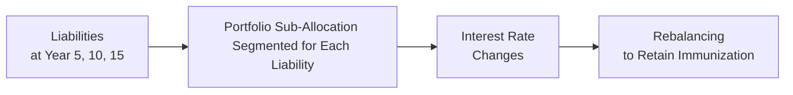

## Introduction

Have you ever worried that a sudden swing in interest rates might jeopardize your ability to cover a future financial obligation—like a pension payout or lump-sum expense? That’s precisely the concern immunization strategies address in fixed income portfolio management. Immunization helps us ensure a portfolio’s value meets a specific liability at a specified time (or series of times), no matter the twists and turns of the interest rate environment.

In practice, immunization focuses on aligning the portfolio’s duration with its liability’s duration. By doing so, changes in interest rates ideally don’t derail the ability to meet obligations, especially if you follow an ongoing rebalancing discipline. Sounds straightforward. But as we’ll see, there are nuances between single-period (classical) immunization and multi-period immunization, each with its own rebalancing intricacies and potential pitfalls.

Below, we’ll explore how immunization works, why rebalancing is essential, and how cash flow matching can be an alternative or complementary strategy.

## Why Immunization Matters

Immunization is all about risk reduction. Specifically, it aims to offset interest rate risk by matching the timing and sensitivity of bond cash flows to the timing and magnitude of liabilities. When done right, it isolates the portfolio from the negative surprises caused by unforeseen interest rate movements.

One portfolio manager I used to work with compared immunization to wearing a life jacket when you’re out fishing on a windy lake. You might still bob up and down with the waves (interest rate fluctuations), but you’re far less likely to sink when the weather turns rough.

## Key Principles of Duration Matching

At the heart of immunization is Macaulay duration, a measure of a bond’s (or a portfolio’s) interest rate sensitivity. If we let:

- \\(P\\) be the current price of the bond (or portfolio),
- \\(C_t\\) be the cash flow at time \\(t\\),
- \\(y\\) be the yield to maturity (assumed constant for simplifying duration calculations),
- \\(T\\) be the final maturity (in years, if annual compounding is used),

then the Macaulay duration \\(D\\) can be written as:


D = \frac{\sum_{t=1}^{T} t \times \frac{C_t}{(1 + y)^t}}{P}.


When we align this duration with the liability’s duration, the portfolio’s value is theoretically insulated from small, parallel shifts in the yield curve. That’s the gist of immunization. Of course, real-world yield curves are rarely so accommodating, so we often must rebalance.

## Single-Period (Classical) Immunization

Single-period immunization is the simpler, more classical version you might have studied early on in fixed income classes. It’s designed with a single horizon or a lump-sum liability in mind. Here’s the conceptual process:

• Identify the liability (say, a $1 million payment due in five years).  
• Construct or choose a bond portfolio whose duration equals five years.  
• Ensure the present value of the bond portfolio equals the present value of the liability.

### The Reinvestment & Price Effect

Think of a classic immunized portfolio as having two offsetting dynamics in the face of interest rate changes:

• Price Effect: When interest rates rise, bond prices fall. This is a loss if you must liquidate now.  
• Reinvestment Effect: When interest rates rise, you can reinvest coupons at higher rates, partially offsetting the price decline.

If your portfolio is properly matched in duration, the reinvestment effect and price effect tend to cancel out, assuming modest interest rate shifts and stable yield curve shapes.

But here’s a catch: bonds “decay” in duration as time passes. Interest rate changes, yield curve shifts, and new liabilities can also alter that initial perfect match.

### Ongoing Rebalancing

To maintain immunization, ongoing rebalancing is crucial. When I worked with a pension fund manager, he used to say, “Setting up the immunized portfolio is the easy part. Keeping it immunized is where the real work begins.”

Every so often—maybe quarterly or annually—portfolio managers check if the portfolio is still immunized:

1. Has the liability profile changed?  
2. Have interest rates shifted enough to move the portfolio off track?  
3. Is the portfolio's duration still aligned with the liability’s duration?

If discrepancies exist, trades are executed to realign durations (and possibly convexities) and keep that protective shield in place.

## Multi-Period Immunization

Life’s rarely that simple, right? In reality, institutional investors or individuals might face multiple future liabilities (e.g., a pension plan paying out monthly or yearly benefits). Multi-period immunization extends the single-period concept by aiming to meet *each* liability’s time-specific payment schedule.

### Segmenting Liabilities by Horizon

Imagine a pension fund with outflows in years 5, 10, and 15. The manager often partitions the portfolio so that a slice of assets immunizes the 5-year liability, another slice immunizes the 10-year liability, and so forth. Or the manager chooses a more dynamic approach behind the scenes, juggling bond positions to ensure overall coverage.

A simplified approach might be to treat each liability segment with a single-period immunization strategy, and then manage each slice individually. However, the result is a bit more complex because changes in interest rates affect the entire yield curve, not just discrete points.

### Challenges in Multi-Period Approach

• Each liability “leg” might need continuous rebalancing.  
• Payment schedules can shift due to external factors (e.g., early retirements, changes in policy).  
• Transaction costs can be significantly higher due to frequent position adjustments.

In advanced cases, you see managers analyzing key rate durations or partial durations to measure sensitivity at different maturities on the yield curve. By matching or hedging exposure across multiple segments, it’s possible to approximate a multi-period immunization strategy. 

Below is a simple conceptual diagram:

## Cash Flow Matching as an Alternative

Cash flow matching (also known as a dedication strategy) aims to line up bond coupon and principal payments exactly with liability outflows. Unlike duration matching, which primarily addresses interest rate risk at a more aggregate level, cash flow matching tries to remove interest rate risk altogether by ensuring the money arrives exactly when needed. 

### How It Works

1. Identify each future liability (e.g., a $100,000 payment in Year 2, $200,000 in Year 4, etc.).  
2. Purchase bonds so that coupons and maturities line up with those payment dates and amounts.

If you execute cash flow matching perfectly, you theoretically have zero reinvestment risk because the exact cash flows align with liabilities. There’s no need to sell or reinvest at uncertain future yields.

### Pros and Cons Compared to Duration Matching

• Pros:  
  - Minimizes many forms of interest rate risk.  
  - Reduces the magnitude of rebalancing.  

• Cons:  
  - Usually more expensive to set up because you might have to buy specific bonds with less favorable yields.  
  - Not always feasible if the required maturities or specific bond issues are unavailable or come with poor liquidity.  
  - Might lock in lower returns due to limited bond choices.

## Advantages and Disadvantages of Immunization

### Advantages

• Predictability: If done right, investors can sleep better, knowing liabilities will be met.  
• Reduced Interest Rate Risk: The portfolio is theoretically shielded from moderate fluctuations in rates.  
• Applicable to Many Structures: Single or multiple liabilities, pensions, insurance companies, and individuals all benefit.

### Disadvantages

• Lower Potential Returns: Immunization can be conservative, especially in a low-yield environment.  
• Ongoing Transaction Costs: If you do a lot of rebalancing, fees eat into returns.  
• Model Assumptions: Classical immunization assumes parallel shifts in the yield curve, ignoring changes in yield curve shape, convexity, and liquidity.

## Practical Example

Let’s run through a small numeric illustration:

• Liability: \$1,000,000 in 5 years.  
• Current 5-year yield: 4%.  
• Construct a portfolio with a Macaulay duration of 5, also worth \$1,000,000.  

If interest rates rise to 5% shortly after purchase, your bond prices would drop. But your coupon reinvestments (and any principal reinvestments if you’re staggering maturities) would benefit. If perfectly immunized, by the exact horizon date of 5 years, you still have \$1,000,000 to meet your liability—assuming no major shift in yield curve shape and that you rebalanced properly when needed.

Of course, exam questions can get more complicated with multi-cash-flow liabilities, but the essence remains: match durations, hold enough principal, and re-check frequently.

## Best Practices and Implementation Tips

• Monitor Gaps in Duration Constantly: Especially as time passes or if new liabilities appear.  
• Pay Attention to Convexity: Matching durations alone might not suffice if large rate moves occur.  
• Factor in Regulatory Requirements: Pension funds or insurance companies often have specific guidelines for liability matching (e.g., local or IFRS standards).  
• Document Everything: Under the CFA Institute Code of Ethics and Standards of Professional Conduct, you’re expected to demonstrate diligence, thoroughness, and a reasonable basis for portfolio decisions.  
• Weigh the Costs: Excessive rebalancing can be detrimental if fees and taxes exceed the benefits of perfect immunization.  

## Conclusion

Immunization strategies provide a robust framework for ensuring an investor’s ability to meet future liabilities without succumbing to the whims of interest rates. Whether you choose a classical single-period approach, a multi-period strategy for multiple outflows, or exact cash flow matching, the key is consistent monitoring and rebalancing.

In the real world, yield curves may twist, credit spreads fluctuate, and liability schedules evolve. But by understanding the basic mechanics of duration matching, you’re far better prepared to craft solutions that stand strong, even when the interest rate winds start blowing sideways.

----

## References and Further Reading

- Fabozzi, F. (Ed.). (2021). Bond Portfolio Management. McGraw-Hill.  
- Society of Actuaries: Publications on immunization techniques and liability management.  
- CFA Institute (2025). CFA Program Curriculum, Level I, Vol. 9, Portfolio Management.  
- Tuckman, B. (2018). Fixed Income Securities: Tools for Today’s Markets. Wiley.

----

## Test Your Knowledge: Immunization Strategies in Fixed Income



### Which of the following best describes the primary goal of immunization for a fixed income portfolio?

- [ ] Maximizing yield by taking on additional duration risk.
- [x] Ensuring the portfolio value matches future liabilities regardless of interest rate changes.
- [ ] Establishing a leveraged bond position at lower cost.
- [ ] Achieving short-term gains through active trading.

> **Explanation:** Immunization focuses on matching the portfolio's duration to its liabilities so that rate changes have a minimal net impact on meeting those obligations.

### In single-period immunization, which of the following is designed to offset the price effect of interest rate changes?

- [x] The reinvestment effect.
- [ ] Bond convexity.
- [ ] Credit hedging.
- [ ] Liquidity premium.

> **Explanation:** For modest interest rate changes, the reinvestment effect of coupons at higher (or lower) rates can compensate for the opposite movement in bond prices when durations are properly matched.

### When constructing a multi-period immunized portfolio for multiple liabilities, one major practical challenge is:

- [ ] Identifying the best performing equity index.
- [ ] Ignoring changes in the yield curve.
- [x] Handling the rebalancing needs across different future payment dates.
- [ ] Merging equity and fixed income into a single index.

> **Explanation:** Multi-period immunization usually involves multiple liabilities, each requiring careful monitoring. Various duration matches and frequent rebalancing might be needed.

### Which statement about cash flow matching is most accurate?

- [x] It aims to align bond coupons and principal payments exactly with liability outflows.
- [ ] It requires active bond selling and frequent rebalancing.
- [ ] It usually results in higher returns than active strategies.
- [ ] It relies purely on interest rate swaps for risk reduction.

> **Explanation:** Cash flow matching (dedication strategy) involves purchasing specific bonds so their cash inflows coincide exactly with payment obligations, thereby minimizing reinvestment and interest rate risks.

### One downside of an immunized portfolio is that:

- [x] It might achieve lower returns because flexibility is constrained.
- [ ] It entirely eliminates portfolio risk and is free of costs.
- [ ] It guarantees outperforming active strategies in all markets.
- [ ] It only works with zero-coupon bonds.

> **Explanation:** Immunization often sacrifices potential upside for the benefit of risk mitigation. Also, rebalancing can be costly, which can reduce returns.

### A 10-year bullet bond has a Macaulay duration of 9 years, while your liability has a duration of 7 years. To immunize, you might:

- [x] Shorten the portfolio’s duration, for example by purchasing shorter-maturity bonds or selling part of the long bond position.
- [ ] Increase the duration by adding more long-term bonds.
- [ ] Shift entirely into cash.
- [ ] Ignore the mismatch because it will self-correct.

> **Explanation:** If the bond’s duration is longer than the liability’s, you must bring it closer to 7 years, typically by replacing some portion of the longer bond with shorter maturity exposures.

### During rebalancing, which of the following is most likely to disrupt an otherwise immunized portfolio?

- [x] Rising transaction costs that limit the ability to fully adjust the portfolio.
- [ ] Perfectly parallel shaped yield curves.
- [ ] Zero-coupon bonds only.
- [ ] Constant yield environment with no new liabilities.

> **Explanation:** If transaction costs become prohibitive, rebalancing to maintain target duration is compromised, increasing risk of mismatches.

### What happens if bond yields drop significantly after a portfolio is immunized for a single future liability?

- [ ] The portfolio automatically readjusts to maintain the same duration.
- [x] The portfolio must be rebalanced to realign duration and avoid mismatch over time.
- [ ] The liability payments become irrelevant.
- [ ] The strategy completely fails.

> **Explanation:** Big moves in yields or curve shifts can create duration mismatches. A prudent manager rebalances to keep immunization intact.

### Which approach could be an alternative (or complement) to immunization?

- [x] Cash flow matching through dedicated bonds.
- [ ] Inflation-indexing an all-equity portfolio.
- [ ] Concentrating on a single high-yield bond.
- [ ] Buying only short-term Treasury bills.

> **Explanation:** Cash flow matching is a different approach to covering liabilities, often used where exact matching of outflows and inflows is desired.

### A portfolio manager claims that single-period immunization demands zero ongoing rebalancing. Is this statement true or false?

- [x] True
- [ ] False

> **Explanation:** Single-period immunization focuses on a single date and often assumes relatively small interest rate shifts and a parallel yield curve; in such simplified theoretical models, no rebalancing is needed if the horizon remains fixed and the environment is stable. However, in practice, rebalancing is still generally required when conditions deviate from assumptions.


