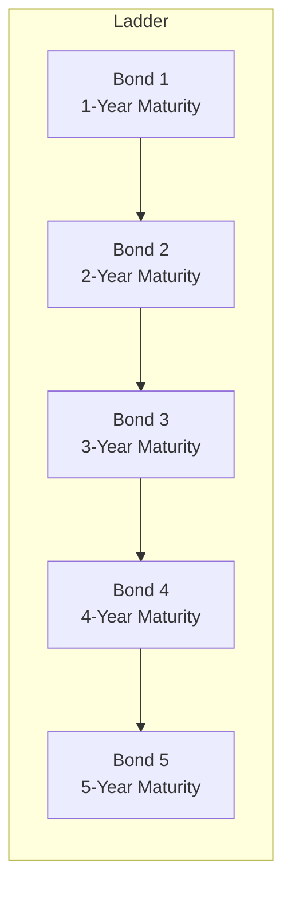

## Introduction
When I first started investing in bonds—many afternoons ago—I got a piece of advice that went something like this: “Don’t put all your maturity eggs in one basket.” At first, I had no idea what that meant (something about baskets?) until a seasoned colleague explained it in terms of managing interest rate and reinvestment risks. Essentially, I learned about two important strategies in the realm of fixed income portfolio construction: bond laddering and barbell strategies. Turns out, they’re both about balancing maturities, but in different ways.

In a broad sense, bond laddering places your bond investments at regular intervals (like rungs on a ladder), while a barbell strategy allocates heavily to both ends of the maturity spectrum, leaving the middle “light” or absent. Why do this? Because interest rate changes can mess with returns, and these strategies aim to manage or even exploit those interest rate changes.

Let’s walk through each strategy step by step. We’ll analyze how they work, compare them, and see how you might use them in your portfolio. And, in line with the complexities you’re used to by now in your CFA preparation, we’ll address some advanced nuances of yield curves, interest rate movements, and real-world performance drivers.

## Understanding Bond Laddering
Bond laddering is often described as buying a series of bonds with staggered maturities—for example, one-year, two-year, three-year, four-year, and five-year bonds. When the one-year bond matures, you reinvest the proceeds in a new five-year bond, thus always maintaining a “ladder” of maturities that extends out five years.

### Key Benefits of a Ladder
• Steady Cash Flows: Each rung of the ladder is a bond that matures at a different time. So if you’re worried about liquidity—maybe you need periodic cash for liabilities—one rung is always coming due fairly soon.  
• Reinvestment Diversification: Because each bond matures at a different time, you avoid putting all your capital to work at a single interest rate environment. If rates go up, you get to invest some proceeds at higher yields. If they fall, well, not all your money is locked in lower rates because you had locked some portion previously in longer maturities.  
• Interest Rate Risk Mitigation: Laddering spreads out duration risk (a principal measure of a bond’s price sensitivity to interest rate changes). Shorter maturities help reduce overall risk, while longer maturities support yield.

### How It Works in Practice
Let’s say you have $100,000 to allocate. You decide on a five-year ladder with consistent rungs:

• Buy $20,000 face value in a 1-year bond.  
• Buy $20,000 face value in a 2-year bond.  
• Buy $20,000 face value in a 3-year bond.  
• Buy $20,000 face value in a 4-year bond.  
• Buy $20,000 face value in a 5-year bond.

When the 1-year bond matures, you collect principal and invest it in a new 5-year bond. You’ll then still have bonds maturing in 1, 2, 3, and 4 years (the old 2-year became a 1-year with the passage of time, and so on). This pattern continues indefinitely.

It can help to visualize it:



Imagine each node as a rung in the ladder, each with its own maturity. As one bond matures, you invest further out in time, perpetually rebuilding the ladder.

### Risks to Keep in Mind
• Default Risk: Laddering can’t help if the issuer defaults. You’ll want to maintain appropriate credit quality and diversification across issuers.  
• Opportunity Cost When Rates Are Low: If interest rates are near record lows, you’re locking in those lower yields for some of your capital. Yes, you get to roll your maturities as they come due, but part of your portfolio might be stuck in a low-rate environment for a while.  
• Transaction Costs: Frequent redeployment of capital (especially if you’re creating a ladder with short intervals) can add expense.  

Despite these risks, bond ladders remain popular thanks to their simplicity and intuitive design. It’s also pretty nice to know when you’ll have cash flows coming in—makes it so much easier to plan.

## The Barbell Strategy
While a ladder spreads maturities across the spectrum in steady intervals, a barbell strategy places bond allocations primarily at the two ends—short maturities and long maturities—hence the name “barbell.” The short end typically provides liquidity and lower interest rate risk, while the long end aims for higher yields (though also higher duration risk). Meanwhile, bonds in the middle of the curve (intermediate maturities) are mostly avoided.

### Why Use a Barbell?
• Potentially Higher Yield Than a Ladder: Longer maturity bonds often come with bigger yields (under normal upward-sloping yield curve conditions). Pairing this with short-term maturities that you can roll over quickly can let you benefit from rate changes more dynamically.  
• Flexibility at the Short End: Short maturities roll over often, letting you reinvest capital at new rates or even shift to other asset classes if the interest rate environment suddenly changes.  
• Beneficial in Certain Yield Curve Movements: When the yield curve flattens (i.e., the difference between short- and long-term yields shrinks), barbells can sometimes outperform because the short and long ends of the curve may hold or gain value relative to the middle.  

### Potential Downsides
• Exposure to Curve Shifts: If the yield curve steepens in the middle, or if interest rates decline more in the intermediate range than at the short or long ends, the barbell might underperform a more balanced approach.  
• Higher Volatility from Long Bonds: Long maturities can see marked price swings if rates change. So if interest rates shoot up unexpectedly, that portion of the barbell can lose significant value.  

Let’s see an example of a barbell with the same $100,000:

• $40,000 in short-term bonds (maturities under two years).  
• $60,000 in long-term bonds (maturities of 10+ years).  

No allocations in the 3–7-year range, effectively skipping the entire “middle” portion of the curve. Some managers intentionally tweak the balance—maybe 30% short, 70% long, or vice versa—depending on their view of the yield curve.


The bar indicates: short end, skip the middle, go heavy on the long end.

## Comparing Laddering and Barbell Approaches
In many respects, these two approaches have a common goal: mitigate interest rate risk while aiming for attractive yield. But the ways they achieve— or fall short of—this goal differ.

### Interest Rate Exposure
• Ladder: Distributes interest rate risk across multiple maturities. Medium sensitivity to interest rate fluctuations at any one point, but reduces the chance of catastrophic losses in a single maturity bucket.  
• Barbell: Concentrates risk in the short and long ends. It can be more sensitive if the long end of the curve rises sharply or, conversely, can capture interesting yield advantages if the long end remains stable or if short-term rates rise quickly.

### Reinvestment Flexibility
• Ladder: Provides moderate, predictable reinvestment opportunities. As each bond matures regularly, you can systematically roll out to longer maturities.  
• Barbell: The short-term portion offers significant opportunity to quickly reinvest at new rates if they become more attractive. Meanwhile, the long-end portion remains locked in for a longer time unless you actively sell and reposition.

### Yield
• Ladder: Yields typically average out somewhere between short-term instruments and long-term instruments—like a “moderate middle.”  
• Barbell: Potentially higher yields if the long maturities have a steep yield differential over the short issue, but the trade-off is a chunk of the portfolio is more exposed to long-duration risk.

### Performance in Varying Yield Curve Scenarios
• Flattening Curve: The barbell can shine here because short rates rise and long rates might not move as much or could even decline (depending on the flattening pattern).  
• Steepening Curve: A ladder might hold up better. If intermediate yields rise with the rest of the curve, the ladder still has a portion invested across those maturities. In contrast, barbell strategies might lose out because the long end sees rising rates (bond prices fall) while the short end can’t compensate enough if the curve steepens quickly.  
• Parallel Shift in Rates: Both strategies might see similar impacts, but the barbell’s inherent longer duration portion could experience more pronounced price movements.

## Practical Example: A Yield Curve Twist
Suppose we have a normal yield curve. Over time, the Federal Reserve (or any major central bank) signals multiple short-term rate hikes, compressing the difference between short and intermediate rates—sometimes referred to as a flattening yield curve. In that scenario, a barbell might see the short-term bond portion rolling over at higher yields, while simultaneously the long-term bond portion might hold its value or experience price gains if the long end of the yield curve remains somewhat stable or even begins to rally as investors reach for longer maturities when short rates get uncomfortably high. The slump in intermediate bonds can mean the barbell strategy outperforms. Meanwhile, a ladder is “stuck” with some intermediate bonds that may get hammered by that flattening dynamic.

But if the curve steepens—maybe short rates remain low while long rates rise significantly—your barbell’s long side might see heavy marked-to-market losses. A ladder, spread across short, intermediate, and long segments, may actually hold up a bit better.

## Theoretical Underpinnings
If you’re prepping for the exam, it helps to connect these strategies with the concept of duration and convexity from your fixed income study sessions:

• Duration: A measure of the price sensitivity of a bond (or portfolio) to interest rate changes. Long bonds have higher duration than short bonds.  
• Convexity: Describes the curvature in the price–yield relationship. Barbells often have higher convexity relative to bullet (pure mid-range) strategies, because the portfolio is more concentrated in extremes. In rising rate environments, higher convexity can be beneficial—but it depends on how the yield curve is shifting.

In formula form (simplified), a portfolio’s duration (Dᵖ) is the weighted average of the durations of the individual bonds:


D^p = \sum_{i=1}^{n} w_i \times D_i


where wᵢ is the weight of bond i in the portfolio, and Dᵢ is that bond’s effective duration.  

For a barbell, some positions will have short durations (like near 1 or 2) and others could have durations in the double digits. Meanwhile, a ladder more evenly distributes durations across a sequence of short- to intermediate- to longer-term bonds.

## Implementation and Best Practices
Whether you choose a ladder or barbell might depend on your objectives, risk tolerance, and market view. Consider:

• Portfolio Objectives: If you need systematic liquidity, a ladder might be the better bet. If you are trying to enhance yield in an expected flattening scenario, you might lean barbell.  
• Liquidity Requirements: Laddering is often favored by retirees or institutions with regular liabilities (e.g., insurance companies).  
• Credit and Sector Diversification: Regardless of your strategy, you want to avoid concentration risk in a single issuer or sector.  
• Transaction Costs: Building a barbell might mean selecting short and long bonds that can sometimes be less liquid, especially for the long-dated portion. Ladders can also require frequent rollovers.  
• Market Outlook: If you suspect that short rates will increase more than long rates, a barbell could potentially capture higher yields while locking in long-term rates before they climb. If you predict a uniform upward shift or no major changes, a simple ladder might suffice.

## Common Pitfalls and Challenges
• Overlooking Changes in the Yield Curve: Many focus primarily on short-term Fed announcements but fail to examine the entire curve, leading to mismatched strategies.  
• Ignoring Reinvestment Rates for the Short End: If you picked a barbell for advantage at the short end but use a poor reinvestment process—or skip it altogether—your strategy might falter.  
• Underestimating Liquidity Pressures: In times of market stress, it may be more difficult (and expensive) to unload long bonds. Meanwhile, with a ladder, you can hopefully hold the longer bonds until they mature, but if you must sell, you could also face liquidity constraints.

## A Quick Python Demo (Optional Calculations)
Sometimes, we want to simulate how each strategy’s value might change if rates shift. Here’s a simplistic Python snippet that calculates approximate percentage changes to a laddered portfolio vs. a barbell, given a parallel shift in yields and different durations:

```python
import numpy as np

ladder_durations = np.array([1.5, 3.0, 4.5, 6.0, 8.0])  # Weighted durations
ladder_weights = np.array([0.2, 0.2, 0.2, 0.2, 0.2])

barbell_durations = np.array([2.0, 12.0])  # Weighted durations
barbell_weights = np.array([0.4, 0.6])     # Heavier weight on long end

def portfolio_duration(durations, weights):
    return np.sum(durations * weights)

def portfolio_price_change(duration, rate_shift):
    # Approx. percentage price change = -duration * rate_change
    return -duration * rate_shift * 100

rate_shift = 0.005

ladder_dur = portfolio_duration(ladder_durations, ladder_weights)
ladder_pct_change = portfolio_price_change(ladder_dur, rate_shift)

barbell_dur = portfolio_duration(barbell_durations, barbell_weights)
barbell_pct_change = portfolio_price_change(barbell_dur, rate_shift)

print(f"Ladder Duration: {ladder_dur:.2f}, Price Change: {ladder_pct_change:.2f}%")
print(f"Barbell Duration: {barbell_dur:.2f}, Price Change: {barbell_pct_change:.2f}%")
```

In a parallel shift scenario, the barbell’s heavier weighting to the long end can lead to bigger price drops when rates rise. But in a flattening or non-parallel shift scenario, the outcomes may differ significantly.

## Exam Tips and Guidance
• Demonstrate a thorough understanding of how bond laddering and barbell strategies mitigate (or amplify) different facets of interest rate and reinvestment risk.  
• Show your reasoning if the essay question is scenario-based; for instance, if you believe the yield curve will flatten, you might argue for barbell.  
• Don’t forget to factor in liquidity needs and the client’s investment objectives as you’d do in a real-world scenario.  
• Clarify how partial or more flexible variations of these strategies might be used, such as a “modified” ladder that extends from 1- to 10-year maturities.  
• Keep an eye on credit risk. The exam might give you bond choices with various credit qualities.  
• In item set questions, watch out for data that hints toward a steepening or flattening curve. That’s your prompt to weigh the strengths of ladder vs. barbell.

## References and Further Exploration
• Morningstar: Various articles discuss “Bond Laddering Benefits and Drawbacks” (www.morningstar.com).  
• Fidelity Learning Center: “Barbell vs. Bullet vs. Laddered Bond Strategies.”  
• CFA Institute Program Curriculum, Fixed Income Volumes.  
• Online tutorials and webcasts from major brokerage firms often show hands-on ways to build and maintain bond ladders and barbell portfolios.

Feel free to dig deeper into academic papers that discuss the term structure of interest rates, especially those dealing with the shape and predictive power of yield curves. These resources can provide extra perspective on when a barbell might be advantageous vs. a ladder.

-----

## Test Your Knowledge: Bond Laddering and Barbell Strategies



### 1. Which of the following best describes a bond ladder strategy?

- [x] A portfolio with bonds maturing at regular intervals to continuously reinvest proceeds.  
- [ ] A portfolio concentrated in short-term and long-term bonds.  
- [ ] A bond selection technique strictly based on credit ratings.  
- [ ] A method for hedging currency risk in fixed income investing.  

> **Explanation:** A bond ladder staggers maturities so that at regular time intervals, some part of your portfolio matures, offering reinvestment opportunities.

### 2. In a barbell approach, how are bond maturities typically allocated?

- [ ] Evenly allocated across short, intermediate, and long maturities.  
- [ ] Concentrated in the intermediate portion of the yield curve only.  
- [x] Concentrated in very short-term and very long-term maturities.  
- [ ] Aligned only with a benchmark index’s durations.  

> **Explanation:** A barbell places its maturities primarily at both ends of the spectrum—short and long—bypassing much of the middle.

### 3. When might a barbell strategy outperform a ladder strategy?

- [x] If the yield curve is flattening, benefiting short- and long-end exposures.  
- [ ] During a parallel upward shift in interest rates.  
- [ ] If interest rates only affect intermediate maturities.  
- [ ] When short-term rates remain constant and long-term rates decline sharply.  

> **Explanation:** A barbell can perform well when the yield curve flattens because distributions in the short and long ends can capture favorable relative performance compared to the middle part of the curve.

### 4. Which of the following is a potential drawback of a barbell strategy?

- [x] Greater price volatility from long-term bonds.  
- [ ] Too many intermediate maturities leading to reinvestment inflexibility.  
- [ ] Lack of exposure to short-term instruments.  
- [ ] No exposure to interest rate changes in short maturities.  

> **Explanation:** Concentrating more in the long end increases duration and hence price sensitivity. This can lead to more volatility if rates rise.

### 5. Which feature is common to both bond laddering and barbell strategies?

- [x] They both aim to manage interest rate exposure by distributing maturities.  
- [ ] They both require derivatives to hedge currency risk.  
- [x] They both attempt to mitigate reinvestment risk (through different mechanisms).  
- [ ] They both explicitly ignore short-term maturities.  

> **Explanation:** Both strategies spread out maturity exposures (in different ways) to address interest rate and reinvestment risks, though barbell focuses on the extremes and ladder spreads them evenly.

### 6. In a laddered portfolio, what happens when a bond matures?

- [x] The proceeds are typically reinvested at the long end of the original maturity range.  
- [ ] All proceeds are kept in cash until the entire portfolio matures.  
- [ ] The bond is replaced by an instrument with the exact same maturity.  
- [ ] The funds are allocated exclusively to stocks.  

> **Explanation:** When one rung of the ladder matures, it’s common to buy a new bond at the far end of the ladder, effectively rolling the portfolio structure forward.

### 7. If the yield curve steepens significantly, which strategy might be less vulnerable to losses?

- [ ] A barbell with heavy concentration in long bonds.  
- [x] A ladder with moderate maturities across the curve.  
- [ ] A portfolio of only zero-coupon bonds.  
- [ ] A strategy that invests exclusively in foreign currency bonds.  

> **Explanation:** With a steepening curve, the longest bonds may suffer larger price declines. A ladder, being more evenly distributed, might see less concentrated price impact.

### 8. Which of the following is the key advantage of the short-term portion of a barbell strategy?

- [x] It provides relatively quick reinvestment at new rates.  
- [ ] It locks in higher yields for a long time.  
- [ ] It avoids default risk compared to longer-term securities.  
- [ ] It has no impact on liquidity.  

> **Explanation:** The short end matures frequently, so cash can be redeployed at fresh yield levels, giving more agility in changing rate environments.

### 9. Which statement accurately highlights a difference between bond laddering and barbell strategies?

- [ ] A ladder focuses on maximizing total return, whereas a barbell focuses only on liquidity.  
- [x] A ladder spreads maturities evenly, while a barbell splits allocations between very short and very long maturities.  
- [ ] Both strategies omit all intermediate maturities.  
- [ ] A barbell always uses derivatives, while a ladder never does.  

> **Explanation:** Ladders normally space maturities out in regular intervals. A barbell, on the other hand, allocates at the two extremes.

### 10. True or False: In a flattening yield curve environment, a ladder strategy is almost always preferred over a barbell strategy.

- [ ] True  
- [x] False  

> **Explanation:** In a flattening yield curve environment, a barbell may capture more favorable rates at the short end and benefit from potential price gains or stable yields at the long end, sometimes outperforming a ladder strategy.


