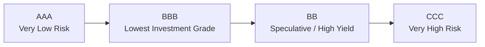

## Introduction
I once met an investor—a good friend—who loved the thrill of chasing high-yield bonds. Whenever we chatted, I'd throw in a cautious "But are you sure you’re comfortable with that credit risk?" And he’d grin, telling me he loved the adrenaline of extra yield. Well, let's dig into the heart of that debate: high yield vs. investment grade. We’re not just chasing coupons here; we’re evaluating how each category slots into a broader portfolio strategy, how their risks behave in different market conditions, and which frameworks exist to manage them.

In this section, we’ll explore the fundamental design of high-yield versus investment-grade bonds, sometimes called "junk" versus "quality," plus the resulting implications for portfolio returns, risk, and overall credit management. We’ll also overlay the macroeconomic context—like interest rate cycles, credit spreads, and sector-level fundamentals. By the end, you’ll be better positioned to decide if that higher yield is worth the heavier risk, or if you’d rather get some shuteye at night holding more stable issues.

## Understanding the Differences
While bonds are typically grouped together as “fixed income,” not all bonds are created equal, particularly when it comes to credit ratings. Let’s define the two broad categories:

• High-yield bonds (below BBB–/Baa3): Also called speculative-grade or junk bonds, they offer higher coupon rates but carry significantly higher default risk. They also tend to behave a bit like equities, especially when markets get choppy.  
• Investment-grade bonds (BBB–/Baa3 or above): These are considered to have lower credit risk and typically pay lower yields. They’re more likely to be considered stable, relatively liquid, and suitable for core bond exposures in many portfolios.

Most rating agencies—like S&P, Moody’s, and Fitch—use a scale that starts at AAA or Aaa (pristine credit quality) and moves down to D (default). High-yield sits on the lower end of that scale.  

## Risk and Return Considerations
High-yield bonds can spice up an otherwise tame portfolio. In times of economic expansion, corporate profits often improve, default rates drop, and investors clamor for yield. That can push high-yield bond prices up, rewarding those who took the risk with equity-like returns. But it’s not all sunshine and rainbows. High yield also means a non-trivial chance that some issuers could fail to make their payments—especially in a recession or sector downturn. Their correlation to equity markets can rise just when you’d prefer true diversification.

Investment-grade bonds, on the other hand, offer modest yields because the issuers are more creditworthy. They tend to remain resilient in market downturns, particularly the upper tranches like AAA or AA, but even investment-grade holders face credit spread widening if markets become turbulent. The net result is that the two categories have different performance profiles under various conditions.

### A Quick Look at Yield Spreads
Yield spreads often serve as a shorthand measure for relative risk in bond markets:

(1) Spread ≈ Yield of Bond – Yield of (Comparable Maturity Treasury)

For high-yield, this spread is typically wider because of added default risk. If you notice spreads suddenly spike, it’s often a signal that the market is baking in expectations of rising defaults.

## Liquidity and Market Depth
It might sound surprising, but liquidity can dry up in the high-yield market faster than you can say "default risk." When macroeconomic conditions become uncertain (think about 2008–2009 or early 2020), dealers and investors often reduce their risk exposure, making it more difficult to buy or sell high-yield bonds at fair prices. As a result, you might wind up stuck if you need to unload your holdings in a pinch.

Investment-grade bonds generally hold better liquidity, especially for issues from well-known corporate giants. Benchmarks such as the Bloomberg U.S. Corporate Investment Grade Index track a broad, active market.

## Fundamental Credit Analysis
You can’t always rely purely on the rating agencies’ signals. Many effective high-yield strategies blend top-down macro views (including industry cycles, central bank policies, and interest rate forecasts) with bottom-up credit analysis:

• Top-down: Considering the credit cycle, GDP growth rate, and inflation environment helps you gauge broad default risks.  
• Bottom-up: Analyzing the company’s capital structure, leverage ratios, cash flow stability, and management practices can hint at whether the issuer really deserves a rating below investment grade—or if it’s poised to improve.  

The challenge? High-yield bond issuers can vary wildly in their fundamentals. Some simply lack established credit histories; others might be cyclical companies that are especially vulnerable to downturns. It’s worth adopting a disciplined process—like a checklist or scorecard—to keep your analysis consistent and reduce emotional decision-making.

## Balancing Diversification
High-yield bonds can offer welcome diversification in a fixed-income portfolio. When the economy is humming, they can add extra alpha. But keep in mind they’re more correlated with equities than their investment-grade cousins, especially during stress events. If you hold both investment-grade and high-yield, you could gain:

• Potential for enhanced total returns.  
• Some diversification away from interest-rate risk, given that high-yield bonds are influenced more by credit risk than by rate changes.  

On the downside, you should beware of sector or issuer concentration. Credit events sometimes cluster. If a major economic sector stumbles, like energy or retail, many issuers can simultaneously face pressure. This phenomenon is sometimes called credit correlation.

## Macroeconomic Considerations
When analyzing high-yield vs. investment-grade allocations, don’t forget about the broader economic backdrop:

• In expansions: High-yield often outperforms, as default rates tend to be low and risk appetites are high.  
• In contractions: Default risk surges, and yields widen. Investors typically flock to quality (e.g., Treasuries, high-grade corporates) and might dump high-yield holdings.  

In moderate or stable environments, investment-grade bonds can serve as a reliable income anchor, while high-yield could contribute some pop to your returns—provided your risk tolerance is up for it.

## Visualizing the Ratings Spectrum

Below is a simple Mermaid diagram that illustrates how bond credit ratings flow along a spectrum from high-grade to high-yield. Notice how investment-grade transitions to high-yield territory once you dip below BBB/Baa ratings.

The gap between BBB and BB is where the boundary between investment-grade and high-yield is set.

## Theoretical Underpinnings: A Nod to Merton
Robert Merton’s (1974) model of corporate debt treats a company’s equity as a call option on the firm’s assets. This framework suggests that debt valuation (and the probability of default) is intrinsically linked to the volatility of the firm’s asset value and its leverage. Though the model is complex, it underscores why high-yield bonds carry higher spreads. In short, more volatility and higher leverage implies a greater chance of default, which the market prices in.

## Potential Pitfalls
• Chasing Yield Blindly: Grabbing the highest coupon might be fun—until you realize the issuer’s fundamentals are shaky.  
• Liquidity Crisis: A high-yield bond can be easy to buy in a hot market, but extremely hard to sell when volatility spikes.  
• Concentration Risk: A portfolio stuffed with high-yield from one sector or region can lead to correlated defaults.

## Key Takeaways
• High-yield bonds (below BBB–/Baa3) have higher potential returns but with elevated default risk and more equity-like volatility.  
• Investment-grade bonds (BBB–/Baa3 or above) provide steadier credit quality for more conservative profiles.  
• Liquidity is a major concern, as high-yield can be prone to sharp selloffs and wide bid-ask spreads.  
• A solid combination of fundamental credit analysis and macroeconomic awareness is crucial.  
• Diversification can be a double-edged sword; high-yield helps in stable markets but can amplify losses in downturns.  

## Glossary
• High-Yield Bond: A non-investment-grade bond offering higher interest rates to compensate for higher credit risk.  
• Investment Grade Bond: A bond with relatively low default risk, rated BBB–/Baa3 or higher by major rating agencies.  
• Default Rate: The frequency at which issuers fail to meet their obligations.  
• Credit Correlation: The tendency for credit events (like defaults) to cluster across issuers or sectors, often under common macro or industry stresses.

## References and Further Reading
• Merton, R. (1974). "On the Pricing of Corporate Debt." The Journal of Finance.  
• Moody’s Analytics: Historical default and recovery rates reports for corporate bonds.  

## Final Exam Tips
• Make sure you understand how yield spreads behave during changes in the economic cycle—this is a popular exam angle.  
• Be ready to compare high-yield strategies to investment-grade approaches in scenario-based questions. You might see a case where you must evaluate the trade-off between yield and default risk under different macro conditions.  
• When tackling constructed response questions, highlight your approach to credit analysis. Explicitly differentiate between top-down and bottom-up methods.  
• In item sets, watch for details such as changes in liquidity or rating transitions. The exam often tests your ability to interpret news about falling credit quality or a rating agency downgrade.  
• Time management matters: Practice writing concise and structured answers, focusing on the trade-offs between yield enhancement vs. default risk and liquidity concerns.

---

## Test Your Knowledge: High-Yield vs. Investment Grade Quiz



### Which of the following best describes a primary advantage of high-yield bonds over investment-grade bonds?

- [ ] Lower correlation with equities
- [ ] Superior issuer credit quality
- [x] Potential for higher returns
- [ ] Greater market liquidity

> **Explanation:** High-yield bonds generally offer higher coupon payments and the potential for bigger total returns due to their greater credit risk.

### Which rating serves as the threshold between high-yield and investment-grade status for most rating agencies?

- [ ] A–/A3
- [x] BBB–/Baa3
- [ ] BB–/Ba3
- [ ] CCC+/Caa1

> **Explanation:** The boundary for high-yield begins once you move below BBB– (S&P/Fitch) or Baa3 (Moody’s).

### When economic conditions deteriorate significantly, how do high-yield bonds typically behave?

- [x] They exhibit higher default rates and may experience price drops
- [ ] They might receive a ratings upgrade
- [ ] They generally appreciate in price, providing a safe haven
- [ ] They show less correlation to equities and become more liquid

> **Explanation:** In a downturn, default risk rises and high-yield bond prices often drop, often moving in tandem with equity markets.

### Which of the following best characterizes liquidity for high-yield bonds compared to investment-grade bonds?

- [ ] High-yield bond markets are typically more liquid than Treasury markets
- [ ] Investment-grade bonds always trade without spread
- [ ] Investment-grade bonds have zero liquidity risk
- [x] High-yield bonds tend to have lower liquidity, which can get worse in a market crisis

> **Explanation:** Liquidity in high-yield markets often dries up rapidly in volatile times, making it more difficult to exit positions.

### What is a key distinction between fundamental credit analysis and purely ratings-based investing?

- [ ] Ratings-based investing always yields better returns
- [ ] Fundamental credit analysis focuses only on macro factors
- [x] Fundamental credit analysis examines both macro conditions and issuer-level data
- [ ] Ratings-based investing is illegal in certain jurisdictions

> **Explanation:** Fundamental credit analysis looks at a company’s leverage, cash flow, and broader economic factors, going beyond the reported rating.

### Which statement best captures the diversification effect of including high-yield bonds in a portfolio?

- [x] They can enhance returns but also raise correlation with equities in downturns
- [ ] They typically lower a portfolio’s volatility under all conditions
- [ ] They reduce default risk significantly
- [ ] They behave the same as government bonds

> **Explanation:** High-yield bonds can bolster returns during expansions but can correlate strongly with equities in market downturns.

### Under Robert Merton’s structural model, how is corporate debt value determined?

- [x] By viewing equity as a call option on the firm’s assets
- [ ] By ignoring leverage and focusing solely on market risk
- [ ] By applying a constant spread to all bonds
- [ ] By analyzing only historical default rates

> **Explanation:** Merton’s approach frames equity as an option on the firm’s value, implying greater volatility translates to higher credit risk and bond spreads.

### What is the main reason high-yield bonds offer larger coupons than investment-grade bonds?

- [ ] They are always issued by high-profile companies
- [x] They compensate investors for taking on higher default risk
- [ ] They have no interest-rate risk
- [ ] They must pay government sponsorship fees

> **Explanation:** High-yield bonds pay bigger coupons to compensate investors for the heightened probability of issuer default.

### Which of the following is most likely to occur when a long-term economic expansion slows?

- [ ] Yields on high-yield bonds decline
- [ ] Investment-grade bonds experience abrupt default spikes
- [x] Spreads on high-yield bonds typically widen
- [ ] There is no change to high-yield issuers

> **Explanation:** As the economy slows, investors become more cautious. High-yield spread widening reflects those default concerns.

### True or False: High-yield bonds are universally recommended for risk-averse investors seeking minimal volatility.

- [ ] True
- [x] False

> **Explanation:** High-yield bonds generally exhibit higher volatility and default risk, so they’re not typically recommended for conservative, risk-averse investors.


