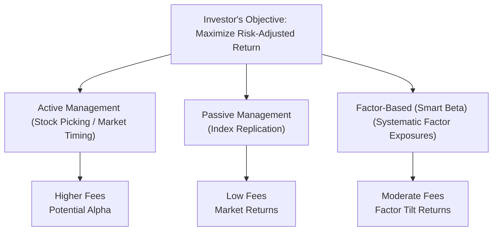

## Introduction
So, let’s dive into a topic that often sparks quite a bit of debate in equity portfolio management circles: should you go with active management, a passive strategy, or factor-based (smart beta) investing? Each approach has its own charm—and pitfalls. I remember once when I first started deciding how to tilt my own retirement savings, I agonized for weeks about whether to bet on a star active manager or just park my funds in a simple index fund. And then friend A told me about factor investing, and that just made the choices feel endless. You might be facing a similar conundrum. 

To clear the air, we’ll break down each approach, highlighting their goals, methods, and trade-offs. We’ll get into how factor-based strategies blend some aspects of active and passive, and we’ll sprinkle in a few real-world anecdotes. We’ll also discuss fees, portfolio turnover, risk management, and how regulatory requirements come into play. By the end, you’ll know exactly how these strategies can be applied to different contexts and what common pitfalls to avoid. 

## Core Concepts of Equity Investment Approaches
Before discussing specific strategies, let’s revisit three underlying approaches to equity portfolio management: active, passive, and factor-based.

### Active Management
Active management is the age-old treasure hunt: you screen stocks, do fundamental analysis, maybe talk to company management, or rely on advanced quantitative signals. The idea is that by identifying undervalued (or overvalued) securities or correctly timing overall market moves, you might outperform the broader market (or a chosen benchmark). But it’s not always a smooth ride.

• Potential for Outperformance (Alpha): Skilled managers aim to deliver alpha above a benchmark such as the S&P 500 through either allocations to mispriced sectors or astute security selection.  
• Fees: Active funds typically come with higher expense ratios, often justified by the cost of research, complex trading strategies, and experienced portfolio managers.  
• Risk of Underperformance: Consistently outperforming the market is challenging, especially after accounting for fees. This downside risk is part of the reason many investors are skeptical about sustaining long-term alpha.

Personally, I’ve seen active funds post stellar performance during certain market regimes—like a small-cap specialist who capitalized on an upward trend in biotech. But when sentiment turned, that manager struggled to pivot quickly, and the higher fees definitely felt more painful.

### Passive Management
Passive management is far simpler—some might even say boring in a good way. You track a benchmark index with minimal deviation and keep costs ultra-low. 

• Matching the Benchmark: If your index is the MSCI World or the S&P 500, you’re essentially replicating its holdings.  
• Low Fees: There’s negligible need for expensive research teams or elaborate market-timing models. As a result, passive funds typically have lower expense ratios and lower turnover.  
• Tracking Error: The main risk is how closely you follow the index. If your fund’s tracking error starts creeping upward, investors may question your execution efficiency.

The last time I tried explaining passive investing to a friend over coffee, I likened it to riding a train: you’ll go where the markets go—sometimes that’s a scenic route, sometimes it’s a bumpy one, but you won’t diverge much from the standard tracks.

### Factor-Based (Smart Beta) Investing
Factor-based strategies, often called “smart beta,” kind of sit in the middle. They’re often rules-based like passive strategies (i.e., your stock selection or weighting approach follows a systematic methodology). Yet, they aim to capture risk premia associated with certain factors—like value, momentum, quality, size, or low volatility—much like an active manager conceptually seeks return drivers. 

• Systematic Factor Exposure: Factor investing uses measurable signals such as price-to-earnings (value), returns over the last 6 to 12 months (momentum), or low total volatility over time to construct a portfolio that tilts toward these characteristics.  
• Moderate Fees: While typically less expensive than fully discretionary active strategies, factor-based funds can be more expensive than a standard market-cap index fund.  
• Performance Patterns: Factor strategies can underperform a broad index over certain periods (for instance, value-tilted portfolios during a bull market led by growth stocks). Over the long run, factors historically have exhibited some premium over the broad market, but behavior can shift in different cycles.

Below is a simplified diagram contrasting the three approaches:

## Potential Advantages and Drawbacks

### Active Management

• Advantages  
  – Potential to outperform the broad market (if manager skill is strong).  
  – Ability to adjust portfolios quickly in response to changing market or macroeconomic conditions.  
  – Offers a sense of personalized strategy—some large institutions prefer that an experienced portfolio manager is “in control.”  

• Drawbacks  
  – High fees and transaction costs can materially erode returns.  
  – Style drift or manager mistakes can lead to inconsistent performance.  
  – Manager turnover can cause disruptions, as new managers might have different investment philosophies.

### Passive Management

• Advantages  
  – Cost efficiency: generally the lowest total expense ratio (TER) among equity strategies.  
  – Transparent holdings: you know exactly what’s in your index.  
  – Historically, many actively managed funds underperform their benchmark net of fees, so passive often beats the average active manager over long periods.

• Drawbacks  
  – No chance of exceeding market returns (by design, since you’re simply tracking).  
  – Difficult to tailor the portfolio to specific risk or return objectives beyond the broad index composition.  
  – Index reconstitutions or rebalancing can lead to minor performance drag (though typically small).

### Factor-Based (Smart Beta) Investing

• Advantages  
  – Systematic approach: confidence in rules-based methodologies, often transparent.  
  – Potential to harvest specific risk premia (e.g., the value premium or the momentum premium).  
  – Diversification benefits if you employ multiple factors, which can reduce idiosyncratic risk.

• Drawbacks  
  – Factor investing is not foolproof; certain factors experience prolonged underperformance (value factor meltdown in growth-led markets, for instance).  
  – Higher turnover than a conventional market-cap index, leading to increased transaction costs and potential tax consequences.  
  – The complexity of factor definitions—two managers might define “value” or “quality” differently, resulting in varied performance outcomes.

## Constructing Factor-Based Portfolios

### Identifying Factors
Common equity factors include value, growth, momentum, low volatility, quality, and size (small-cap tilt). Each factor aims to isolate particular sources of return. For instance, “value” invests in seemingly cheap stocks according to metrics like price-to-book or price-to-earnings, while “momentum” invests in stocks that have shown strong relative performance over a given period. In practice, factor definitions vary widely across index providers like MSCI, FTSE, or custom in-house quant teams.

### Weighting Approaches
Once you’ve identified which factors you want, the next step is weighting them in your portfolio. Some strategies might apply an equal-weight approach among the selected stocks that meet a certain factor threshold, while others use a proportional weighting based on each stock’s factor score. Still others incorporate constraints designed to limit unintended bets.

Imagine you have a factor-based approach that picks the top quartile of S&P 500 stocks ranked by momentum. You could decide to:

• Equal-weight those top-quartile names, or  
• Weight them by each stock’s momentum score, so that stronger momentum gets a higher weight.  

In either case, the objective is to systematically capture that “momentum effect.” Over time, you must rebalance or reevaluate factor scores, which can lead to higher turnover compared with a simple buy-and-hold index.

### Factor Rebalancing
Because market dynamics change, factor exposures drift. A value stock might appreciate in price, diminishing its “value” characteristics. If you never rebalance, you might drift away from the factor that originally defined your strategy. This means that factor-based investing requires a disciplined rebalancing schedule—perhaps quarterly or semiannually—depending on the factor’s typical half-life.

Yet rebalancing too frequently can be costly: transaction fees, market impact, and potential taxes for realized gains. So there’s a trade-off between maintaining factor purity and controlling transaction costs.

## Practical Examples and Case Studies

• Case Study: Active Manager Turnaround. A mid-sized pension fund invests in an active small-cap growth manager hoping to capitalize on booming technology stocks. The strategy posts strong returns early on. But as the economic cycle matures, technology stocks become overheated, and the manager underperforms for 18 months, prompting the pension fund’s trustees to reevaluate. This scenario highlights the risk of style drift, the timing of manager changes, and the importance of rebalancing or re-allocating in line with the Investment Policy Statement (IPS).

• Example of Passive Indexing: Consider a retail investor who simply buys an S&P 500 ETF. They accept the market’s ups and downs, pay roughly 0.03% in annual fees, and end up matching the index’s performance. Over a 20-year span, the compounding effect of those low fees can be dramatic.

• Factor Investing in Real Life: An institutional investor might combine a value factor tilt with a momentum tilt, believing that these two exposures are uncorrelated enough to diversify factor risk. Let’s say they allocate 50% to a value index and 50% to a momentum index. During a period of market exuberance, momentum might surge, while value underperforms. But in more turbulent times, value might hold up better, reducing overall volatility. The success of this strategy depends on the correlation of these factors over the relevant horizon and the rebalancing discipline in place.

## Cost, Turnover, and Risk Management Considerations
Costs matter greatly in equity management. Over a 10- or 20-year period, even a fraction of a percentage point difference in annual expense ratios can translate into substantial variations in the final portfolio size. Active managers must deliver enough alpha to justify their fees—and that is no small feat in an efficient market.

Portfolio turnover relates directly to transaction costs and tax efficiency. Active strategies often exhibit higher turnover than passive indexes, and factor-based (smart beta) can range anywhere between moderate and fairly high, depending on how frequently you rebalance and how strict your selection rules are.

In terms of overall risk management, it’s generally important to:

• Monitor Factor Concentration: A big momentum tilt can lead to overweighting high-flying tech stocks, which can be risky if sentiment shifts.  
• Diversify Globally: Combining different regions and factors can reduce correlations and smooth returns. (See Chapter 14 for more on Global and Multi-Asset Perspectives.)  
• Use Scenario and Stress Testing: Understand how your strategy performs in adverse market conditions, maybe referencing prior crises.  

## Blending Strategies in a Multi-Sleeve Portfolio
Many institutional portfolios combine all three approaches, effectively taking advantage of the strengths of each. Perhaps the core portfolio is passive (60% of assets) to ensure broad market exposure at a minimal cost, with a 20% sleeve allocated to a proven active manager known for in-depth research, and the remaining 20% in factor-based strategies targeting value and low volatility. This multi-sleeve concept can help meet return targets, manage fees, and produce better risk-adjusted performance overall.

## Regulatory and Disclosure Implications
While active strategies involve unique disclosures around holdings and portfolio turnover, factor-based strategies often require clear explanation of the index construction methodology so investors understand the factor definitions. For passive strategies, regulators focus on ensuring that fund managers replicate the index as stated, abiding by best execution practices. Regardless of approach, compliance with relevant oversight bodies (e.g., the SEC in the US, ESMA in the EU) is essential, as is alignment with professional standards (such as the CFA Institute Code of Ethics and Standards of Professional Conduct).

## Glossary of Key Terms
• Active Management: An investment approach aiming to outperform market indexes through stock selection or timing.  
• Passive Management: A strategy to replicate a benchmark index with minimal deviation and lower fees.  
• Factor Investing (Smart Beta): A systematic strategy targeting explicit risk premia (e.g., value, momentum) rather than purely tracking a market-cap-weighted index.  
• Tracking Error: The standard deviation of return differentials between a portfolio and its benchmark.  
• Risk Premia: Additional returns expected for bearing specific risk (e.g., small-cap, value, momentum).  

## Exam Tips for CFA Candidates
• Understand the difference between skill-based alpha (active) and systematic factor-based returns. Be prepared to explain why alpha might be negative after fees if a manager can’t consistently beat the market.  
• Know how to calculate performance metrics like tracking error and how they apply to passive vs. factor-based portfolios.  
• Be ready for item sets about combining multiple factors, including trade-offs in turnover, costs, and the potential for correlated factor exposures.  
• For constructed-response questions, expect to justify recommendations for a particular equity strategy given a specific investor’s return objective, risk tolerance, fees, and constraints.

## References for Further Study
• CFA Institute, “Equity Portfolio Management,” CFA Program Curriculum (2025).  
• Ang, A. (2014). “Asset Management: A Systematic Approach to Factor Investing.”  
• Bogle, J. (2017). “The Little Book of Common Sense Investing.”  
• MSCI Factor Investing Research: https://www.msci.com/our-solutions/factor-investing  

---

## Test Your Knowledge: Active, Passive, and Factor-Based Equity Investments



### 1. Which characteristic is most commonly associated with passive equity investing?
- [ ] Potential for continuous alpha
- [x] Low fees and stable market exposure
- [ ] Frequent style drift
- [ ] Immediate tax losses

> **Explanation:** Passive equity strategies track a benchmark with minimal changes, providing low-cost and transparent market exposure over time.

### 2. Which of the following is typically a disadvantage of active management?
- [ ] Lower than average tracking error
- [ ] Full replication of benchmark
- [x] Higher fees that may erode returns
- [ ] Negligible volatility risk

> **Explanation:** Active managers often charge higher fees due to research and trading operations, which can lead to net underperformance if they cannot generate sufficient alpha.

### 3. In factor-based investing, which factor is typically isolated using price-to-earnings or price-to-book ratios?
- [x] Value
- [ ] Momentum
- [ ] Low volatility
- [ ] Growth

> **Explanation:** Value factors often use fundamental valuation metrics, such as low price-to-earnings or lower price-to-book, to identify undervalued securities.

### 4. An investor who wishes to simply capture broad market returns at minimal cost would likely choose which approach?
- [ ] Aggressive active management
- [ ] Long-short factor-based strategy
- [x] A passive index replication strategy
- [ ] A leveraged ETF

> **Explanation:** A passive index-tracking fund is designed to closely match broad market returns reliably and with low fees.

### 5. Which statement best captures a challenge in factor-based (smart beta) investing?
- [x] Factors may experience long periods of underperformance or drift.
- [ ] No rebalancing is necessary if the factor is well-defined.
- [ ] Transaction costs are always negligible in factor investing.
- [ ] The SEC does not allow factor-based strategies for retail investors.

> **Explanation:** Factor-based strategies are not immune to market cycles. The factor you target can lag the market for extended stretches, and rebalancing is crucial to maintain factor exposure.

### 6. Which strategy is likely to have the lowest portfolio turnover?
- [ ] A fundamentally managed active equity fund
- [ ] A momentum factor strategy 
- [x] A passive index fund
- [ ] A long-short hedge fund

> **Explanation:** Passive funds typically follow a buy-and-hold model, with turnover tied mostly to index rebalancing rather than frequent trading decisions.

### 7. What is the main performance measure difference between active and passive approaches?
- [x] Active managers target alpha; passive managers mirror the index with minimal tracking error.
- [ ] Passive managers measure alpha; active strategies target zero tracking error.
- [ ] Both rely solely on matching market returns.
- [ ] Both rely solely on fundamental analysis.

> **Explanation:** Active management aims to achieve alpha, outpacing the benchmark. Passive seeks to match the benchmark, focusing on minimal deviation (low tracking error).

### 8. A common reason for blending multiple factor strategies (e.g., value + momentum) is:
- [ ] To hedge out all market exposure.
- [x] To diversify factor-specific risk and reduce correlations.
- [ ] To eliminate the need for rebalancing.
- [ ] To limit annual fees to zero.

> **Explanation:** Different factors can perform well in different market conditions. Blending them may smooth out returns and reduce risk over a full cycle.

### 9. From a regulatory perspective, factor-based funds must most importantly:
- [ ] Guarantee a specified level of alpha to their investors.
- [ ] Eliminate transaction fees for small investors.
- [x] Disclose the methodology used to construct and rebalance the factor indices.
- [ ] Avoid any correlation to market movements.

> **Explanation:** Regulatory bodies require clear, transparent disclosure of how factor-based portfolios are constructed so that investors understand the systematic process.

### 10. True or False: Over long periods, studies show that even some factor-based strategies may underperform basic passive approaches once costs and taxes are factored in.
- [x] True
- [ ] False

> **Explanation:** Factors can go through extended cycles of underperformance, and transaction costs or taxes can erode the advantage, causing certain factor strategies to occasionally lag a simple market-cap index.


