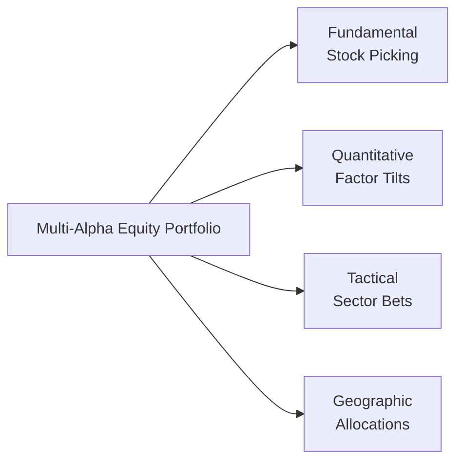

## Introduction
I remember chatting with a colleague who ran a pretty successful equity portfolio driven by classic fundamental stock picking. He told me, “I’m missing out on all these quantitative and sector-rotation strategies.” At first, I thought, “Why not just dive deeper into your existing method?” But then I realized: investors might actually capture multiple sources of alpha (returns beyond a benchmark) by logically combining different active strategies. This concept—often referred to as multi-alpha equity investing—aims to generate higher total alpha and reduce the overall risk of a portfolio by blending several uncorrelated alpha engines. 

So, what does that really mean in practice? It means you’re looking for distinct pockets of opportunity, each with its own unique risk/return characteristics, so that when one source of alpha dips, another might remain steady, or even surge higher. It’s kind of like having multiple star players on a basketball team. You don’t want everyone to be a point guard; you need variety to adapt to different conditions and opponents.

## Defining Multi-Alpha Equity Strategies
A multi-alpha equity strategy is, in essence, a combination of various active approaches or “alpha engines.” These might include:

• Fundamental Stock Picking: Traditional analysis of individual companies’ financial statements, management quality, and competitive advantage.  
• Quantitative Factor Tilts: Systematic approaches that target style premiums such as value, momentum, or low volatility factors.  
• Tactical Sector Bets: Taking short-term or medium-term positions in sectors expected to outperform due to macro or industry-specific trends.  
• Geographic Allocations: Shifting exposure among different regions or countries based on relative valuations, macroeconomic signals, or political risk changes.  

By carefully blending these alpha sources—while monitoring correlation and capacity constraints—the multi-alpha investor aims to enhance risk-adjusted returns.  

## Rationale and Benefits of Combining Multiple Alphas
Why not simply invest in one well-performing strategy? Well, sometimes your best idea is already “crowded,” meaning many market participants are chasing a similar alpha signal (e.g., value factor). Or perhaps your skill set is broad enough to identify opportunities in multiple domains. Indeed, combining diverse alpha engines can:

• Deliver higher total active returns compared to relying on a single strategy.  
• Provide more consistent performance through market cycles, especially if the alpha sources are truly uncorrelated.  
• Potentially reduce total portfolio volatility because different alpha engines perform under different market regimes.

Honestly, it reminds me of cooking my favorite vegetable stew at home—if I rely on only one spice, the flavor quickly becomes one-dimensional. But if I carefully combine various spices, each ingredient stands out and complements the others to produce a well-rounded dish.  

## Key Considerations: Correlation Management and Diversification
Maximizing benefits across alpha sleeves hinges on keeping their strategies as uncorrelated as possible. If your fundamental-manager sleeve and your quant-factor sleeve both unknowingly chase the same large-cap growth stocks, you get extreme style overlap and end up with a single concentrated bet that might tank if that style goes out of favor.

One simple metric that can help is the correlation coefficient between the return streams of each alpha engine. If correlation starts creeping up because managers or strategies converge on the same trades, it’s time to trim or rebalance.  

To illustrate the structure and interaction of different alpha engines, consider the following Mermaid diagram:

Each box represents a distinct alpha engine, feeding into the integrated multi-alpha portfolio.  

## Capacity, Liquidity, and Risk Budgets
A multi-alpha approach might sound appealing, but it isn’t all roses and sunshine. You have to think about capacity, liquidity, and risk budgets:

• Capacity: Each alpha strategy has a maximum size at which it can still be effective. A small-cap stock picker, for instance, can’t manage tens of billions of dollars without shifting the market. You can’t just pour unlimited capital into a niche strategy and expect consistent alpha.  
• Liquidity: If a particular alpha source invests in thinly traded securities, you’ll face higher transaction costs and potential slippage. Overextending allocations to illiquid sleeves could hamper your ability to rebalance or meet redemptions.  
• Risk Budgets: Multi-alpha investing still needs an overarching risk framework. You have to decide how much risk each alpha sleeve is allowed to contribute to the overall portfolio. Going too large too fast can blow up your drawdowns if things go wrong.  

## Performance Attribution
Performance attribution tells you exactly where your gains or losses are coming from. This process helps answer: Are my fundamental picks driving most of the return? Did the tactical sector bets add anything? Or was it the quantitative factor tilt that truly delivered alpha?

A simplified performance attribution approach might segment returns into:

• Benchmark Return (e.g., return of a broad equity index).  
• Allocation Effect (the impact of overweighting/underweighting certain sectors, factors, or regions).  
• Selection Effect (the impact of security selection, e.g., fundamental picks or factor-based tilts).  
• Interaction or Residual Effects (any combined effects not captured by the above categories).  

Understanding the results can guide future adjustments. For instance, if a quant angle is performing robustly, you might reallocate capital to that strategy. Conversely, if your global macro geographical shifts consistently fail to add value, it might be time to trim that sleeve or re-evaluate the managers.  

## Core-Satellite Approach in Multi-Alpha
One practical structure for implementing a multi-alpha framework is the well-known core-satellite approach. Essentially:

• Core: Most of your equity exposure (say 60–80%) is allocated to a broad passive or enhanced index fund. This core provides low-cost market exposure. You’re basically securing the “beta” of the equity market.  
• Satellites: The remainder is allocated to high-conviction alpha strategies (e.g., factor-based, fundamental stock picking, or sector rotation). Each satellite manager or strategy operates independently, seeking alpha in its niche.  

The beauty here is that the core ensures you won’t drift too far from the market’s overall performance, while satellites give you the potential for outperformance. But if any satellite misfires, the damage is contained to a smaller potion of the total portfolio.

## Monitoring and Manager Selection
After you set up a multi-alpha structure, the real challenge is ongoing monitoring. Sometimes, alpha engines can “decay” if too many managers chase the same signals, or if the underlying market inefficiency closes. You could see your factor tilt go from brilliant to bland if the rest of Wall Street figures it out.

Meanwhile, manager selection is critical. Don’t bring on three fundamental managers who all love mega-cap technology stocks; you’ll be duplicating the same style. It’s critical to conduct thorough due diligence to:

• Uncover each manager’s investment philosophy and process.  
• Evaluate historical performance (risk-adjusted returns, drawdowns, correlation with other managers, etc.).  
• Understand the manager’s capacity, operational structure, and compliance record.  

Finally, keep an eye out for style overlap: Sometimes managers claim to use different methods, but once you dig deeper, you find they all love the same type of growth stocks or the same region. That overlap obliterates the diversification benefit.  

## Alpha Decay and Avoiding Crowd Dynamics
“Alpha decay” refers to the gradual erosion of outperformance as more capital competes for a similar market anomaly. Picture a small fishing pond: If only one person is fishing, they might catch enough to feed their entire family. But if 20 people show up with bigger nets, they’ll fish out the pond in no time, leaving little for themselves or the next wave of fishers. 

In investing, certain factor anomalies may be highly effective at low capacity. But as the strategy’s success becomes public, new managers jump in, leading to narrower opportunities and less alpha. Ongoing research and adaptation are essential to refresh your alpha engines before they become overly “fished out.”

## Best Practices and Common Pitfalls
• Diversify Thoroughly: Make sure each alpha sleeve is genuinely uncorrelated.  
• Construct a Rigorous Risk Budget: Keep your portfolio from being dominated by one hot strategy.  
• Perform Regular Attribution: Know where your returns come from and adjust.  
• Avoid Style Overlap: Overlapping approaches mean paying fees for redundant exposures.  
• Consider Realistic Capacity Limits: Some strategies don’t scale well.  
• Watch for Alpha Decay: Ongoing research helps you stay ahead of the crowd.  

From personal experience, I once invested in a momentum-based factor strategy that looked absolutely stellar on paper, only to see that half my peers in the same program were using near-identical rules. Eventually, the alpha disappeared. So I learned to keep an eye on how many other players are tapping into the same signals.

## Putting It All Together
A disciplined multi-alpha equity framework brings together different active strategies in one cohesive portfolio. It’s all about balancing them well—like building a dream sports team or mixing the perfect set of instruments in an orchestra. Careful attention to correlation, capacity, liquidity, and potential alpha decay is crucial. By mobilizing multiple alpha engines, the aim is to achieve a smoother ride across market cycles while still capturing meaningful outperformance relative to a standard equity benchmark.

## Exam Tips
• Conceptual Clarity: The CFA exam often tests your understanding of how uncorrelated alpha sources can reduce overall portfolio risk. Be ready to explain how a multi-alpha framework differs from a single-manager approach.  
• Attribution Analysis: You might see a constructed response question where you must calculate and interpret the allocation vs. selection effect.  
• Risk Constraints: Prepare to illustrate how risk budgeting is applied when deciding how to scale each alpha sleeve.  
• Practical Pitfalls: Know how to spot style overlap or correlation creep. Real-world examples often appear in item sets.  
• Core-Satellite Context: Be prepared to connect multi-alpha strategies to the core-satellite framework.  

## Glossary
Alpha Engine: A distinct investment strategy used to generate returns in excess of a benchmark, typically requiring specialized skill or unique insight.  
Core-Satellite Approach: An investment structure combining a large, passive or enhanced index core with smaller allocations to active tactics.  
Style Overlap: Occurs when multiple managers within a portfolio follow similar strategies, inadvertently concentrating positions and undermining diversification.

## References
• Thomas, S. & Evans, J. (2018). “Multi-Manager Funds & Multi-Alpha Strategies.”   
• CFA Institute, “Equity Investments,” CFA Program Curriculum (2025).  

• Additional Resource: 
  - For deeper insights into the math behind factor investing, see “Advanced Factor Strategies” by Dorsey-Wright.  
  - For ongoing managerial due diligence frameworks, explore “Building a Multi-Manager Platform” in the Journal of Portfolio Management (2023).

## Multi-Alpha Equity Strategies Knowledge Check



### Which best describes the main goal of multi-alpha equity strategies?

- [ ] Achieving market returns with zero tracking error.  
- [ ] Focusing solely on fundamental analysis for stock selection.  
- [x] Combining multiple uncorrelated alpha sources to enhance diversification.  
- [ ] Avoiding all forms of active management to reduce fees.  

> **Explanation:** The intent of a multi-alpha approach is to identify and combine several distinct, ideally uncorrelated, sources of active return.  

### In a multi-alpha structure, which of the following best illustrates style overlap?

- [ ] Having multiple managers that each invest in different parts of the capital structure (equity, debt, etc.).  
- [x] Engaging several managers who end up holding the same large-cap technology stocks.  
- [ ] Using a macro-driven sector rotation fund alongside a fundamental small-cap manager.  
- [ ] Mixing equity and fixed income funds in one portfolio.  

> **Explanation:** Style overlap stems from multiple managers focusing on similar securities and/or styles, resulting in concentration and limited diversification.  

### What is “alpha decay” in the context of multi-alpha equity investing?

- [ ] The process of alpha growing larger over time as the strategy gains more assets.  
- [x] The gradual erosion of a strategy's outperformance when more capital competes for the same market anomaly.  
- [ ] A statistical error in attributing alpha to nontangible factors.  
- [ ] A short-term fluctuation in the stock market that reduces realized returns.  

> **Explanation:** Alpha decay occurs when too many market participants exploit the same inefficiency, reducing the available excess return.  

### An investor wants to fund several alpha strategies but is worried about too much overlap. Which measure is most relevant in evaluating synergy or redundancy among alpha sleeves?

- [ ] Sharpe ratio of each alpha sleeve in isolation.  
- [ ] Sortino ratio focusing on downside risk.  
- [x] Correlation coefficients between alpha sleeves’ returns.  
- [ ] Dividend yield comparison across alpha sleeves.  

> **Explanation:** Correlation coefficients show how similarly the alpha returns move. Low correlation suggests true diversification potential.  

### Which of the following best describes the core-satellite approach in multi-alpha investing?

- [x] Holding a large passive or enhanced core while using smaller active allocations for alpha generation.  
- [ ] Pursuing multiple alpha strategies without any passive components.  
- [ ] Allocating equally to all alpha engines with no benchmark.  
- [ ] Rotating between passive and active strategies quarterly.  

> **Explanation:** Core-satellite typically involves a passive (or enhanced) index at the heart of the portfolio, complemented by smaller, targeted active “satellite” strategies.  

### What is a risk budget in the context of multi-alpha portfolios?

- [x] A framework specifying how much risk each alpha sleeve can contribute to the overall portfolio.  
- [ ] A requirement forcing all strategies to hold the same number of stocks.  
- [ ] A guideline that limits the size of the manager’s annual bonus.  
- [ ] A cap on how many times a portfolio can be rebalanced per year.  

> **Explanation:** A risk budget defines the maximum allowable allocations and limits for risk exposures among the different alpha engines.  

### Which statement about capacity constraints is accurate?

- [x] Certain niche strategies can lose efficacy if they become too large relative to their investable market.  
- [ ] Capacity constraints only apply to fixed income strategies.  
- [ ] A strategy’s alpha generally increases as the strategy grows in size.  
- [ ] Capacity constraints are irrelevant as long as the portfolio is diversified.  

> **Explanation:** Niche or capacity-limited alpha sources (especially small-cap or specialized factor strategies) can see diminished performance when too much capital floods those markets.  

### Why is performance attribution critical in a multi-alpha strategy?

- [ ] It ensures all managers follow identical benchmarks.  
- [x] It identifies each alpha engine’s contribution to returns, guiding rebalancing and adjustments.  
- [ ] It helps avoid all active strategies in the future.  
- [ ] It ensures that transaction costs remain constant.  

> **Explanation:** Performance attribution breaks down the sources of gains or losses, enabling better decision-making on how to adjust or allocate capital among alpha engines.  

### Which scenario may indicate that two alpha engines are converging?

- [x] Their correlation of returns is rising significantly over time.  
- [ ] Their combined Sharpe ratio is improving.  
- [ ] Each engine’s performance is diverging widely from the other.  
- [ ] They are separately managed by distinct organizations.  

> **Explanation:** A rising correlation coefficient suggests they are pairing into more similar exposures, reducing diversification benefits.  

### When a multi-alpha portfolio invests in illiquid assets or thinly traded securities, what is the primary concern?

- [x] Liquidity risks and potential large transaction cost impacts.  
- [ ] Impossibility of generating alpha.  
- [ ] Constant correlation with other alpha engines.  
- [ ] Strong guarantee of stable, long-term alpha.  

> **Explanation:** Illiquid strategies can be prone to higher transaction costs and may become difficult to rebalance, amplifying risk if market sentiment shifts.  


