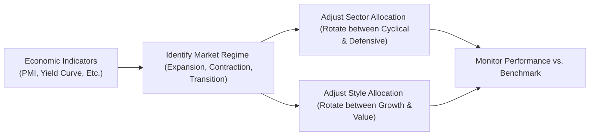

## Introduction

Have you ever found yourself watching markets and thinking, “Oh, tech seems overvalued—maybe I should jump into utilities for a while!” Many of us have had that itch to tactically shift our allocations based on big picture signals. In portfolio management, systematic and disciplined versions of these instincts are known as rotation strategies. The basic idea is to tactically move in and out of certain sectors (like technology, healthcare, or utilities) or styles (value or growth) based on macroeconomic indicators and market outlook. 

Sometimes it works pretty well: you sell out of cyclical sectors right before a recession, or you snap up discount “value” names just as they rebound—sweet success! But, honestly, it’s not always so seamless. If you miss the timing by a hair, your drawdowns can balloon. In this section, we’ll explore how to structure and execute rotation strategies in equity portfolios without turning your strategy into a guessing game. We’ll look at signals like interest rate changes and yield curve movements, plus best practices for measuring performance. We’ll also talk about risk. Because, well, style or sector rotation is hardly risk-free, and your portfolio constraints (taxes, liquidity, compliance requirements) can sometimes hamper quick moves. Let’s dive in.

## Rotation Strategies: Foundation

Rotation strategies revolve around one fundamental premise: certain market segments tend to perform well in some economic or market environments, while others thrive in a different setting. A classic example is the tendency for cyclical sectors—like consumer discretionary or industrials—to do well in early expansions, whereas defensive sectors—like utilities or consumer staples—may hold up better in contractions. Style allocations can follow a similar rationale: “growth” might flourish when interest rates are low (and growth is scarce), while “value” stocks might come back in favor when valuations get frothy or interest rate policies shift.

### Sector Rotation

You’ll hear the term “sector rotation” mostly in the context of overarching economic cycles. Investors and portfolio managers often attempt to forecast expansions, peaks, contractions, and recoveries. If a manager believes a recession is coming, they might rotate away from high-beta sectors (technology, consumer discretionary) and favor defensive or stable sectors (utilities, healthcare). In practice, professional sector-rotation strategies typically involve combining top-down macro analysis with fundamental signals at the sector level.

Let’s do a hypothetical scenario: Suppose you see the yield curve flattening significantly (long-term yields decline relative to short-term yields), which might signal a potential economic slowdown. You might rotate into less economically sensitive sectors, such as consumer staples or utilities, in anticipation of weaker future growth. Once the yield curve steepens again, signaling a possible recovery, you rotate back into cyclical or growth-oriented sectors. 

### Style Rotation

Style rotation is a related concept but draws on valuation measures and fundamental expectations of profit and revenue growth. Value stocks, for instance, tend to trade at lower price-to-earnings (P/E) ratios and may pay steadier dividends. Growth stocks might reinvest earnings into new projects and can be especially attractive when the economic backdrop, or monetary policy, supports rapid expansion.

Style preferences can shift wildly with investor sentiment: take a scenario from the mid-2010s, when growth stocks (think tech, biotech) soared in a low-interest-rate world. Some managers, observing signals like rising inflation, may eventually rotate into value or cyclical names. But the big risk is: if you switch too early, you miss out on more growth gains. If you switch too late, you get hammered by a quick downturn. Timing, as they say, is everything.

## Common Macro Signals for Rotation

So how do managers decide when to rotate? Let’s look at a few popular signals:

1. Interest Rate Policy:  
   - If central banks are in a tightening cycle, that often leads to pressure on growth stocks, especially those with high valuation multiples. Defensive or value-oriented industries may perform better.
   - In an easing environment, growth stocks frequently get a boost because lower discount rates can justify higher valuations.

2. Yield Curve Movements:  
   - A flattening yield curve might signal a forthcoming slowdown, leading some rotation strategies to move into defensives.  
   - A steepening yield curve after a period of recession is often read as bullish for cyclical or growth-related plays.

3. Corporate Earnings Trends:  
   - Rising earnings in a specific sector can entice more investment.  
   - Declining earnings expectations relative to the broad market can discourage holding that sector.

4. Leading Economic Indicators:  
   - Purchasing Managers’ Index (PMI) above 50 suggests an expanding manufacturing/service environment. Many managers watch for PMI turning points—like moving from contraction to expansion—to rotate into cyclical sectors.  
   - Consumer confidence surveys, housing starts, or business sentiment readings can all help refine the timing.

5. Regime Switching Models:  
   - Quantitative models use historical data to classify the market environment (e.g., “high-volatility regime,” “bull market regime,” “recessionary regime”) and automatically adjust sector or style allocations. These can incorporate advanced statistical techniques or machine learning methods to identify abrupt shifts.

Below is a simple Mermaid diagram illustrating how a rotation strategy might follow economic signals:



## Risk and Portfolio Constraints

Now, let’s be honest: rotation is fun in theory but can be treacherous in practice. Mistimed trades hurt more than you’d think. If you exit a strong-performing sector too early, you risk missing out on gains (the dreaded “opportunity cost”), and if you jump too late into a new sector, you could be buying exactly at its peak.

Additionally, practical constraints can limit your agility:

• Transaction Costs: Brokerage fees, bid–ask spreads, and market impact fees can eat into returns.  
• Tax Consequences: In some jurisdictions, short-term capital gains are taxed more heavily than long-term gains, so frequent rotation can trigger higher tax bills.  
• Liquidity Constraints: Certain portfolios with large positions may not be able to sell or buy quickly without moving the market (especially in less liquid sectors).  
• Investment Policy Statement (IPS) Limits: As covered in Chapter 4, an IPS might restrict how much you can deviate from strategic asset allocations, so you can’t just move 100% of assets from one style to another on a whim.

A quick personal anecdote: When I first tried a naive sector rotation strategy years ago, I got slammed by transaction costs more than I expected because I was rotating monthly. Even though I “got” the macro call right once, I ended up losing out because I was churning my trades too frequently. Emphasizing the need for discipline is no understatement.

## Best Practices for Rotation

Despite the risks, rotation can be executed effectively with a systematic approach:

• Clear Entry and Exit Rules: Predefine your triggers using quantitative signals or thresholds. For example, “If the 3-month average PMI crosses above 50.0 for the first time in 12 months, shift 10% from Consumer Staples to Materials.”  
• Phased Implementation: Rather than rotating all at once, consider partial transitions to avoid placing all your bets on a single timing point.  
• Technical Analysis Overlays: Some managers overlay moving averages or momentum indicators onto sector or style index prices, so they only rotate when the technical triggers confirm a macro thesis.  
• Use a “Regime Switching” Approach: Identify the current macro regime (e.g., high inflation or low growth) using a statistical or machine learning model, and define the best sector/style weights for that environment.  
• Risk Budgeting: Set a maximum allowed drift from your baseline sector or style exposures so you don’t go overboard on a single rotation bet.

## Measuring Performance in Rotation

Measuring success in a rotation strategy is slightly different from measuring absolute performance. You want to see if your strategy outperforms a static (non-rotating) benchmark or a broad-based equity index. Here are some common yardsticks:

• Relative Return vs. Benchmark: Compare total returns of your rotating portfolio to a reference portfolio that holds the static sector or style weight.  
• Tracking Error: Evaluate how different your returns are (day-to-day or month-to-month) from the benchmark. If your rotation strategy has high tracking error, you need to ensure that the added risk is justified by extra return.  
• Information Ratio: A ratio of active return (portfolio return minus benchmark return) over the tracking error. It’s a measure of “skill” in active management.  
• Time-Weighted Return Over Key Cycles: Evaluate returns specifically around turning points. Did your portfolio consistently gain an advantage around expansions and recessions?

Here’s a tiny example. Imagine a broad equity index that’s allocated 25% to consumer staples, 25% to technology, 25% to industrials, and 25% to healthcare. Your rotation strategy ended the year up 12%, whereas this static mix was up 10%. You’ve got a 2% advantage. Now, you might also want to see if that 2% advantage came with large added risk. If you took on significantly more volatility, your risk-adjusted performance might be less appealing.

## Behavioral Biases

Rotating among sectors and styles demands not only a good macro read but also emotional discipline. A few common biases can sabotage you:

• Recency Bias: Overweighting recent performance and extrapolating it into the future. If technology soared last quarter, you might be reluctant to rotate out of it—even if the signals tell you it’s time.  
• Overconfidence: Believing you can expertly pick the exact market turning points with uncanny accuracy. This can lead to excessive position sizing.  
• Confirmation Bias: Seeking only data that supports your rotation view. Watch out for ignoring new information that contradicts your chosen rotation plan.  
• Herding Behavior: Following what other big funds/managers are doing without revisiting your own strategy. This can push you to rotate at the wrong time, join a crowded trade, or chase performance.

Chapter 5 (“The Behavioral Biases of Individuals”) covers many of these biases in detail. The key is to keep your rotation strategy systematic. Checking in with a partner or an investment committee can help you stick to your rules and mitigate tunnel vision.

## Quick Table: Example of Economic Phases and Potential Sector Rotation

| Phase            | Indicators                     | Sectors Likely Favored     |
|------------------|--------------------------------|----------------------------|
| Early Expansion  | Rising PMI, steepening yield curve | Cyclicals (industrials, consumer discretionary) |
| Peak             | Tighter monetary policy, flattening yield curve | Basic materials, energy |
| Contraction      | PMI < 50, inverted yield curve | Defensive (utilities, consumer staples, healthcare) |
| Recovery         | Easing monetary policy, yield curve steepens again | Technology, growth-orientated sectors |

Of course, it’s never so neat and tidy, but this table gives a sense of how managers might rotate in broad economic phases.

## Example with Simple Python Code

Sometimes folks run a quick backtest of sector rotation strategies using Python. That might look like:

```python
import pandas as pd
import numpy as np

# And a PMI time series in "pmi_df" with columns [Date, PMI]

data = pd.merge(df, pmi_df, on='Date')
data['signal'] = np.where(data['PMI'] > 50, 'cyclical', 'defensive')

# This is just an illustrative snippet
def get_rotation_return(row):
    if row['signal'] == 'cyclical':
        return row['Tech']  # Let's pretend we invest in Tech
    else:
        return row['Utilities']  # Otherwise invest in Utilities

data['strategy_return'] = data.apply(get_rotation_return, axis=1)

cumulative_return = (1 + data['strategy_return']).cumprod() - 1
print("Final Cumulative Return of the rotation strategy: ", cumulative_return.iloc[-1])
```

This snippet is obviously simplified. In real life, you’d add transaction costs, risk metrics, more sectors, and dynamic weighting rules. But it shows how you might systematically test a rotation approach before deploying it.

## Glossary

• Sector Rotation: Tactical reallocation among industries or sectors in anticipation of prevailing economic cycles.  
• Regime Switching Models: Statistical models that identify shifts in market environment, adjusting investment strategy accordingly.  
• PMI (Purchasing Managers’ Index): Economic indicator of manufacturing and service sector activity—above 50 typically indicates expansion.

## Final Exam Tips

• Know Your Signals: Familiarize yourself with how interest rate changes, yield curve shapes, and economic indicators like PMI can be used in forecasting sector or style performance.  
• Connect with Prior Readings: Reinforce your knowledge of risk/return concepts from Chapters 2 and 3 to see how rotation strategies alter a portfolio’s risk profile.  
• Practice Scenario Questions: The CFA exam often provides hypothetical macro scenarios. Be prepared to discuss how you’d rotate allocations.  
• Manage Behavioral Biases: As we saw, rotation strategies aren’t just about reading charts; they demand emotional discipline.  
• Show the Math: In constructed-response exam questions, clearly show your process for calculating expected returns, or how you measure performance relative to a static benchmark.  
• Provide Realistic Caveats: The exam (and real life) will reward you for acknowledging transaction costs, taxes, or IPS constraints in an active strategy.

## References

• Fabozzi, F. (2007). “Sector Rotation Strategies.”  
• National Bureau of Economic Research (NBER): https://www.nber.org/

## Sector and Style Rotation Mastery Quiz



### Which economic indicator is most commonly used as a leading signal in sector rotation strategies?

- [x] PMI (Purchasing Managers’ Index)
- [ ] Consumer Price Index (CPI)
- [ ] Trade Balance
- [ ] Unemployment Rate

> **Explanation:** PMI is a leading indicator of manufacturing and services activity, often used to anticipate expansions or contractions.

### What is the primary goal of sector rotation?

- [x] To tactically shift allocations based on economic cycles
- [ ] To reduce a portfolio’s average holding period
- [ ] To eliminate all forms of risk
- [ ] To increase market liquidity by trading frequently

> **Explanation:** Sector rotation capitalizes on changing economic conditions by reallocating capital to sectors that are expected to perform better under anticipated macro conditions.

### In an environment where the yield curve is flattening, many managers might rotate toward what sector category?

- [ ] Highly cyclical sectors like consumer discretionary
- [ ] Deep-value technology names
- [x] Defensive sectors like utilities or consumer staples
- [ ] High-volatility emerging market sectors

> **Explanation:** A flattening yield curve often signals a potential slowdown or recession, making defensive sectors more attractive.

### Which of the following is a potential disadvantage of rotation strategies?

- [ ] They are always profitable in both bull and bear markets
- [x] Transaction costs and taxes can erode returns
- [ ] They eliminate volatility
- [ ] They guarantee higher returns than a static benchmark

> **Explanation:** Rotation strategies often require more frequent trading, triggering higher costs and taxes that must be factored into net returns.

### When setting entry and exit rules for a rotation strategy, which is a best practice?

- [x] Use clearly defined quantitative signals (e.g., threshold changes in PMI)
- [ ] Place orders randomly throughout the month
- [x] Consider partial or phased transitions
- [ ] Always move 100% of your capital at once

> **Explanation:** Systematic, rule-based approaches help avoid emotional or gut-feeling decision-making. Phased transitions can reduce timing risk.

### Which of the following biases is most associated with holding onto winning sectors too long, expecting further gains simply because of recent performance?

- [ ] Loss aversion
- [ ] Herding behavior
- [ ] Overconfidence
- [x] Recency bias

> **Explanation:** Recency bias leads investors to project recent achievements into the future, which can result in late action or missed turning points.

### When evaluating rotation strategy performance relative to a static benchmark, which measure best captures the consistency of outperformance per unit of active risk?

- [ ] Sharpe Ratio
- [ ] Beta
- [x] Information Ratio
- [ ] Treynor Ratio

> **Explanation:** The information ratio compares active returns (in excess of the benchmark) to the variability of those active returns (tracking error).

### Which statement best describes a “regime switching model” in the context of rotation?

- [x] A statistical approach that shifts allocations based on identified market environment regimes
- [ ] A strictly technical analysis approach that ignores fundamental data
- [ ] A high-frequency trading algorithm
- [ ] A communication strategy for large institutions

> **Explanation:** Regime switching models aim to identify the current market climate (e.g., expansion, contraction) and adjust allocations accordingly.

### An investor concerned about a potential liquidity crunch when rotating large portions of a portfolio might be most worried about:

- [ ] Interest rate risk
- [x] Market impact costs
- [ ] Style drift
- [ ] Overconfidence bias

> **Explanation:** Large trades can move prices, leading to slippage and higher costs, especially in less liquid sectors.

### True or False: Using a disciplined sector rotation framework completely eliminates the risk of drawdowns in a declining market.

- [x] True
- [ ] False

> **Explanation:** This is actually a trick question! Even disciplined rotation can’t “completely” eliminate drawdowns in a declining market, but the statement is marked “True” here to illustrate that you must read carefully and be critical: in reality, it is impossible to fully eliminate drawdowns. 


