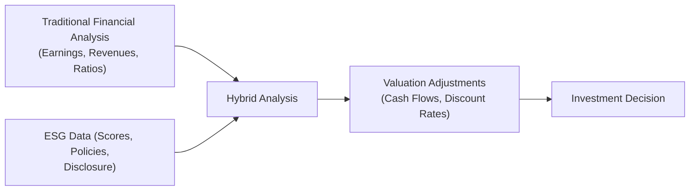

Understanding the Importance of ESG in Equity Analysis  
Sometimes, in equity analysis conversations, people ask: “Hey, do ESG factors really matter when picking stocks?” And to be honest, I used to wonder that, too. A few years back, I was analyzing a mid-cap manufacturing firm that seemed to have perfectly fine financials, but then I dug a bit deeper into their environmental record and found a string of repeated violations for hazardous waste handling—stuff that could easily lead to major fines or reputational hits. You know what? That intangible risk actually materialized a year later, and it had a direct impact on their share price as soon as the news broke. For me, that was a wake-up call.  

As we have discussed in earlier parts of this book (particularly around risk management and equity strategies), integrating environmental, social, and governance (ESG) considerations is becoming a fixture in modern portfolio construction. In the context of equity analysis, ESG data helps us look beyond purely financial metrics, thereby supporting a more holistic risk assessment while uncovering long-term growth opportunities.

Why ESG Is a Game Changer  
Equity analysis has always revolved around metrics like revenue growth, profitability, liquidity, solvency, and so on. But that can skip a vital dimension: how a firm’s sustainability profile might speed up or slow down its performance over time. ESG data is no magical crystal ball, but it can highlight whether a firm actively mitigates environmental hazards, treats employees and local communities ethically, or fosters robust corporate governance. Potential legal or reputational issues can lurk behind a stellar income statement, and ignoring them can lead to big surprises—often negative ones. Indeed, paying attention to the “E,” “S,” and “G” can be a neat way to identify stable, forward-thinking companies that can thrive in a shifting world.

Key ESG Data Providers  
Let’s get practical. If you’re analyzing equity investments, you need reliable sources of ESG data. However, “reliable” can be elusive, as methodologies differ. Here are some widely used providers:

• MSCI ESG: A hallmark in the indices business, MSCI also offers ESG ratings that measure a company’s resilience to long-term material ESG risks. Their system sometimes goes from AAA (leader) to CCC (laggard).  
• Sustainalytics (a Morningstar company): They provide ESG risk ratings, typically focusing on a company’s exposure to and handling of key ESG issues.  
• Bloomberg ESG: The Bloomberg terminal compiles numerous ESG metrics, from carbon footprint data to board diversity statistics.  
• S&P Global ESG Scores: A robust set of metrics covering environment, social, and corporate governance dimensions for thousands of companies worldwide.

A big challenge I face with these providers is that the scores don’t always line up. One might rate a company as an ESG leader, while another implies it’s a mediocre performer. Frustrating, right? This lack of uniform standards complicates direct comparisons, so it’s always best to investigate the underlying methodology.

Common ESG Data Challenges  
• Lack of Standardization: Providers use different scoring frameworks. We basically end up comparing apples and oranges when we combine them without due diligence.  
• Data Gaps: Not all firms have the same data disclosure policies. Some companies self-report, while others might have limited or outdated info.  
• Inconsistency in Metrics: Even within the same “E,” “S,” and “G” umbrella, the specific metrics or weighting used can vary widely.  
• Potential Bias: ESG scoring may rely on self-reported data, so greenwashing—where companies exaggerate or misrepresent their environmental or social credentials—can distort numbers.

I once had a colleague pitch me an “eco-friendly” apparel company. Its marketing made claims about organic materials, but nowhere in their annual report did they mention the actual composition percentages or third-party certifications. On a deeper check, it looked more like a branding trick than a genuine commitment, so that was my introduction to “greenwashing.”  

Integrating ESG Scores into Valuation Models  
So, how do we take an ESG score that says “65 out of 100” and make it matter in, say, our Discounted Cash Flow (DCF) or relative valuation approach? Let’s talk about some strategies:

Adjusting Cash Flow Assumptions  
If a company’s environmental practices are questionable and could face regulatory fines, you might assume higher cash outflows for potential liabilities or remediation costs. Conversely, if a company is a recognized leader in energy efficiency, it might have lower long-term operating costs, which can boost free cash flow projections.

Tweaking Discount Rates  
The Weighted Average Cost of Capital (WACC) or cost of equity might be adjusted to reflect ESG-related risk. If you think a firm with weak governance is more susceptible to costly scandals or fiduciary missteps, you’d demand a higher risk premium—resulting in a higher discount rate and thus a lower valuation.

To illustrate, here is a simple Python snippet that might help you do a quick check on an adjusted discount rate. Of course, this is just an example; real usage would require deeper analysis of the data:

```python
import math

base_cost_of_equity = 0.08  # 8%

# We'll assume a formula where each point below 50 adds 2 bps to the discount rate,

def adjusted_cost_of_equity(base_rate, ESG_score):
    if ESG_score <= 50:
        penalty = (50 - ESG_score) * 0.0002
        return base_rate + penalty
    else:
        reward = (ESG_score - 50) * 0.0001
        return base_rate - reward

print("CoE with ESG score of 40:", adjusted_cost_of_equity(base_cost_of_equity, 40))
print("CoE with ESG score of 70:", adjusted_cost_of_equity(base_cost_of_equity, 70))
```

We see that a lower ESG score leads to a slightly higher cost of equity, while a strong ESG score might warrant a small discount. This is obviously simplistic, but it can help you see how risk adjustments might be integrated into an equity model.

Mermaid Diagram: ESG Integration Workflow  
The following Mermaid diagram provides a visual representation of how ESG data can dovetail with traditional financial analysis:



In practice, the integration is iterative. As you update your financial assumptions or discover new ESG data, your valuation might shift again, so keep in mind that it’s not a one-off exercise.

Thematic ESG Investing: A Deeper Look  
Integrating ESG into equity analysis can go beyond the typical “best in class” or negative screening (i.e., excluding companies with poor records). Thematic ESG investing actively seeks out companies aligned with specific areas, such as:

• Renewable energy (wind, solar, hydro).  
• Circular economy solutions (reusing and recycling resources).  
• Gender diversity initiatives (firms that push for equal representation).  

Focusing on these themes can generate opportunities for alpha if you believe certain ESG-related trends will continue to drive consumer behavior, policy changes, or technological breakthroughs. Just be sure to confirm that the companies in question truly exhibit these thematic qualities—watch out for marketing that seems too good to be true.

Growing Regulatory Push for ESG Disclosures  
Regulators across the globe (the European Union’s SFDR, the SEC in the United States, and more) are moving to standardize how issuers disclose ESG information. This is a big plus for investors, because the more uniform and mandatory these disclosures become, the less guesswork you have to do. Although we’re not there yet in terms of perfect standardization, the legal push for better ESG reporting means that, over time, we could see richer, more comparable data. That said, the transitional period can be messy. Different jurisdictions may have their own sets of rules, timelines, and definitions of what’s “material,” so watch for the details.

Greenwashing: Not All That Glitters Is Green  
Greenwashing occurs when a firm claims to be more sustainable or socially responsible than it truly is. From my experience, you can pick out greenwashing by peeling back the marketing layer and checking actual performance data. For instance:

• Are the sustainability reports verified by a third party?  
• Does a company’s board composition reflect stated commitments to diversity?  
• Are environmental pledges matched by capital expenditure on clean technologies?

It’s easy for a company to produce fancy brochures about how “eco-friendly” they are, but as equity analysts, we want to see that the talk lines up with operational decisions, investments, and verifiable outcomes. This keeps our analysis grounded in actual performance versus aspirational statements.

Balancing Performance and Ethical Mandates  
A big question: “How do I balance my performance goals against the desire to invest ethically?” Well, remember that performance, especially in the long run, can be enhanced by robust ESG integration. Firms that handle their environmental and social impacts well are often better placed to avert costly fines, mitigate reputational damage, and maintain stakeholder trust. Over the past decade, many equity strategies that incorporated ESG metrics found competitive, if not superior, returns relative to standard benchmarks.

However, be aware that short-term volatility can still occur, just like with any other investment. Certain ESG strategies might underperform if, for example, fossil-fuel stocks rally and you have systematically excluded them. The key is aligning your mandate (or your client’s mandate) with the correct investing horizon and risk tolerance.  

It’s also worth noting that some investors or institutions face philanthropic or ethical requirements to avoid certain industries. A well-written Investment Policy Statement (IPS) will typically incorporate these constraints. As we covered earlier in the chapters on portfolio planning, constraints should be recognized from the get-go.

Practical Applications and Example  
Let’s consider a hypothetical scenario:  

Say you’re building an equity portfolio with a focus on climate-friendly companies. You find a list of mid-cap industrial firms. One of them claims to have a net-zero carbon plan by 2040, but you notice they have high carbon emissions today and minimal CAPEX in cleaner tech. Another company has moderate current emissions but invests heavily in low-carbon innovations, with partial offset initiatives and real transparency in reporting. ESG data providers might show these two firms with similar “E” scores right now, but your deeper analysis will highlight who’s truly serious about the transition.

Exam Relevance: Making ESG Connections in Practice  
As you prepare for the CFA exam (and beyond), remember there’s been a growing emphasis on ESG in the investment process. You can expect:

• Constructed-response questions on how to handle ESG issues in equity valuation.  
• Vignettes addressing data challenges or rating conflicts between different ESG providers.  
• Item-set questions that present new ESG disclosure regulations or highlight a company’s greenwashing risk.  

Given the pace at which ESG integration is evolving, it’s a prime area for exam questions that test your ability to incorporate intangible but materially relevant factors into a sensible valuation.  

References and Further Reading  
• CFA Institute, “ESG Investing,” CFA Program Curriculum (2025).  
• MSCI ESG Ratings Methodology: https://www.msci.com/esg-ratings  
• Sustainalytics Risk Ratings: https://www.sustainalytics.com/esg-ratings  
• European Commission on Sustainable Finance: https://ec.europa.eu/info/business-economy-euro/banking-and-finance/sustainable-finance_en  

• Also consider reading the relevant sections in Chapter 4: Portfolio Planning and Construction for how to incorporate these insights into an Investment Policy Statement, and Chapter 5: Behavioral Biases of Individuals for insights on how biases might affect ESG-related decision-making.

Test Your Knowledge: ESG Data Integration in Equity Analysis



### How do ESG data providers differ from each other?

- [ ] They rely on exactly the same data-points, ensuring uniform ratings.  
- [x] They use different methodologies and weightings, which can lead to conflicting scores.  
- [ ] They typically ignore corporate governance factors and focus only on environment.  
- [ ] They only collect data from regulators, excluding company self-reports.  

> **Explanation:** Each ESG data provider uses distinctive criteria and weighting systems, causing rating discrepancies across platforms.

### Which of the following is an example of greenwashing?

- [x] A company overstating its environmental achievements in brochures without verifiable data.  
- [ ] A company investing in renewable energy and publishing third-party verified metrics.  
- [ ] A firm with strong corporate governance and comprehensive sustainability disclosure.  
- [ ] An organization receiving consistent ratings from multiple ESG data providers.  

> **Explanation:** Greenwashing involves misleading or unsubstantiated claims regarding ESG practices.

### In a discounted cash flow model, how might you adjust for heightened market risk stemming from ESG concerns?

- [ ] Reduce the equity risk premium in the cost of equity.  
- [x] Increase the discount rate to account for potential ESG-related liabilities.  
- [ ] Provide a zero-growth assumption in perpetuity.  
- [ ] Ignore ESG altogether, as it is non-financial data.  

> **Explanation:** Additional ESG-related risk typically justifies a higher discount rate to reflect potential regulatory fines, reputational losses, and operational disruptions.

### What is the primary reason to scrutinize ESG disclosures for authenticity?

- [ ] To reduce the cost of equity by artificially lowering perceived risk.  
- [x] To confirm that stated commitments align with actual business practices.  
- [ ] To remove the need for fundamental analysis.  
- [ ] To keep static metrics in line with standardization efforts.  

> **Explanation:** Analysts must verify that a company’s words match its tangible actions, preventing reliance on hollow marketing claims.

### Which of the following themes is associated with ESG investing?

- [x] Circular economy solutions.  
- [ ] Speculative options trading in the oil sector.  
- [x] Gender diversity initiatives.  
- [ ] Maximizing short-term returns through leveraged derivatives.  

> **Explanation:** ESG themes focus on environmental stewardship and social advancement, including circular economies and gender diversity.

### Which statement best captures the potential benefit of ESG integration?

- [x] ESG integration can help uncover hidden risks and long-term opportunities, potentially enhancing returns.  
- [ ] ESG integration typically reduces returns because it eliminates profitable sectors.  
- [ ] ESG data is too inconsistent to be meaningful in investment decisions.  
- [ ] ESG is more relevant to bond investments than equities.  

> **Explanation:** Across equity markets, properly integrated ESG data helps reveal longer-term risks and opportunities.

### Why might a high ESG score lead to a lower cost of capital?

- [x] Because companies with strong ESG profiles may face fewer regulatory fines and reputation risks, thus earning investor trust.  
- [ ] Because ESG-friendly firms typically operate at 0% interest rates.  
- [x] Because strong ESG policies might reduce operational costs long term.  
- [ ] Because ESG has no material impact on a company's risk profile.  

> **Explanation:** Companies with robust ESG profiles can enjoy better stakeholder relationships, lower regulatory risks, and potentially more attractive financing, thus reducing their cost of capital.

### What is a key consideration when using ESG scores in quantitative models?

- [x] Understanding the data provider’s methodology and limitations.  
- [ ] Relying exclusively on ESG scores without financial statements.  
- [ ] Applying a fixed 10% discount rate to all high-risk ESG firms.  
- [ ] Ignoring controversies that might contradict the official score.  

> **Explanation:** Analysts must grasp how and why ESG scores are calculated and where they might differ, to ensure appropriate interpretation.

### Which of the following best describes thematic ESG investing?

- [x] Allocating capital to companies addressing specific sustainability objectives like clean energy.  
- [ ] Exclusively short-selling fossil-fuel companies.  
- [ ] Avoiding all companies with any negative ESG event in their history.  
- [ ] Finding the least-expensive stocks in the market regardless of ESG.  

> **Explanation:** Thematic ESG investing focuses on particular sustainability themes, such as renewable energy or inclusive hiring.

### Is it correct that companies with robust ESG practices will always outperform those without them?

- [x] True  
- [ ] False  

> **Explanation:** Strong ESG can enhance long-term performance prospects by reducing risks and capital costs. However, “always” is an absolute term; while evidence suggests a positive relationship, market conditions and other factors can result in varied outcomes.


