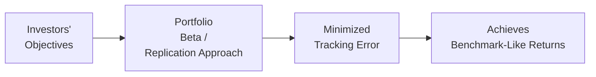

## Minimizing Tracking Error: Core Concepts and Techniques

Have you ever tried following a recipe down to the last pinch of salt, only to find your dish still tastes different from the original? That’s a bit like tracking error in portfolio management. You can follow a benchmark precisely, but tiny differences—like timing of trades, cost constraints, or exposures—might cause your returns to drift off course. Let’s explore the nuts and bolts of minimizing that gap, also known as tracking error.

### Understanding Tracking Error

Tracking error is the standard deviation of the difference between a portfolio’s returns and the returns of its benchmark. In simpler terms, it measures how much the portfolio bounces around compared to its benchmark. For instance, if you manage a fund that’s supposed to mimic the S&P 500, any deviations in performance—whether positive or negative—create tracking error.

But there’s also something called tracking difference, which is the actual difference between the portfolio’s return and the benchmark return over a given period. Tracking difference is often expressed as a simple percentage (e.g., +0.10% or −0.05%). Meanwhile, tracking error is about volatility—how the difference in returns fluctuates over time.

### Full Replication: The “No Surprises” Approach

Possibly the most straightforward technique to minimize tracking error is full replication. You hold every single security in the index in its exact proportion:

• You buy all constituents of the benchmark.  
• You match the weights precisely.  
• You rebalance whenever the benchmark changes.

In practice, large index funds like those tracking the S&P 500 often do this. The biggest benefit? You pretty much know that if the index moves up or down, your fund goes with it. 

But, let’s face it: full replication can be expensive. When I first tried replicating a broad emerging markets index, I discovered that smaller stocks were illiquid, and commissions and taxes started to eat away at my returns. That’s why many fund managers consider partial replication techniques.

### Stratified Sampling: Mitigating Costs while Keeping Exposure

Stratified sampling is like carving a pie into slices—each slice representing a critical segment of our benchmark. Instead of buying every single stock, you focus on a representative subset. If the benchmark has 25% in Technology, you hold roughly 25% in carefully selected Tech stocks. If 15% is in Healthcare, you pick a sample from that sector, and so on.

The good news is that with stratified sampling, you keep costs in check by not buying every security, and you reduce tracking error relative to a random pick. The downside is that you might not capture every nuance of the benchmark’s performance. A few stock picks off by a couple of percentage points can disrupt your returns. 

Still, stratified sampling is a popular technique for smaller funds or satellite allocations within a core–satellite structure. It tries to strike a balance between cost and fidelity. You minimize random “mis-weighting” of benchmark exposures by ensuring the sample looks a lot like the benchmark in terms of industry breakdown, market capitalization, and other relevant factors.

### Optimization-Based Approaches: The Math-Driven Route

Optimization-based approaches rely on quantitative models to match the portfolio’s risk factors with those of the benchmark. Fund managers use an optimization tool that typically involves:

• Factor exposures (e.g., size, value, momentum).  
• Risk constraints (total risk, sector constraints).  
• Transaction cost models.  

These models try to find the smallest difference between the portfolio’s factor profile and that of the benchmark. Sometimes, you can turn the dial: you push for extremely low tracking error, or you allow for a bit more deviation if you see an opportunity to add alpha. Of course, the more constraints you layer on, the less likely you’ll deviate from your benchmark, but also the less room you have to outperform it.

And if you ever dabble in optimization, you might have that “wait, is the tail wagging the dog?” feeling. The model can spit out bizarre results—like taking a large position in an illiquid stock—if the cost assumptions or risk constraints are not specified carefully. 

### Balancing the Trade-Off: Minimizing Error vs. Generating Alpha

The fundamental question is: do you want to hug the index so closely that your tracking error is near zero, or do you want some active positioning for potential outperformance? The tighter your replication, the less room you have to generate alpha (excess returns over the benchmark). 

• If your primary objective is to replicate an index, you’ll likely accept minimal alpha for minimal risk of deviation.  
• If you aim to generate alpha, you allow more deviation (i.e., a higher tracking error).  

In practice, many managers float somewhere in between, anticipating a modest alpha potential while trying not to stray wildly from the benchmark.

### Turnover, Trading Costs, and Rebalancing

One tricky part of replication is the cost. Trading frequently to match the benchmark’s holdings or weight changes can add up quickly in commissions, bid–ask spreads, and market impact. If you chase every single index change in real time, your portfolio might get hammered by trading costs. So you must weigh the benefits of staying perfectly in line with potential outperformance from letting the portfolio “drift” a bit.

An important note: a high-turnover approach can keep your factor exposures pinned right to the benchmark’s profile, but it can erode returns. A lower-turnover approach might accept small drifts in weights, slightly increasing tracking error but preserving returns from fewer transaction fees.

### Factor Decomposition: The “X-Ray” into Your Portfolio

Ever seen those fancy X-ray analyses of a portfolio that show the breakdown by style, region, or risk factor? Factor decomposition—common in modern portfolio analytics—helps verify how your portfolio lines up against the benchmark. By comparing factor exposures (e.g., size, value, momentum, quality), you pinpoint whether you’re under- or overexposed in certain areas.

It’s a goldmine for controlling tracking error. If you see that your portfolio has slightly higher exposure to large-cap growth stocks than the benchmark, you can trim some holdings to match the benchmark more closely. Conversely, if you see a factor tilt you intentionally want (like a mild value tilt), that tilt might be your path to alpha, but it’ll also push tracking error higher.

### Controlling Factor Bets, Sector Weights, and Security Concentration

When you aim for ultra-low tracking error, you control every bet:

• Match sector weights to the benchmark: If the benchmark has 10% in Energy, you hold roughly the same.  
• Keep factor exposures in line: No big style tilts unless that’s part of your alpha strategy.  
• Limit security-level deviations: If a single company is 5% of the index, you try not to let it be 0.5% of your portfolio.  

In short, you’re effectively hugging the index. Factor decomposition helps keep all that in check. If you notice a meaningful mismatch—like an unintended 3% overweight to cyclical stocks—you can correct it and keep your tracking error in check.

### Tracking Difference vs. Tracking Error

Don’t forget, tracking difference is the actual performance gap: Portfolio Return − Benchmark Return. It’s the realized difference over a specific period (like a year). Tracking error, on the other hand, measures the variability of that difference over multiple periods.

• If your tracking difference is consistently close to zero, you’re delivering near-benchmark returns.  
• If your tracking error is low, it means your difference in returns doesn’t swing much from one period to the next.  

Sometimes you’ll see a manager with a slightly positive average tracking difference (like +0.05%), which might sound great, but if the tracking error is high, it means the manager’s difference in returns from the benchmark is all over the place—some quarters up, some quarters down.

### Practical Tools: ETFs and Swaps

When you need to quickly match benchmark exposures or reduce tracking error (especially if you have cash inflows you can’t deploy immediately), you can use an ETF that tracks your benchmark. It’s a quick way to gain broad exposure and avoid being underinvested.

Swaps or other derivatives can also efficiently dial in exposures to specific factors or indices, sometimes with lower frictional costs than transacting in the underlying securities. Keep in mind that derivatives come with counterparty risk and additional complexities (like resetting swap maturities), so you can’t just set them and forget them.

### A Quick Visual Overview

Below is a simple diagram illustrating a conceptual flow from investor objectives to achieving minimal tracking error:

### Glossary

• Tracking Error (TE): Standard deviation of the portfolio’s excess returns relative to its benchmark.  
• Replication: Holding all or most of the securities in the benchmark in proportion to their index weights.  
• Stratified Sampling: Selecting index constituents in proportion to their weights, ensuring representative coverage of each segment or sector in the benchmark.

### Best Practices and Pitfalls

• Best Practices:  
  1. Use factor decomposition regularly to catch unwitting tilts.  
  2. Track your transaction costs and weigh them against rebalancing frequency.  
  3. Employ optimization tools that incorporate cost assumptions and factor constraints.  
  4. Use derivatives only if you fully understand the embedded risks.  

• Pitfalls:  
  1. Over-trading: Attempting to perfectly match every intraday index change can bleed returns.  
  2. Neglecting hidden factor exposures: Even small biases can produce big deviations over time.  
  3. Overlooking costs in “free” trades: Even small commissions add up, especially on large rebalances.  

### Final Exam Tips

• Explain the differences between full replication, stratified sampling, and optimization.  
• Remember: tracking difference is about the actual gap in returns, while tracking error is about fluctuations in that gap over time.  
• If a question focuses on cost considerations, mention how turnover can eat into the portfolio’s returns despite low tracking error.  
• For scenario-based questions, highlight the trade-off between potential alpha and the desire to remain close to the index.  

### References

• CFA Institute, “Index Management,” CFA Program Curriculum (2025).  
• S&P Dow Jones Indices Research on Index Tracking:  
  https://www.spglobal.com/spdji/en/education/  

---

## Minimizing Tracking Error and Performance Quiz



### Which best describes “tracking error?”
- [ ] The difference between annual coupon payments 
- [x] The standard deviation of the portfolio’s excess return relative to the benchmark 
- [ ] The correlation between the portfolio and the benchmark 
- [ ] The time-weighted return on the portfolio

> **Explanation:** Tracking error is defined as the volatility (standard deviation) of the difference in returns between a portfolio and its benchmark.

### A manager fully replicates a benchmark but notices that the fund consistently underperforms by about 0.10% each year. Which concept captures this 0.10% difference?
- [ ] Tracking error 
- [ ] Benchmark mismatch 
- [x] Tracking difference 
- [ ] Factor deviation

> **Explanation:** Tracking difference is the actual return gap over a specific period, such as consistently underperforming by 0.10%.

### Which of the following is an advantage of a stratified sampling approach to index replication?
- [ ] It guarantees zero tracking error. 
- [ ] It excludes all small-cap stocks. 
- [x] It reduces trading costs by not holding every security in the index. 
- [ ] It ignores sector weights.

> **Explanation:** Stratified sampling targets representative sub-segments of the index, reducing the need to buy every constituent, thus lowering transaction costs.

### In an optimization-based approach, a manager incorporates constraints on factor exposures and sector weights, aiming to minimize the portfolio’s deviation from the benchmark. What is a potential downside?
- [x] Model-generated portfolios can include illiquid or unintended positions. 
- [ ] The portfolio becomes fully diversified. 
- [ ] The approach automatically eliminates trading costs. 
- [ ] The benchmark automatically adjusts to the portfolio’s holdings.

> **Explanation:** If the optimization constraints or cost models are poorly specified, the tool might shift capital into illiquid stocks or take undesired concentrated bets.

### A fund reevaluates its weights each trading day to maintain near-identical weights to its target index. Over time, the fund’s net performance still lags behind that index. Which factor is most likely contributing?
- [ ] The index has more stocks than the fund can hold. 
- [x] Transaction costs from high turnover. 
- [ ] The index invests in derivative instruments. 
- [ ] Changes in interest rates.

> **Explanation:** Constant rebalancing can lead to high turnover, generating significant trading costs that drag enough on returns to create a performance gap.

### How might an exchange-traded fund (ETF) help an asset manager reduce tracking error during sudden cash inflows?
- [x] By quickly providing immediate market exposure. 
- [ ] By preventing all volatility in the market. 
- [ ] By eliminating the need for any rebalancing. 
- [ ] By guaranteeing arbitrage-free pricing.

> **Explanation:** An ETF can be purchased quickly to mirror the benchmark’s exposure, reducing the time the fund remains underinvested and risking deviation from the benchmark.

### If a manager aims to keep a portfolio’s tracking error very low but also wants to pursue a small value tilt, what is the manager implicitly accepting?
- [ ] No turnover in the portfolio. 
- [ ] A perfect correlation with the benchmark. 
- [x] A moderate increase in tracking error due to the tilt. 
- [ ] A significant shift into large-cap growth stocks.

> **Explanation:** Any style tilt from the exact benchmark composition will introduce some deviation and increase tracking error.

### Which of the following best explains the difference between “tracking difference” and “tracking error?”
- [ ] Tracking difference measures factor loadings; tracking error measures alpha. 
- [x] Tracking difference is the absolute gap in returns; tracking error is the volatility of that gap. 
- [ ] They are synonymous. 
- [ ] Tracking difference uses a risk-free benchmark; tracking error uses total returns.

> **Explanation:** Tracking difference focuses on the realized return difference over a period, whereas tracking error measures how that difference fluctuates over time.

### When controlling for factor bets, a manager identifies a higher exposure to energy stocks than the benchmark. What is the manager’s most likely course of action to reduce tracking error?
- [x] Sell a portion of the energy holdings to align the sector weight with the benchmark. 
- [ ] Purchase more technology stocks to counterbalance. 
- [ ] Take short positions in other sectors. 
- [ ] Eliminate all small-cap holdings.

> **Explanation:** Aligning sector weights with the benchmark helps reduce tracking error by removing sector-level over- or underweights.

### True or False: Minimizing tracking error always leads to the highest possible alpha for the portfolio.
- [x] True
- [ ] False

> **Explanation:** Actually, this statement is tricky. Strictly speaking, the more you minimize tracking error, the closer you are to the benchmark. This often reduces opportunities for alpha. If you’re hugging the benchmark, your outperformance potential is very limited. Therefore the absolute statement in the question is a bit of a trap: Minimizing tracking error does not necessarily deliver high alpha—often, it reduces it.


