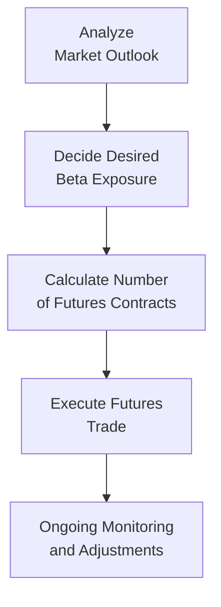

## Introduction
Sometimes, you’re managing an equity portfolio and you can’t help but feel a tad uneasy about potential downturns lurking around the corner. Trust me, I’ve been there, watching the markets swing wildly on the back of some unexpected central bank news! Luckily, derivatives can help hedge against downside risks (or other unwanted exposures) in a fairly streamlined way. They can also help you lock in a desired exposure level—whether you’re trying to dial down systematic risk, manage sector-specific volatility, or protect certain positions from large losses.

In this section, we’ll examine how equity portfolio managers use derivatives (such as futures, swaps, and options) to either partially or fully hedge their holdings. We’ll see how index futures allow you to temporarily neutralize beta exposure or ramp it up if that’s more in line with your strategy. We’ll also look at two common options-based strategies—protective puts and covered calls—and discuss their advantages, limitations, and cost considerations. 

Make sure to revisit Chapter 3 (“Systematic Versus Nonsystematic Risk” and “The Capital Asset Pricing Model”) and Chapter 6 (“Risk Management Framework and Governance”) if you’d like a refresher on the underlying risk concepts. Those sections detail how systematic risks are measured and how risk management structures guide our derivative usage.  

## Role of Derivatives in Equity Portfolio Hedging
Derivatives, despite often being labeled as “complex,” can be surprisingly accessible risk management tools. Here are the main reasons portfolio managers reach for derivatives:

• Adjust Portfolio Beta: Using index futures or total return swaps, managers can quickly increase or decrease the market (beta) exposure.  
• Protect Against Downside: With puts, you can insure your positions against substantial drops—similar to purchasing an insurance policy.  
• Generate Additional Income: By selling calls on existing equity positions (covered calls), you can collect premium income to enhance returns.  
• Hedge Specific Risks: Sector index futures, or single-stock options, let you hedge undesirable exposures to certain industries or individual holdings.  

### Common Derivative Instruments
1. Futures (Index or Single Stock)  
2. Options (Calls and Puts)  
3. Total Return Swaps (Equity Swaps)  

Futures and swaps are typically used to target or neutralize broad, systematic risks. Options, on the other hand, give you the chance to hedge directional risk in a more flexible manner—some might say they’re a bit more “surgical” in how they operate.

## Protective Puts for Downside Protection
A protective put is a go-to strategy when you own a stock (or a portfolio of stocks) and want to cap your downside losses. You basically buy put options that give you the right (but not the obligation) to sell your share(s) at the strike price. 

In other words:  
• If the stock’s price plummets below your strike price, the put gains value, offsetting your losses on the underlying stock.  
• If the stock’s price remains above or hovers around the strike price, the put may expire worthless, and your loss is limited to the cost of the premium you paid.  

Protective puts can be expensive over time, especially in volatile markets. So, a manager must carefully evaluate how many of the shares or which portion of the portfolio to protect, as well as the strike price and maturity date that best align with the portfolio’s risk tolerance.  

Let’s do a quick hypothetical example:

• You have a portfolio valued at $5,000,000 with a composition similar to an S&P 500-type index.  
• You buy protective put options on that index with a strike price of 5% below the current market level, paying a total premium of 1% of the portfolio’s value (i.e., $50,000).  

If the market heads downward by 10%, your protective puts may offset most of that 10% drop, effectively limiting your net loss to around 5%, minus the premium. But if the market doesn’t fall at all, you’ve spent $50,000 “unnecessarily.” That’s the trade-off—like paying insurance premiums on your house, hoping you’ll never need to file a claim.

## Covered Calls to Enhance Income
A covered call is another popular strategy. Here, you already own a stock (or portfolio). Then you sell a call option on the same stock (or a closely related index). This trade generates additional income (the premium), but you give up some upside if the stock’s price soars above the strike:
  
• Upside is capped: If the underlying price rises well above the strike, you could lose out on potential gains because you’ve effectively “sold” the upside beyond the strike price.  
• Premium collected: You instantly collect the premium. This can juice your returns if the market has smaller gains or even if it trades sideways.  
• Downside cushion: This premium can help offset minor losses if the stock price drops, though it won’t protect you from a full-blown crash the way a protective put might.

Covered calls work especially well in mildly bullish or neutral markets where you aren’t expecting massive upside surprises. This strategy is also used a lot by income-oriented portfolios looking for ways to earn additional yield.

## Hedging Market Exposure with Index Futures
Index futures markets are often the fastest, most straightforward method for hedging systematic (market-level) risk. Let’s say your portfolio is heavily exposed to a broad index, but you temporarily suspect significant market turbulence is afoot. With index futures, you can neutralize some (or all) of that exposure without selling individual securities outright. This is particularly useful if:

• You want to avoid transaction costs and taxes associated with selling the actual underlying shares.  
• You believe the market drop will be temporary and you want to stay invested for the long run.  
• You need a quick hedge in place but want the flexibility to remove it once volatility subsides.

### Adjusting Beta
Beta is the sensitivity of your portfolio’s returns relative to a benchmark index. If you suspect a downturn and prefer to keep a smaller exposure to market fluctuations, you can replicate a short position on the index using index futures. Conversely, if you’re underexposed and want to increase your portfolio’s beta, you can go long index futures.

The typical formula for adjusting beta with futures (from Chapter 3 references) looks like this:


\text{Number of contracts} = \frac{\beta_{p} \times V_{p}}{\beta_{f} \times \text{Futures Price} \times \text{Contract Multiplier}}


Where:  
• \\(\beta_{p}\\) is your current portfolio beta.  
• \\(V_{p}\\) is the total market value of your portfolio.  
• \\(\beta_{f}\\) is (usually) the beta of the futures contract relative to the same benchmark, often very close to 1.0 for major equity indexes.  
• \\(\text{Futures Price}\\) is the quoted price of the futures contract.  
• \\(\text{Contract Multiplier}\\) is the standard contract size (e.g., for some equity index futures, the multiplier might be 50 or 100).  

Adjusting \\(\beta_{p}\\) in the formula (for instance, to reduce it to zero or some lower level) helps you quickly determine how many contracts to short (or long) in order to hedge or scale up the portfolio’s overall market risk.

Below is a simple conceptual diagram illustrating the steps in deciding whether to hedge with futures:

## Basis Risk
Basis risk is the possibility that your hedge instrument (e.g., S&P 500 index futures) doesn’t move exactly in tandem with your actual portfolio (which might be a blend of mid-cap, small-cap, and international equities). If the correlation is imperfect, you might still experience gains or losses because the hedge doesn’t perfectly offset the underlying security price movements.

To minimize basis risk:  
• Use derivatives referencing indices or assets closely matching your portfolio’s composition.  
• Monitor correlation patterns over time—if correlations diverge, reevaluate your hedge.  
• Accept the reality that a perfect hedge might be costly or difficult to achieve, particularly for specialized or niche portfolios.

## Risk Management Considerations
### Setting Strike Prices, Maturities, and Position Sizing
Your choice of strike price for puts/calls (in the example of protective puts or covered calls) and the maturity date are integral to how much downside protection you get and how much premium you pay or collect. Option strike selection often reflects a balance between:

• How much loss you’re willing to tolerate.  
• What premium you can afford or want to earn.  
• Your short- vs. long-term market view.  

When picking maturities, some managers go for short-dated options, rolling them regularly (monthly or quarterly), while others prefer longer-dated options to reduce transaction costs. It’s all about risk tolerance and cost management.

### Rolling Derivative Positions
Hedges using futures and options need to be rolled over before they expire, especially if your hedging horizon extends beyond the contract’s expiration date. Rolling a position involves closing out the near-month contract and entering an equivalent position in a further-out contract. Keep an eye on:

• The “roll yield” or cost from differences between the old contract and the new contract’s pricing.  
• Liquidity in the new contract—the further out the expiry, the smaller the trading volume might be.  
• Any changes in market outlook—rolling time is a natural checkpoint for re-evaluating the hedge.

### Handling Margin Calls
When hedging with futures, initial margin and variation margin requirements can lead to margin calls. If the market moves against your hedge position, you may need to post additional collateral. True, the loss on the hedge might be offset by a gain in the underlying position (assuming a well-matched hedge), but you must have enough available cash or securities that can be quickly posted as collateral. Improper margin planning can worsen liquidity risk.

### Costs of Hedging
The cost of hedging can eat away at returns. Option premiums (for puts) are front-loaded, meaning you pay them right away, and if the market remains stable or rises, those premiums could be a drag. Even if you use futures or swaps, you incur transaction costs, bid-ask spread expenses, roll costs, and financing charges. Make sure to weigh these hedging costs against the benefit of risk reduction. In many cases, partial hedges—like a strategy that only protects a portion of the portfolio—can help keep costs more manageable.

## Measuring Hedging Success
We rarely see a perfect hedge in practice, but we can measure how effective our hedge is by looking at the difference in returns between the hedged portfolio and the theoretical goal. For instance, if you aimed to fully eliminate exposure to a particular index but your portfolio ended up with a small net gain or loss, the hedge was nearly successful. Larger unexpected gains or losses may arise if basis risk or miscalculated contract sizing played a role.

Some managers gauge hedging effectiveness by comparing the volatility (standard deviation) of an unhedged portfolio to that of a hedged portfolio. If the hedged portfolio’s volatility is significantly lower, that’s generally considered successful. In an exam or real-world scenario, always note the possibility that you’ve introduced new types of risk—such as liquidity or operational risk from the derivatives themselves.

## Practical Tips for Exam and Real-World Use
• Familiarize yourself with standard index futures contract specifications (Chapter 10 of this volume covers more about “Portfolio Overlays and Currency Management,” which often overlaps with similar derivative mechanics).  
• Double-check your correlation assumptions—especially for international or sector-specific portfolios.  
• Always monitor transaction costs, contract roll costs, and margin requirements.  
• For those who prefer options-based strategies, watch Chapter 5’s discussion of behavioral aspects. Investor sentiment can affect implied volatility (which influences option premiums).  

## Additional References
• Hull, J. (2022). “Options, Futures, and Other Derivatives.”  
• CME Group, “Equity Index Futures and Options,” available at:  
  https://www.cmegroup.com/markets/equities.html  

Consider also reviewing academic journals like The Journal of Derivatives and The Journal of Portfolio Management for more advanced articles on hedging techniques and practical, real-world case studies.

----------------------------------------------------------------------------------------------

## Test Your Knowledge: Hedging Equity Portfolios with Derivatives Quiz



### Which of the following best describes a protective put strategy for an equity portfolio?

- [ ] Selling a put option to limit losses.
- [ ] Buying a call option to generate premium income.
- [x] Buying a put option to insure against downside risk.
- [ ] Selling a call option to cap the portfolio’s upside.

> **Explanation:** A protective put involves purchasing a put option on an already-owned underlying asset, providing downside protection.

---

### What is one key drawback of repeatedly buying protective puts for hedging?

- [ ] Reduced portfolio liquidity.
- [x] Ongoing premium expenses over time.
- [ ] Loss of all portfolio upside potential.
- [ ] Additional margin requirements to post collateral.

> **Explanation:** Regularly buying protective puts can become expensive, as option premiums must be paid each time new puts are purchased or rolled.

---

### Which of the following best defines basis risk?

- [ ] The risk that a stock won’t track its benchmark if company fundamentals change.
- [x] The risk that a derivative’s price movement differs from the underlying portfolio’s movement.
- [ ] The risk that short-selling activity will place upward pressure on option premiums.
- [ ] The risk that implied volatility abruptly changes.

> **Explanation:** Basis risk arises when the hedge instrument (e.g., index futures) doesn’t perfectly correlate with the underlying securities in the portfolio, possibly leading to mismatched returns.

---

### A manager wants to reduce a portfolio's beta from 1.2 to 0.8 using index futures. Which of the following is correct?

- [x] The manager would short a certain number of index futures contracts.
- [ ] The manager would initiate an offsetting swap to increase beta.
- [ ] The manager would buy call options to lower volatility.
- [ ] The manager would buy put options that exceed current portfolio value.

> **Explanation:** To decrease beta, the manager sells (or short-sells) index futures. This offsets some of the portfolio’s exposure to market movements.

---

### In which environment is a covered call strategy usually considered most beneficial? (Select two)

- [x] A market expected to move sideways or modestly higher.
- [ ] A market that is highly volatile with large downward moves.
- [x] A stable market with lower levels of volatility.
- [ ] A rapidly rising market with unlimited upside potential.

> **Explanation:** Covered calls perform best in neutral to mildly bullish markets where the stock isn’t expected to skyrocket far above the strike price, because the upside potential is capped.

---

### Which of the following is a direct cost associated with an equity index future hedge?

- [x] Roll costs incurred when replacing expiring contracts.
- [ ] Credit risk premium embedded in the futures contract.
- [ ] Dividend withholding taxes on index futures.
- [ ] Capital gains tax paid on initial margin.

> **Explanation:** Rolling futures contracts can lead to small gains or losses due to differences in contract pricing, known as roll costs.

---

### A protective put strategy ensures that if the market falls below the option’s strike price:

- [x] The portfolio’s losses are limited.
- [ ] The portfolio gains unlimited upside.
- [x] The put option’s intrinsic value will rise.
- [ ] The investor must buy more shares of the underlying.

> **Explanation:** Protective puts provide downside insurance by increasing in value if the underlying asset’s price falls below the put strike. However, this doesn’t give unlimited upside benefit, and it doesn’t force the investor to buy more shares.

---

### When rolling futures contracts for a hedge, portfolio managers should be most concerned about:

- [x] Differences in the near-term versus longer-term futures prices.
- [ ] Elimination of margin requirements upon rolling.
- [x] Any shift in the correlation structure of the underlying to the future.
- [ ] The automatic exercise of the contract prior to expiration.

> **Explanation:** When rolling futures, managers analyze cost or benefit from differences in contract pricing (near vs. next month) and ensure the correlation assumptions still hold.

---

### Which of the following statements about margin calls in futures hedging is accurate?

- [x] Margin calls require additional collateral when the futures position has a loss.
- [ ] Margin calls reduce total portfolio risk.
- [ ] Margin calls are not required if the hedge is “perfectly correlated.”
- [ ] Margin calls only occur for long positions, not short positions.

> **Explanation:** If the futures position moves against you, you may need to post additional collateral, known as a margin call, regardless of correlation.

---

### Protective puts eliminate all downside risk. True or False?

- [ ] True
- [x] False

> **Explanation:** While protective puts limit (or reduce) downside risk substantially, you still pay the premium cost, and there could be small gaps between strikes, etc. They do not eliminate all potential losses in all scenarios.


