## Understanding Performance Attribution

Evaluating how a portfolio actually earned (or lost) its returns is a big deal in investment management. After all, we’d love to know whether a stellar equity fund manager is simply riding the wave of a booming sector or genuinely making savvy stock-picking decisions. Performance attribution is the tool we use to decompose portfolio returns into various components—like asset allocation, sector or style decisions, and security selection. This helps everyone (managers, clients, colleagues, boards) see exactly where (and how) value has been added or lost.

I remember early in my career—this was back when I was working at a boutique asset manager—I once got an urgent request from a client who noticed their quarterly performance surged way more than the overall market. They were thrilled. But, you know, you always gotta figure out the “why.” We discovered the portfolio had a healthy overweight to technology at just the right moment but also benefited from a few well-chosen small-cap growth names. The revelation was that half the outperformance came from the tactical sector overweight (which could’ve been pure luck, if we’re being honest) and the other half from skillful single-stock picks. By showing that breakdown, the client understood the strategy a lot better—and we felt more confident about replicating success in the future.

Anyway, in formal terms, we talk about performance attribution in three main ways:

• Asset Allocation (aka Allocation Effect): Did the decision to overweight or underweight certain sectors or styles (relative to a benchmark) add or detract?  
• Security Selection (aka Selection Effect): Once we decide where to invest, how effective are we at picking individual stocks?  
• Interaction Effect (sometimes combined with other measures): The interplay of allocation and selection decisions.  

It’s like baking a cake. Sure, the ingredients (sectors) must be chosen carefully, but your skill in mixing and adding special icing (actual stock picks within those sectors) also matters.

## The Brinson–Hood–Beebower (Brinson) Model

One of the most commonly referenced approaches in performance attribution is the Brinson–Hood–Beebower model, often just called the “Brinson model.” It popularized the idea that the main forces in portfolio performance can be separated into allocation and selection decisions—plus an interaction term. Here’s how it generally works:

1. You specify a benchmark, which includes a set of weights (wᵦ,ᵢ) for each sector (or style) i, as well as a benchmark return for each sector (rᵦ,ᵢ) and for the overall benchmark (rᵦ).  
2. You record the actual portfolio weights (wₚ,ᵢ) in each sector and their actual returns (rₚ,ᵢ).  
3. By comparing differences in weights and differences in returns, you attribute the portfolio’s excess return (relative to the benchmark) to allocation, selection, and interaction.

### A Quick Formulaic View

Using simpler notation, the Brinson model typically breaks down the portfolio’s excess return (E) as:

E = Σ [ (wₚ,ᵢ − wᵦ,ᵢ) × rᵦ,ᵢ ]  
  + Σ [ wᵦ,ᵢ × (rₚ,ᵢ − rᵦ,ᵢ) ]  
  + Σ [ (wₚ,ᵢ − wᵦ,ᵢ) × (rₚ,ᵢ − rᵦ,ᵢ) ]

…where each summation is over all sectors i. The first summation is the allocation effect, the second is the selection effect, and the third is the interaction effect. If you ignore the third term (which many practitioners do if it’s small or if they prefer a two-part breakdown), you effectively have a simpler view of performance. However, more detailed attribution can highlight how the combination of overweighting or underweighting plus good individual picks in that sector contributed to extra alpha (or negative alpha).

Below is a small Mermaid diagram showing how the Brinson model flows from the overarching benchmark to the breakdown of effects:

```mermaid
flowchart LR
    A["Overall Portfolio <br/>Return (rₚ)"] --> B["Benchmark Return (rᵦ)"]
    B["Benchmark Return (rᵦ)"] --> C["Allocation Effect"]
    B["Benchmark Return (rᵦ)"] --> D["Selection Effect"]
    B["Benchmark Return (rᵦ)"] --> E["Interaction Effect"]
    C["Allocation Effect"] --> F["Excess Return"]
    D["Selection Effect"] --> F["Excess Return"]
    E["Interaction Effect"] --> F["Excess Return"]
    F["Excess Return"] --> G["Portfolio Attribution <br/>Explanations"]
```

## Factor-Based Attribution

Sometimes, managers want to dive deeper than just “tech vs. consumer staples.” A factor-based approach attributes returns to recognized factors—like value, momentum, quality, size, or others. This approach is particularly relevant if you have factor-tilted strategies (e.g., a “value” manager who systematically targets stocks with low price-to-book ratios).

Factor-based attribution typically uses a factor exposure matrix to see which factors the portfolio (and the benchmark) are most sensitive to. For example, you might run a regression on daily or weekly returns, controlling for exposures to certain common factors:

rₚ − r𝑓 = α + β₁(Factor₁) + β₂(Factor₂) + ... + ε

If your empirically estimated alpha (α) is positive, it suggests the portfolio outperformed what you’d expect from those factor exposures. That outperformance is often considered “true stock-picking skill,” though watch out: factor definitions can be incomplete or too narrow, so the line between factor-based outperformance and security selection can get blurry.

## Time-Weighted vs. Money-Weighted Returns

Now, I’ll admit, there’s a bit of an “um, what’s the difference?” moment for many people here. It’s because performance measurement is one thing, but properly attributing is quite another.

• Time-Weighted Return (TWR): Measures the growth of a single unit of currency invested in the portfolio, neutralizing the impact of external cash inflows and outflows. This is the method generally favored under the Global Investment Performance Standards (GIPS) because it reflects the manager’s investment skill—cash flows, after all, often come from client decisions, not the manager’s.  

• Money-Weighted Return (MWR) or Internal Rate of Return (IRR): Measures the return considering the effect of cash inflows and outflows. It’s particularly relevant when the manager has discretion over timing of cash flows or if you want to see the actual “investor experience.” However, it can obscure the true effect of security selection and allocation, because large cash inflows or outflows can coincide with market fluctuations.

For performance attribution, you almost always see time-weighted returns used for each sub-period (once again, GIPS sort of insists on that consistency). That said, if you’re trying to measure a private equity fund’s performance, or an alternative investment with highly irregular cash flows, the money-weighted approach might be more relevant. Just keep the difference in mind.

## Data Gathering for Attribution Analysis

I can’t emphasize enough how data underpins the entire attribution process. If you get inaccurate weights, or the benchmark classification for a security is off, your entire performance breakdown becomes misleading. Some best practices include:

• Regularly updated security classifications (sector, style, region).  
• Precise weighting data—sometimes daily or even intraday if turnover is high.  
• Accurately measured benchmark performance, ideally at the same frequency as the portfolio.  
• Clean factor definitions and stable factor loadings if you’re doing factor-based attribution.  

It’s also helpful to have a robust data management system that automatically records trades and updates your holdings. And, of course, always double-check that your system’s classification schema matches your benchmark. If you classify a stock as large-cap value while the benchmark lumps it into mid-cap growth, you can get some weird results.

## Communicating Attribution Results

Ever show a client a complicated table with hundreds of lines broken down by micro-sector? It’s not always a crowd-pleaser. The real challenge is conveying the relevant insights in a concise, intuitive manner.

Typically, you’ll see attribution presented with a table like:

| Sector / Factor | Portfolio Weight | Benchmark Weight | Portfolio Return | Benchmark Return | Allocation Effect | Selection Effect | Interaction Effect |
|-----------------|------------------|------------------|------------------|------------------|--------------------|-------------------|---------------------|
| Tech            | 25%             | 20%             | 12%             | 10%             | +0.40%           | +0.40%          | +0.08%            |
| Utilities       | 5%              | 10%             | 2%              | 3%              | −0.10%           | −0.05%          | +0.00%            |
| ...             | ...             | ...             | ...             | ...             | ...              | ...             | ...               |
| Totals          | 100%            | 100%            |  –              | –               | +0.30%           | +0.25%          | +0.08%            |

Then you might summarize, “Overall, the portfolio had total outperformance of +0.63% over the benchmark, driven primarily by overweighting the technology sector and strong stock picks in healthcare.” The simpler the final story, the better. People want to know: “Did we beat the benchmark? If so, was it because of sector weighting, individual picks, or both?”

## Ongoing Use of Attribution and Process Refinement

One reason performance attribution is so darn practical is that it helps identify what’s working and what’s not. If you notice that your biggest alpha consistently comes from stock selection in small-caps, you might allocate more resources to that research. Or, if you’re discovering that your high turnover in certain styles repeatedly drags performance down, well, that’s a sign you might want to change the process or revise your risk controls.

Some managers use attribution results to guide their future factor exposures. For instance, if factor attribution indicates consistent negative returns from a momentum tilt, that might prompt them to reduce that tilt or drop it altogether. Performance attribution is most powerful as a feedback loop—helping you refine your approach over time rather than just as a quarterly compliance exercise.

## Linking Attribution to Risk Analysis

We’d all love a nice, pure alpha that arises from a manager’s brilliant skill in picking undervalued companies. But what if the portfolio’s “alpha” is just a disguised bet on a single factor (like small-cap or high-beta stocks) that soared in the last few months? That can be risky. A sudden reversal in that factor can wipe out gains.

Hence the synergy between performance attribution and risk analysis. You want to ensure that any alpha you’re taking credit for is robust and not purely the result of taking on unrecognized factor exposures or overweighting a sector that might be extremely volatile. In extreme market conditions, as we’ve seen in past crises (think back to 2008 or the 2020 COVID market crash), certain factors can flip in a heartbeat. A manager’s “alpha” can vanish if associated risk exposures aren’t carefully monitored.

## Putting It All Together

Performance attribution is more than just math. It’s a narrative about how you earned your returns and what that implies for future performance. When done right—complete with a consistent methodology (like Brinson), appropriate return calculation (time-weighted vs. money-weighted), accurate data, factor-based insights for deeper analysis, and clear communication—it can galvanize trust and refine your entire investment process. Conversely, if you misapply or oversimplify attribution, you may draw the wrong conclusions about your portfolio’s performance or the manager’s skill.

Below is another quick Mermaid diagram summarizing how factor-based attribution feeds into overall portfolio analysis:

## Glossary

• **Brinson Model**: A widely used performance attribution method to separate returns into allocation, selection, and interaction effects relative to a benchmark.  
• **GIPS (Global Investment Performance Standards)**: Industry guidelines created by CFA Institute that seek to ensure consistency and transparency in performance measurement and reporting.  
• **Time-Weighted Return (TWR)**: A return measure that removes the impact of external cash flows, reflecting the pure investment performance of the manager over time.  
• **Money-Weighted Return (MWR)**: Also called the internal rate of return (IRR). A performance measure influenced by the size and timing of external cash flows.  

## References

• Brinson, G. P., Hood, L. R., & Beebower, G. L. (1986). “Determinants of Portfolio Performance.”  
• CFA Institute, “Performance Evaluation and GIPS,” CFA Program Curriculum (2025).  

For deeper reading, you might also check out industry articles or academic research on advanced factor-based attribution—kind of a follow-up to the Brinson model. Additionally, reviewing vendor software documentation (e.g., FactSet, Bloomberg, or MSCI Barra) is a great way to see how real-world tools process data for day-to-day attribution.

## Test Your Knowledge: Equity Portfolio Performance Attribution



### Which of the following statements best describes the primary purpose of performance attribution?

- [x] It decomposes a portfolio’s return relative to a benchmark into allocation, selection, and interaction effects.
- [ ] It measures only the overall portfolio return compared with the risk-free rate.
- [ ] It isolates factor exposures to identify the optimal portfolio weights.
- [ ] It determines how market liquidity affects capital gains in each period.

> **Explanation:** Performance attribution focuses on explaining how a portfolio’s performance differs from a chosen benchmark by separating the impact of allocation and stock selection decisions (and possibly interaction).

### When applying the Brinson model, which effect measures the difference between the portfolio’s sector weights and the benchmark’s sector weights?

- [x] Allocation effect
- [ ] Selection effect
- [ ] Interaction effect
- [ ] Factor effect

> **Explanation:** The allocation effect captures how much over/underweighting certain sectors or segments contributes to overall excess returns.

### In a factor-based attribution approach, a manager’s “alpha” is typically considered to be:

- [ ] The total return of the portfolio minus the total return of the market index.
- [ ] The difference between the portfolio’s return and the benchmark return after considering investor cash flows.
- [x] The component of return that remains unexplained by tested factors (like value, momentum, etc.).
- [ ] The exposure to macroeconomic variables such as GDP growth and inflation.

> **Explanation:** Factor-based attribution analyzes how much of the portfolio’s performance can be explained by known factors. The leftover portion is generally termed alpha.

### Which return measure is generally preferred under GIPS for performance attribution?

- [ ] Money-Weighted Return (MWR)
- [x] Time-Weighted Return (TWR)
- [ ] Arbitrage Pricing Theory Return (APTR)
- [ ] Real Return Adjusted for Inflation (RRAI)

> **Explanation:** GIPS advocates time-weighted returns for consistency, as it removes the distortion of external cash flows controlled by investors rather than the manager.

### Which of the following best describes the interaction effect in the Brinson model?

- [x] The combination of overweight/underweight decisions and specific security selection within those overweight or underweight sectors.
- [ ] The difference between the portfolio’s overall performance and its factor exposures.
- [ ] The effect of benchmark rebalancing on the portfolio.
- [ ] The difference between TWR and MWR calculations.

> **Explanation:** In the Brinson framework, the interaction effect specifically accounts for how allocation and selection decisions overlap in the same segments.

### If a manager wants to show how a large cash inflow mid-month impacted performance, which measure might be more informative?

- [ ] Time-Weighted Return (TWR)
- [x] Money-Weighted Return (MWR)
- [ ] Excess Return Above Benchmark (ERAB)
- [ ] Geometric Mean Return (GMR)

> **Explanation:** The money-weighted metric, or IRR, accounts for the size and timing of cash flows, showing how those flows contributed to the investor’s actual experience.

### Which data issue is most likely to distort attribution results?

- [x] Misclassification of stocks into incorrect sectors or style buckets.
- [ ] Using daily instead of monthly data for performance calculations.
- [ ] Excluding dividends from total returns.
- [ ] Using time-weighted returns rather than money-weighted returns.

> **Explanation:** Misclassification can significantly skew attribution. Proper classification ensures that the right portion of returns is attributed to each segment.

### How could an investor use attribution results to improve future performance?

- [x] Identify consistent alpha sources (e.g., certain sectors) and adjust the strategy accordingly.
- [ ] Eliminate all factor exposures to maximize pure alpha.
- [ ] Base future allocations solely on the prior quarter’s highest performing sector.
- [ ] Replace time-weighted returns with price returns.

> **Explanation:** By analyzing which strategies or exposures have historically added value, the investor can refine and adjust their approach to enhance future performance.

### In extreme market conditions, performance attribution can reveal:

- [x] Whether outperformance is largely due to unstated factor bets that could reverse quickly.
- [ ] How to guarantee positive returns by shorting high-volatility sectors.
- [ ] The single best hedge for any black swan event.
- [ ] That allocation effects are always more important than selection effects.

> **Explanation:** In volatile markets, hidden factor bets might significantly impact performance. Attribution helps identify if a manager’s outperformance is from a systematic tilt that could swing the other way.

### Performance attribution and risk analysis:

- [x] Should be used together, because factor exposures or sector tilts uncovered by attribution can inform risk monitoring.
- [ ] Are entirely separate disciplines that do not overlap.
- [ ] Are only relevant for fixed-income portfolios.
- [ ] Must rely exclusively on money-weighted returns.

> **Explanation:** Attribution shows where returns come from, and risk analysis examines the potential downside when those exposures move adversely. Combining both yields a fuller picture of the portfolio’s risk–return profile.


