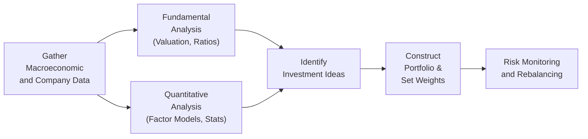

## Introduction
Equity investing is full of choices, right? You might be chatting with a friend or reading a random blog post and hear about “value picks” or “momentum signals.” At the heart of these discussions are two major camps: fundamental analysts and quantitative analysts. Both strive to pick winners (or avoid losers) in the stock market, but they take surprisingly different routes. This section aims to unpack how these two approaches work, where they shine, and how they can sometimes blend to form powerful hybrid strategies.

In my early days (well, a few years ago), I spent countless hours poring over company statements, building DCF models, and looking for bargains. Then I met a self-proclaimed quant wizard who seemed to rely on magical formulas and enormous data sets. I remember thinking, “There’s no way some algorithm can beat me reading all these 10-Ks!” Over time, I realized each method can be compelling—depending on the market environment and the resources you have. Let’s explore why.

## Key Differences Between Fundamental and Quantitative Analysis
Fundamental analysis focuses on the deeper, often qualitative aspects of a company’s intrinsic worth. Quantitative analysis focuses more on patterns, numbers, historical data, and mathematical models. While fundamental practitioners spend a lot of time reading footnotes in annual reports, quantitative pros might be perfecting a multi-factor regression strategy or an algorithm that buys stocks with certain risk-factor exposures.

From a big-picture perspective:
• Fundamental: In-depth study of a firm’s financials, competitive environment, and macro trends.  
• Quantitative: Statistical or algorithmic rules driven by data to identify price inefficiencies and patterns.  

The choice between them isn’t necessarily an either-or proposition. Many asset managers combine both to tackle the market from multiple angles.

## The Fundamental Analysis Process
Fundamental analysis is grounded in the idea that each stock has an intrinsic value, and by comparing that intrinsic value to its current market price, you can find undervalued or overvalued stocks. While the process can vary widely among analysts, it generally includes:

### Industry and Economic Analysis
Fundamental research often starts with a top-down or bottom-up perspective.  
• Top-down analysts will first assess the broader economy—interest rates, employment trends, GDP growth—then narrow down to industries poised for growth or resilience.  
• Bottom-up analysts home in on individual companies with promising fundamentals, and only then do they consider the broader macroeconomic constraints.  

Let’s say a fundamental analyst is investigating a biotech firm. They’d review the growth prospects of the biotech industry, the regulatory environment for drug approvals, and, maybe, the demographics that could support higher demand for innovative therapies.

### Company-Specific Research
After the macro or industry setup, the analysis moves to the firm itself:
• Examining financial statements.  
• Assessing management quality and corporate governance.  
• Delving into competitive advantages like brand strength, intellectual property, or cost leadership.  

Typically, an analyst might look at common ratios—like the current ratio to gauge short-term liquidity, the debt-to-equity ratio to understand the capital structure, and return on equity (ROE) to measure profitability relative to shareholders’ equity.  

### Ratio Analysis
Ratio analysis features heavily in fundamental research. It’s essentially about squeezing information out of financial statements:
• Liquidity ratios (current ratio, quick ratio).  
• Profitability ratios (net margin, ROE, ROA).  
• Valuation ratios (P/E, P/B, EV/EBITDA).  

However, these must be compared against industry norms or against different time periods for the same firm to spot trends in profitability or capital structure changes.

### Cash Flow Modeling and Valuation Methods
One hallmark of fundamental analysis is the Discounted Cash Flow (DCF) model. Here, we estimate a company’s future free cash flows and then discount them back to present value using an appropriate discount rate. That discount rate typically reflects the firm’s weighted average cost of capital (WACC).

In mathematical terms, a DCF model might look like:


\text{Value of Firm} = \sum_{t=1}^{n} \frac{CF_t}{(1 + r)^t} + \frac{\text{Terminal Value}}{(1 + r)^n}


Where:  
• \\( CF_t \\) is the free cash flow at time t.  
• \\( r \\) is the discount rate (often WACC).  
• Terminal Value measures the beyond-forecast horizon value.

If the DCF-derived intrinsic value is well above the current market price, it’s potentially undervalued. Another standard approach is using multiples—like comparing a company’s P/E ratio to industry benchmarks.

### Strengths of Fundamental Analysis
• Useful in less efficient markets, where thorough research can uncover hidden gems.  
• Allows qualitative judgments (like management capability or intangible advantages).  
• Helpful in long-term buy-and-hold strategies where short-term price movements are less critical.

## The Quantitative Analysis Process
Quantitative analysis revolves around large data sets, statistical models, and algorithmic signals. The core assumption is that patterns in historical data can be used to predict future returns—although that assumption can be tricky if markets shift quickly.

### Data Collection and Cleansing
One of the first steps (and sometimes the most tedious) is collecting the right data. This includes:
• Price and volume data for relevant stocks.  
• Economic indicators and market sentiment indices.  
• Fundamental data that can be fed into factor models.  

Data quality is paramount. A single data error, such as an incorrect historical price or misreported earnings figure, can throw off an entire regression or lead to spurious signals. That’s why data scrubbing and checks for outliers or anomalies are absolutely crucial.

### Factor Models and Multi-Factor Regressions
Quantitative strategies often revolve around exploiting factor premiums. Factors like size, value, momentum, quality, or low volatility are well-known from academic research.  
• A factor model might break down a stock’s returns as a function of these systematic factors.  
• Multi-factor regression can help isolate how each factor contributes.  

For instance, you could regress stock returns on factor returns:


R_{i,t} = \alpha_i + \beta_{i,Size} \times \text{Factor}_{Size} + \beta_{i,Value} \times \text{Factor}_{Value} + \beta_{i,Momentum} \times \text{Factor}_{Momentum} + \ldots + \epsilon_{i,t}


If a certain factor consistently shows a positive and statistically significant coefficient, that might suggest a quant strategy focusing on that factor.

### Rule-Based and Algorithmic Models
Higher-frequency quants use real-time data and automated execution to capitalize on micro inefficiencies. Lower-frequency (monthly or quarterly rebalancing) quants might systematically rank stocks by expected risk-adjusted returns and rotate into top-decile names.

Quantitative analysts often backtest these rules against historical data, searching for persistent patterns. But watch out—there’s a big risk of overfitting, where a strategy looks brilliant in your backtest but flops in real markets.

### Strengths of Quantitative Analysis
• Excellent at sifting through large piles of data quickly.  
• Objective and disciplined—less prone to emotional biases that plague humans.  
• Adapts well to systematic rebalancing and can handle high-frequency trading better.

## Data Quality and Cleansing
No matter how superb your model is, “garbage in, garbage out” still applies. Data cleansing is non-negotiable.  
• Remove or investigate outliers.  
• Adjust for corporate actions (stock splits, dividends, special dividends).  
• Account for survivorship bias (include delisted or merged firms in historical data).  
• Stay wary of “look-ahead bias”—where you accidentally incorporate data that wasn’t available at the time an investment decision would have been made.

I recall a situation where an intern used future financial statements in a backtest by accident. Sure enough, that strategy performed wondrously in simulation, but it was pure fantasy.

## When Fundamental Analysis May Outperform
There are periods and market segments that are comparatively inefficient—perhaps small-cap stocks in an emerging market or specialized industries where intangible assets matter a lot. The advantage of fundamental analysis is the flexibility of human judgment. If a firm’s CEO is on the verge of a major shift in corporate strategy or if intangible brand value is high, fundamentals might capture nuances that a purely numerical model overlooks.

In uncertain or illiquid markets, carefully done research can reveal value that might not show up in the data. Think about “story stocks” where the potential for dramatic transformations can outpace purely historical patterns. That’s where fundamental intuition can shine.

## When Quantitative Analysis Might Excel
Quantitative methods may outperform in broad, liquid markets with massive data sets—like large-cap U.S. equities—where patterns or factor exposures are typically more consistent. Automated, rule-based systems can also stand out in the short term. High-frequency trading is practically unthinkable without quant-based strategies.

With big data sets, you can tease out subtle relationships. For instance, a quant strategy might notice that a basket of stocks with rising analyst revisions and strong recent price momentum has historically outperformed. You can systematically exploit that insight.

## Portfolio Construction and Risk Management
Both fundamental and quant approaches ultimately funnel into portfolio construction. The difference often lies in how they set and manage weights:

• In a fundamental portfolio, the analyst might weigh stocks based on confidence in the valuation gap or growth potential. If you feel strongly about a telecom giant’s ability to disrupt 5G markets, you might give it a higher stake.  
• In a quant portfolio, weights are typically determined by some optimization technique. You might maximize your expected risk-adjusted return subject to constraints like tracking error or sector exposures.  

### Monitoring Risk
Regardless of the approach, robust risk management is key. Fundamental managers might track fundamental risk metrics—like concentration risk in a particular business model, or an overdependence on one commodity. Quantitative managers usually lean on beta calculations, factor exposures, or Value at Risk (VaR) measures to ensure the portfolio doesn’t stray too far from risk tolerances.

## The Role of Qualitative Overlays
Even in a purely quantitative shop, it’s do-or-die to have some human oversight. A quant model might signal a big buy in a regional airline stock, but if you know the company is dealing with imminent bankruptcy or a major scandal, you might override that decision. There are times when news flows or a shift in regulation simply isn’t fully captured in historical data. A flexible overlay can help hedge against the blind spots of algorithms.

## Common Pitfalls
It’s easy to get tangled in the complexities of either approach:

• Overfitting: Building a model so perfectly tailored to historical data that it fails to generalize in live markets.  
• Look-Ahead Bias: Using info in your backtests that would never have been available in real-time.  
• Model Drift: Relying on a model built for a market environment that has changed dramatically.  
• Neglecting Revisions: Overconfidence in a DCF analysis that fails to update assumptions as new risk factors emerge.

Humans can fall in love with a stock story or rely too heavily on stale data. Meanwhile, quants can miss the forest for the trees by focusing on the numbers but ignoring major catalysts or intangible changes in the marketplace.

## Best Practices for Implementation
• Maintain robust data validation processes.  
• Revisit assumptions frequently—both in DCF or ratio analysis for fundamental, and factor exposure or correlation structures for quant.  
• If you’re a fundamental manager, consider using some factor-based screens to generate a shortlist of interesting names.  
• If you’re a quant manager, keep an eye on fundamental or news-driven catalysts that could upend your signals.  
• Diversify. Both fundamental and quant managers can benefit from ensuring the portfolio isn’t hinging on a single big bet or factor theme.

## Illustrative Mermaid Diagram
Below is a simplified flowchart illustrating both approaches uniting in a combined process:

## Concluding Thoughts
It might sound as if you have to pick a camp—fundamental or quant—and stay there forever. But the more I learned, the more I realized that a blend is often the sweet spot. Quantitative screens can generate potential “value” or “growth” leads that fundamental analysts can then investigate in depth. Or vice versa, fundamental analysts can store their insights in a systematic tool that acts as a partial quant screen.

While each approach has its own set of strengths, the ultimate success in equity investing often hinges on adaptability, rigorous research, and vigilant risk management. Whether you’re rummaging through footnotes or crunching reams of high-frequency data, the goal is to find that elusive edge—and keep it.

## Glossary
• Discounted Cash Flow (DCF): A valuation method that calculates the present value of future cash flows to estimate a company’s intrinsic value.  
• Look-Ahead Bias: The error of using information in a simulation or backtest that wouldn’t have been available at the time.  
• Overfitting: A modeling error that tailors so closely to historical data that it doesn’t work in real-life scenarios.  
• Factor Regression: A statistical method used to decompose stock returns into individual factor exposures (like value, momentum, or size).

## References
• Damodaran, A. (2012). “Investment Valuation.”  
• Grinold, R., & Kahn, R. (2000). “Active Portfolio Management.”  
• CFA Institute, “Quantitative Methods,” CFA Program Curriculum (2025).

## Practical Exam Tips
• On the CFA exam, you might see a scenario where you must evaluate whether fundamental or quant approaches fit an investor’s objectives and constraints. Demonstrating knowledge of both is key.  
• Be prepared for item-set questions that show partial financial statements or factor returns, then ask you to compare a fundamental-based weighting versus a quant-based weighting.  
• Watch for common pitfalls: exam questions often revolve around data snafus (e.g., look-ahead bias) or modeling errors (e.g., overfitting).  
• Convey the ability to integrate both methods. Don’t assume it’s strictly either fundamental or quant. The CFA Institute loves questions on multi-step processes that combine complementary techniques.  

## Test Your Knowledge: Fundamental vs. Quantitative Strategies



### Which best describes the focus of fundamental analysis?

- [x] Evaluating financial statements, competitive positioning, and the intrinsic value of companies.
- [ ] Developing algorithmic trading models based on historical price data.
- [ ] Stress-testing short-term signals in high-frequency trading scenarios.
- [ ] Using primarily correlation-based factors to rank investment opportunities.

> **Explanation:** Fundamental analysis is all about studying company-level information, such as financial statements, management quality, and growth drivers, to determine a stock's intrinsic worth.

### What is often the first step for a quantitative analyst?

- [ ] Performing a deep-dive interview with the company’s CEO.
- [x] Gathering and cleansing large historic and current data sets.
- [ ] Engaging in top-down macroeconomic analysis and reading industry white papers.
- [ ] Conducting a qualitative assessment of a firm’s corporate governance.

> **Explanation:** Quantitative analysis starts with data, data, and more data. Before building any model, quants ensure the information is properly collected and cleaned.

### In a DCF model, which piece of information is discounted to determine intrinsic valuation?

- [ ] Earnings Before Interest and Taxes (EBIT) over a 5-year period.
- [ ] Operating margin over next quarter.
- [ ] Dividend payout ratios for the next 10 years only.
- [x] Expected free cash flows, discounted by an appropriate cost of capital.

> **Explanation:** The hallmark of DCF is discounting future free cash flows (including terminal value) back to present value using a discount rate that typically reflects the weighted average cost of capital.

### Which of the following describes a potential advantage of fundamental analysis?

- [x] It provides flexibility to include qualitative insights such as management quality or brand equity.
- [ ] It completely removes human biases from the decision-making process.
- [ ] It relies solely on big data to discover persistent market anomalies.
- [ ] It is best suited only for short-term trading.

> **Explanation:** A key benefit of fundamental research is incorporating intangible or qualitative aspects that might not show up in purely numeric data.

### Which factor is typically used in multi-factor regression models among quantitative analysts?

- [x] Style factors like value, size, or momentum.
- [ ] Company press releases regarding new product launches.
- [x] Quality metrics such as profitability or stable earnings growth.
- [ ] Total daily news coverage per stock on social media.

> **Explanation:** Quant models often use style or risk factors, such as value, size, momentum, and quality, to explain why certain stocks might have outperformed historically. News coverage is sometimes used, but style factors are the more textbook example.

### Why is look-ahead bias problematic in backtesting?

- [x] It uses future information that wouldn’t have been available at the time, leading to overly optimistic and unrealistic performance.
- [ ] It relays short-term signals that are easily interpretable in real-time.
- [ ] It focuses primarily on discount rates that vary over time.
- [ ] It obviates the need for historical data cleaning.

> **Explanation:** Look-ahead bias inflates backtest results because you’re in effect reading tomorrow’s news today—an impossible scenario when actually trading.

### Which scenario is more likely to favor a purely fundamental approach over a purely quantitative one?

- [x] A niche emerging market with limited data and frequently changing company fundamentals.
- [ ] A large developed market with decades of reliable, deep market data for thousands of stocks.
- [x] An industry where intangible asset valuation (e.g., brand value) is crucial and not easily captured by standard factors.
- [ ] A high-frequency trading environment reading microsecond-level price changes.

> **Explanation:** When data is sparse or when intangible factors matter heavily, fundamental analysis typically does a better job by relying on human judgment and nuanced understanding.

### What is the main downside of overfitting in a quantitative model?

- [x] It performs brilliantly on historical data but fails to generalize in live or out-of-sample testing.
- [ ] It is completely free of random noise.
- [ ] It ensures that overshadowed stocks are always included in the portfolio.
- [ ] It helps the strategy adapt to immediate changes in market structure.

> **Explanation:** Overfitting leads to a model that looks “perfect” historically but doesn’t hold up when conditions shift away from the sample used to design it.

### Why might a qualitative overlay still be used in a quantitative investment strategy?

- [x] To account for unique events or developments that are difficult to capture using numeric data alone.
- [ ] To eliminate all systematic factor exposures and rely solely on data analytics.
- [ ] To ensure that risk exposures are purely based on fundamental analysis only.
- [ ] To automatically eliminate fundamental analysis from the process.

> **Explanation:** A qualitative overlay helps incorporate insights that data-driven models may not capture—like sudden regulatory changes, lawsuits, or leadership changes.

### True or False: A single data error in quantitative methods can sometimes distort the entire model’s signals.

- [x] True
- [ ] False

> **Explanation:** With quant strategies so heavily reliant on data integrity, even small errors in the dataset (e.g., an incorrect stock price or corporate action) can create inaccurate signals and flawed trading decisions.


