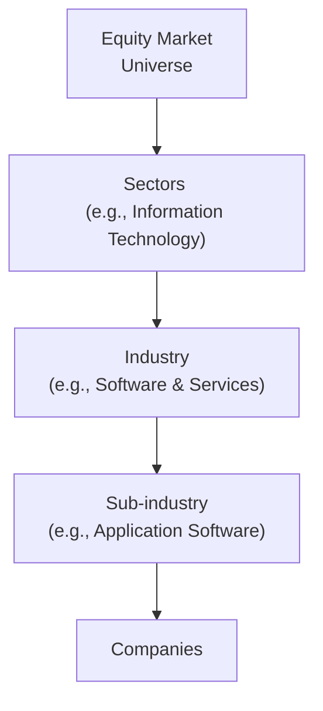

## Introduction

When building equity portfolios, many investors use sector and style classifications to organize their holdings and tailor risk exposures. Sectors help us group companies by economic activity, while style classifications (e.g., growth, value, or blend) reflect fundamental characteristics like valuation and earnings momentum. The result? A structured way to estimate how stocks might behave under different market or macroeconomic conditions.  

You might recall a lively conversation I once had with a friend who managed an equity fund. She mentioned how, in certain market environments, overweighting cyclical sectors made her portfolio highly sensitive to GDP trends, whereas adopting a defensive tilt helped weather unexpected downturns. The big question, of course, was balancing that approach across growth and value styles, each with its own set of risks.  

Below, we’ll take a deeper look at the role of sector classifications, explore the main equity styles, and, most importantly, demonstrate how these classifications come together in real-world portfolio construction.

## Sector Classification Systems

Sector classification systems are frameworks that group companies based on their primary lines of business. Two prominent systems are the Global Industry Classification Standard (GICS) and the Industry Classification Benchmark (ICB). Both aim to give investors a consistent “map” of the equity landscape, allowing for easy sector comparisons across countries and time periods.

• GICS (Global Industry Classification Standard)  
Developed by MSCI and S&P, GICS organizes equities into sectors, industry groups, industries, and sub-industries. It uses a bottom-up approach that assigns each company to a single category based on revenue sources. Investors reference major sectors such as Information Technology, Financials, Energy, Consumer Discretionary, Consumer Staples, Industrials, Healthcare, Utilities, Real Estate, Materials, Communication Services, and so on.

• ICB (Industry Classification Benchmark)  
ICB is another widely used classification framework. It categorizes companies into industries, supersectors, sectors, and subsectors, with a structure broadly comparable to GICS. While the naming conventions differ at times (e.g., ICB might separate Telecommunications from Technology more distinctly), the overall concept is similar.

Let’s visualize a simplified segment of GICS with a Mermaid diagram:

In practice, an equity index provider will state how many companies from each sector appear in a benchmark, such as the S&P 500. This data makes it easier for managers to decide whether to overweight or underweight specific sectors.

## Major Equity Styles: Growth, Value, and Blend

Investors often categorize stocks according to style. Three common style buckets are growth, value, and blend. You might think of investing “styles” as different ways to see the market: some favor cheap valuations, some favor high growth rates, and others sit squarely in the middle.

### Growth Investing
Growth investors look for companies generating—or expected to generate—revenue and earnings growth at above-average rates. This approach often involves focusing on:

• High earnings growth projections  
• Expanding revenue trends  
• High price-to-earnings (P/E) and price-to-book (P/B) ratios (due to strong future expectations)  

Anecdotally, I recall sitting in a meeting where a growth-focused manager exclaimed, “I’m okay paying 40 times earnings if I’m confident those earnings will triple in five years.” That statement highlights the typical growth approach: a willingness to pay more for anticipated robust growth.

### Value Investing
Value investors seek stocks that appear undervalued by the market. The idea is to buy shares at a discount to their intrinsic worth, hoping the price eventually converges to fair value. Typical value metrics include:

• Low P/E ratio  
• Low P/B ratio  
• High dividend yield (sometimes)  

Often, these companies operate in more mature or cyclical industries. They may have slower growth profiles, but the valuation is considered attractive relative to fundamentals.

### Blend (or Core) Investing
A blend (or core) approach mixes characteristics of both growth and value. Instead of emphasizing one extreme, blend investors hold stocks with moderate growth prospects and relatively fair valuations. Many broad market index funds are considered “blend,” as they combine companies of various styles.

Below is a simple Mermaid diagram of a common style box concept:

In reality, you often see a 3×3 “style box” that breaks out categories by size (Large, Mid, Small) on one axis and style (Value, Blend, Growth) on the other.  

## Macroeconomic Factors Affecting Sectors and Styles

One reason analysts pay so much attention to sectors and styles is that macroeconomic forces can affect some groups quite differently from others:

• Interest Rates: Rising interest rates often hurt sectors or companies with higher debt loads. Financials might benefit from a steeper yield curve, while real estate can struggle if property financing costs spike. Growth stocks with long-dated cash flows can also feel pressured when discount rates increase.  

• GDP Growth: When GDP is expanding, cyclical sectors like Industrials, Consumer Discretionary, and Materials often outperform. On the flip side, if GDP falters, defensive sectors (e.g., Consumer Staples, Health Care, Utilities) tend to hold up better.  

• Inflation: High inflation can erode margins for companies that cannot pass rising costs to consumers. Materials and Energy stocks sometimes benefit if commodity prices rise, while growth-oriented tech companies might see a decline in relative valuations if inflation pushes interest rates upward.  

Understanding these linkages is essential. Historically, growth strategies have thrived during periods of stable or declining interest rates, while value strategies often find favor when rates rise or when cyclical recoveries are in full swing.

## Constructing Sector-Based Portfolios

Sector-based portfolios are often a product of both top-down and bottom-up approaches:

• Top-Down: Analyzing macro trends, forecasting interest rate directions, and assessing political changes can guide broad sector over/underweights. Suppose you have a strong view that global demand for semiconductors will skyrocket. You might overweight the Information Technology sector accordingly.

• Bottom-Up: Within the chosen sector, you then pick individual companies that align with your investment criteria—whether value, growth, or a mix.

Sometimes, managers build entire funds around a sector. Thematic funds focus on big-picture drivers (e.g., clean energy, biotech, cloud computing). Another approach is sector rotation, where the manager times overweight and underweight positions in different sectors based on where we are in the business cycle.

### Overweighting vs. Underweighting
Say you have a benchmark allocation of 15% in the Energy sector, but your macro view suggests oil prices will remain depressed. If you decide to hold only 10% in the Energy sector, you are 5% underweight relative to your benchmark. Conversely, if you think consumer demand is about to boom, you might go overweight the Consumer Discretionary sector.  

Practically speaking, these relative bets can be magnified or hedged by derivatives, such as sector index futures or options, allowing for more tactical adjustments without fully redistributing underlying holdings.

## Style Drift: The Unintended Shift

Sometimes, your portfolio style classification can change over time without your explicit intent. This phenomenon is called style drift. For instance, you set out to build a “value” portfolio focusing on low P/B stocks in cyclical sectors. Over the next couple years, as macro conditions evolve, some of those “cheap” stocks morph into high-growth momentum champions. Now your originally “value” tilt looks suspiciously closer to blend or even growth.

Such a shift can be subtle. It might happen because you left big winners in the portfolio too long, or simply because the business fundamentals changed dramatically. Monitoring your portfolio’s style exposure helps maintain consistency with your stated strategy. Tools like the Morningstar Style Box or internal style factor reports can help track these shifts in real time.

## Sector and Style as Part of the Bigger Factor Puzzle

Sector and style allocations tie in closely with factor investing. Factors such as size (small vs. large cap), value (low valuation vs. high valuation), quality, and momentum can run across sectors. It is entirely possible to have a “value” tilt in the Technology sector or a “growth” tilt in Consumer Staples. By combining sector and style analyses, you might unearth more precise exposures. For instance, you can refine the notion of “value” by focusing on companies with low valuations in cyclical or defensive sectors, or you can combine a growth tilt with a bet on innovative tech.  

Often, institutional investors have an overall factor (or risk) budget and then use sector allocations to express macro views. For example, they might say, “We want a moderate tilt toward growth stocks, but also maintain a slight overweight in defensive sectors to protect against a potential downturn.”  

## Cyclical vs. Defensive Sectors

In any conversation about sector allocation, cyclical vs. defensive is a huge topic. Why? Because the business cycle heavily influences returns.

• Cyclical Sectors: Industrials, Consumer Discretionary, Materials, and sometimes Financials or Information Technology, depending on current trends. These sectors often rise more than average when the economy is strong and fall more sharply when it contracts.  

• Defensive Sectors: Utilities, Consumer Staples, and Health Care typically produce more stable cash flows regardless of economic fluctuations. They tend to be less sensitive to short-term changes in consumer sentiment.  

### Sector Rotation Strategy
One popular approach, known as sector rotation, seeks to align sector exposures with phases of the business cycle:

• Early Expansion: Overweight cyclicals (Consumer Discretionary, Industrials)  
• Mid-Cycle: Watch for signs of a shift to more balanced exposures  
• Late Expansion: Consider rotating into defensive sectors in anticipation of a downturn  
• Recession: Historically, defensive sectors, such as Consumer Staples and Utilities, can provide relative shelter  

Of course, markets rarely move in a predictable, linear fashion, so this strategy demands ongoing macro assessment.  

## Using Historical Performance Patterns

Historical performance data can help in two ways. First, it provides an understanding of which sectors typically flourish under certain macro conditions (rising rates, inflationary shocks, etc.). Second, analyzing style performance over multiple cycles can reveal how growth vs. value leadership shifts over time.  

However, any analysis of historical patterns must account for risk controls. Concentrating too heavily in a single sector can be dangerous—think 1990s tech bubble or the Financials meltdown during the 2008 crisis. Consistent monitoring of sector and style weights helps ensure you don’t quietly wind up with, say, a 40% exposure to a single cyclical theme when the economy is teetering.

## Best Practices, Pitfalls, and Practical Tips

• Best Practices:  
  – Use a recognized classification system (GICS, ICB) to maintain clarity.  
  – Regularly measure your portfolio’s style exposures using standardized frameworks (e.g., Morningstar Style Box).  
  – Perform stress tests to see how your sector over/underweights behave in bull, bear, and neutral markets.  
  – Keep an eye on macro fundamentals, especially interest rates and GDP growth trends.  

• Common Pitfalls:  
  – Overconcentration in a popular sector during a bubble.  
  – Style drift that unintentionally alters the portfolio’s risk/return profile.  
  – Blindly rotating sectors according to a fixed model without adjusting for real-time macro signals.  
  – Failing to reconcile sector bets with factor exposures, leading to unintended risk layering.  

• Practical Tips:  
  – Rebalance periodically to maintain target sector and style weights—especially after big market moves.  
  – Monitor valuations in each sector, as style shifts can also occur at the sector level.  
  – Combine sector analysis with fundamental research to uncover alpha opportunities rather than relying on top-down alone.  

## Conclusion and Exam Tips

Sector and style allocations lie at the heart of many equity strategies. They offer a structured framework for analyzing where risks and opportunities might lie, whether that’s investing in high-growth technologies or undervalued cyclical plays. You can add a tactical overlay by rotating exposures as macro conditions evolve, but beware of style drift and unintended factor exposures.  

From an exam standpoint, remember to demonstrate how these classifications tie into broader portfolio management concepts like diversification, the capital market line, and risk-adjusted return measures. You might see a question asking you to identify and justify an overweight in a particular sector given inflation forecasts. Another prompt might have you evaluate how a portfolio’s style drift could distort the investor’s stated risk tolerance. Practice linking macro scenarios, sector selection, and style outcomes together in a concise, methodical way.

## Glossary

• GICS (Global Industry Classification Standard): A standardized industry taxonomy used widely in equity markets, dividing equities into sectors, industry groups, industries, and sub-industries.  
• Value Investing: An approach focusing on undervalued stocks based on fundamental metrics (e.g., low P/E, low P/B).  
• Growth Investing: A strategy targeting companies expected to achieve above-average revenue or earnings growth.  
• Style Drift: The unintentional shift of a portfolio’s style characteristics—e.g., from value to blend or growth—over time or due to market forces.  

## References for Further Exploration

• Morningstar Style Box Methodology:  
  https://www.morningstar.com/content/  
• MSCI & S&P GICS Classification Guides:  
  https://www.msci.com/gics  

• Additional Reading:  
  – “Equity Management: The Art and Science of Modern Quantitative Investing” by Bruce Jacobs and Ken Levy  
  – “The Intelligent Investor” by Benjamin Graham (classic text on value investing)  

--------------------------------------------------------------------------------

## Mastering Sector and Style Allocations in Equity Portfolios: 10 Sample Exam Questions



### Which of the following statements best describes the purpose of a sector classification system like GICS?

- [ ] It aims to classify companies by size (market cap) only.
- [x] It groups companies based on primary business activities into sectors and industries.
- [ ] It classifies companies solely by geographic region.
- [ ] It evaluates companies by investment style, such as growth or value.

> **Explanation:** GICS focuses on grouping companies by their business activities into sectors and further subdivisions, making it easier to analyze and compare how each sector behaves.

### Which metric is commonly associated with identifying value stocks?

- [x] Price-to-book (P/B) ratio
- [ ] Earnings per share (EPS) growth
- [ ] Volatility measures (like beta)
- [ ] Sales growth rate

> **Explanation:** Value investors typically look for undervalued companies, often indicated by a low P/B ratio.

### Which sector is generally considered defensive?

- [x] Consumer Staples
- [ ] Information Technology
- [ ] Materials
- [ ] Consumer Discretionary

> **Explanation:** Defensive sectors (Consumer Staples, Health Care, Utilities) usually have stable revenues regardless of economic upswings or downturns.

### Suppose a manager believes the economy is entering a late expansion phase. What sector tilt might they adopt to reduce downside risk?

- [ ] Overweight cyclical sectors such as Industrials
- [ ] Overweight high-beta growth stocks
- [ ] Overweight Consumer Discretionary stocks
- [x] Overweight defensive sectors such as Utilities or Consumer Staples

> **Explanation:** As the cycle matures, managers often shift to defensive sectors to mitigate downturn risk.

### In a situation where interest rates are predicted to rise significantly, which statement is most accurate?

- [x] Growth stocks with high valuations may be more vulnerable due to higher discount rates.
- [ ] Value stocks are typically unaffected by higher interest rates.
- [ ] All stocks, both growth and value, will outperform.
- [ ] Defensive sectors always underperform in rising rate environments.

> **Explanation:** Rising rates generally increase the discount rate used in valuation models, which disproportionately impacts growth stocks whose cash flows are further in the future.

### What is style drift in the context of portfolio management?

- [x] The unintended change in a portfolio’s investment style over time.
- [ ] The intentional shift in strategy to target higher returns.
- [ ] The process of rebalancing between bond and equity allocations.
- [ ] A rotation from cyclical to defensive sectors.

> **Explanation:** Style drift occurs when a portfolio’s characteristics evolve from the original style, often without the manager realizing it.

### Which of the following is a true statement regarding blend (or core) investing?

- [x] It combines elements of value and growth strategies.
- [ ] It primarily focuses on high dividend yields.
- [x] It can include stocks with moderate growth rates and fair valuations.
- [ ] It systematically excludes large-cap equities.

> **Explanation:** A blend approach mixes both value and growth characteristics and can include various market capitalizations.

### An investor decides to overweight the Information Technology sector by 4% and underweight Financials by 3% relative to the benchmark. This approach is most directly associated with:

- [x] Sector rotation or tactical allocation.
- [ ] Long-short equity strategy.
- [ ] Passive investing approach.
- [ ] Style drift correction.

> **Explanation:** Adjusting exposures relative to a benchmark by overweighting or underweighting specific sectors reflects a tactical allocation or sector rotation strategy.

### When constructing a sector-based portfolio, which of the following risks is the most concerning if not properly managed?

- [x] Concentration risk in a single sector if it underperforms significantly.
- [ ] Style drift from blend to value.
- [ ] Excessive diversification across multiple sectors.
- [ ] Limited exposure to a single factor in the portfolio.

> **Explanation:** Overconcentration in one sector can lead to outsized drawdowns if that sector performs poorly.

### True or False: Value stocks always outperform growth stocks in periods of rising inflation.

- [x] True
- [ ] False

> **Explanation:** Historically, value stocks have tended to perform relatively better in rising rate or inflationary environments. However, “always” is a strong term—there are exceptions and no strategy outperforms in every situation. Nonetheless, for the purposes of exam-oriented generalization, it is often taught that value may benefit more than growth when inflation and rates increase.


