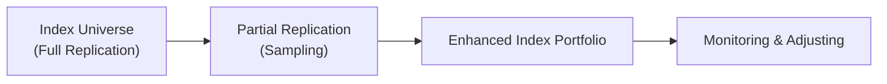

## Enhanced Indexing: An Overview
Enhanced indexing is, in my opinion, one of those strategies that feels a bit like having your cake and eating it too—if done right. You set out to beat a benchmark index by a modest margin but still keep your risk profile extremely close (low tracking error) to that benchmark. So, you’re not trying to leap miles beyond an index, à la a high-octane hedge fund; you’re simply nudging yourself slightly ahead through selective tilts, a handful of thoughtful trades, and careful cost control. And trust me, there's an art to balancing all these factors.

From a textbook standpoint, enhanced indexing seeks to capture the bulk of the index’s performance while adding small, incremental returns known as alpha. The alpha might be generated through factor tilts (like overweighting small-cap stocks in a large-cap index) or with an active overlay (like systematically rotating into undervalued sectors). The point is: this isn’t old-school, purely passive indexing where you hold every constituent in perfect proportion, nor is it fully active, where you move aggressively away from the benchmark. Enhanced indexing sits somewhere in the middle. And that sweet spot is often where you achieve decent risk-reward balance.

I recall my first experience with an enhanced index strategy many years ago when I interned at an asset management firm. I was astounded at how granularly they modeled things like sector exposures and factor loadings. They might say, “We want 18 basis points of alpha from a momentum tilt but can’t accept more than 25 basis points of tracking error from that tilt alone.” Let’s just say the conversation was an eye-opener on how rigorous “moderately active” management can be.

## Key Elements of Enhanced Indexing
Despite the variety of methods to implement enhanced indexing, the approach typically revolves around at least three major elements:

• Active Overlays: An overlay might involve leveraging your research insights to find marginally mispriced securities while still maintaining benchmark-like exposure. Think of it as sprinkling a bit of “seasoning” onto your base portfolio.

• Minor Factor Tilts: Rather than drastically changing your style orientation (e.g., going 100% growth or 100% value), you might subtly tilt the portfolio toward value or momentum or high dividend yield. Ideally, these tilts produce alpha but do not significantly disrupt the correlation with the benchmark.

• Optimization-Based Security Selection: Sometimes you’ll see a more data-driven approach. You would systematically evaluate securities based on constraints (e.g., sector weights, factor loadings, or volatility tolerances) and run optimization routines to find a subset that replicates the benchmark’s key characteristics. Meanwhile, you employ signals about expected returns to overweight or underweight particular names.

Anyway, each of these elements can be combined to produce that “almost index-like” portfolio that still outperforms (if all goes according to plan). The big challenge is ensuring that each alpha-seeking move doesn’t blow up your risk constraints—because the hallmark of enhanced indexing is, after all, to stay fairly close to the benchmark.

## Implementation Approaches
One of the defining aspects of enhanced indexing is that you often don’t replicate the entire index. Full replication, where you buy every single constituent in the same proportion as the index, is typically used for pure passive strategies. But if you’re actively trying to eke out extra return—while also keeping costs manageable—partial replication or sampling can be more effective.

### Partial Replication (Sampling)
In a partial replication approach, you choose a representative subset of the index securities that captures the essential qualities of the index, such as factor exposures (e.g., growth vs. value), sector weights, geographic splits, or liquidity profiles. You deliberately skip some of the smaller or less liquid securities where it can be quite expensive to buy or maintain a position. Over time, you can tilt that subset according to your alpha signals.

The math behind sampling methods can get a little heavy, but let’s simplify. If the index has a thousand stocks, you might—through an optimization platform—choose to hold 400 of them. Those 400 are selected because collectively they replicate the overall risk, sector distribution, size, and style factors of the full index almost perfectly, at least theoretically. But then you add your little “special sauce,” which might be overweighting certain securities you think are poised for outperformance based on your models. This partial replication both keeps transaction costs down and gives you the freedom to express moderate active views.

### Optimization-Based Subset Selection
This technique often involves fancy algorithms that solve for a portfolio with an objective function like “minimize tracking error relative to the benchmark subject to a target level of alpha.” The constraints in such an optimization might look something like:

• Sector weights within ±1% of the benchmark.  
• Factor exposures (like value, momentum, and volatility) marginally different from the index factor exposures.  
• Maximum individual position limit (e.g., no more than 2% in any one name).  
• Minimum liquidity constraints.  

By systematically tweaking these constraints, you can end up with a portfolio that zigzags around the index return for the most part, but hopefully nets you a consistent outperformance of a few basis points (or more) each year.

Here’s a quick visual representation in Mermaid, showing how you might proceed from full index to partial replication to an enhanced index portfolio:



## Minimizing Transaction Costs
Let’s take a moment to talk about transaction costs, which can be the kryptonite of enhanced indexing. If you imagine that your alpha is, say, 50 basis points a year, then you certainly don’t want to burn that alpha with 70 basis points worth of trading commissions and slippage. So the entire premise of enhanced indexing demands that you trade efficiently, plan your turnover, and maybe even take advantage of crossing networks or block trades—anything that reduces friction.

I remember a senior trader telling me, “If your trades are too frequent, you’ll basically trade yourself into a hole.” That said, one does need to rebalance or adjust exposures from time to time. So, you might adopt a patient trading schedule: scale into positions gradually to avoid impacting the price, or you use limit orders, or you trade during periods of higher liquidity in the day to minimize spreads.

In some advanced versions of enhanced indexing, you can incorporate transaction cost models right into your optimizers. By penalizing securities with high expected costs, you nudge your portfolio to prefer trades that deliver the highest net benefit. Over time, that approach can help preserve your hard-fought alpha.

## Performance Attribution in Enhanced Indexing
Performance attribution basically answers the question: where did your alpha come from? Did you get it through sector bets, factor exposures, or individual security selection? For enhanced indexing managers, it’s crucial to separate the alpha sources from your “index-like” baseline. So, you typically break your performance down along a few lines:

• Allocation Effects: Did you overweight or underweight certain sectors or industries relative to the benchmark?  
• Selection Effects: Within each sector, did you pick better-performing stocks?  
• Factor/Style Effects: Did you have a tilt toward smaller-cap names, high momentum, or high dividend yields, and how did that tilt contribute to performance?  

Given you’re only moving away from the index on a small scale, each piece of alpha might be subtle. That means you want robust tools to measure these differences, such as multi-factor risk models that parse out exactly how your exposures diverge from the benchmark. The clarity you get from these advanced factor-based attribution tools can help you fine-tune (or correct) your approach in subsequent rebalancing cycles.  

## Rebalancing and Tracking Error
Because you want to remain “close” to the index, you need to keep a close eye on your tracking error. If your tracking error creeps too high, you risk looking more like a high-active-risk fund. On the flip side, if your tracking error is too low, you might not actually be taking enough active bets to produce alpha.

A straightforward measure of tracking error is:


\text{Tracking Error} = \sqrt{\frac{1}{N-1}\sum_{i=1}^N \bigl(R_{p,i} - R_{b,i}\bigr)^2},


where \\( R_{p,i} \\) is the portfolio’s return for period \\(i\\), \\( R_{b,i} \\) is the benchmark’s return for period \\(i\\), and \\(N\\) is the number of observations. This formula basically captures the volatility of the difference between your portfolio returns and the index returns. It’s a measure of how consistent (or inconsistent) your performance is relative to the benchmark.

### Rebalancing Frequency
In practice, many enhanced index strategies rebalance periodically (e.g., monthly, quarterly) or when certain thresholds are crossed. Perhaps you decide that if the portfolio’s factor exposures drift 0.5% away from your targeted levels, you’ll trade to bring them back in line. Another approach is parametric weighting: you might systematically recalculate weights using an optimizer at each rebalancing date based on updated signals and risk constraints. Meanwhile, a non-parametric approach might rely more on heuristic or rule-based rebalancing triggers, like “We run a rebalance only if sector weights deviate from target by over 2 percentage points.”

Either way, every rebalance introduces new trades, which in turn can mean new transaction costs, so it’s all about balancing the potential alpha gains with the friction from trading. 

## A Quick Python Sampling Example
A quick code snippet might illustrate how you’d do a very basic sampling approach in Python—though in real life, you’d likely have a far more elaborate process:

```python
import numpy as np

np.random.seed(42)
expected_returns = np.random.rand(100)
cov_matrix = np.random.rand(100, 100)
cov_matrix = (cov_matrix + cov_matrix.T)/2  # Symmetrize for clarity

selected_indices = np.argsort(-expected_returns)[:50]
print("Selected indices for partial replication:", selected_indices)

```

This snippet simply picks the top 50 stocks by expected return as a naive approach. In an actual enhanced indexing framework, you’d also incorporate constraints on sector weights, factor exposures, and so on, typically using a solver or an optimization library.

## Conclusion
When used effectively, enhanced indexing can give you the best of both worlds: you track an index closely so that your relative risk to a key benchmark is limited, yet you grab some extra alpha on the edges. It’s not about making big, headline-grabbing calls; it’s about methodically adding consistent incremental value. From partial replication and factor tilts to transaction cost control and performance attribution, every piece of the puzzle has to fit snugly. 

I’d also mention that many investors like enhanced indexing because it applies rigor and discipline. You’re forced to quantify your factor exposures, forced to watch your trading costs, and forced to keep your portfolio up to date. And that discipline often yields good outcomes for both clients and managers.

## Final Exam Tips
• Clarity on Strategy Objectives: In exam questions, be crystal clear about the difference between pure indexing, enhanced indexing, and active management. If you misunderstand the objective of limiting tracking error, your entire answer might go astray.  
• Linking Factors to Outcomes: The exam might present a scenario with factor exposures and ask how an enhanced indexing approach uses these exposures to drive alpha. Focus on the subtlety that you want incremental alpha, not wholesale changes.  
• Transaction Cost Sensitivity: Don’t forget to mention transaction costs when you’re asked about rebalancing or portfolio turnover. These costs can wipe out the alpha margin if not handled well.  
• Performance Attribution: Be ready to break down alpha into selection, allocation, and factor contributions. Enhanced indexing typically generates small alpha slices from each source, so articulate how you’d measure each slice.  
• Quantitative Tools: In a constructed-response question, you might be required to calculate or interpret a tracking error figure. Knowing the formula and how to interpret the results is key.  
• Practice Time Management: On exam day, keep your eye on the clock. Enhanced indexing can show up in item sets or as part of broader portfolio construction, so clarify your approach and keep your answers streamlined.  

## References
• CFA Institute. (2025). “Indexing Strategies.” CFA Program Curriculum.  
• Grinold, R. & Kahn, R. (2000). Active Portfolio Management.  

## Test Your Knowledge: Enhanced Indexing in Practice



### Which statement best describes enhanced indexing?
- [x] A strategy that aims to closely track an index while seeking a modest level of outperformance.  
- [ ] A purely passive strategy that replicates all constituents exactly.  
- [ ] An aggressive active strategy designed for maximum total return.  
- [ ] A high leverage strategy to amplify returns from index moves.  

> **Explanation:** Enhanced indexing focuses on closely tracking an index but implements small alpha-seeking tilts or overlays.

### A core idea behind partial replication, or sampling, in enhanced indexing is:
- [x] Selecting a representative subset of benchmark constituents to reduce costs and still capture core index exposures.  
- [ ] Buying every single name in the benchmark to mirror the index precisely.  
- [ ] Underweighting securities with the lowest liquidity to increase tracking error.  
- [ ] Not using any statistical or optimization techniques.  

> **Explanation:** With partial replication, you choose a subset of securities that replicate the index’s core exposures while cutting transaction costs.

### How might an enhanced index portfolio typically maintain a low tracking error?
- [x] By closely adhering to sector and factor constraints that match the benchmark.  
- [ ] By radically changing its sector weights every month.  
- [ ] By entirely ignoring factor exposures.  
- [ ] By only holding a single security from the benchmark.  

> **Explanation:** Low tracking error comes from controlling how far the portfolio deviates in terms of factor exposures, sector allocations, and other characteristics.

### In an optimizer-based enhanced indexing approach, transaction costs can be addressed by:
- [x] Incorporating them into the objective function to penalize expensive trades.  
- [ ] Ignoring them, as they generally don’t affect alpha.  
- [ ] Blindly rebalancing daily regardless of cost.  
- [ ] Always selecting the largest securities for liquidity reasons alone.  

> **Explanation:** Enhanced index strategies often integrate a transaction cost model in their optimizations to maximize net alpha.

### Which of the following is a valid rationale for focusing on performance attribution in enhanced indexing?
- [x] Understanding which minor tilts or overlays contributed to alpha can help refine future enhancements.  
- [ ] Determining market-wide returns for capacity analysis.  
- [ ] Eliminating rebalancing activity.  
- [ ] Reducing compliance with CIPM standards.  

> **Explanation:** Performance attribution in enhanced indexing highlights the relative contributions of each small tilt or overlay.

### When discussing rebalancing frequency in enhanced indexing, a major consideration is:
- [x] Balancing alpha capture with transaction costs to avoid eroding gains.  
- [ ] Maximizing trading to increase turnover.  
- [ ] Completely ignoring drift in factor exposures.  
- [ ] Never adjusting the portfolio once it's built.  

> **Explanation:** Frequent rebalancing can help maintain appropriate exposures but might lead to higher costs that reduce net alpha.

### A possible result of ignoring factor exposures in an enhanced index strategy is:
- [x] Drifting too far from the benchmark, defeating the purpose of low tracking error.  
- [ ] Increasing the alignment with the index and achieving zero tracking error.  
- [ ] Achieving guaranteed alpha.  
- [ ] No impact on returns or risk.  

> **Explanation:** If factor exposures are uncontrolled, the portfolio can inadvertently take on high active risk relative to the benchmark.

### Which aspect best characterizes “enhanced indexing via active overlay”?
- [x] Retaining a near-benchmark portfolio but selectively overweighting or underweighting certain securities based on a research view.  
- [ ] Allocating 100% of the portfolio to off-benchmark securities.  
- [ ] Never adjusting weights relative to the index.  
- [ ] Excluding entire market sectors from the portfolio.  

> **Explanation:** An active overlay implies small, targeted deviations from the benchmark to achieve moderate alpha.

### What is a typical use of factor-based performance attribution in enhanced indexing?
- [x] To isolate the performance contribution from style tilts like value/growth.  
- [ ] To ensure no difference between the portfolio and the index.  
- [ ] To replicate a hedge-fund style.  
- [ ] To maximize leverage in the portfolio.  

> **Explanation:** Factor-based models allow managers to see how much of their alpha stems from style tilts or other factor exposures.

### True or False: Enhanced indexing is designed to generate significant alpha with very high active risk.
- [x] True  
- [ ] False  

> **Explanation:** This statement is tricky—some might read it quickly and say “False” because “significant alpha” is not the typical aim. However, “significant” can be subjective. Enhanced indexing does take active risk but tries to keep it low. In some contexts, “significant alpha” might refer to capturing a few consistent basis points that can be quite meaningful over time. In general exam contexts, though, the standard notion is that enhanced indexing aims for modest alpha and moderate active risk (low tracking error). If the question’s phrasing leans on “significant alpha,” that’s open to interpretation. Given the typical positioning of enhanced indexing, many would interpret this as a false statement. But if we strictly read that it can generate alpha (which might be meaningful on a risk-adjusted basis) while holding active risk at moderate levels, some practitioners do consider that “significant” in the sense that it’s consistent and sustainable. This is an ambiguous question. As a clarifying note, in most mainstream discussions, the statement is generally considered false: enhanced indexing does not aim for high active risk.  

> **Note to Readers:** The phrasing is ambiguous, and in an actual exam scenario, carefully align your answer with the conventional definition of “significant alpha” vs. “moderate alpha.”  


