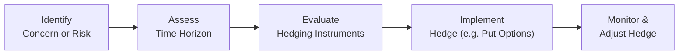

## Introduction

So, you’ve decided to focus on equity investments—fantastic! But, as I once overheard in a trading room, “Equity markets can be your best friend and your biggest foe—often at the same time.” Equity portfolios can offer significant upside potential, but they also carry substantial risk. Understanding, measuring, and managing these risks are crucial for meeting investment objectives, staying calm under pressure, and upholding your fiduciary responsibilities.

In this section, we’ll walk step by step through the spectrum of equity risk management. We’ll begin with a quick refresher on common risk measures (like volatility and Value at Risk), explore more advanced tools such as scenario analysis and stress testing, and see how diversification, position sizing, and hedging come together to protect our portfolios in both quiet and tumultuous markets. Let’s dive right in.

## Key Risk Measures for Equity Portfolios

Equities can be volatile, and that’s often what draws us to them. However, along with the allure of higher returns comes the need to measure and monitor risk effectively. Here are three common measures:

### Volatility (Standard Deviation)

Volatility refers to the standard deviation of returns. In plain language, it measures how widely equity returns fluctuate over a given period. The higher the volatility, the bigger the potential swings—both up and down. That’s exciting when the market is climbing, but it can be unnerving on the way down.

Mathematically, for a portfolio with returns \\( r_1, r_2, \ldots, r_n \\):


\sigma = \sqrt{\frac{1}{n - 1} \sum_{t=1}^{n} (r_t - \overline{r})^2}


where \\( \overline{r} \\) is the mean of the returns. A “low” \\(\sigma\\) might signal a relatively stable portfolio; a “high” \\(\sigma\\) suggests large fluctuations.

### Value at Risk (VaR)

Value at Risk (VaR) is an estimate of the potential loss a portfolio could suffer within a specified time horizon, at a given confidence level. For example, a 1-day 95% VaR of \$1 million implies that, with 95% confidence, you will not lose more than \$1 million in a single trading day. The flip side is that there’s a 5% chance of losing more than \$1 million.

This quantitative approach helps risk managers gauge worst-case scenarios—sort of a “How bad could it get on a really rough day?” VaR alone isn’t perfect, but it’s a widely used tool, particularly among larger financial institutions.

### Maximum Drawdown

Max drawdown is that dreaded peak-to-trough decline—at least historically. It’s the largest observed loss from a portfolio’s highest point to the subsequent lowest point. This measure resonates with many investors emotionally because it effectively asks, “If I invested at the worst possible time, how big could my losses have been before the portfolio started recovering?”

Keeping an eye on max drawdown is crucial for investors with certain thresholds of pain. For instance, if a retiree can’t tolerate more than a 10% drawdown, you need to manage the equity portion accordingly.

## Systematic Risk and Beta

In Chapter 3 (“Portfolio Risk and Return – Part II”), we introduced the Capital Asset Pricing Model (CAPM) and the concept of beta (\\(\beta\\)). Beta measures how a stock or portfolio moves relative to the broader market—typically, the market is your benchmark with a beta of 1.0.

• A beta higher than 1.0 suggests the portfolio tends to move more sharply than the market.  
• A beta below 1.0 implies the portfolio is less volatile relative to the market index.  

Mercifully, you don’t need to do elaborate calculations every day; many data providers track and publish betas. But it’s vital to remember that beta is backward-looking and context-dependent: a stock’s beta might change substantially when market conditions shift (for instance, during a recession or a sudden pandemic-driven shutdown).

## Correlation and Diversification

Even if you have the perfect handle on your portfolio’s overall beta, keep in mind that diversification is about how different holdings move relative to each other (correlation). A portfolio stuffed with high-tech companies might be fun when tech is booming, but if they all tank together, you’ll lack offsetting winners. Consequently, it’s best to combine equities from diverse sectors, styles (value vs. growth), or even geographies, reducing correlation among holdings.

Correlation, \\(\rho_{A,B}\\), measures how returns on Asset A and Asset B move together:


\rho_{A,B} = \frac{\text{Cov}(A, B)}{\sigma_A \sigma_B}.


If correlation is close to 1.0, those assets move similarly; if correlation is near zero or negative, they behave more independently—great for diversification.

## Scenario Analysis and Stress Testing

Let’s be honest: fancy risk models are wonderful until extraordinary events happen (think of the Global Financial Crisis in 2008 or the sudden market closures due to a pandemic). These outliers often slip through statistical cracks. That’s where scenario analysis and stress testing step in.

• **Scenario Analysis**: Construct hypothetical or historical “what-if” market conditions. For instance, what if inflation spikes unexpectedly? How would our equity-focused portfolio respond if energy prices suddenly jumped 50%?  
• **Stress Testing**: Simulate extreme market shocks, such as a 30% drop in equity indexes within a month. Stress tests are intentionally dramatic and can highlight vulnerabilities that standard VaR or volatility measures might miss.

Real-life example: During the COVID-19 pandemic, many funds discovered unanticipated correlation surges among their equity holdings. Stress testing for adverse health events (previously considered “low probability”) could have better prepared them for drastic drawdowns in certain sectors.

## Standard Risk Mitigation Techniques

Equity risk mitigation is more of an art than a science. Here are a few tried-and-true techniques:

### Diversification Across Sectors, Styles, and Geographies

It’s almost cliché, but an equity portfolio that invests across multiple sectors (technology, healthcare, finance, etc.) is less likely to experience a catastrophic drawdown from one sector meltdown. Within each sector, balancing value stocks, growth stocks, large-cap, small-cap, or even region-specific equities can further reduce concentration risk. Besides, let’s face it: it’s also more interesting to learn about many different companies rather than betting heavily on just one theme.

### Position Sizing

Position sizing is key to capping your risk. “How big should each equity position be?” is intimately tied to how much risk you’re comfortable taking. For instance, if you discover that a single position approach is driving 25% of your entire portfolio’s risk, that might signal a need to scale back, unless you intentionally want that high concentration.

### Stop-Loss Policies

Stop-losses provide an automatic exit whenever a stock drops to a certain price. While they protect against big losses, they can also trigger an exit only to see the stock bounce back. Personally, I recall a time I set a stop-loss on a biopharmaceutical stock just a bit too tight. Mere intraday noise triggered the sell, and the stock rebounded strongly in the following days—naturally, I missed out. So weigh the pros and cons carefully.

### Dynamic Hedging

In some cases, you might want to actively hedge your equity exposure using derivatives like options or futures. For example, if you’re worried about a short-term correction but don’t want to sell your long-term equity positions, you can buy put options on the underlying index. This approach can be complex, but it often helps navigate turbulent markets, especially if you believe your holdings have strong long-term fundamentals yet anticipate near-term volatility.

Below is a simplistic workflow for dynamic hedging decisions:

## Risk Appetite and Acceptable Volatility Ranges

Every investor has a unique “sleep at night” threshold. Some might be fine with 30%+ annual swings in pursuit of big gains, while others prefer a steady 8–10% volatility. Pinpointing that sweet spot is crucial because it shapes:
• The equity allocation in the overall portfolio.  
• The type of equities—conservative, dividend-paying stocks vs. high-growth tech.  
• The extent of hedging, diversification, and other protective measures.

Align your portfolio’s construction with these preferences. If you manage money for clients, you already know: mismatching the risk profile is a guaranteed way to lose trust (especially during market downturns).

## Liquidity and Market Impact

Liquidity risk is often overlooked until it’s too late. If you’re dealing with smaller-cap stocks or emerging market equities, it’s possible that on a bad day there just aren’t enough buyers. This can amplify your losses beyond normal measures of volatility or VaR. Moreover, large trades can cause market price distortions, known as “market impact.” 

For big institutional portfolios, careful planning and possibly working with a broker who uses algorithms (like VWAP or TWAP orders) can help minimize market impact. Even for smaller accounts, it’s a good idea to pay attention to trading volumes and bid-ask spreads, especially when markets are going wild.

## Risk Budgeting

Risk Budgeting is effectively deciding “how much risk capital do we allocate to each strategy or portfolio component?” If you have an equity portfolio that includes a mixture of large-cap value, small-cap growth, sector plays, and so on, each of these segments will consume part of your total “risk budget.”

Why is this so handy? Because it forces discipline around where you expect the highest return per unit of risk. If a particular equity strategy or style is chewing up an enormous slice of the risk budget but isn’t delivering adequate performance, it might be time for a re-evaluation.

Below is a simplified example with hypothetical percentages of “risk capital” allocated to different equity segments:

| Equity Segment            | % of Risk Budget | Rationale                                  |
|---------------------------|------------------|--------------------------------------------|
| Large-Cap Value           | 30%             | Lower volatility, stable dividends         |
| Small-Cap Growth          | 40%             | Higher return potential, higher volatility |
| Emerging Markets          | 20%             | Diversification, but liquidity constraints |
| Thematic/Tech Focus       | 10%             | Targeted opportunity, sector expertise     |

## Practical Case Example: Navigating a Market Selloff

Let’s imagine you run an equity fund that focuses primarily on mid-cap U.S. growth stocks. Suddenly, you see storm clouds on the horizon: inflation is ticking up, and the Federal Reserve indicates a quicker-than-expected rate hike cycle. Growth stocks tend to get battered when interest rates climb. What can you do?

1. **Scenario Analysis**: Evaluate a scenario where the broad equity market drops 15–20% due to a tech sector correction and rising yields.  
2. **Stress Test**: Project what happens if your mid-cap holdings specifically fall 25%. Analyze how that correlates with the rest of your portfolio (maybe you have some small positions in defensive sectors, or you hold some index puts).  
3. **Risk Mitigation**:  
   - Consider rewriting your sector allocations—maybe adding some defensive consumer staples or healthcare stocks.  
   - Implement partial hedges using put options on a mid-cap growth ETF.  
   - Revisit position sizes in your top 5 holdings—if each is 12% of your portfolio, that might be too concentrated.  
4. **Liquidity Check**: If these mid-cap stocks trade in relatively thin markets, plan an orderly exit or rebalance to avoid massive slippage if you see the market turning fast.  
5. **Decision**: Perhaps you only hedge a portion of the portfolio for a specified period, wanting to maintain upside if the market recovers quickly.

## Glossary

• **Value at Risk (VaR)**: Estimate of the maximum potential loss over a specified time horizon at a given confidence level. Often used for daily or weekly risk control.  
• **Beta**: A measure of a stock or portfolio’s volatility relative to the overall market (market beta = 1). A higher beta means higher sensitivity to market swings.  
• **Risk Budgeting**: Allocating portions of total risk capacity across various strategies, sectors, or asset segments to optimize returns given a set risk tolerance.

## References and Further Reading

• Jorion, P. (2006). “Value at Risk: The New Benchmark for Managing Financial Risk.”  
• CFA Institute, “Risk Management Applications,” CFA Program Curriculum (2025).  
• For deeper dives into quantitative risk methods, consider online courses from Coursera or edX on financial risk modeling and stress testing.  

## Final Exam Tips

• Know your definitions: VaR, volatility, beta—these are likely to appear in both item-set and essay (constructed response) questions.  
• Practice scenario analysis with real or hypothetical market shocks. The exam often includes “what if” vignettes.  
• Emphasize the interplay between risk appetite, position sizing, and overall strategy objectives.  
• Illustrate your understanding in constructed response answers—show the process (not just the final number).  
• Time management matters: use bullet points or well-structured paragraphs to convey clarity in your exam responses.

---

## Essential Risk Management Knowledge Quiz



### For an equity portfolio, which risk measure offers an estimate of the maximum expected loss over a specified time period at a given confidence level?

- [ ] Standard deviation
- [x] Value at Risk (VaR)
- [ ] Beta
- [ ] Sharpe ratio

> **Explanation:** VaR measures potential maximum loss at a chosen confidence level, such as 95% or 99%, over a given time horizon.

### Which measure specifically indicates how closely two stocks move together?

- [ ] Beta
- [ ] Alpha
- [x] Correlation
- [ ] Standard deviation

> **Explanation:** Correlation measures the extent to which two assets move in tandem. Beta, on the other hand, compares an asset’s movements against a market benchmark.

### According to a risk budgeting approach, if a portfolio strategy consumes a large slice of the total “risk budget” but delivers insufficient returns, the typical action is to:

- [ ] Allocate more capital to the strategy.
- [ ] Increase the exposure to high-volatility segments.
- [x] Reduce or re-evaluate the allocation to that strategy.
- [ ] Abandon risk budgeting entirely.

> **Explanation:** If the contribution to overall risk is disproportionately high compared to the returns generated, risk budgeting would typically recommend scaling back.

### Which of the following is a benefit of conducting scenario analysis in equity risk management?

- [x] It highlights how the portfolio might behave in specific, plausible market situations.
- [ ] It eliminates the need for diversification.
- [ ] It replaces the need for volatility metrics.
- [ ] It is only relevant for fixed-income portfolios.

> **Explanation:** Scenario analysis provides insights into how your equity portfolio might respond in different economic or market conditions, giving a reality check beyond simple measurements like volatility or VaR.

### In an equity portfolio, if you believe there will be a short-term market correction but you still want to retain your core holdings for the long run, you might:

- [x] Buy put options for partial downside protection.
- [ ] Sell your entire portfolio immediately.
- [x] Adjust your position sizing and possibly trim concentrated bets.
- [ ] Do nothing and disregard the correction risk.

> **Explanation:** Using options or trimming positions are prudent strategies for mitigating short-term risk. A full sell-off might conflict with long-term goals, and ignoring potential risk may be irresponsible.

### What is the primary role of a stop-loss in equity trading?

- [x] Automatically trigger a sell order when the price hits a certain level.
- [ ] Guarantee the portfolio will never experience a loss.
- [ ] Increase the correlation among portfolio stocks.
- [ ] Eliminate the need for diversification.

> **Explanation:** A stop-loss is a predefined mechanism to limit losses on a position if prices move beyond a set loss threshold.

### Which of the following statements regarding liquidity risk is correct?

- [x] Trading illiquid stocks can increase transaction costs and potential slippage.
- [ ] Liquidity risk is irrelevant for long-only equity portfolios.
- [x] Large trades in illiquid markets can lead to significant market impact.
- [ ] Smaller-cap stocks generally have no liquidity issues.

> **Explanation:** Liquidity risk stems from insufficient activity in the market, often leading to price distortion, especially when large volumes are traded.

### Why might an equity-focused portfolio manager conduct a stress test using an extreme drop in the market index?

- [x] To see potential worst-case losses across all holdings.
- [ ] To confirm that standard deviation is irrelevant to risk.
- [ ] To prove correlation doesn’t matter.
- [ ] To avoid scenario analysis.

> **Explanation:** Stress tests help highlight vulnerabilities in extreme market events and analyze how positions might behave under drastic downward scenarios.

### If a portfolio has a beta of 1.2 relative to the market, which statement is most accurate?

- [x] The portfolio is expected to move 1.2 times the market’s movement, on average.
- [ ] The portfolio is uncorrelated with the market.
- [ ] The portfolio is guaranteed higher returns than the market.
- [ ] The portfolio has no systematic risk exposure.

> **Explanation:** A beta of 1.2 suggests that if the market’s return changes by 1%, the portfolio’s return changes by about 1.2%, reflecting higher volatility relative to the market.

### For an equity portfolio, diversification benefits increase most when holdings:

- [x] Are less correlated with each other.
- [ ] Move in perfect tandem.
- [ ] Come from the same sector.
- [ ] Have uniform beta values.

> **Explanation:** When stocks are less correlated, their individual movements help offset each other’s volatility, enhancing the overall risk-adjusted return profile.


