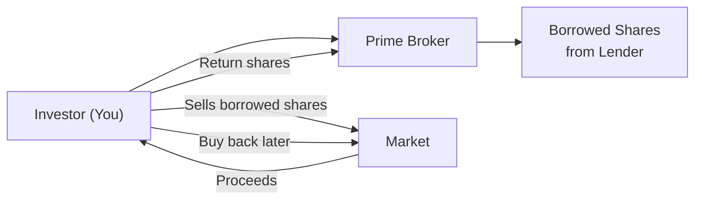

## Introduction
Long-short equity and market-neutral strategies offer an intriguing twist on traditional long-only investing. Instead of trying to beat the market solely on the way up, these approaches attempt to profit in both rising and falling markets. Seems fancy, right?

Well, it can be, but it’s also surprisingly straightforward once you see how all the pieces connect. In my earlier days, I recall chatting with a seasoned hedge fund manager who swore by these techniques, especially in choppy markets. He’d say, “If you can’t hedge your market exposure, you might as well throw dice.” Let’s see what he meant by that, focusing on the mechanics, the rationale, and the potential pitfalls of these strategies.

## Traditional Long-Only vs. Long-Short Equity Strategies
Traditional equity portfolios typically hold a diverse basket of stocks. The idea is to find undervalued (or fairly valued) companies, buy them, and watch them (hopefully) appreciate over time. But in a long-only strategy, there’s a constraint: you can’t profit directly from a stock you believe might go down. You can only sell it if you own it.

Long-short strategies break that constraint. They allow you to:
• Buy (go long) stocks that you think will increase in value.  
• Sell short securities that you believe will decline in value.  

By combining these positions, you can generate alpha from both sides of the market. Moreover, the short book can provide a partial hedge if the broader market falls (though the degree of hedge will depend on net exposures, correlation, and volatility).

### Basic Comparison Table

| Aspect                   | Traditional Long-Only        | Long-Short                         |
|--------------------------|------------------------------|------------------------------------|
| Positions                | Only long                    | Long and short                     |
| Potential Sources of Return | Rising stock prices only      | Rising prices on longs + falling prices on shorts |
| Market Exposure          | Generally positive (beta)    | Can be leveraged, net exposure can be positive, neutral, or negative |
| Hedging Market Declines  | Limited (only by going to cash) | Automatic partial hedge from short positions |

## The Mechanics of Short Selling
Short selling is the lifeblood of long-short strategies. Essentially, you borrow shares from someone else (often a broker or a prime broker’s client), sell them in the market, and then hope to buy them back later at a lower price. The difference between the initial sale price and the eventual buyback cost is your profit (if it goes as you planned). But beware—short selling carries special risks.

### Prime Brokerage Arrangements
In practice, short selling relies on prime brokerage services. A prime broker:
• Lends securities for short selling.  
• Facilitates margin lending and leverage.  
• Provides back-office support, such as trade clearing and settlement.  

Access to these services often requires meeting specific account size and collateral requirements. The prime broker will hold the proceeds from the short sale, as well as additional margin, as security against the short position.

### Margin Requirements
Because you’re using borrowed securities, typical margin requirements for short positions can be more stringent than for long positions. Regulatory bodies (e.g., FINRA in the US) and prime brokers set minimum margins that you must maintain. If the stock you shorted starts rising, your margin cushion shrinks. When it dips below a certain threshold, you’ll receive a margin call and have to deposit more cash or close part of the position.

### Stock Lending
Short selling wouldn’t exist without a robust stock lending market. Institutions such as pension funds or large mutual funds often have shares sleeping in their portfolios. They can lend these shares against a fee. For them, it’s extra income. For you, it’s the ability to execute your short. However, a borrower might have to pay a higher fee if it’s a “hard-to-borrow” security with limited lending supply.

## Market-Neutral Strategies
When we say “market-neutral,” we usually mean that the strategy is designed to have a net zero beta exposure to the overall market. The manager tries to keep the portfolio’s total long market exposure equal to its total short market exposure—for instance, by matching the dollar value or the beta of long and short positions. Think of it like balancing your seesaw so it stays level whether it’s an up or down day in the market.

### The Concept of Zero Net Market Exposure
A typical market-neutral strategy attempts to make profits from stock selection (i.e., picking which securities will outperform or underperform each other), rather than from the overall market’s direction. If it’s perfectly neutral, broad market moves shouldn’t affect the portfolio, at least in theory.

The payoff might look something like:
• Gains on your longs if they outperform the shorted securities.  
• Potential gains on your shorts if those stocks do poorly or the overall sector weakens.  
• A near-zero correlation to the equity market if the portfolio is truly neutral.  

Of course, no strategy is 100% immune to big market shocks. Correlations can surge in a crisis, as we saw in 2008, but the principle still stands.

### Pairs Trading
Pairs trading is a popular market-neutral approach. You pick two stocks that are usually highly correlated or that move in tandem—maybe they’re in the same industry, or they’re direct competitors. Then you:
• Go long on the undervalued (or “cheap”) stock.  
• Go short on the overvalued (or “expensive”) stock.  

If the relationship reverts to its norm, you make money when the long position outperforms the short. It doesn’t really matter whether the overall market goes up or down, as long as your chosen pair converges or diverges as expected.

## Risk Management Considerations
Remember how that fund manager spoke about hedging? Well, it’s not all peaches and cream. Long-short strategies and market-neutral portfolios come with their own sets of risks:

### Leverage
Long-short managers often use leverage to amplify returns. This could mean leveraging both the long and short books. If you’re not careful, leverage can magnify losses as quickly as it can magnify gains.

### Margin Calls
When shorted stocks rise sharply, your broker may demand additional collateral (a margin call). Sometimes these margin calls pop up at the worst possible times—when your positions are deep underwater. If you fail to meet the margin call, your broker can close your positions at unfavorable prices.

### Short Squeezes
A short squeeze happens when a heavily shorted stock starts climbing, forcing short sellers to buy back shares to cover their positions. This accelerated buying can push prices even higher—a vicious cycle. We’ve all seen dramatic short squeezes, especially if a famous investor tweets something bullish or an online community collectively piles in.

### Factor and Sector Exposures
Even market-neutral strategies can inadvertently accumulate exposures to certain factors, such as growth versus value, or certain sectors like technology. If, for instance, you’re systematically shorting overpriced tech companies while going long cyclical stocks, you might not be as neutral as you think. Continuous monitoring and rebalancing of these exposures is crucial.

## Performance Measurement
Long-short and market-neutral strategies are frequently measured on risk-adjusted metrics. Because these portfolios might hold both long and short sides, standard measures like raw returns against an equity index are less useful.

### Alpha Generation
Investors often gauge these strategies based on alpha—the return above and beyond what would be explained by market (beta) exposure. In market-neutral setups, the benchmark might even be the risk-free rate, since you’re trying to remove market influence.

### Risk-Adjusted Returns (Sharpe Ratio, Sortino Ratio)
Common performance yardsticks include:
• Sharpe Ratio: Compares a strategy’s returns to the risk-free rate, dividing by the portfolio’s standard deviation.  
• Sortino Ratio: Focuses on downside volatility, arguably a better measure for market-neutral approaches that aim to limit big drawdowns.

### Correlation to Market Indexes
High correlation to major indexes suggests you’re not as neutral as you might want to be. Ideally, truly neutral strategies strive for near-zero correlation. However, emergencies or crisis events can break these relationships, driving correlation up across asset classes.

## Historical Performance and Potential Pitfalls
Long-short equity hedge funds have been around for decades, with some big winners (and losers) along the way. Often, their success depends heavily on the manager’s stock selection skill and timing, plus effective risk control.

• Famous examples: Many large hedge funds, including those started by legendary investors, got their fame employing some form of long-short equity.  
• Crowded trades: With so many market participants chasing the same “undervalued vs. overvalued” theme, positions can become crowded and unwinding them can be painfully slow.  
• Liquidity constraints: In stressed markets, liquidity can vanish, forcing managers to hold onto losing shorts.  

## Maintaining Neutrality Over Time
Keeping a market-neutral style means constantly rebalancing. For instance, if a long stock doubles while a short stock remains flat, your once-even exposures might change significantly. You’ll need to scale back or reallocate positions to remain market-neutral.

### Rebalancing and Factor Exposures
Maybe your portfolio is market neutral in terms of raw dollar amounts: $1 million in longs and $1 million in shorts. But from a factor perspective—like beta, style (growth vs. value), or sector weighting—you might be lopsided and not even realize it. Daily or weekly checks can help manage these hidden exposures.

### Monitoring Beta
Many managers track “beta to the market” as well as betas to specific industries or factors. If your overall net beta starts drifting away from zero, it might be time to adjust some positions, engage in hedges, or shift your pair trades.

## Practical Example
Let’s illustrate a simple numeric scenario. Suppose you have USD 100,000 to invest. You decide to construct a market-neutral strategy:

• Long Position: USD 100,000 in Stock A, which you believe is undervalued.  
• Short Position: USD 100,000 in Stock B, which you believe is overvalued.  
• Your net market exposure (in $ terms) is zero: 100,000 – 100,000 = 0.  

Now assume:
• Stock A rises 10%. Your long position is now worth USD 110,000.  
• Stock B declines 5%. Your short position gains USD 5,000, so it costs you only USD 95,000 to cover it.  

Your total gain:  
• Long: +USD 10,000  
• Short: +USD 5,000  

Total = +USD 15,000, while the broader market might have gone up or down—doesn’t matter as much. Of course, if Stock A had tanked while Stock B soared, you’d face significant losses on both sides. Always keep an eye on the risks!

## Visualizing the Mechanics of a Short Sale



In this short sale flow:  
1. You borrow shares from a prime broker.  
2. You sell them in the market, receiving cash proceeds.  
3. Later, you buy back the same number of shares (ideally at a lower price).  
4. You return the borrowed shares to the broker and keep any profit.

## Python Snippet for Illustrative Returns
Below is a small Python snippet showing a straightforward calculation of returns for a hypothetical long-short position. (Note: This is just an illustration, so the real world will involve more data and complexities.)

```python
import pandas as pd

data = {
    'Position':   ['Long Stock A', 'Short Stock B'],
    'Initial Value': [100000, -100000],  # short is negative
    'Price Change (%)': [10, -5]        # negative for short means a price decline
}

df = pd.DataFrame(data)
df['Final Value'] = [
    100000 * (1 + 0.10),   # Long gains 10%
    -100000 * (1 + (-0.05))  # Short gains because price fell 5%
]
df['Profit'] = df['Final Value'] - df['Initial Value']

print(df)
print("Total Profit:", df['Profit'].sum())
```

When run, you’ll see the long gains USD 10,000 and the short gains an additional USD 5,000, for a total profit of USD 15,000.

## Glossary
• Short Selling: Borrowing and selling a security with the intention to buy it back at a lower price.  
• Market-Neutral Strategy: A portfolio designed to remove market beta exposure by balancing long and short positions.  
• Pairs Trading: Strategy that involves going long on one security and short on a related security to profit from relative mispricing.

## Regulatory and Standards Integration
Globally, regulations on short selling vary. Some markets impose strict short-selling rules, and others may temporarily ban shorts on specific sectors during market crises. As a portfolio manager, you must comply with relevant rules, margin requirements, and disclosures. Also, aligning with the CFA Institute Code of Ethics and Standards of Professional Conduct is vital, especially regarding market manipulation and fair dealings.

## Exam Relevance and Practical Tips
On the CFA exam, long-short equity and market-neutral strategies often appear in questions about alternative investments or portfolio management (with references to Chapter 13 as well). Be ready to:
• Evaluate the impact of short positions on overall portfolio risk.  
• Calculate net and gross exposures.  
• Distinguish between a long-short fund’s alpha and general market returns.  
• Incorporate risk management techniques (see Chapter 6).  

When answering exam questions:
• Show that you understand how margin requirements differ for short positions.  
• Demonstrate the ability to calculate returns and net exposures.  
• Discuss risks, including short squeezes, factor tilts, and the correlation to the market.  

Time management is crucial. If a question has multiple parts—like “Explain how a market-neutral strategy can yield positive returns in a flat market” and “Calculate net exposure given a certain set of positions”—tackle them step-by-step. Don’t forget to address risk considerations thoroughly.

## References
• Schwager, J. (1993). “Market Wizards.”  
• CFA Institute, “Alternative Investments,” CFA Program Curriculum (2025).  

For more on short selling mechanics and hedge fund strategies, you might explore specialized textbooks or academic articles on alternative investments.

---

## Test Your Knowledge: Long-Short Equity and Market-Neutral Strategies



### In a market-neutral strategy, what is the primary goal of balancing long and short positions?

- [ ] To maximize net beta exposure.
- [x] To eliminate the portfolio’s overall beta exposure.
- [ ] To concentrate on a single sector.
- [ ] To increase correlation with the market.

> **Explanation:** The core objective of market-neutral strategies is to have zero or near-zero net exposure to overall market movements, so returns primarily reflect the manager’s skill in stock selection.

### Which of the following best describes the main advantage of pairs trading?

- [ ] It relies solely on a market’s bull run to profit.  
- [ ] It requires extremely high leverage to be effective.  
- [x] It focuses on capturing relative mispricing between two correlated stocks.  
- [ ] It eliminates all forms of factor risk.

> **Explanation:** Pairs trading aims to exploit price disparities between two historically correlated securities. The manager goes long on the undervalued stock and shorts the overvalued stock, generating profit if the spread converges.

### If you hold a USD 100,000 position in Stock X (long) and a USD 80,000 position in Stock Y (short), what is your net market exposure in dollar terms?

- [x] USD 20,000 long.  
- [ ] USD 180,000 short.  
- [ ] Zero (completely neutral).  
- [ ] USD 80,000 long.

> **Explanation:** Net exposure is simply long minus short: 100,000 – 80,000 = 20,000. This indicates a net long bias of USD 20,000.

### Which of the following is a chief risk associated with short selling?

- [x] Short squeeze leading to forced buyback.  
- [ ] Excessive liquidity in the market.  
- [ ] Elimination of margin requirements.  
- [ ] Guarantees of unlimited upside for short positions.

> **Explanation:** Short squeezes can drive share prices up quickly, forcing short sellers to buy shares back at high prices and potentially triggering large losses.

### In a perfect market-neutral strategy, which of the following is most likely to be the performance benchmark?

- [ ] Standard global equity index.  
- [ ] A specific sector benchmark.  
- [ ] A broad bond market index.  
- [x] A risk-free rate or near-zero beta benchmark.

> **Explanation:** Market-neutral funds aim to deliver returns independent of market movements and often compare results to a risk-free benchmark to measure pure alpha.

### A manager identifies two telecommunication stocks with historically high correlation. They short the one believed to be overvalued and go long the one considered undervalued. Which strategy are they employing?

- [ ] Enhanced indexing.  
- [ ] Long-only sector rotation.  
- [x] Pairs trading.  
- [ ] Futures spread arbitrage.

> **Explanation:** Buying the undervalued stock and shorting the overvalued stock within the same industry is a classic example of pairs trading.

### Why can leverage become a double-edged sword in long-short strategies?

- [x] It amplifies both gains and losses.  
- [ ] It only increases the apparent alpha.  
- [x] It eliminates all margin calls.  
- [ ] It makes short squeezes unnecessary.

> **Explanation:** While leverage can significantly enhance returns, it also magnifies downside risks and can lead to faster drawdowns if market movements turn against you.

### During a severe market downturn, which correlation change might undermarket-neutral strategies?

- [x] Equities and short bets suddenly become highly correlated.  
- [ ] Correlations drop to near zero across all assets.  
- [ ] Risk-free assets behave aggressively.  
- [ ] Bond and equity prices decouple entirely.

> **Explanation:** In crises, correlations among equities often increase, impairing the idea that diversified long and short positions offset one another.

### How can a short seller limit the impact of a potential short squeeze?

- [x] Use stop-loss orders or position limits to close at predetermined levels.  
- [ ] Avoid markets with any short selling regulations.  
- [ ] Bet on extremely illiquid stocks.  
- [ ] Double down on the short position with more capital.

> **Explanation:** Setting stop-loss or position limits can help prevent uncontrolled losses in a short squeeze, where prices surge and force short sellers to buy back shares at higher prices.

### A portfolio with no net market exposure is labeled “market-neutral.” True or False?

- [x] True  
- [ ] False  

> **Explanation:** By definition, a market-neutral strategy aims to have no net market exposure, indicating a balanced allocation of long and short positions in dollar (or beta) terms.


